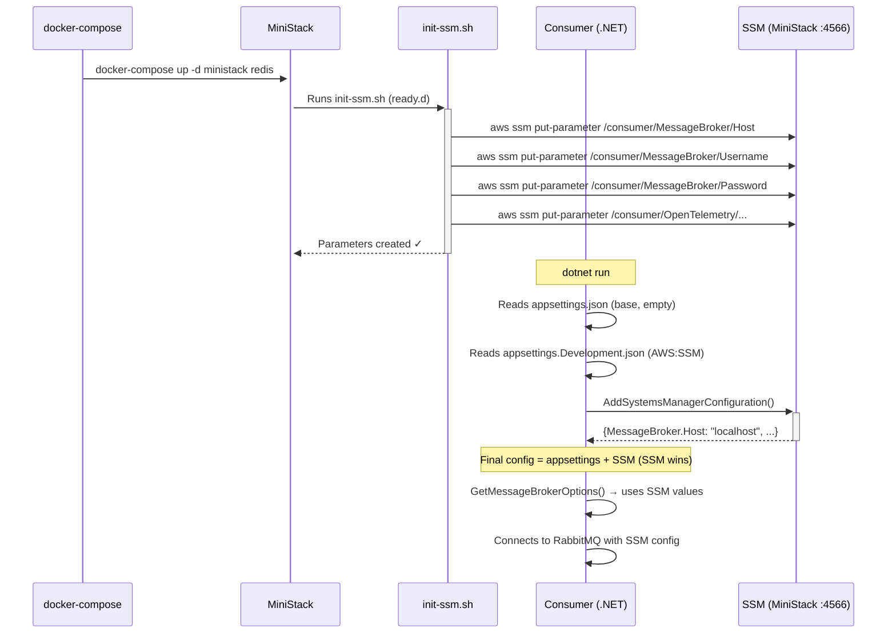

<h1 align="center">MiniStack — Local AWS Emulator</h1>

<p align="center">
  <em>Learn what MiniStack is, what it is used for, which AWS services it emulates, and how it was implemented in this project</em>
</p>

<p align="center">
  
  
  
  
</p>

---

## Table of Contents

1. [What is MiniStack?](#what-is-ministack)
2. [Why does it exist? The LocalStack problem](#why-does-it-exist-the-localstack-problem)
3. [What is it used for?](#what-is-it-used-for)
4. [How does it work?](#how-does-it-work)
5. [AWS services available in MiniStack](#aws-services-available-in-ministack)
6. [Alternatives to MiniStack](#alternatives-to-ministack)
7. [Setup: how to interact with MiniStack](#setup-how-to-interact-with-ministack)
8. [MiniStack in this project](#ministack-in-this-project)
   - [MiniStack services implemented](#ministack-services-implemented)
   - [docker-compose configuration](#docker-compose-configuration)
   - [Initialization script `init-ssm.sh`](#initialization-script-init-ssmsh)
   - [.NET integration](#net-integration)
   - [Complete flow: from startup to loaded configuration](#complete-flow-from-startup-to-loaded-configuration)
9. [Useful commands](#useful-commands)
10. [Related documentation](#related-documentation)

---

## What is MiniStack?

**MiniStack** is a **free and open-source local emulator of AWS services**. It runs in a Docker container (or directly with `pip install ministack`) and exposes on a single port (`4566`) the same endpoints as real AWS, so your applications work **without an AWS account, without costs, and without Internet connectivity**.

It is "drop-in compatible": if your code uses the **AWS SDK, AWS CLI, Terraform, CDK, Pulumi, or any AWS tool**, it works against MiniStack by simply pointing the endpoint to `http://localhost:4566`.

| Characteristic | Detail |
|----------------|--------|
| **License** | MIT (free, open-source, "Free forever") |
| **Services** | 60+ emulated AWS services |
| **Port** | `4566` (a single port for all services) |
| **Installation** | `docker run -p 4566:4566 ministackorg/ministack` or `pip install ministack` |
| **Size** | ~270 MB image, ~30 MB RAM at rest |
| **Startup** | < 2 seconds |
| **Compatibility** | AWS CLI, boto3, AWS SDK (.NET, Java, Go, JS), Terraform, CDK, Pulumi |
| **Real infrastructure** | RDS (real Postgres/MySQL), ElastiCache (real Redis), ECS (real Docker), EKS (real k3s), Athena (real DuckDB) |

> **Key idea:** a local AWS emulator gives you the same behavior as real AWS (same endpoints, same formats, same errors), but on your machine. This lets you develop, test, and run CI/CD without paying a cent.

---

## Why does it exist? The LocalStack problem

MiniStack was born as a direct response to **LocalStack**, the most popular AWS emulator, which moved its core services behind a paid plan. Teams that relied on the LocalStack Community edition (S3, Lambda, DynamoDB, SQS... for local development and CI/CD) were left without a complete free option.

MiniStack was built as a replacement: **same port, same SDK compatibility, real MIT license, no bait-and-switch**. Today it emulates more than 60 services, including the ones LocalStack stopped offering for free (Lambda, IAM, SSM, EventBridge) and even **real infrastructure** (databases, containers, Kubernetes).

---

## What is it used for?

MiniStack is used whenever you need to **simulate AWS in a controlled environment**:

| Use case | What it enables |
|----------|-----------------|
| **Local development** | Run your app against S3/SQS/DynamoDB/SSM without an AWS account |
| **Integration tests** | Tests that spin up real AWS resources in an isolated, cheap way |
| **CI/CD** | Pipelines that validate Terraform/CloudFormation without deploying anything to AWS |
| **Learn AWS** | Experiment with services and the CLI at no cost (what this project does) |
| **Offline development** | Work without Internet, without depending on the AWS network |
| **Data seeding** | Create initial state (parameters, tables, buckets) via startup scripts |

### Advantages over using real AWS

| Aspect | MiniStack (local) | Real AWS |
|--------|-------------------|----------|
| **Cost** | Free | Pay-as-you-go |
| **Account / credentials** | Any value (`test`/`test`) | Real IAM |
| **Speed** | Starts in < 2 s | Minutes of provisioning |
| **Risk** | Zero (no real infrastructure touched) | Can generate costs |
| **Determinism** | Controlled, resettable state | Depends on the environment |
| **Internet** | Not required | Required |

---

## How does it work?

MiniStack is a **gateway** (a single HTTP process) that listens on port `4566`. Each request carries the service in the path or in the API host (SigV4 style), and MiniStack routes it to the matching emulator while keeping the **same response format as real AWS**.

```
Your app / AWS CLI / Terraform
        │  aws --endpoint-url=http://localhost:4566
        ▼
  MiniStack (port 4566)  ──►  /s3    ──► S3 emulator
                                /sqs   ──► SQS emulator
                                /ssm   ──► SSM emulator
                                /...   ──► 60+ services
```

### Quick start

```bash
# Option 1: Docker
docker run -p 4566:4566 ministackorg/ministack

# Option 2: pip (Python)
pip install ministack
ministack

# Option 3: with real infrastructure (RDS, ECS, Lambda in Docker)
docker run -p 4566:4566 -v /var/run/docker.sock:/var/run/docker.sock ministackorg/ministack

# Verify it is alive
curl http://localhost:4566/_ministack/health
```

### Useful internal endpoints

```bash
# Health status of all services
curl http://localhost:4566/_ministack/health

# Reset all state (perfect between tests!)
curl -X POST http://localhost:4566/_ministack/reset
curl -X POST "http://localhost:4566/_ministack/reset?init=1"   # reset + re-run startup scripts

# View SQS / SES messages (inspection)
curl http://localhost:4566/_ministack/sqs/messages
curl http://localhost:4566/_ministack/ses/messages
```

### Configuration via environment variables

| Variable | Default | Description |
|----------|---------|-------------|
| `GATEWAY_PORT` | `4566` | Gateway port |
| `MINISTACK_HOST` | `localhost` | Hostname used in response URLs |
| `MINISTACK_ACCOUNT_ID` | `000000000000` | Default account ID in ARNs |
| `MINISTACK_REGION` | `us-east-1` | Default region in ARNs |
| `PERSIST_STATE` | `0` | Persist state across restarts |
| `S3_PERSIST` | `0` | Persist S3 objects to disk |
| `LOG_LEVEL` | `INFO` | `DEBUG`, `INFO`, `WARNING`, `ERROR` |

### Multi-account and multi-region

- **Multi-account:** if your `AWS_ACCESS_KEY_ID` is a 12-digit number, MiniStack uses it as the **Account ID** in ARNs, isolating resources per account. Perfect for several developers/pipelines sharing the same endpoint.
- **Multi-region:** state is isolated per region (`--region us-east-1` vs `--region eu-west-1`), mimicking real AWS.

```bash
# Multi-account
export AWS_ACCESS_KEY_ID=111111111111   # → account 111111111111
aws --endpoint-url=http://localhost:4566 sts get-caller-identity

# Multi-region
aws --endpoint-url=http://localhost:4566 --region us-east-1 sqs create-queue --queue-name jobs
aws --endpoint-url=http://localhost:4566 --region eu-west-1 sqs create-queue --queue-name jobs  # independent queue
```

### Usage with AWS CLI, boto3 and .NET

```bash
# AWS CLI (dummy credentials, MiniStack does not validate them)
export AWS_ACCESS_KEY_ID=test
export AWS_SECRET_ACCESS_KEY=test
export AWS_DEFAULT_REGION=us-east-1

aws --endpoint-url=http://localhost:4566 s3 mb s3://my-bucket
aws --endpoint-url=http://localhost:4566 sqs create-queue --queue-name my-queue
aws --endpoint-url=http://localhost:4566 dynamodb list-tables
aws --endpoint-url=http://localhost:4566 ssm get-parameters-by-path --path "/" --recursive
```

```python
# boto3 (Python)
import boto3
s3 = boto3.client("s3", endpoint_url="http://localhost:4566",
                  aws_access_key_id="test", aws_secret_access_key="test", region_name="us-east-1")
s3.create_bucket(Bucket="my-bucket")
s3.put_object(Bucket="my-bucket", Key="hello.txt", Body=b"Hello, MiniStack!")
```

```csharp
// AWS SDK for .NET: point to MiniStack with ServiceURL (see the ".NET integration" section)
new AmazonS3Config { ServiceURL = "http://localhost:4566" };
```

---

## AWS services available in MiniStack

MiniStack emulates **more than 60 AWS services** on a single port. They are organized into three groups:

### Core Services (the most used)

| Service | What it emulates |
|----------|------------------|
| **S3** | Buckets, object CRUD, multipart upload, versioning, lifecycle, CORS, bucket policies, Object Lock |
| **SQS** | Standard and FIFO queues, deduplication, DLQ, visibility timeout, batch |
| **SNS** | Topics, subscriptions, SNS→SQS and SNS→Lambda fan-out, FIFO topics, mobile push |
| **DynamoDB** | Tables, CRUD, Query/Scan, TransactWriteItems, TTL, DynamoDB Streams |
| **Lambda** | Python and Node (warm pool), Go/Rust/C++ (Docker RIE), event source mappings, layers, aliases, Function URLs |
| **IAM** | Users, roles, policies, access keys, instance profiles, identity providers |
| **STS** | GetCallerIdentity, AssumeRole, GetSessionToken |
| **SecretsManager** | Secrets, versioning, rotation, cross-region replication |
| **CloudWatch Logs** | Log groups, streams, PutLogEvents, FilterLogEvents, embedded metrics |

### Extended Services

| Service | What it emulates |
|----------|------------------|
| **SSM Parameter Store** | String/SecureString/StringList parameters, hierarchies, version history, labels |
| **EventBridge** | Buses, rules, targets, PutEvents, archives and replays |
| **Kinesis** | Streams, shards, PutRecord/PutRecords, GetRecords |
| **CloudWatch Metrics** | Metrics, alarms, dashboards |
| **SES / SES v2** | Email sending (stored in memory, not actually sent) |
| **Step Functions** | State machines with full ASL: Retry/Catch, Map/Parallel, waitForTaskToken, TestState |
| **API Gateway v1/v2** | REST APIs and HTTP APIs, Lambda proxy, WebSocket |
| **ELBv2 / ALB** | Load balancers, target groups, listeners, path-based rules |
| **KMS** | Keys, encrypt/decrypt, sign/verify, rotation |
| **CloudFront** | Distributions, invalidations, Origin Access Control |
| **CloudTrail** | Trails and LookupEvents (audit) |
| **WAF v2** | Web ACLs, IP Sets, rules |
| **MSK** | Kafka control plane (control-plane only) |
| **Bedrock** | Model catalog, Converse/InvokeModel (mock responses or connectable to Ollama/llama.cpp) |
| **AmazonMQ** | Broker control plane |

### Real Infrastructure Services (spin up real containers)

| Service | What it actually does |
|----------|------------------------|
| **RDS** | `CreateDBInstance` starts a real **Postgres/MySQL** container and returns the real endpoint |
| **ElastiCache** | `CreateCacheCluster` starts real **Redis/Valkey/Memcached** |
| **ECS** | `RunTask` launches **real Docker containers** |
| **EKS** | `CreateCluster` starts a real **k3s cluster** that works with `kubectl` |
| **Athena** | Real SQL queries with **DuckDB** over local data |
| **Glue** | Real Python jobs and Spark with the official Glue image |
| **EFS / EC2 / EBS / ECR / Cognito / Route53 / AppSync / CloudFormation** | Full control plane (EC2 does not launch real VMs, only metadata) |

> **Note:** almost all emulated services also support **persistence** (`PERSIST_STATE=1`), so resources survive container restarts.

---

## Alternatives to MiniStack

| Tool | License | Services | Real infrastructure | Notes |
|------|---------|----------|---------------------|-------|
| **MiniStack** | MIT (free) | 60+ | Yes (RDS, ElastiCache, ECS, EKS, Athena) | The free alternative to LocalStack |
| **LocalStack** | Pro (paid) | 70+ | Yes (Pro edition) | Previously free; core services moved to paid |
| **AWS SAM Local** | Apache 2.0 | Lambda + API Gateway | No | Serverless focus, uses official AWS images |
| **Serverless Offline** | MIT | Lambda + API Gateway (plugin) | No | For the Serverless framework |

---

## Setup: how to interact with MiniStack

To be able to query the resources MiniStack emulates (for example, the SSM parameters created on startup by `init-ssm.sh`), you need the **AWS CLI**.

### 1. Install the AWS CLI

```powershell
winget install Amazon.AWSCLI
```

Once installed, you can already query the parameters injected at MiniStack startup:

```powershell
aws --endpoint-url=http://localhost:4566 ssm describe-parameters
```

### 2. (Optional) Create the `awslocal` alias

Typing `--endpoint-url=http://localhost:4566` on every command is tedious. To make it easier, you can add a **permanent** alias in PowerShell:

#### 2.1 Open your PowerShell profile

Run this command to open your profile file in Notepad (if it does not exist, it will be created automatically):

```powershell
if (!(Test-Path -Path $PROFILE)) { New-Item -ItemType File -Path $PROFILE -Force }
notepad $PROFILE
```

#### 2.2 Paste the alias function

In the file opened in Notepad, add this line at the end:

```powershell
function awslocal { aws --endpoint-url=http://localhost:4566 $args }
```

Save the changes (Ctrl + S) and close Notepad.

#### 2.3 Use it

After that, you can use it like this:

```powershell
awslocal ssm describe-parameters
```

---

## MiniStack in this project

This educational project uses MiniStack to **emulate the production configuration**: the three .NET applications read their configuration from **SSM Parameter Store** locally exactly as they would in real AWS.

### MiniStack services implemented

Out of the **60+ services** that MiniStack offers, this project implements **one**:

| MiniStack service | Use in the project |
|-------------------|--------------------|
| **SSM Parameter Store** | Stores the configuration for the API, OutboxProcessor, and Consumer (connection strings, message broker, OpenTelemetry) |

For SSM to work, MiniStack needs its persistence backend:

| MiniStack service (support) | Role |
|-----------------------------|------|
| **Redis** (via `REDIS_HOST`) | Backend where MiniStack persists the SSM parameters |

> **Design:** the rest of the services (S3, SQS, DynamoDB...) are not used in this project, but they remain available because MiniStack exposes them on the same port `4566`. If the project needed, for example, an SQS queue tomorrow, it would be used without touching the infrastructure.

### docker-compose configuration

The `docker-compose.yml` spins up **two containers** for MiniStack to work:

```yaml
# docker-compose.yml
ministack:
  image: ministackorg/ministack
  container_name: ministack-slg
  ports:
    - "4566:4566"          # Main endpoint for emulated AWS services
  volumes:
    - /var/run/docker.sock:/var/run/docker.sock
    - ./scripts/ministack:/docker-entrypoint-initaws.d/ready.d   # Initialization scripts
  environment:
    - REDIS_HOST=redis     # MiniStack uses Redis internally for persistence
  depends_on:
    - redis

redis:
  image: redis:7-alpine
  container_name: redis-slg
  ports:
    - "6379:6379"
```

| Container | Image | Port | Role |
|-----------|-------|------|------|
| `ministack-slg` | `ministackorg/ministack` | `4566` | Emulates the AWS endpoints (SSM and all other services) |
| `redis-slg` | `redis:7-alpine` | `6379` | MiniStack persistence backend |

> **Why Redis?** MiniStack stores the state of the SSM parameters in Redis. This means the parameters you create **persist** across MiniStack restarts (as long as Redis is up).

### Initialization script `init-ssm.sh`

The file `scripts/ministack/init-ssm.sh` runs **automatically** when MiniStack starts (via the volume mounted at `ready.d`). Its job is to create all the SSM parameters the project needs.

```
scripts/
└── ministack/
    └── init-ssm.sh   ← Runs when MiniStack starts
```

The script uses the AWS CLI (pointed at `localhost:4566`) to create parameters organized by service:

#### API (`SoftwareLearningGuide.Api`)
| SSM parameter | Value |
|---------------|-------|
| `/softwarelearningguide/dev/api/ConnectionStrings/SoftwareLearningGuide` | SQL Server connection string |
| `/softwarelearningguide/dev/api/OpenTelemetry/ServiceName` | `SoftwareLearningGuide` |
| `/softwarelearningguide/dev/api/OpenTelemetry/Otlp/Endpoint` | `http://localhost:4317` |
| `/softwarelearningguide/dev/api/OpenTelemetry/Otlp/Protocol` | `grpc` |

#### OutboxProcessor
| SSM parameter | Value |
|---------------|-------|
| `/softwarelearningguide/dev/outboxprocessor/Database/SoftwareLearningGuide` | SQL Server connection string |
| `/softwarelearningguide/dev/outboxprocessor/MessageBroker/Host` | `localhost` |
| `/softwarelearningguide/dev/outboxprocessor/MessageBroker/Username` | `guest` |
| `/softwarelearningguide/dev/outboxprocessor/MessageBroker/Password` | `guest` |
| `/softwarelearningguide/dev/outboxprocessor/OpenTelemetry/ServiceName` | `SoftwareLearningGuide.OutboxProcessor` |

#### Consumer
| SSM parameter | Value |
|---------------|-------|
| `/softwarelearningguide/dev/consumer/MessageBroker/Host` | `localhost` |
| `/softwarelearningguide/dev/consumer/MessageBroker/Username` | `guest` |
| `/softwarelearningguide/dev/consumer/MessageBroker/Password` | `guest` |
| `/softwarelearningguide/dev/consumer/OpenTelemetry/ServiceName` | `SoftwareLearningGuide.Consumer` |

#### Path convention

```
/softwarelearningguide/dev/{service}/{section}/{key}
     ↑ app            ↑ env   ↑ who uses it
```

This hierarchy mimics exactly how you would organize parameters in real AWS. When migrating to production, you would only change `dev` to `prod`.

### .NET integration

#### 1. NuGet packages used

```xml
<!-- SoftwareLearningGuide.Consumer.csproj (same pattern in Api and OutboxProcessor) -->
<PackageReference Include="Amazon.Extensions.NETCore.Setup" />
<PackageReference Include="Amazon.Extensions.Configuration.SystemsManager" />
<PackageReference Include="AWSSDK.SimpleSystemsManagement" />
```

#### 2. Options class: `CloudProvidersConfigurationOptions`

```csharp
// Options/CloudProvidersConfigurationOptions.cs
public class CloudProvidersConfigurationOptions {
    public static string SectionName => "CloudProvidersConfigurations";

    public AwsConfigurationOptions AWS { get; set; } = new();
}

public class AwsConfigurationOptions {
    public AwsCredentialsOptions Credentials { get; set; } = new();  // AccessKey / AccessSecret
    public SsmConfigurationOptions SSM { get; set; } = new();
}

public class AwsCredentialsOptions {
    public string AccessKey { get; set; }     // "test" credentials (MiniStack does not validate them)
    public string AccessSecret { get; set; }
}

public class SsmConfigurationOptions {
    public static string SectionName => "SSM";

    public bool Enabled { get; set; }           // Enables/disables the SSM integration
    public string Path { get; set; }             // Base path in SSM (e.g., /softwarelearningguide/dev/consumer/)
    public string Region { get; set; } = "us-east-1";
    public string ServiceUrl { get; set; }       // MiniStack URL (http://localhost:4566) or empty for real AWS
    public int ReloadIntervalSeconds { get; set; } = 300;
}
```

#### 3. Extension method: `AddSystemsManagerConfiguration`

```csharp
// Extensions/ConfigurationBuilderExtensions.cs
public static IConfigurationBuilder AddSystemsManagerConfiguration(
    this IConfigurationBuilder configurationBuilder,
    IConfiguration configuration) {

    var cloudProvidersConfiguration = configuration
        .GetSection(CloudProvidersConfigurationOptions.SectionName)
        .Get<CloudProvidersConfigurationOptions>() ?? new CloudProvidersConfigurationOptions();

    var ssmOptions = cloudProvidersConfiguration.AWS.SSM;

    // If SSM is disabled or there is no path, do nothing
    if (!ssmOptions.Enabled || string.IsNullOrEmpty(ssmOptions.Path))
        return configurationBuilder;

    var awsOptions = new AWSOptions {
        // Credentials from CloudProvidersConfigurations:AWS:Credentials ("test"/"test")
        Credentials = new BasicAWSCredentials(
            cloudProvidersConfiguration.AWS.Credentials.AccessKey,
            cloudProvidersConfiguration.AWS.Credentials.AccessSecret),
        Region = RegionEndpoint.GetBySystemName(ssmOptions.Region)
    };

    // If there is a ServiceUrl → point to local MiniStack; otherwise → use real AWS
    if (!string.IsNullOrEmpty(ssmOptions.ServiceUrl))
        awsOptions.DefaultClientConfig.ServiceURL = ssmOptions.ServiceUrl;

    configurationBuilder.AddSystemsManager(source => {
        source.Path = ssmOptions.Path;
        source.Optional = true;           // If SSM is unavailable, continue without error
        source.ReloadAfter = TimeSpan.FromSeconds(ssmOptions.ReloadIntervalSeconds);
        source.AwsOptions = awsOptions;
    });

    return configurationBuilder;
}
```

#### 4. Registration in `Program.cs`

```csharp
// Consumer Program.cs (same pattern in Api and OutboxProcessor)
var builder = Host.CreateApplicationBuilder(args);

// SSM Parameter Store (MiniStack/AWS): takes priority over appsettings; appsettings acts as fallback
builder.Configuration.AddSystemsManagerConfiguration(builder.Configuration);
```

> **Important:** SSM is loaded **after** `appsettings.json`. This means SSM values **override** the `appsettings` ones, letting the local files act as fallback when SSM is unavailable.

#### 5. Configuration in `appsettings`

```json
// appsettings.json — empty values (fallback)
{
  "CloudProvidersConfigurations": {
    "AWS": {
      "Credentials": {
        "AccessKey": "",
        "AccessSecret": ""
      },
      "SSM": {
        "Enabled": false,
        "Path": "",
        "Region": "",
        "ServiceUrl": "",
        "ReloadIntervalSeconds": 0
      }
    }
  }
}

// appsettings.Development.json — points to MiniStack
{
  "CloudProvidersConfigurations": {
    "AWS": {
      "Credentials": {
        "AccessKey": "test",
        "AccessSecret": "test"
      },
      "SSM": {
        "Enabled": true,
        "Path": "/softwarelearningguide/dev/consumer/",
        "Region": "us-east-1",
        "ServiceUrl": "http://localhost:4566",
        "ReloadIntervalSeconds": 300
      }
    }
  }
}
```

### Complete flow: from startup to loaded configuration



### Why `source.Optional = true` matters

```csharp
source.Optional = true;
```

If MiniStack is not running when the application starts, **no exception is thrown**. The app starts with the `appsettings.Development.json` values as fallback. This is essential during development when you do not always have Docker running.

### Table: appsettings vs SSM

| Aspect | `appsettings.json` | SSM Parameter Store |
|--------|--------------------|---------------------|
| **Purpose** | Base configuration / fallback | Runtime configuration, centralized |
| **Priority** | Low (gets overridden) | High (overrides appsettings) |
| **Hot reload** | No (requires restart) | Yes (every `ReloadIntervalSeconds`) |
| **Security** | In source code | Outside the repo, managed by AWS IAM |
| **Local environment** | Always available | Requires MiniStack or AWS |
| **Production environment** | Empty values (structure only) | Contains the real values |

---

## Useful commands

```bash
# Start MiniStack and Redis
docker-compose up -d ministack redis

# View MiniStack logs (includes init-ssm.sh execution)
docker-compose logs -f ministack

# Verify MiniStack is alive
curl http://localhost:4566/_ministack/health

# Verify the parameters were created correctly
aws --endpoint-url=http://localhost:4566 ssm get-parameters-by-path \
  --path "/softwarelearningguide/dev/consumer/" \
  --recursive

# List all project parameters
aws --endpoint-url=http://localhost:4566 ssm get-parameters-by-path \
  --path "/softwarelearningguide/" \
  --recursive

# Read a specific parameter
aws --endpoint-url=http://localhost:4566 ssm get-parameter \
  --name "/softwarelearningguide/dev/consumer/MessageBroker/Host"

# Reset MiniStack state (deletes all parameters)
curl -X POST "http://localhost:4566/_ministack/reset?init=1"
```

> **Requirement:** you need the [AWS CLI](https://aws.amazon.com/cli/) installed. The credentials can be any value (MiniStack does not validate them).

---

## Relationship with real AWS (production)

In production, the only change needed is:

```json
// appsettings.Production.json
{
  "CloudProvidersConfigurations": {
    "AWS": {
      "SSM": {
        "Enabled": true,
        "Path": "/softwarelearningguide/prod/consumer/",
        "Region": "us-east-1",
        "ServiceUrl": ""    // ← empty = use real AWS
      }
    }
  }
}
```

The application code does not change. The credentials (IAM Role of the EC2/ECS/Lambda) can be omitted from `Credentials` or left empty, and the AWS SDK resolves them from the environment. This is documented in more detail in [README.AWS.en.md](README.AWS.en.md).

---

## Related documentation

| Topic | Document |
|-------|----------|
| **Real AWS (production) and its service catalog** | [`README.AWS.en.md`](README.AWS.en.md) |
| **Feature Management** | [`README.FeatureManagement.en.md`](SoftwareLearningGuide.Api/README.FeatureManagement.en.md) |
| **Observability** | [`README.Observability.en.md`](SoftwareLearningGuide.Api/README.Observability.en.md) |
| **Full Docker Compose** | [`README.en.md`](README.en.md#docker-compose) |

---

## References

- [MiniStack — GitHub](https://github.com/ministackorg/ministack)
- [MiniStack — Official website](https://ministack.org)
- [MiniStack — Docker Hub](https://hub.docker.com/r/ministackorg/ministack)
- [AWS CLI](https://aws.amazon.com/cli/)
- [AWS SDK for .NET](https://aws.amazon.com/sdk-for-net/)

---

**Happy learning!** 🚀
