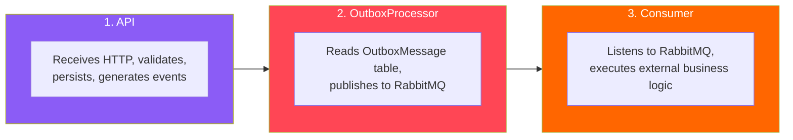
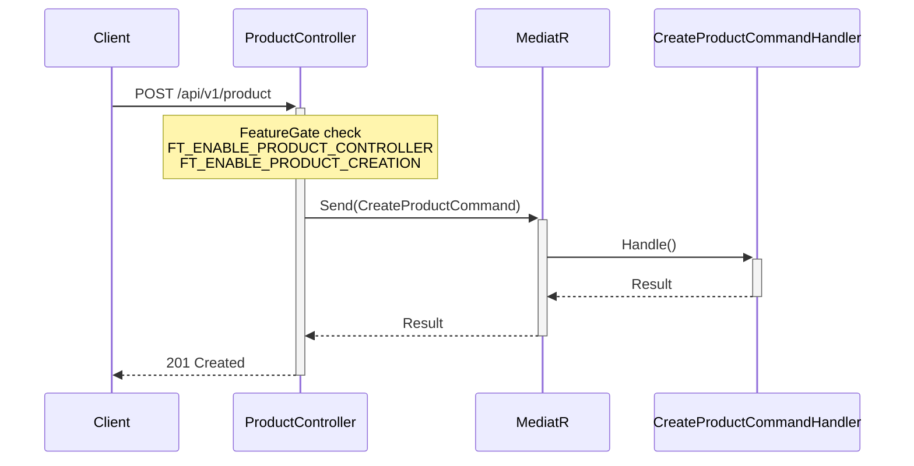
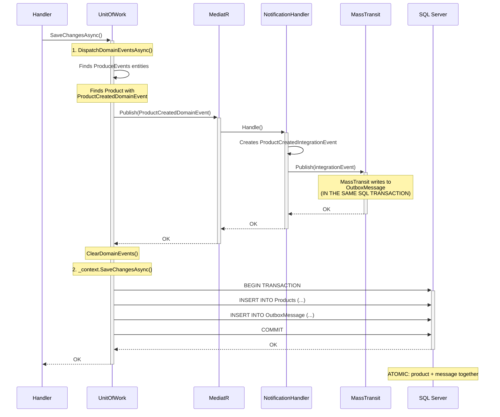
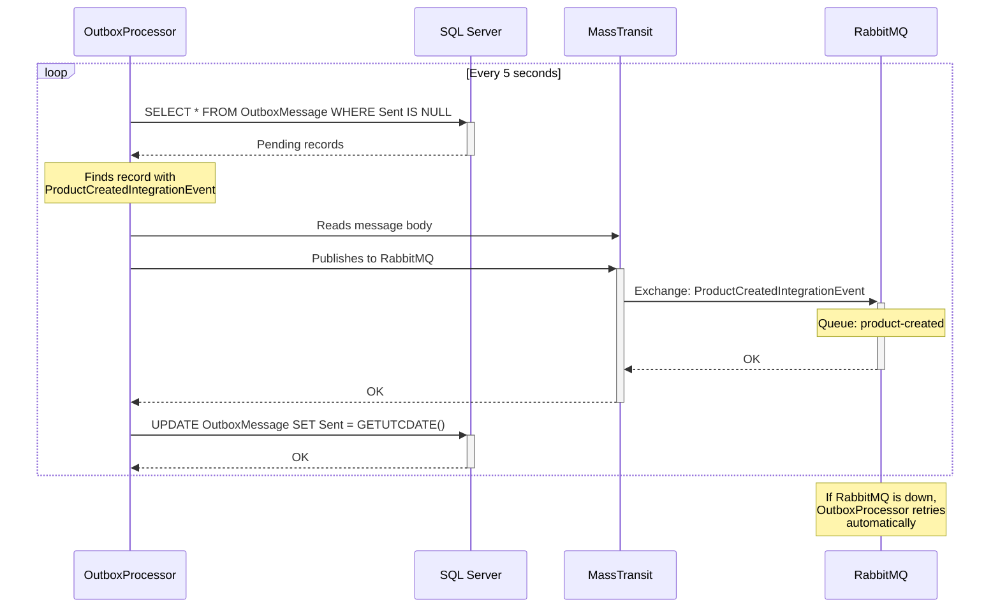
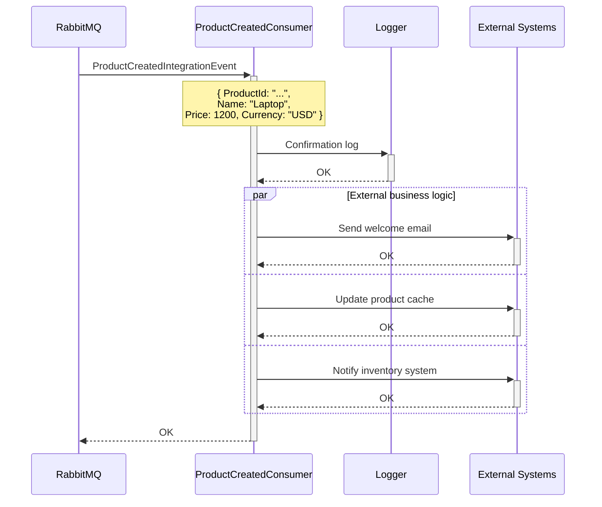
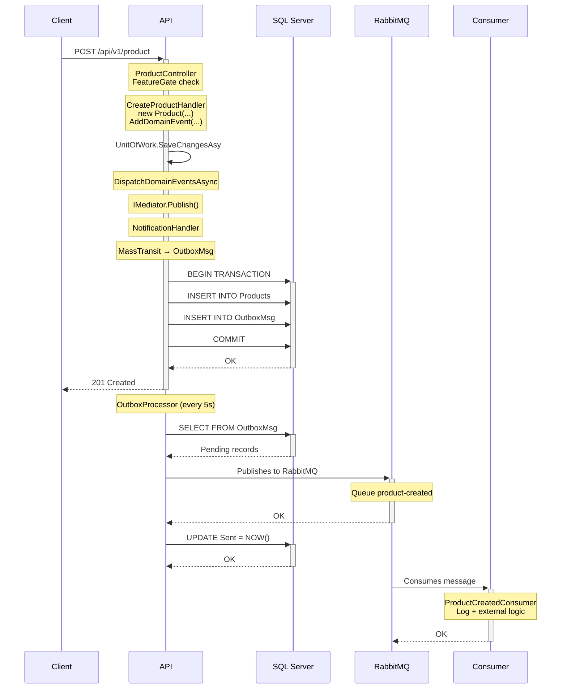

<h1 align="center">Software Learning Guide</h1>

<p align="center">
  <em>Educational project for learning and practicing modern development concepts in <strong>.NET 10</strong></em>
</p>

<p align="center">
  
  
  
  
  
</p>

<p align="center">
  
  
  
  
  
  
</p>

<p align="center">
  
  
  
  
</p>

<p align="center">
  <a href="README.md">
    
  </a>
</p>

---

## What You'll Learn

| Area | Key Concepts | Badge |
|------|--------------|-------|
| **Architecture** | Clean Architecture, Vertical Slicing, SOLID, Dependency Inversion | `Architecture` |
| **Domain (DDD)** | Value Objects, Entities, Aggregates, Domain Events, DomainErrors | `DDD` |
| **Result\<T\> Pattern** | Functional error handling without exceptions, composition | `Result Pattern` |
| **CQRS** | Command/Query separation with MediatR, Handlers, Pipeline Behaviors | `CQRS` |
| **Unit of Work** | Transactionality, atomicity, event dispatching | `UoW` |
| **Events** | Domain Events, Integration Events, Notification Handlers | `Events` |
| **Transactional Outbox** | Outbox Pattern with MassTransit + RabbitMQ, Workers | `Outbox` |
| **Resilience** | Retry, Circuit Breaker, Timeout in MassTransit | `Resilience` |
| **Persistence** | EF Core (write), Dapper (read), Value Objects in DB | `Data` |
| **REST APIs** | Controllers, versioning, OpenAPI documentation, streaming | `API` |
| **Observability** | Distributed tracing, metrics, structured logging, scopes | `Observability` |
| **Feature Flags** | Feature Toggles with Microsoft.FeatureManagement and Flagsmith | `Feature Mgmt` |
| **Infrastructure** | Docker, Aspire Dashboard, RabbitMQ, SQL Server | `Infra` |

---

## Documentation

### To Learn About...

| Topic | Location | Description |
|-------|----------|-------------|
| **Domain-Driven Design (DDD)** | [`README.DDD.en.md`](SoftwareLearningGuide.Core.Business/README.DDD.en.md) | Value Objects, Entities, Aggregates, practical examples |
| **Domain Events** | [`README.EventSourcing.en.md`](SoftwareLearningGuide.Core.Business/README.EventSourcing.en.md) | Domain events, MediatR, Notification Handlers, Integration Events |
| **Transactional Outbox** | [`README.OutboxPattern.en.md`](SoftwareLearningGuide.OutboxProcessor/README.OutboxPattern.en.md) | Outbox Pattern with MassTransit + RabbitMQ, atomicity, Workers |
| **Resilience** | [`README.Resilience.en.md`](SoftwareLearningGuide.OutboxProcessor/README.Resilience.en.md) | Retry, Circuit Breaker, Timeout in the MassTransit pipeline |
| **Result\<T\> Pattern** | [`README.ResultPattern.en.md`](SoftwareLearningGuide.Core.Business/README.ResultPattern.en.md) | Functional error handling, composition, best practices |
| **DomainErrors** | [`README.Errors.en.md`](SoftwareLearningGuide.Core.Business/README.Errors.en.md) | Centralized error catalog with entity context and ID |
| **CQRS with MediatR** | [`README.CQRS.en.md`](SoftwareLearningGuide.Application/README.CQRS.en.md) | Commands, Queries, Handlers, Mediator pattern |
| **Unit of Work** | [`README.UnitOfWork.en.md`](SoftwareLearningGuide.Infraestructure/README.UnitOfWork.en.md) | Transactionality, atomicity, Unit of Work pattern |
| **Entity Framework Core** | [`README.EntityFramework.en.md`](SoftwareLearningGuide.Infraestructure.Data/README.EntityFramework.en.md) | DbContext, configurations, Value Objects, Owned Types |
| **Dapper** | [`README.Dapper.en.md`](SoftwareLearningGuide.Application.Query/README.Dapper.en.md) | Direct SQL, CommandDefinition, result mapping |
| **Middleware** | [`README.Middleware.en.md`](SoftwareLearningGuide.Api/README.Middleware.en.md) | Global Exception Handling, logging scopes, HTTP pipeline |
| **Building APIs** | [`README.Api.en.md`](SoftwareLearningGuide.Api/README.Api.en.md) | REST API concepts, versioning, OpenAPI |
| **Observability** | [`README.Observability.en.md`](SoftwareLearningGuide.Api/README.Observability.en.md) | The 3 pillars: traces, metrics, logs, scopes, exporters |
| **Feature Management** | [`README.FeatureManagement.en.md`](SoftwareLearningGuide.Api/README.FeatureManagement.en.md) | Feature Toggles, Feature Flags, Microsoft.FeatureManagement, Flagsmith |
| **Vertical Slicing** | [`README.VerticalSlicing.en.md`](SoftwareLearningGuide.Application/README.VerticalSlicing.en.md) | Organization by features, autonomous slices, Open/Closed in practice |
| **Clean Architecture** | [`README.CleanArchitecture.en.md`](SoftwareLearningGuide.Api/README.CleanArchitecture.en.md) | Layers, dependency rule, Ports & Adapters, technology independence |

#### Design Patterns

| Pattern | Location | Description |
|---------|----------|-------------|
| **SOLID** | [`README.Pattern.SOLID.en.md`](SoftwareLearningGuide.Application/README.Pattern.SOLID.en.md) | The 5 SOLID principles with concrete project examples |
| **Factory** | [`README.Pattern.Factory.en.md`](SoftwareLearningGuide.Application/README.Pattern.Factory.en.md) | Static Factory Method in Value Objects and Aggregates |
| **Builder** | [`README.Pattern.Builder.en.md`](SoftwareLearningGuide.Application/README.Pattern.Builder.en.md) | Fluent Builder for tests, complex Commands, and records with `with` |
| **Repository** | [`README.Pattern.Repository.en.md`](SoftwareLearningGuide.Application/README.Pattern.Repository.en.md) | Data access abstraction, write vs read repositories |
| **Mediator** | [`README.Pattern.Mediator.en.md`](SoftwareLearningGuide.Application/README.Pattern.Mediator.en.md) | MediatR: Send vs Publish, Pipeline Behaviors, automatic discovery |

#### Testing References

| Concept | Location | Description |
|---------|----------|-------------|
| **TDD** | [`README.TDD.en.md`](tests/README.TDD.en.md) | Red-Green-Refactor cycle, testing best practices |
| **TestContainers** | [`README.TestContainer.en.md`](tests/README.TestContainer.en.md) | Disposable Docker containers for integration tests |
| **Respawn** | [`README.Respawn.en.md`](tests/README.Respawn.en.md) | Automatic database reset between tests |
| **Response Fixture** | [`README.ResponseFixture.en.md`](tests/README.ResponseFixture.en.md) | JSON files with expected responses for assertions |

#### Cloud Providers

| Topic | Location | Description |
|-------|----------|-------------|
| **AWS (General)** | [`README.AWS.en.md`](README.AWS.en.md) | What AWS is, regions, pricing model, service catalog with prices and CLI commands |
| **MiniStack (Local AWS)** | [`README.Ministack.en.md`](README.Ministack.en.md) | Free local AWS emulator (60+ services), how it works and its implementation in this project |

---

## Quick Start

### Prerequisites

- **.NET 10 SDK** or higher
- **Docker Desktop** (for observability services and SQL Server)
- **Visual Studio 2026** (recommended) or VS Code

### Run the API

The project contains **three applications** that run independently:

#### 1. Main API (`SoftwareLearningGuide.Api`)

```bash
# Run the REST API
dotnet run --project SoftwareLearningGuide.Api

# Or from the project folder
cd SoftwareLearningGuide.Api
dotnet run

# Or from Visual Studio: F5
```

> **Ports:** `http://localhost:5089` (HTTP) | `https://localhost:7033` (HTTPS)

#### 2. Outbox Processor (`SoftwareLearningGuide.OutboxProcessor`)

Worker Service that reads the OutboxMessage table and publishes events to RabbitMQ. It contains no consumption logic - it only publishes.

```bash
# Run the Outbox Processor
dotnet run --project SoftwareLearningGuide.OutboxProcessor

# Or from the project folder
cd SoftwareLearningGuide.OutboxProcessor
dotnet run
```

> **Requires:** SQL Server and RabbitMQ running (`docker-compose up -d`)

#### 3. Consumer (`SoftwareLearningGuide.Consumer`)

Worker Service that listens to RabbitMQ queues and processes events published by the OutboxProcessor.

```bash
# Run the Consumer
dotnet run --project SoftwareLearningGuide.Consumer

# Or from the project folder
cd SoftwareLearningGuide.Consumer
dotnet run
```

> **Requires:** RabbitMQ running (`docker-compose up -d`)

#### Available Endpoints

**Main API (`localhost:5089`):**

| Method | Endpoint | Description |
|--------|----------|-------------|
| GET | `/api/v1.0/order` | Get all orders |
| GET | `/api/v1.0/order/{id}` | Get order by GUID |
| POST | `/api/v1.0/order` | Create an order |
| GET | `/api/v1.0/product` | Get all products |
| GET | `/api/v1.0/product/{id}` | Get product by GUID |
| POST | `/api/v1.0/product` | Create a product |
| GET | `/api/v1.0/customer` | Get all customers |
| GET | `/api/v1.0/customer/{id}` | Get customer by GUID |
| POST | `/api/v1.0/customer` | Create a customer |
| GET | `/api/v1.0/weatherforecast` | Weather forecast (v1) |
| GET | `/api/v2.0/weatherforecast` | Weather forecast (v2, with metrics) |
| GET | `/api/v2.0/apirest` | List items (with filter and pagination) |
| GET | `/api/v2.0/apirest/{id}` | Get item by ID |
| POST | `/api/v2.0/apirest` | Create item |
| PUT | `/api/v2.0/apirest/{id}` | Replace item (full update) |
| PATCH | `/api/v2.0/apirest/{id}` | Update item (partial) |
| DELETE | `/api/v2.0/apirest/{id}` | Delete item |
| POST | `/api/v2.0/apirest/upload` | Upload file (multipart, max 10MB) |
| GET | `/api/v2.0/apirest/stream` | Stream items (IAsyncEnumerable) |
| GET | `/api/v2.0/apirest/headers` | Read header X-Request-ID |
| GET | `/api/v2.0/apirest/forbidden` | Example 403 response |
| GET | `/api/v2.0/apirest/unauthorized` | Example 401 response |
| GET | `/api/v2.0/apirest/problem` | Example 500 response (ProblemDetails) |

**Documentation:**
- **Scalar:** `https://localhost:7033/scalar/v1`
- **Swagger UI:** `https://localhost:7033/swagger`
- **OpenAPI Spec:** `https://localhost:7033/openapi/v1.json`

> **Note:** Order, Product, and Customer controllers are protected by Feature Flags. In Development mode all are enabled.

---

## Docker Compose

The current stack includes:

- **Aspire Dashboard** - .NET observability control panel
- **SQL Server 2022** - Application database
- **Flagsmith** - Feature flags management service
- **PostgreSQL** - Flagsmith database
- **RabbitMQ** - Message broker for service integration

### Available Services

| Service | URL | Port | Description |
|---------|-----|------|-------------|
| **Aspire Dashboard** | http://localhost:18888 | 18888 | Traces, metrics, and logs panel |
| **OTEL Collector (gRPC)** | localhost:4317 | 4317 | Receives telemetry from the app |
| **SQL Server** | localhost,1433 | 1433 | SoftwareLearningGuide database |
| **Flagsmith** | http://localhost:8000 | 8000 | Feature flags panel |
| **PostgreSQL** | localhost:5432 | 5432 | Flagsmith database |
| **RabbitMQ** | localhost:5672 | 5672 | Message broker (AMQP) |
| **RabbitMQ Management** | http://localhost:15672 | 15672 | RabbitMQ administration UI (guest/guest) |

### Useful Commands

```bash
# Start the stack
docker-compose up -d

# View logs
docker-compose logs -f aspire-dashboard

# Stop the stack
docker-compose down

# View service status
docker-compose ps

# Connect to SQL Server (from the app)
# ConnectionString: Server=localhost,1433;Database=SoftwareLearningGuide;User Id=sa;Password=YourStrong!Passw0rd;TrustServerCertificate=True;
```

---

## Learning Objectives

- Understand REST architecture with versioning
- Implement Domain-Driven Design with Value Objects and Aggregates
- Implement Domain Events for total decoupling in the domain
- Use the Transactional Outbox pattern for database and messaging atomicity
- Use the Result\<T\> pattern for functional error handling
- Centralize domain errors with DomainErrors for descriptive and consistent messages
- Implement CQRS with MediatR to separate reads and writes
- Apply the Unit of Work pattern for transactionality and atomicity in writes
- Use Dapper for direct read queries against the database
- Use Entity Framework Core for commands with tracking and relationships
- Implement modern observability with OpenTelemetry (traces, metrics, logs)
- Use structured logging and scopes for request correlation
- Expose custom business metrics
- Document APIs with OpenAPI/Swagger
- Containerize .NET applications with Docker
- Monitor applications in production
- Manage feature toggles and flags with Microsoft.FeatureManagement and Flagsmith

---

## Folder Structure

```mermaid
graph TD
    Root["SoftwareLearningGuide/"]
    
    Core["Core.Business<br/>Domain Layer (DDD)"]
    CoreExc["Exceptions/<br/>Domain exceptions + Result&lt;T&gt;"]
    CoreErr["Errors/<br/>DomainErrors: centralized error catalog"]
    CoreVO["ValueObjects/<br/>Money, Email, Address, OrderId"]
    CoreEnt["Entities/<br/>Product, Customer, OrderLine"]
    CoreAgg["Aggregates/<br/>Order (aggregate root)"]
    
    App["Application/<br/>Application Layer"]
    AppQuery["Application.Query/<br/>Queries (Dapper, read)"]
    AppQueryGet["GetOrder/<br/>GetOrderQuery + Handler"]
    AppCmd["Application.Command/<br/>Commands (EF Core, write)"]
    AppCmdCreate["CreateOrder/<br/>CreateOrderCommand + Handler"]
    AppCmdPorts["Ports/<br/>IOrderWriteRepository, IUnitOfWork"]
    
    Infra["Infraestructure/<br/>Infrastructure Layer"]
    InfraData["Infraestructure.Data/<br/>EF Core, DbContext"]
    InfraDataCtx["Context/<br/>ApplicationDbContext"]
    InfraDataConf["Configurations/<br/>OrderConfiguration"]
    InfraDataRepo["Repositories/<br/>OrderWriteRepository, UnitOfWork"]
    InfraPorts["Ports/<br/>IOrderWriteRepository"]
    
    Api["Api/<br/>ASP.NET Core REST API"]
    ApiCtrl["Controllers/<br/>OrderController, WeatherForecast"]
    ApiExt["Extensions/<br/>OpenTelemetry, ApiVersioning"]
    ApiFeat["FeatureToggles/<br/>Feature Management"]
    ApiMid["Middlewares/<br/>GlobalExceptionMiddleware"]
    ApiMet["Metrics/<br/>OrderMetrics"]
    
    Outbox["OutboxProcessor/<br/>Worker Service: Outbox → RabbitMQ"]
    Consumer["Consumer/<br/>Worker Service: RabbitMQ → Business Logic"]
    Docker["docker-compose.yml"]
    
    Root --> Core
    Root --> App
    Root --> Infra
    Root --> Api
    Root --> Outbox
    Root --> Consumer
    Root --> Docker
    
    Core --> CoreExc
    Core --> CoreErr
    Core --> CoreVO
    Core --> CoreEnt
    Core --> CoreAgg
    
    App --> AppQuery
    AppQuery --> AppQueryGet
    App --> AppCmd
    AppCmd --> AppCmdCreate
    AppCmd --> AppCmdPorts
    
    Infra --> InfraData
    InfraData --> InfraDataCtx
    InfraData --> InfraDataConf
    InfraData --> InfraDataRepo
    Infra --> InfraPorts
    
    Api --> ApiCtrl
    Api --> ApiExt
    Api --> ApiFeat
    Api --> ApiMid
    Api --> ApiMet
    
    style Root fill:#512BD4,color:#fff,stroke:#4020a6
    style Core fill:#4ECDC4,color:#fff
    style App fill:#FF6B6B,color:#fff
    style Infra fill:#45B7D1,color:#fff
    style Api fill:#8B5CF6,color:#fff
    style Outbox fill:#FF4655,color:#fff
    style Consumer fill:#FF6600,color:#fff
    style Docker fill:#2496ED,color:#fff
```



---

## Complete Flow: API → Outbox → Consumer (Create Product Case)

This section explains how the 3 system artifacts interact when a client creates a product. It's the practical example that integrates all project patterns.

### The 3 Artifacts



### Step 1: Client sends POST /api/v1/product

The request arrives at `ProductController`, which dispatches a `CreateProductCommand` via MediatR:



### Step 2: The Command Handler creates the domain

The handler creates the `Product` entity which **inherits from `ProduceEvents`**, validating business rules and triggering a domain event:

```csharp
// Product.cs inherits from ProduceEvents
var product = new Product(productId, "Laptop", "Gaming laptop",
    new Money(1200.00m, "USD"), 10);
// Internally executes:
//   AddDomainEvent(new ProductCreatedDomainEvent { ... })
// The event remains in memory within the _domainEvents list
```

### Step 3: UnitOfWork persists everything atomically

The handler calls `_unitOfWork.SaveChangesAsync()` which does two things:



**Key:** The product and outbox message are saved in the **same SQL transaction**. If something fails, the product is not saved and no message is generated.

### Step 4: OutboxProcessor publishes to RabbitMQ

The `OutboxProcessor` is a Worker Service that checks the `OutboxMessage` table every 5 seconds:



**Note:** If RabbitMQ is down, the OutboxProcessor automatically retries when the broker recovers. No messages are lost.

### Step 5: Consumer processes the event

The `ProductCreatedConsumer` in the Consumer service listens to the `product-created` queue:



### Complete Visual Diagram



### What happens if something fails?

| Scenario | Result |
|----------|--------|
| Validation fails in Product | Nothing is created, 400 response with error |
| SQL Server down | Nothing is saved, 500 response (GlobalExceptionMiddleware) |
| RabbitMQ down | Product is saved, OutboxMessage remains pending. OutboxProcessor retries |
| Consumer fails | Message stays in RabbitMQ with retries (at-least-once) |

### Related Documentation

To dive deeper into each artifact, check the dedicated READMEs:

- [`README.DDD.en.md`](SoftwareLearningGuide.Core.Business/README.DDD.en.md) - Product entity and its ProduceEvents inheritance
- [`README.EventSourcing.en.md`](SoftwareLearningGuide.Core.Business/README.EventSourcing.en.md) - Domain Events and their lifecycle
- [`README.UnitOfWork.en.md`](SoftwareLearningGuide.Infraestructure/README.UnitOfWork.en.md) - How UnitOfWork dispatches events and persists
- [`README.OutboxPattern.en.md`](SoftwareLearningGuide.OutboxProcessor/README.OutboxPattern.en.md) - Transactional Outbox with MassTransit
- [`README.CQRS.en.md`](SoftwareLearningGuide.Application/README.CQRS.en.md) - Command/Query separation with MediatR

---

## Technology Stack

<p align="center">
  
  
  
  
  
  
  
  
  
  
  
  
  
  
  
  
</p>

---

## Support and Resources

- [Microsoft .NET Documentation](https://learn.microsoft.com/en-us/dotnet/)
- [OpenTelemetry .NET](https://opentelemetry.io/docs/instrumentation/net/)
- [ASP.NET Core API Best Practices](https://learn.microsoft.com/en-us/aspnet/core/web-api/)
- [Domain-Driven Design - Eric Evans](https://www.domainlanguage.com/ddd/)
- [Railway-Oriented Programming](https://fsharpforfunandprofit.com/rop/)
- [MediatR Documentation](https://automapper.org/)
- [MassTransit Documentation](https://masstransit.io/)
- [RabbitMQ Tutorials](https://www.rabbitmq.com/getstarted.html)
- [Dapper Documentation](https://dapperlib.github.io/Dapper/)
- [Entity Framework Core](https://learn.microsoft.com/en-us/ef/core/)
- [Transactional Outbox Pattern](https://microservices.io/patterns/data/transactional-outbox.html)

---

**Happy learning!**