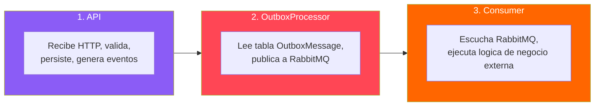
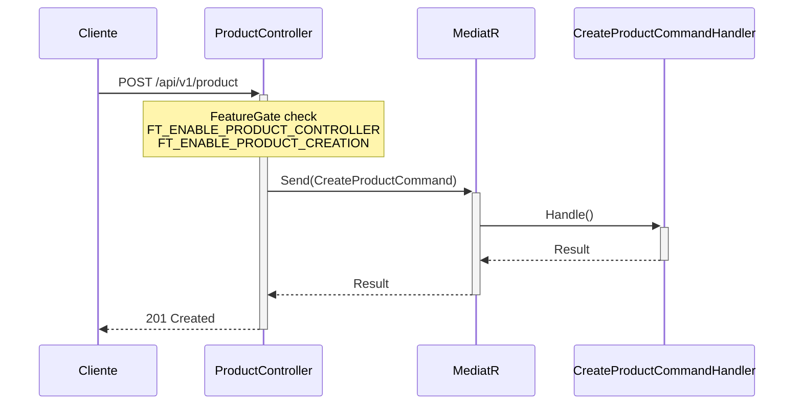
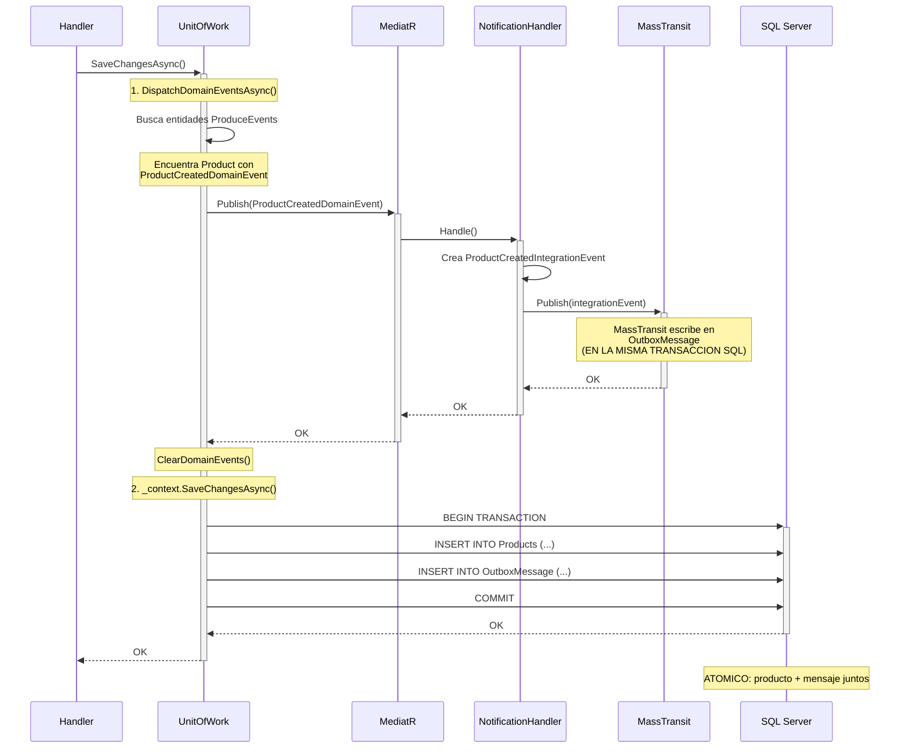
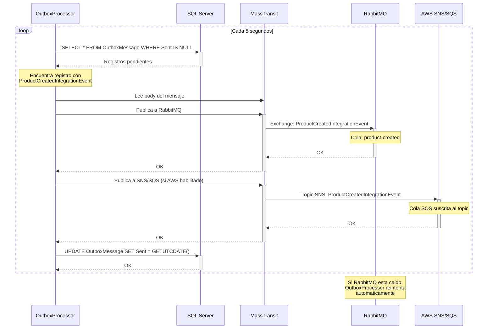
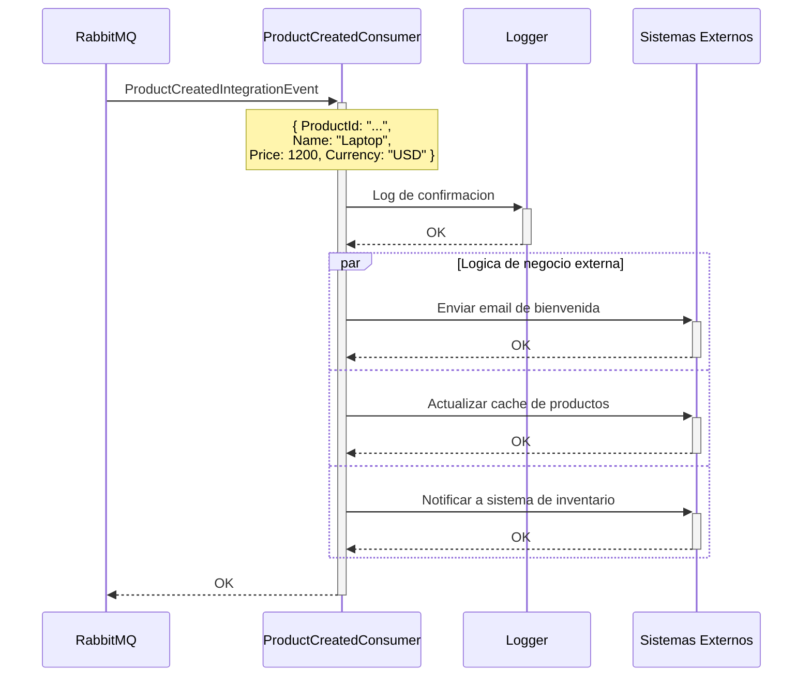
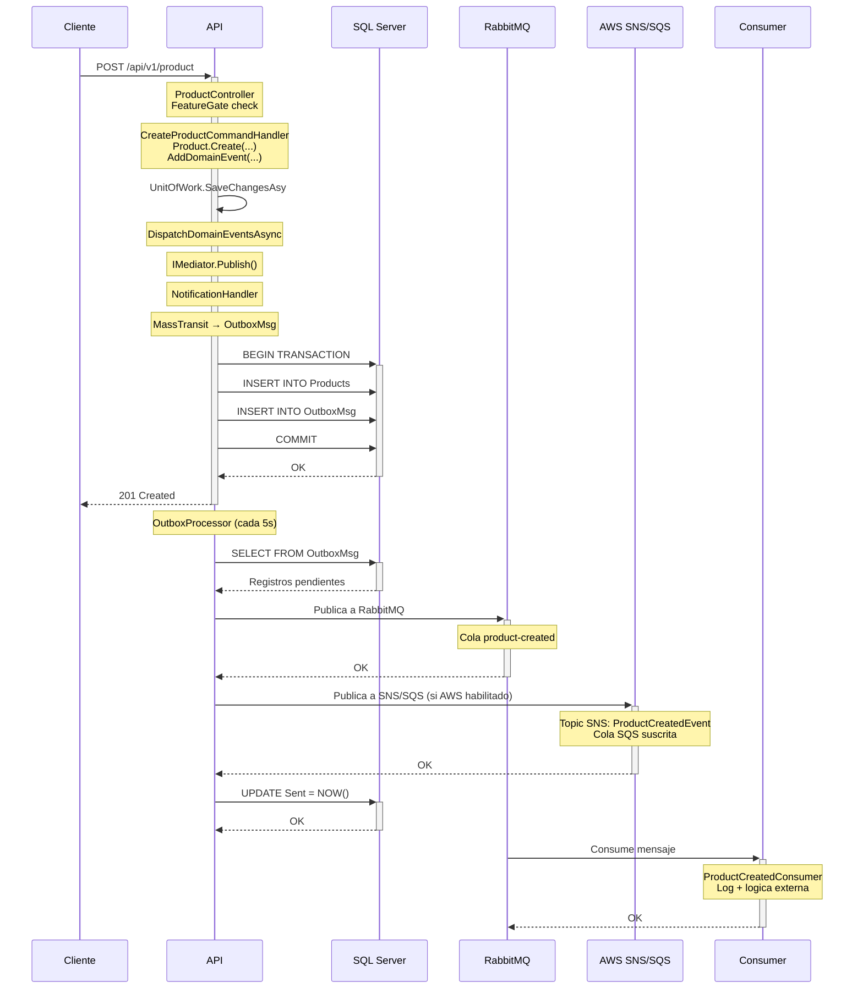

<h1 align="center">Software Learning Guide</h1>

<p align="center">
  <em>Proyecto educativo para aprender y practicar conceptos modernos de desarrollo en <strong>.NET 10</strong></em>
</p>

<p align="center">
  
  
  
  
  
</p>

<p align="center">
  
  
  
  
  
  
</p>

<p align="center">
  
  
  
  
</p>

<p align="center">
  <a href="README.en.md">
    
  </a>
</p>

---

## Que aprenderas

| Area | Conceptos Clave | Badge |
|------|-----------------|-------|
| **Arquitectura** | Clean Architecture, Vertical Slicing, SOLID, Dependency Inversion | `Architecture` |
| **Dominio (DDD)** | Value Objects, Entidades, Agregados, Domain Events, DomainErrors | `DDD` |
| **Patron Result\<T\>** | Manejo funcional de errores sin excepciones, composicion | `Result Pattern` |
| **CQRS** | Separacion Command/Query con MediatR, Handlers, Pipeline Behaviors | `CQRS` |
| **Unit of Work** | Transaccionalidad, atomicidad, despacho de eventos | `UoW` |
| **Eventos** | Domain Events, Integration Events, Notification Handlers | `Events` |
| **Transactional Outbox** | Patron Outbox con MassTransit + RabbitMQ, Workers | `Outbox` |
| **Resiliencia** | Retry, Circuit Breaker, Timeout en MassTransit | `Resilience` |
| **Persistencia** | EF Core (escritura), Dapper (lectura), Value Objects en DB | `Data` |
| **APIs REST** | Controladores, versionado, documentacion OpenAPI, streaming | `API` |
| **Observabilidad** | Trazas distribuidas, metricas, logging estructurado, scopes | `Observability` |
| **Feature Flags** | Feature Toggles con Microsoft.FeatureManagement y Flagsmith | `Feature Mgmt` |
| **Cloud Providers** | AWS, MiniStack (emulador local), SSM Parameter Store, proveedores de configuracion | `Cloud Providers` |
| **Infraestructura** | Docker, Aspire Dashboard, RabbitMQ, SQL Server | `Infra` |

---

## Documentacion

### Para Aprender Sobre...

| Tema | Ubicacion | Descripcion |
|------|-----------|-------------|
| **Domain-Driven Design (DDD)** | [`README.DDD.md`](SoftwareLearningGuide.Core.Business/README.DDD.md) | Value Objects, Entidades, Agregados, ejemplos practicos |
| **Domain Events** | [`README.EventSourcing.md`](SoftwareLearningGuide.Core.Business/README.EventSourcing.md) | Eventos de dominio, MediatR, Notification Handlers, Integration Events |
| **Transactional Outbox** | [`README.OutboxPattern.md`](SoftwareLearningGuide.OutboxProcessor/README.OutboxPattern.md) | Outbox Pattern con MassTransit + RabbitMQ, atomicidad, Workers |
| **Resiliencia** | [`README.Resilience.md`](SoftwareLearningGuide.OutboxProcessor/README.Resilience.md) | Retry, Circuit Breaker, Timeout en el pipeline de MassTransit |
| **Patron Result\<T\>** | [`README.ResultPattern.md`](SoftwareLearningGuide.Core.Business/README.ResultPattern.md) | Manejo de errores funcional, composicion, mejores practicas |
| **DomainErrors** | [`README.Errors.md`](SoftwareLearningGuide.Core.Business/README.Errors.md) | Catalogo centralizado de errores con contexto de entidad e ID |
| **CQRS con MediatR** | [`README.CQRS.md`](SoftwareLearningGuide.Application/README.CQRS.md) | Commands, Queries, Handlers, patron Mediator |
| **Unit of Work** | [`README.UnitOfWork.md`](SoftwareLearningGuide.Infraestructure/README.UnitOfWork.md) | Transaccionalidad, atomicidad, patron Unit of Work |
| **Entity Framework Core** | [`README.EntityFramework.md`](SoftwareLearningGuide.Infraestructure.Data/README.EntityFramework.md) | DbContext, configuraciones, Value Objects, Owned Types |
| **Dapper** | [`README.Dapper.md`](SoftwareLearningGuide.Application.Query/README.Dapper.md) | SQL directo, CommandDefinition, mapeo de resultados |
| **Middleware** | [`README.Middleware.md`](SoftwareLearningGuide.Api/README.Middleware.md) | Global Exception Handling, scopes de logging, pipeline HTTP |
| **Construccion de APIs** | [`README.Api.md`](SoftwareLearningGuide.Api/README.Api.md) | Conceptos de API REST, versionado, OpenAPI |
| **Observability** | [`README.Observability.md`](SoftwareLearningGuide.Api/README.Observability.md) | Los 3 pilares: trazas, metricas, logs, scopes, exportadores |
| **Feature Management** | [`README.FeatureManagement.md`](SoftwareLearningGuide.Api/README.FeatureManagement.md) | Feature Toggles, Feature Flags, Microsoft.FeatureManagement, Flagsmith |
| **Vertical Slicing** | [`README.VerticalSlicing.md`](SoftwareLearningGuide.Application/README.VerticalSlicing.md) | Organizacion por features, slices autonomos, Open/Closed en la practica |
| **Clean Architecture** | [`README.CleanArchitecture.md`](SoftwareLearningGuide.Api/README.CleanArchitecture.md) | Capas, regla de dependencias, Ports & Adapters, independencia tecnologica |

#### Patrones de Diseno

| Patron | Ubicacion | Descripcion |
|--------|-----------|-------------|
| **SOLID** | [`README.Pattern.SOLID.md`](SoftwareLearningGuide.Application/README.Pattern.SOLID.md) | Los 5 principios SOLID con ejemplos concretos del proyecto |
| **Factory** | [`README.Pattern.Factory.md`](SoftwareLearningGuide.Application/README.Pattern.Factory.md) | Static Factory Method en Value Objects y Agregados |
| **Builder** | [`README.Pattern.Builder.md`](SoftwareLearningGuide.Application/README.Pattern.Builder.md) | Builder fluido para tests, Commands complejos y records con `with` |
| **Repository** | [`README.Pattern.Repository.md`](SoftwareLearningGuide.Application/README.Pattern.Repository.md) | Abstraccion de acceso a datos, repositorios de escritura vs lectura |
| **Mediator** | [`README.Pattern.Mediator.md`](SoftwareLearningGuide.Application/README.Pattern.Mediator.md) | MediatR: Send vs Publish, Pipeline Behaviors, descubrimiento automatico |

#### Referentes de Tests

| Concepto | Ubicacion | Descripcion |
|----------|-----------|-------------|
| **TDD** | [`README.TDD.md`](tests/README.TDD.md) | Ciclo Red-Green-Refactor, buenas practicas de testing |
| **TestContainers** | [`README.TestContainer.md`](tests/README.TestContainer.md) | Contenedores Docker desechables para tests de integracion |
| **Respawn** | [`README.Respawn.md`](tests/README.Respawn.md) | Reseteo automatico de base de datos entre tests |
| **Response Fixture** | [`README.ResponseFixture.md`](tests/README.ResponseFixture.md) | Archivos JSON con respuestas esperadas para asserts |

#### Proveedores en la Nube

| Tema | Ubicacion | Descripcion |
|------|-----------|-------------|
| **AWS (General)** | [`README.AWS.md`](softwareLearningApplication/README.AWS.md) | Que es AWS, regiones, modelo de precios, catalogo de servicios con precios y comandos CLI |
| **MiniStack (Local AWS)** | [`README.Ministack.md`](softwareLearningApplication/README.Ministack.md) | Emulador local gratuito de AWS (60+ servicios), como funciona y su implementacion en este proyecto |
| **Terraform (IaC)** | [`README.Terraform.md`](softwareLearningApplication/README.Terraform.md) | Infraestructura como codigo con Terraform: VPC, ECR, EKS. Emulacion local con MiniStack y despliegue real en AWS |
| **Helm (Kubernetes)** | [`README.Helm.md`](softwareLearningApplication/README.Helm.md) | Gestión de paquetes para Kubernetes: los 3 charts (API, OutboxProcessor, Consumer), installation, operaciones diarias |
| **Despliegue completo** | [`softwareLearningApplication/README.Deploy.md`](softwareLearningApplication/README.Deploy.md) | Guia completa de despliegue: IaC con Terraform, Helm, flujo emulado con MiniStack, despliegue real en AWS |

---

## Inicio Rapido

### Requisitos Previos

- **.NET 10 SDK** o superior
- **Docker Desktop** (para servicios de observabilidad y SQL Server)
- **Visual Studio 2026** (recomendado) o VS Code

### Servicios Utilizados

| Servicio | Provider | Rol en el proyecto |
|----------|----------|--------------------|
| **SQL Server 2022** | Docker (`sqlserver-slg`) | Base de datos principal de la API y del OutboxProcessor |
| **RabbitMQ** | Docker (`rabbitmq-slg`) | Broker de mensajes principal: publicacion y consumo de Integration Events |
| **MiniStack** | Docker (`ministack-slg`) | Emulador local de AWS (SSM, SNS, SQS, ...) en `localhost:4566` |
| **Redis** | Docker (`redis-slg`) | Backend de persistencia de MiniStack |
| **Aspire Dashboard** | Docker | Observabilidad: recoleccion de trazas/metricas (OTLP) |
| **Flagsmith + PostgreSQL** | Docker (`flagsmith` + `flagsmith-postgres`) | Feature Management (feature flags) |
| **SSM Parameter Store** | AWS (via MiniStack) | Configuracion centralizada de las 3 aplicaciones |
| **SNS** | AWS (via MiniStack) | Topicos donde el OutboxProcessor publica los Integration Events (ademas de RabbitMQ) |
| **SQS** | AWS (via MiniStack) | Colas suscritas a los topicos SNS que consume el Consumer |
| **Cognito** | AWS (via MiniStack) | User Pool con usuarios/grupos (`admin`, `normal`) que emite los JWT que la API valida (autenticacion + RBAC) |

### Ejecutar la API

El proyecto contiene **tres aplicaciones** que se ejecutan independientemente:

#### 1. API Principal (`SoftwareLearningGuide.Api`)

```bash
# Ejecuta la API REST
dotnet run --project SoftwareLearningGuide.Api

# O desde la carpeta del proyecto
cd SoftwareLearningGuide.Api
dotnet run

# O desde Visual Studio: F5
```

> **Puertos:** `http://localhost:5089` (HTTP) | `https://localhost:7033` (HTTPS)

#### 2. Outbox Processor (`SoftwareLearningGuide.OutboxProcessor`)

Worker Service que lee la tabla OutboxMessage y publica eventos a **RabbitMQ** y a **SNS/SQS (AWS)**. No contiene logica de consumo - solo publica.

```bash
# Ejecuta el Outbox Processor
dotnet run --project SoftwareLearningGuide.OutboxProcessor

# O desde la carpeta del proyecto
cd SoftwareLearningGuide.OutboxProcessor
dotnet run
```

> **Requiere:** SQL Server, RabbitMQ y MiniStack ejecutandose (`docker-compose up -d`)

#### 3. Consumer (`SoftwareLearningGuide.Consumer`)

Worker Service que escucha colas de **RabbitMQ** y de **SNS/SQS (AWS)** y procesa los Integration Events publicados por el OutboxProcessor.

```bash
# Ejecuta el Consumer
dotnet run --project SoftwareLearningGuide.Consumer

# O desde la carpeta del proyecto
cd SoftwareLearningGuide.Consumer
dotnet run
```

> **Requiere:** RabbitMQ y MiniStack ejecutandose (`docker-compose up -d`)

#### Endpoints Disponibles

**API Principal (`localhost:5089`):**

| Metodo | Endpoint | Descripcion |
|--------|----------|-------------|
| GET | `/api/v1.0/order` | Obtener todas las ordenes |
| GET | `/api/v1.0/order/{id}` | Obtener orden por GUID |
| POST | `/api/v1.0/order` | Crear una orden |
| GET | `/api/v1.0/product` | Obtener todos los productos |
| GET | `/api/v1.0/product/{id}` | Obtener producto por GUID |
| POST | `/api/v1.0/product` | Crear un producto |
| GET | `/api/v1.0/customer` | Obtener todos los clientes |
| GET | `/api/v1.0/customer/{id}` | Obtener cliente por GUID |
| POST | `/api/v1.0/customer` | Crear un cliente |
| GET | `/api/v1.0/weatherforecast` | Pronostico del clima (v1) |
| GET | `/api/v2.0/weatherforecast` | Pronostico del clima (v2, con metricas) |
| GET | `/api/v2.0/apirest` | Listar items (con filtro y paginacion) |
| GET | `/api/v2.0/apirest/{id}` | Obtener item por ID |
| POST | `/api/v2.0/apirest` | Crear item |
| PUT | `/api/v2.0/apirest/{id}` | Reemplazar item (actualizacion completa) |
| PATCH | `/api/v2.0/apirest/{id}` | Actualizar item (parcial) |
| DELETE | `/api/v2.0/apirest/{id}` | Eliminar item |
| POST | `/api/v2.0/apirest/upload` | Subir archivo (multipart, max 10MB) |
| GET | `/api/v2.0/apirest/stream` | Streaming de items (IAsyncEnumerable) |
| GET | `/api/v2.0/apirest/headers` | Leer header X-Request-ID |
| GET | `/api/v2.0/apirest/forbidden` | Ejemplo respuesta 403 |
| GET | `/api/v2.0/apirest/unauthorized` | Ejemplo respuesta 401 |
| GET | `/api/v2.0/apirest/problem` | Ejemplo respuesta 500 (ProblemDetails) |

**Documentacion:**
- **Scalar:** `https://localhost:7033/scalar/v1`
- **Swagger UI:** `https://localhost:7033/swagger`
- **OpenAPI Spec:** `https://localhost:7033/openapi/v1.json`

> **Nota:** Los controllers de Order, Product y Customer estan protegidos por Feature Flags. En modo Development todos estan habilitados.
>
> **Autenticacion (Cognito):** los endpoints de Order, Product, Customer (`RequireNormalRole`: roles `normal`/`admin`) y Diagnostics (`RequireAdminRole`: solo `admin`) requieren un **JWT** de Cognito en el header `Authorization: Bearer <token>`. Sin token → `401`; rol insuficiente → `403`. Usuarios de prueba (seed de `cognito-init.sh`): `admin@test.com` / `Test1234!` (admin) y `user@test.com` / `Test1234!` (normal). Puedes obtener un token con `POST /api/v1/token` (user/password) o con el boton **Authorize** de Swagger. Detalles en [README.Ministack.md](softwareLearningApplication/README.Ministack.md#autenticación-con-cognito-jwt-y-rbac).

---

## Docker Compose

El stack actual incluye:

- **Aspire Dashboard** - Panel de control para observabilidad de .NET
- **SQL Server 2022** - Base de datos para la aplicacion
- **Flagsmith** - Servicio de gestion de feature flags
- **PostgreSQL** - Base de datos de Flagsmith
- **RabbitMQ** - Message broker para integracion entre servicios

### Servicios Disponibles

| Servicio | URL | Puerto | Descripcion |
|----------|-----|--------|-------------|
| **Aspire Dashboard** | http://localhost:18888 | 18888 | Panel de trazas, metricas y logs |
| **OTEL Collector (gRPC)** | localhost:4317 | 4317 | Recibe telemetria de la app |
| **SQL Server** | localhost,1433 | 1433 | Base de datos SoftwareLearningGuide |
| **Flagsmith** | http://localhost:8000 | 8000 | Panel de feature flags |
| **PostgreSQL** | localhost:5432 | 5432 | Base de datos de Flagsmith |
| **RabbitMQ** | localhost:5672 | 5672 | Message broker (AMQP) |
| **RabbitMQ Management** | http://localhost:15672 | 15672 | UI de administracion de RabbitMQ (guest/guest) |

### Comandos Utiles

```bash
# Levantar el stack
docker-compose up -d

# Ver logs
docker-compose logs -f aspire-dashboard

# Detener el stack
docker-compose down

# Ver estado de servicios
docker-compose ps

# Conectar a SQL Server (desde la app)
# ConnectionString: Server=localhost,1433;Database=SoftwareLearningGuide;User Id=sa;Password=YourStrong!Passw0rd;TrustServerCertificate=True;
```

---

## Objetivos de Aprendizaje

- Entender arquitectura REST con versionado
- Implementar Domain-Driven Design con Value Objects y Agregados
- Implementar Domain Events para desacoplamiento total en el dominio
- Usar el patron Transactional Outbox para atomicidad entre base de datos y mensajeria
- Usar el patron Result\<T\> para manejo de errores funcional
- Centralizar errores de dominio con DomainErrors para mensajes descriptivos y consistentes
- Implementar CQRS con MediatR para separar lecturas y escrituras
- Aplicar el patron Unit of Work para transaccionalidad y atomicidad en escrituras
- Usar Dapper para queries de lectura directa contra la base de datos
- Usar Entity Framework Core para commands con tracking y relaciones
- Implementar observabilidad moderna con OpenTelemetry (trazas, metricas, logs)
- Usar logging estructurado y scopes para correlacion de requests
- Exponer metricas personalizadas de negocio
- Documentar APIs con OpenAPI/Swagger
- Containerizar aplicaciones .NET con Docker
- Monitorear aplicaciones en produccion
- Gestionar feature toggles y flags con Microsoft.FeatureManagement y Flagsmith

---

## Estructura de Carpetas

```mermaid
graph TD
    Root["SoftwareLearningGuide/"]
    
    Core["Core.Business<br/>Capa de Dominio (DDD)"]
    CoreExc["Exceptions/<br/>Result&lt;T&gt; y Result (patron Result)"]
    CoreErr["Errors/<br/>DomainErrors: catalogo centralizado"]
    CoreVO["ValueObjects/<br/>Money, Email, Address, OrderId, ProductId"]
    CoreEnt["Entities/<br/>Product, Customer, OrderLine"]
    CoreAgg["Aggregates/<br/>Order (raiz del agregado), OrderStatus"]
    CoreDom["DomainEvents/<br/>ProduceEvents, ProductCreatedDomainEvent"]
    
    App["Application/<br/>Capa de Aplicacion (contratos)"]
    AppPorts["Ports/<br/>IBaseRepository, IOrderWriteRepository, IUnitOfWork"]
    
    AppCmd["Application.Command/<br/>Commands (EF Core, escritura)"]
    AppCmdCreate["CreateProduct, CreateOrder,<br/>CreateCustomer + Handlers"]
    AppCmdNh["NotificationHandlers/<br/>ProductCreated, OrderCreated, ..."]
    AppCmdPorts["Ports/<br/>IOutboxWriter"]
    
    AppQuery["Application.Query/<br/>Queries (Dapper, lectura)"]
    AppQueryGet["GetProduct, GetOrder, GetCustomer,<br/>GetAllProducts, GetAllOrders, GetAllCustomer"]
    
    Contracts["Contracts/<br/>Contratos de integracion"]
    ContractsEvents["Events/<br/>ProductCreatedEvent, OrderCreatedEvent, ..."]
    
    Infra["Infraestructure/<br/>Capa de Infraestructura"]
    InfraRepo["Repositories/<br/>BaseRepository, OrderWriteRepository,<br/>ProductWriteRepository, UnitOfWork"]
    InfraServ["Services/<br/>OutboxWriter"]
    
    InfraData["Infraestructure.Data/<br/>EF Core, DbContext"]
    InfraDataCtx["Context/<br/>ApplicationDbContext"]
    InfraDataConf["Configurations/<br/>OrderConfiguration, ProductConfiguration"]
    InfraDataEnt["Entities/<br/>OutboxMessageEntity"]
    InfraDataMig["Migrations/<br/>Migraciones EF Core"]
    
    Api["Api/<br/>API REST ASP.NET Core"]
    ApiCtrl["Controllers/<br/>Subcarpeta por feature:<br/>ProductControllerExample, OrderControllerExample"]
    ApiExt["Extensions/<br/>OpenTelemetry, ApiVersioning, CognitoAuth"]
    ApiFeat["FeatureToggles/<br/>FeatureToggles, FeatureManagementProvider"]
    ApiMid["Middlewares/<br/>GlobalExceptionMiddleware"]
    ApiMet["Metrics/<br/>OrderMetrics"]
    ApiOpt["Options/<br/>DatabaseOptions, OpenTelemetryOptions, ..."]
    ApiSta["Startup/<br/>CqrsStartup, DbConnectionsStartup, ..."]
    
    Outbox["OutboxProcessor/<br/>Worker Service: Outbox → RabbitMQ"]
    OutboxBus["Buses/<br/>IAwsMessageBus (SQS/SNS)"]
    OutboxWkr["Workers/<br/>CustomOutboxProcessorWorker"]
    
    Consumer["Consumer/<br/>Worker Service: RabbitMQ → Business Logic"]
    ConsumerBus["Buses/<br/>IAwsMessageBus (SQS/SNS)"]
    ConsumerCons["Consumers/<br/>ProductCreatedConsumer, OrderCreatedConsumer, ..."]
    
    Tests["tests/<br/>NUnit + Testcontainers"]
    
    Docker["docker-compose.yml"]
    Docs["docs/<br/>Documentacion (Docsify)"]
    
    Root --> Core
    Root --> App
    Root --> AppCmd
    Root --> AppQuery
    Root --> Contracts
    Root --> Infra
    Root --> InfraData
    Root --> Api
    Root --> Outbox
    Root --> Consumer
    Root --> Tests
    Root --> Docker
    Root --> Docs
    
    Core --> CoreExc
    Core --> CoreErr
    Core --> CoreVO
    Core --> CoreEnt
    Core --> CoreAgg
    Core --> CoreDom
    
    App --> AppPorts
    
    AppCmd --> AppCmdCreate
    AppCmd --> AppCmdNh
    AppCmd --> AppCmdPorts
    
    AppQuery --> AppQueryGet
    
    Contracts --> ContractsEvents
    
    Infra --> InfraRepo
    Infra --> InfraServ
    
    InfraData --> InfraDataCtx
    InfraData --> InfraDataConf
    InfraData --> InfraDataEnt
    InfraData --> InfraDataMig
    
    Api --> ApiCtrl
    Api --> ApiExt
    Api --> ApiFeat
    Api --> ApiMid
    Api --> ApiMet
    Api --> ApiOpt
    Api --> ApiSta
    
    Outbox --> OutboxBus
    Outbox --> OutboxWkr
    
    Consumer --> ConsumerBus
    Consumer --> ConsumerCons
    
    style Root fill:#512BD4,color:#fff,stroke:#4020a6
    style Core fill:#4ECDC4,color:#fff
    style App fill:#FF6B6B,color:#fff
    style AppCmd fill:#FF6B6B,color:#fff
    style AppQuery fill:#FF6B6B,color:#fff
    style Contracts fill:#FFD93D,color:#000
    style Infra fill:#45B7D1,color:#fff
    style InfraData fill:#45B7D1,color:#fff
    style Api fill:#8B5CF6,color:#fff
    style Outbox fill:#FF4655,color:#fff
    style Consumer fill:#FF6600,color:#fff
    style Tests fill:#2ECC71,color:#fff
    style Docker fill:#2496ED,color:#fff
    style Docs fill:#959DA5,color:#fff
```



---

## Flujo Completo: API → Outbox → Consumer (Caso Crear Producto)

Esta seccion explica como interactuan los 3 artefactos del sistema cuando un cliente crea un producto. Es el ejemplo practico que integra todos los patrones del proyecto.

### Los 3 Artefactos



### Paso 1: El cliente envia POST /api/v1/product

El request llega al `ProductController`, que despacha un `CreateProductCommand` via MediatR:



### Paso 2: El Command Handler crea el dominio

El handler crea la entidad `Product` que **hereda de `ProduceEvents`**, validando reglas de negocio y disparando un domain event:

```csharp
// Los constructores de Product, Money y ProductId son privados:
// la creacion pasa por factories que devuelven Result
var productId = ProductId.Create();

var priceResult = Money.Create(request.Price, request.Currency);
if (!priceResult.IsSuccess)
    return Result<Guid>.Failure(priceResult.Error!);

var productResult = Product.Create(
    productId,
    request.Name,
    request.Description,
    priceResult.Value!,
    request.StockQuantity);

if (!productResult.IsSuccess)
    return Result<Guid>.Failure(productResult.Error!);
// Product.Create internamente ejecuta:
//   AddDomainEvent(new ProductCreatedDomainEvent { ProductId, Name, Price, Currency })
// El evento queda en memoria dentro de la lista _domainEvents
```

### Paso 3: UnitOfWork persiste todo atomicamente

El handler llama a `_unitOfWork.SaveChangesAsync()` que hace dos cosas:



**Clave:** El producto y el mensaje de outbox se guardan en la **misma transaccion SQL**. Si algo falla, no se guarda el producto y no se genera el mensaje.

### Paso 4: OutboxProcessor publica a RabbitMQ y SNS/SQS

El `OutboxProcessor` es un Worker Service que revisa la tabla `OutboxMessage` cada 5 segundos:



**Nota:** Si RabbitMQ esta caido, el OutboxProcessor reintenta automaticamente cuando el broker se recupera. No se pierden mensajes. Ademas, si AWS esta habilitado en la configuracion, el mismo mensaje se publica tambien a SNS/SQS a traves de un segundo bus de MassTransit.

### Paso 5: Consumer procesa el evento

El `ProductCreatedConsumer` en el servicio Consumer escucha la cola `product-created`:



### Diagrama Visual Completo



### Que sucede si algo falla?

| Escenario | Resultado |
|-----------|-----------|
| Validacion falla en Product | No se crea nada, respuesta 400 con error |
| SQL Server caido | No se guarda, respuesta 500 (GlobalExceptionMiddleware) |
| RabbitMQ caido | Producto se guarda, OutboxMessage queda pendiente. OutboxProcessor reintenta |
| Consumer falla | Mensaje se queda en RabbitMQ con reintentos (at-least-once) |

### Documentacion Relacionada

Para profundizar en cada artefacto, consulta los READMEs dedicados:

- [`README.DDD.md`](SoftwareLearningGuide.Core.Business/README.DDD.md) - Entidad Product y su herencia de ProduceEvents
- [`README.EventSourcing.md`](SoftwareLearningGuide.Core.Business/README.EventSourcing.md) - Domain Events y su ciclo de vida
- [`README.UnitOfWork.md`](SoftwareLearningGuide.Infraestructure/README.UnitOfWork.md) - Como UnitOfWork despacha eventos y persiste
- [`README.OutboxPattern.md`](SoftwareLearningGuide.OutboxProcessor/README.OutboxPattern.md) - Transactional Outbox con MassTransit
- [`README.CQRS.md`](SoftwareLearningGuide.Application/README.CQRS.md) - Command/Query separation con MediatR

---

## Stack Tecnologico

<p align="center">
  
  
  
  
  
  
  
  
  
  
  
  
  
  
  
  
</p>

---

## Soporte y Recursos

- [Microsoft .NET Documentation](https://learn.microsoft.com/en-us/dotnet/)
- [OpenTelemetry .NET](https://opentelemetry.io/docs/instrumentation/net/)
- [ASP.NET Core API Best Practices](https://learn.microsoft.com/en-us/aspnet/core/web-api/)
- [Domain-Driven Design - Eric Evans](https://www.domainlanguage.com/ddd/)
- [Railway-Oriented Programming](https://fsharpforfunandprofit.com/rop/)
- [MediatR Documentation](https://automapper.org/)
- [MassTransit Documentation](https://masstransit.io/)
- [RabbitMQ Tutorials](https://www.rabbitmq.com/getstarted.html)
- [Dapper Documentation](https://dapperlib.github.io/Dapper/)
- [Entity Framework Core](https://learn.microsoft.com/en-us/ef/core/)
- [Transactional Outbox Pattern](https://microservices.io/patterns/data/transactional-outbox.html)

---

**Feliz aprendizaje!**
