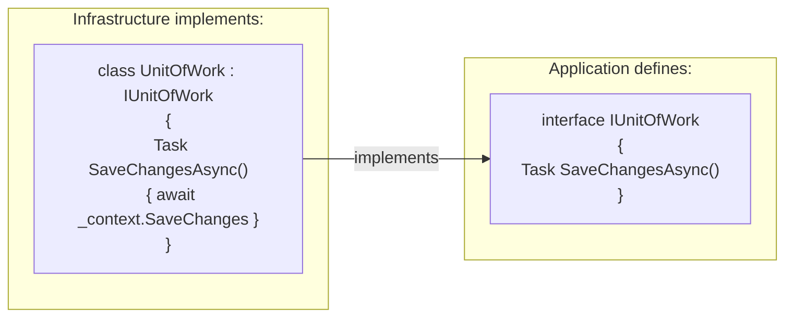
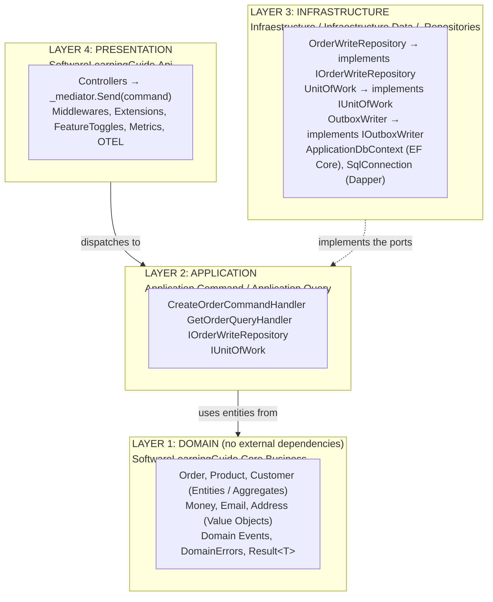

# Clean Architecture


**Clean Architecture** organizes code into concentric layers where dependencies always point **inward**, toward the domain. The domain layer doesn't know or care whether the database is SQL Server, SQLite, or a file on disk. This ensures technological independence and maximum testability.

---

#### Table of Contents

1. [What is Clean Architecture?](#what-is-clean-architecture)
2. [The Golden Rules](#the-golden-rules)
3. [Project Layers](#project-layers)
4. [The Dependency Rule in Practice](#the-dependency-rule-in-practice)
5. [Dependency Inversion (Ports & Adapters)](#dependency-inversion-ports--adapters)
6. [Layer Diagram](#layer-diagram)
7. [Project Reference](#project-reference)

---

## What is Clean Architecture?

**Clean Architecture** (Robert C. Martin, "Uncle Bob") is a set of principles that defines how layers are organized and in which direction dependencies flow.

> **Key concept:** Dependencies always point inward. The business doesn't know a database exists. The database doesn't know an API exists.

The goal is for **business rules** to be completely independent of:
- Frameworks (ASP.NET, EF Core, MassTransit)
- Databases (SQL Server, PostgreSQL, MongoDB)
- User interfaces (REST API, gRPC, console)
- External services (RabbitMQ, Stripe, SendGrid)

---

## The Golden Rules

1. **Framework Independence**: The domain doesn't depend on any external framework.
2. **Testability**: Business rules can be tested without UI, database, or web server.
3. **UI Independence**: The UI can change without affecting business rules.
4. **Database Independence**: You can switch from SQL Server to PostgreSQL without touching the domain.
5. **The Dependency Rule**: Code in outer layers can depend on inner layers, but never the reverse.

---

## Project Layers

### Layer 1: Domain — `SoftwareLearningGuide.Core.Business`

The heart of the application. **No external references** (only .NET primitives).

| Component | Description | Example |
|-----------|-------------|---------|
| **Entities** | Objects with unique identity | `Product`, `Customer`, `OrderLine` |
| **Aggregates** | Root entities that control their group | `Order` (aggregate root) |
| **Value Objects** | Immutable objects by value | `Money`, `Email`, `Address` |
| **Domain Events** | Facts that occurred in the domain | `OrderCreatedDomainEvent` |
| **DomainErrors** | Centralized error catalog | `DomainErrors.Order.NotFound(id)` |
| **Result\<T\>** | Functional error handling | `Result<Order>.Success(order)` |

```csharp
// The domain has NO references to EF Core, ASP.NET, or any framework
public sealed class Product : ProduceEvents
{
    public ProductId Id { get; private set; }
    public Money Price { get; private set; }  // Immutable Value Object

    public Product(ProductId id, string name, Money price, int stock)
    {
        // Pure business validations — no EF Core, no SQL
        Id = id; Price = price;

        // Domain Event: business fact that occurred
        AddDomainEvent(new ProductCreatedDomainEvent { ProductId = id.Value, Name = name });
    }
}
```

### Layer 2: Application — `SoftwareLearningGuide.Application`

Orchestrates the domain to fulfill use cases. Contains Commands, Queries, Handlers, and **Ports** (interfaces defining what it needs from the outside).

> **Critical rule:** The Application layer **defines** the ports but **doesn't implement** them. Implementations live in Infrastructure.

```csharp
// Application defines the contract — doesn't know how it's implemented
public interface IOrderWriteRepository : IBaseRepository<Order, Guid> { }

// Application uses the interface, never the implementation
public sealed class CreateOrderCommandHandler : IRequestHandler<CreateOrderCommand, Result<Guid>>
{
    private readonly IOrderWriteRepository _repository;  // Interface, not EF Core
    private readonly IUnitOfWork _unitOfWork;             // Interface, not DbContext
}
```

### Layer 3: Infrastructure

Implements the Application's ports. This is where technical details live (EF Core, SQL, RabbitMQ).

| Project | Responsibility |
|---------|-----------------|
| `Infraestructure.Data` | `ApplicationDbContext`, EF Core configurations |
| `Infraestructure.Repositories` | `OrderWriteRepository`, `UnitOfWork` |
| `Infraestructure` | `Dependencies.cs` (DI registration), `OutboxWriter` |

```csharp
// Infrastructure IMPLEMENTS Application's port
public sealed class OrderWriteRepository
    : BaseRepository<Order, OrderId, Guid>, IOrderWriteRepository
{
    public OrderWriteRepository(ApplicationDbContext context)
        : base(context, guid => OrderId.From(guid).Value) { }
    // The application never sees ApplicationDbContext — only IOrderWriteRepository
}
```

### Layer 4: Presentation — `SoftwareLearningGuide.Api`

Entry point of the application. Receives HTTP requests and transforms them into Commands/Queries.

```csharp
// The controller is the adapter between HTTP and the Application layer
[ApiController]
[Route("api/v{version:apiVersion}/[controller]")]
public class OrderController : ControllerBase
{
    private readonly IMediator _mediator;

    // Only dispatches — no business logic, no SQL, no EF Core
    [HttpPost]
    public async Task<IActionResult> Create([FromBody] CreateOrderCommand command, CancellationToken ct)
    {
        var result = await _mediator.Send(command, ct);
        return result.IsSuccess
            ? CreatedAtAction(nameof(GetById), new { id = result.Value }, new { orderId = result.Value })
            : BadRequest(new { error = result.Error });
    }
}
```

---

## The Dependency Rule in Practice

Project references go **from outside to inside, never the reverse**:

```
Api             → Application, Infraestructure, Core.Business
Infraestructure → Core.Business, Application (only Ports)
Application     → Core.Business
Core.Business   → (nothing: only .NET primitives)
```

> **Why does it matter?** If the domain depended on EF Core, you couldn't test it without a database. With this rule, you switch from SQL Server to PostgreSQL by touching **only** the Infrastructure layer.

---

## Dependency Inversion (Ports & Adapters)

**Port:** Interface defined in Application specifying what it needs.
**Adapter:** Concrete implementation in Infrastructure using the real technology.



**Ports in this project:**

| Port | Defined in | Implemented in |
|--------|-------------|-----------------|
| `IOrderWriteRepository` | `Application/Ports/` | `Infraestructure.Repositories/` |
| `IUnitOfWork` | `Application/Ports/` | `Infraestructure.Repositories/` |
| `IOutboxWriter` | `Application/Ports/` | `Infraestructure/Services/` |

---

## Layer Diagram



---

## Project Reference

| Project | Layer | Responsibility |
|---------|------|-----------------|
| [`Core.Business/`](../SoftwareLearningGuide.Core.Business/) | Domain | Entities, Aggregates, Value Objects, Domain Events, DomainErrors, Result\<T\> |
| [`Application/`](../SoftwareLearningGuide.Application/) | Application | Ports (interfaces), base registration |
| [`Application.Command/`](../SoftwareLearningGuide.Application.Command/) | Application | Commands and their Handlers (write) |
| [`Application.Query/`](../SoftwareLearningGuide.Application.Query/) | Application | Queries and their Handlers (read with Dapper) |
| [`Infraestructure.Data/`](../SoftwareLearningGuide.Infraestructure.Data/) | Infrastructure | EF Core DbContext, entity configurations |
| [`Infraestructure.Repositories/`](../SoftwareLearningGuide.Infraestructure.Repositories/) | Infrastructure | Concrete repositories, UnitOfWork |
| [`Infraestructure/`](../SoftwareLearningGuide.Infraestructure/) | Infrastructure | OutboxWriter, Dependencies.cs (DI registration) |
| [`Api/`](.) | Presentation | Controllers, Middlewares, Startup, Metrics, OpenTelemetry |

---

**See also:**
- [`README.DDD.md`](../SoftwareLearningGuide.Core.Business/README.DDD.md) — Domain Layer: Value Objects, Entities, Aggregates
- [`README.CQRS.md`](../SoftwareLearningGuide.Application/README.CQRS.md) — Application Layer: Commands and Queries with MediatR
- [`README.VerticalSlicing.md`](../SoftwareLearningGuide.Application/README.VerticalSlicing.md) — Organization by features within Application
- [`README.Pattern.SOLID.md`](../SoftwareLearningGuide.Application/README.Pattern.SOLID.md) — SOLID principles that underpin the architecture
