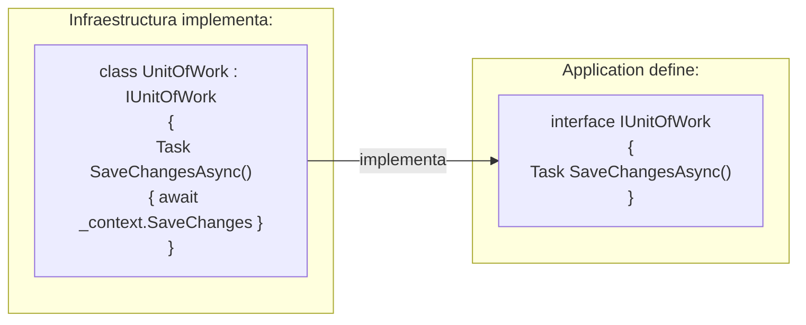
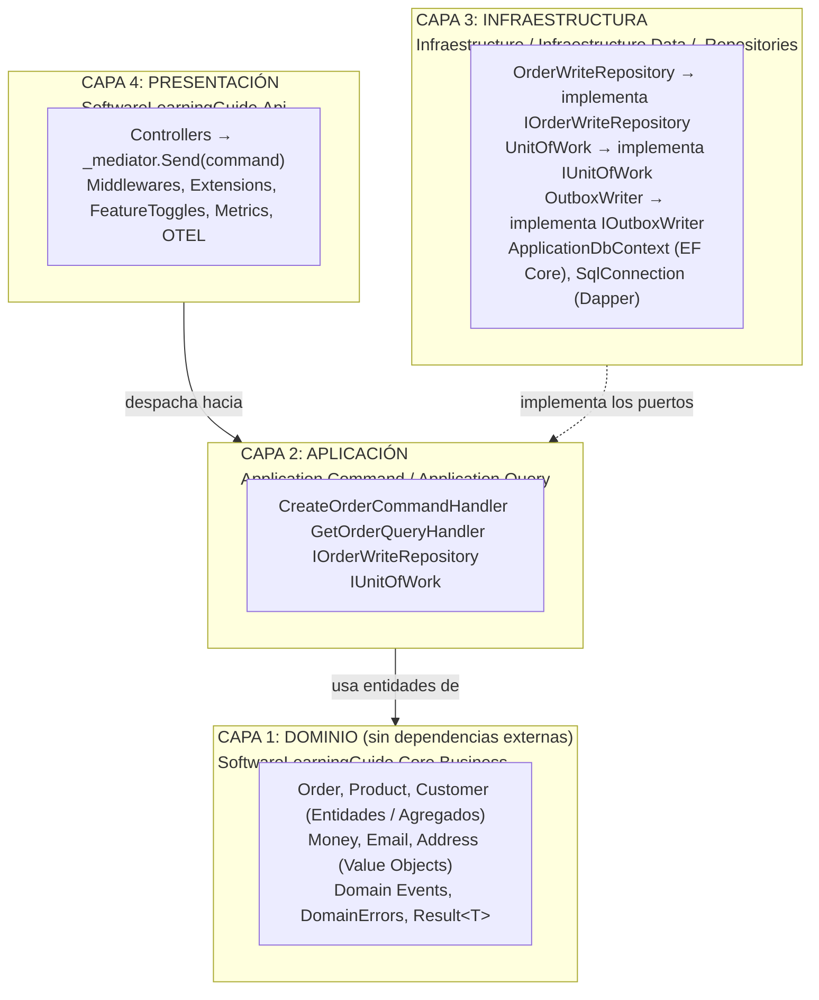

# Clean Architecture


**Clean Architecture** organiza el código en capas concéntricas donde las dependencias siempre apuntan **hacia adentro**, hacia el dominio. La capa de dominio no conoce ni le importa si la base de datos es SQL Server, SQLite o un archivo en disco. Esto garantiza independencia tecnológica y máxima testabilidad.

---

#### Tabla de Contenidos

1. [¿Qué es Clean Architecture?](#qué-es-clean-architecture)
2. [Las Reglas de Oro](#las-reglas-de-oro)
3. [Capas del Proyecto](#capas-del-proyecto)
4. [La Regla de Dependencias en Práctica](#la-regla-de-dependencias-en-práctica)
5. [Inversión de Dependencias (Ports & Adapters)](#inversión-de-dependencias-ports--adapters)
6. [Diagrama de Capas](#diagrama-de-capas)
7. [Referencia de Proyectos](#referencia-de-proyectos)

---

## ¿Qué es Clean Architecture?

**Clean Architecture** (Robert C. Martin, "Uncle Bob") es un conjunto de principios que define cómo se organizan las capas y en qué dirección fluyen las dependencias.

> **Concepto clave:** Las dependencias siempre apuntan hacia adentro. El negocio no sabe que existe una base de datos. La base de datos no sabe que existe una API.

El objetivo es que las **reglas de negocio** sean completamente independientes de:
- Frameworks (ASP.NET, EF Core, MassTransit)
- Bases de datos (SQL Server, PostgreSQL, MongoDB)
- Interfaces de usuario (REST API, gRPC, consola)
- Servicios externos (RabbitMQ, Stripe, SendGrid)

---

## Las Reglas de Oro

1. **Independencia de Frameworks**: El dominio no depende de ningún framework externo.
2. **Testabilidad**: Las reglas de negocio se pueden testear sin UI, base de datos, ni servidor web.
3. **Independencia de UI**: La UI puede cambiar sin afectar las reglas de negocio.
4. **Independencia de Base de Datos**: Puedes cambiar de SQL Server a PostgreSQL sin tocar el dominio.
5. **La Regla de Dependencias**: El código de las capas externas puede depender de capas internas, pero nunca al revés.

---

## Capas del Proyecto

### Capa 1: Dominio — `SoftwareLearningGuide.Core.Business`

El corazón de la aplicación. **Sin referencias externas** (solo primitivos .NET).

| Componente | Descripción | Ejemplo |
|-----------|-------------|---------|
| **Entidades** | Objetos con identidad única | `Product`, `Customer`, `OrderLine` |
| **Agregados** | Entidades raíz que controlan su grupo | `Order` (raíz del agregado) |
| **Value Objects** | Objetos inmutables por valor | `Money`, `Email`, `Address` |
| **Domain Events** | Hechos ocurridos en el dominio | `OrderCreatedDomainEvent` |
| **DomainErrors** | Catálogo centralizado de errores | `DomainErrors.Order.NotFound(id)` |
| **Result\<T\>** | Manejo funcional de errores | `Result<Order>.Success(order)` |

```csharp
// El dominio NO tiene referencias a EF Core, ASP.NET, ni ningún framework
public sealed class Product : ProduceEvents
{
    public ProductId Id { get; private set; }
    public Money Price { get; private set; }  // Value Object inmutable

    public Product(ProductId id, string name, Money price, int stock)
    {
        // Validaciones de negocio puras — sin EF Core, sin SQL
        Id = id; Price = price;

        // Domain Event: hecho de negocio que ocurrió
        AddDomainEvent(new ProductCreatedDomainEvent { ProductId = id.Value, Name = name });
    }
}
```

### Capa 2: Aplicación — `SoftwareLearningGuide.Application`

Orquesta el dominio para cumplir casos de uso. Contiene Commands, Queries, Handlers y **Ports** (interfaces que definen lo que necesita del exterior).

> **Regla crítica:** La capa de Aplicación **define** los puertos pero **no los implementa**. Las implementaciones viven en Infraestructura.

```csharp
// Application define el contrato — no sabe cómo se implementa
public interface IOrderWriteRepository : IBaseRepository<Order, Guid> { }

// Application usa la interfaz, nunca la implementación
public sealed class CreateOrderCommandHandler : IRequestHandler<CreateOrderCommand, Result<Guid>>
{
    private readonly IOrderWriteRepository _repository;  // Interfaz, no EF Core
    private readonly IUnitOfWork _unitOfWork;             // Interfaz, no DbContext
}
```

### Capa 3: Infraestructura

Implementa los puertos de la Aplicación. Aquí viven los detalles técnicos (EF Core, SQL, RabbitMQ).

| Proyecto | Responsabilidad |
|---------|-----------------|
| `Infraestructure.Data` | `ApplicationDbContext`, configuraciones EF Core |
| `Infraestructure.Repositories` | `OrderWriteRepository`, `UnitOfWork` |
| `Infraestructure` | `Dependencies.cs` (registro DI), `OutboxWriter` |

```csharp
// Infraestructura IMPLEMENTA el puerto de Application
public sealed class OrderWriteRepository
    : BaseRepository<Order, OrderId, Guid>, IOrderWriteRepository
{
    public OrderWriteRepository(ApplicationDbContext context)
        : base(context, guid => OrderId.From(guid).Value) { }
    // La aplicación nunca ve ApplicationDbContext — solo IOrderWriteRepository
}
```

### Capa 4: Presentación — `SoftwareLearningGuide.Api`

Entry point de la aplicación. Recibe requests HTTP y las transforma en Commands/Queries.

```csharp
// El controller es el adapter entre HTTP y la capa de Aplicación
[ApiController]
[Route("api/v{version:apiVersion}/[controller]")]
public class OrderController : ControllerBase
{
    private readonly IMediator _mediator;

    // Solo despacha — sin lógica de negocio, sin SQL, sin EF Core
    [HttpPost]
    public async Task<IActionResult> Create([FromBody] CreateOrderCommand command, CancellationToken ct)
    {
        var result = await _mediator.Send(command, ct);
        return result.IsSuccess
            ? CreatedAtAction(nameof(GetById), new { id = result.Value }, new { orderId = result.Value })
            : BadRequest(new { error = result.Error });
    }
}
```

---

## La Regla de Dependencias en Práctica

Las referencias de proyecto van **de afuera hacia adentro, nunca al revés**:

```
Api             → Application, Infraestructure, Core.Business
Infraestructure → Core.Business, Application (solo Ports)
Application     → Core.Business
Core.Business   → (nada: solo primitivos .NET)
```

> **¿Por qué importa?** Si el dominio dependiera de EF Core, no podrías testearlo sin una base de datos. Con esta regla, cambias de SQL Server a PostgreSQL tocando **solo** la capa de Infraestructura.

---

## Inversión de Dependencias (Ports & Adapters)

**Port (Puerto):** Interfaz definida en Application que especifica lo que necesita.
**Adapter (Adaptador):** Implementación concreta en Infraestructura que usa la tecnología real.



**Puertos en este proyecto:**

| Puerto | Definido en | Implementado en |
|--------|-------------|-----------------|
| `IOrderWriteRepository` | `Application/Ports/` | `Infraestructure.Repositories/` |
| `IUnitOfWork` | `Application/Ports/` | `Infraestructure.Repositories/` |
| `IOutboxWriter` | `Application/Ports/` | `Infraestructure/Services/` |

---

## Diagrama de Capas



---

## Referencia de Proyectos

| Proyecto | Capa | Responsabilidad |
|---------|------|-----------------|
| [`Core.Business/`](../SoftwareLearningGuide.Core.Business/) | Dominio | Entidades, Agregados, Value Objects, Domain Events, DomainErrors, Result\<T\> |
| [`Application/`](../SoftwareLearningGuide.Application/) | Aplicación | Ports (interfaces), registro base |
| [`Application.Command/`](../SoftwareLearningGuide.Application.Command/) | Aplicación | Commands y sus Handlers (escritura) |
| [`Application.Query/`](../SoftwareLearningGuide.Application.Query/) | Aplicación | Queries y sus Handlers (lectura con Dapper) |
| [`Infraestructure.Data/`](../SoftwareLearningGuide.Infraestructure.Data/) | Infraestructura | EF Core DbContext, configuraciones de entidades |
| [`Infraestructure.Repositories/`](../SoftwareLearningGuide.Infraestructure.Repositories/) | Infraestructura | Repositorios concretos, UnitOfWork |
| [`Infraestructure/`](../SoftwareLearningGuide.Infraestructure/) | Infraestructura | OutboxWriter, Dependencies.cs (registro DI) |
| [`Api/`](.) | Presentación | Controllers, Middlewares, Startup, Métricas, OpenTelemetry |

---

**Ver también:**
- [`README.DDD.md`](../SoftwareLearningGuide.Core.Business/README.DDD.md) — Capa de Dominio: Value Objects, Entidades, Agregados
- [`README.CQRS.md`](../SoftwareLearningGuide.Application/README.CQRS.md) — Capa de Aplicación: Commands y Queries con MediatR
- [`README.VerticalSlicing.md`](../SoftwareLearningGuide.Application/README.VerticalSlicing.md) — Organización por features dentro de Application
- [`README.Pattern.SOLID.md`](../SoftwareLearningGuide.Application/README.Pattern.SOLID.md) — Principios SOLID que sustentan la arquitectura
