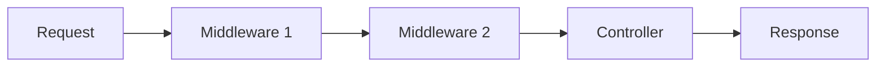
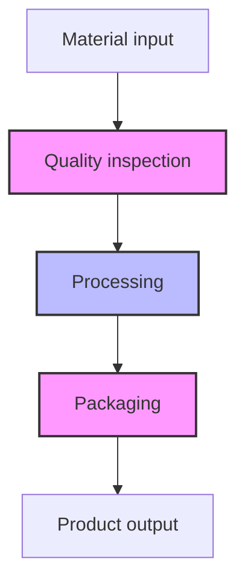
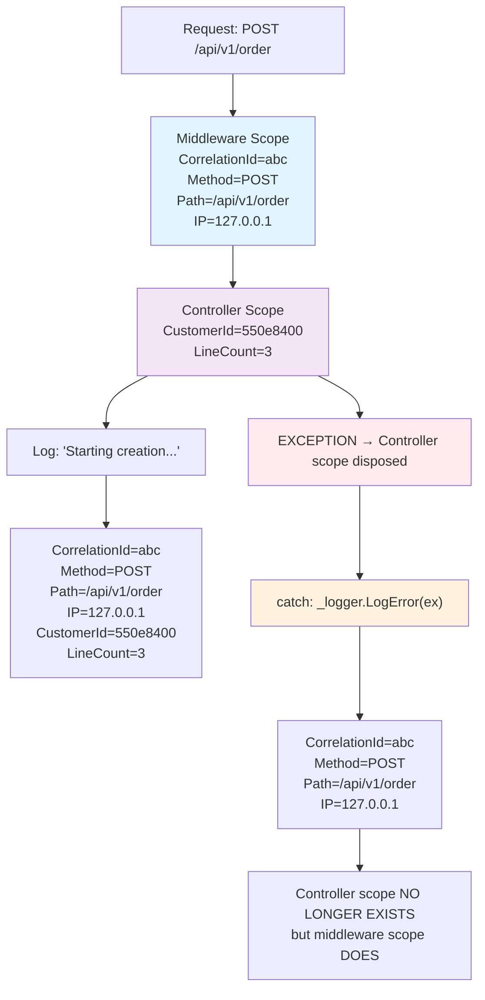
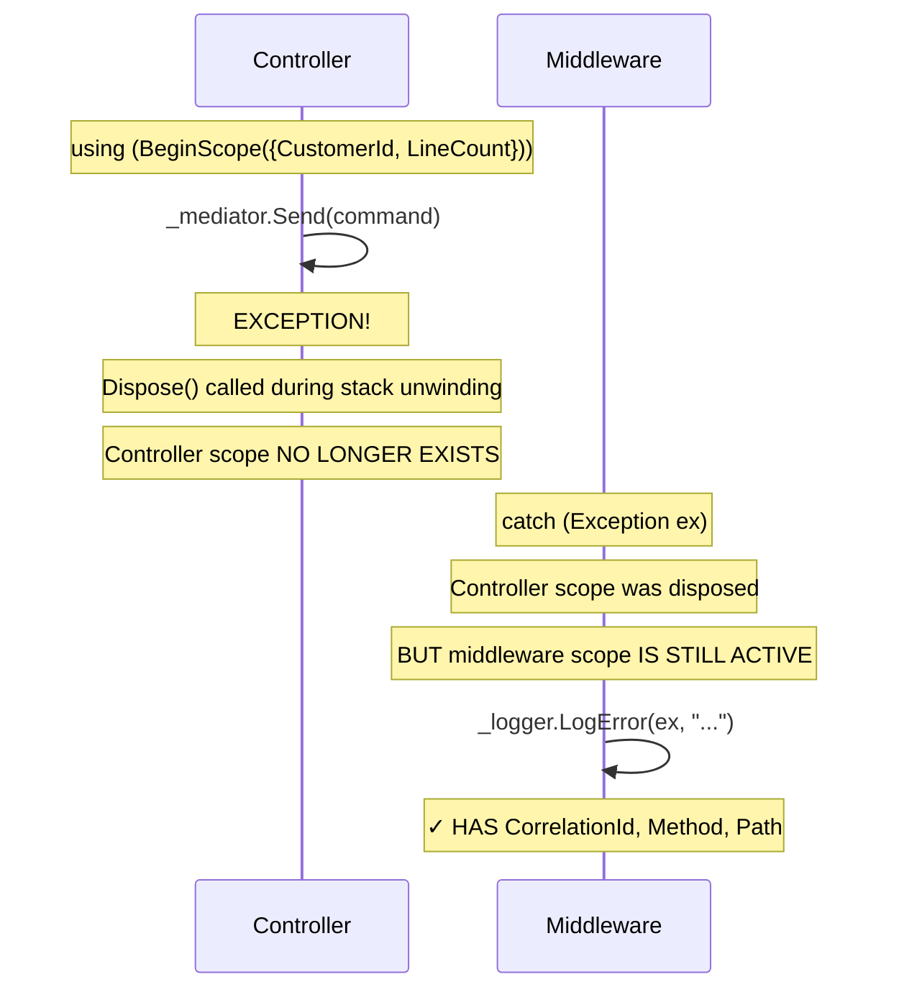
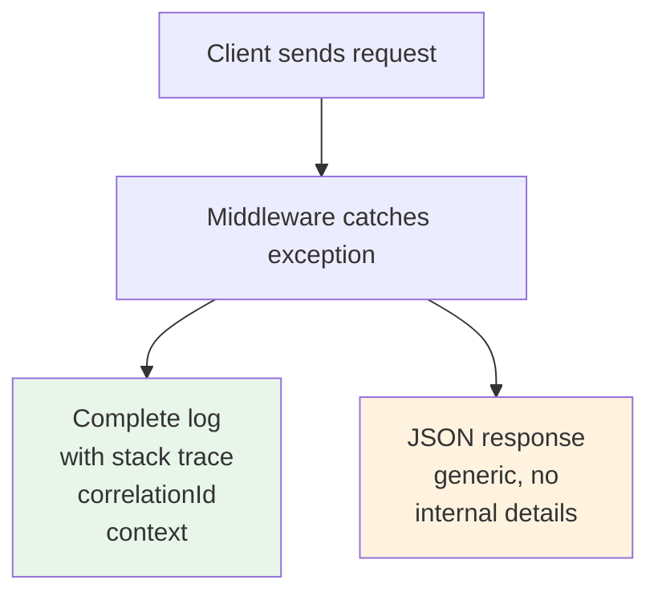
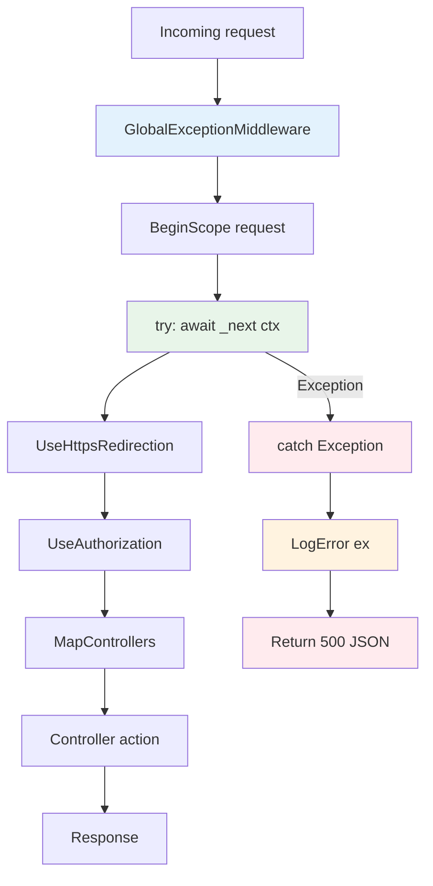
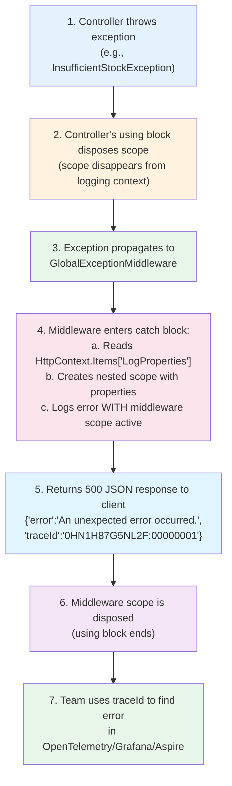
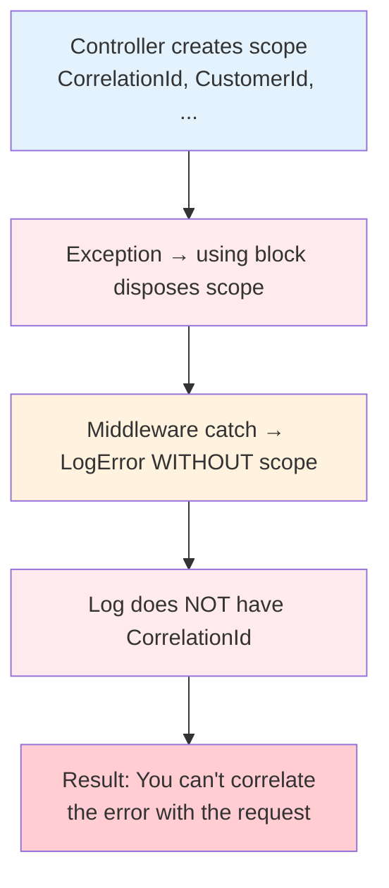
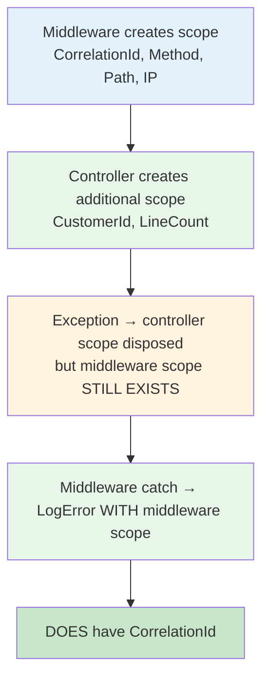

# Middleware - Global Exception Handling


A **global middleware** captures any unhandled exception that rises in the HTTP pipeline, logs it with full context, and returns a 500 response to the client. It prevents unexpected errors from reaching the user with default error HTML.

---

#### Table of Contents

1. [What is a Middleware?](#what-is-a-middleware)
2. [GlobalExceptionMiddleware](#globalexceptionmiddleware)
3. [Logging Scopes in the Middleware](#logging-scopes-in-the-middleware)
4. [Error Response](#error-response)
5. [Position in the Pipeline](#position-in-the-pipeline)
6. [Exception Flow](#exception-flow)
7. [Why Scopes in the Middleware?](#why-scopes-in-the-middleware)
8. [File Reference](#file-reference)

---

## What is a Middleware?

A **middleware** is a class that processes each HTTP request before or after it reaches the next pipeline component. Each middleware can:

- Execute code before the next middleware
- Modify the request or response
- **Short-circuit** the pipeline (not call the next one)
- Handle errors



### Analogy

Think of middleware as a **safety net** in a factory:



If something fails at any step, the safety net catches it and reports the problem without stopping the entire factory.

Without a global exception middleware, each controller would have to handle its own exceptions with `try-catch`. This creates duplicate code and, worse, if a controller forgets to catch an exception, the user sees an ugly HTML error page. The middleware centralizes error handling in a single place: one control point that catches **any** unhandled exception in the entire application.

---

## GlobalExceptionMiddleware

The middleware intercepts any unhandled exception that occurs after a request enters the pipeline and before the response is sent to the client. It does this by executing the rest of the pipeline inside a `try/catch` block wrapped in a logging scope that persists for the entire request duration, ensuring that even if a controller's scope is disposed during exception propagation, the error log retains context data (CorrelationId, Method, Path, IP).

[`SoftwareLearningGuide.Api/Middlewares/GlobalExceptionMiddleware.cs`](SoftwareLearningGuide.Api/Middlewares/GlobalExceptionMiddleware.cs)

```csharp
public sealed class GlobalExceptionMiddleware {
    private readonly RequestDelegate _next;
    private readonly ILogger<GlobalExceptionMiddleware> _logger;

    public GlobalExceptionMiddleware(RequestDelegate next, ILogger<GlobalExceptionMiddleware> logger) {
        _next = next ?? throw new ArgumentNullException(nameof(next));
        _logger = logger ?? throw new ArgumentNullException(nameof(logger));
    }

    public async Task InvokeAsync(HttpContext context) {
        using (_logger.BeginScope(new Dictionary<string, object>
        {
            { "CorrelationId", context.TraceIdentifier },
            { "RequestMethod", context.Request.Method },
            { "RequestPath", context.Request.Path },
            { "RemoteIpAddress", context.Connection.RemoteIpAddress?.ToString() ?? "unknown" }
        })) {
            try {
                await _next(context);
            }
            catch (Exception ex) {
                var extraProperties = context.Items["LogProperties"] as IDictionary<string, object>;

                var scope = extraProperties is { Count: > 0 }
                    ? _logger.BeginScope(extraProperties)
                    : null;

                try {
                    _logger.LogError(ex,
                        "Unhandled exception in {Method} {Path}{QueryString}. TraceId: {TraceId} with Message: {Message}",
                        context.Request.Method,
                        context.Request.Path,
                        context.Request.QueryString,
                        context.TraceIdentifier,
                        ex.Message);
                }
                finally {
                    scope?.Dispose();
                }

                await HandleExceptionAsync(context, ex);
            }
        }
    }

    private static async Task HandleExceptionAsync(HttpContext context, Exception exception) {
        context.Response.ContentType = "application/json";
        context.Response.StatusCode = (int)HttpStatusCode.InternalServerError;

        var response = new {
            error = "An unexpected error occurred.",
            traceId = context.TraceIdentifier
        };

        var json = JsonSerializer.Serialize(response, new JsonSerializerOptions {
            PropertyNamingPolicy = JsonNamingPolicy.CamelCase
        });

        await context.Response.WriteAsync(json);
    }
}
```

### Middleware Breakdown

Let's break down what this middleware does step by step:

1. **Request scope** (lines 79-85): Creates a scope that wraps the entire request with context data (CorrelationId, Method, Path, IP). Any log written inside `_next(context)` will have these fields automatically attached.

2. **Pipeline execution** (line 89): Calls `_next(context)` to execute the next middleware or controller. If everything goes well, the scope disposes normally when exiting the `using`.

3. **Exception capture** (lines 92-118): If something fails, it captures the exception, reads additional properties the controller may have saved in `HttpContext.Items`, logs them with all available context, and returns a generic JSON response to the client with the `traceId` so the team can trace the error.

4. **Safe response** (`HandleExceptionAsync` method): Returns a generic JSON with `"error"` and `"traceId"`. Never exposes internal details like stack traces or error messages to the client.

### Key Points

| Concept | Description |
|---------|-------------|
| `RequestDelegate _next` | Delegate to the next middleware in the pipeline |
| `ILogger _logger` | Logger injected by DI to log the error |
| **Request scope** | Wraps the entire request, including the catch |
| **Controller scope** | Read from `HttpContext.Items` to enrich the error log |
| `context.TraceIdentifier` | Unique request ID for correlation with OpenTelemetry |
| **JSON Response** | Generic error to client, full details in logs |

---

## Logging Scopes in the Middleware

### What are Scopes?

A **scope** is a "context" that is attached to all logs written within it. It's like putting a sticker on each log that says "this log belongs to this request".

Without scopes, each log would be an isolated event. With scopes, each log carries attached context information (like the request ID). It's like putting a label on each piece of a puzzle: you know which request it belongs to. This is fundamental in production where you have hundreds of concurrent requests — without scopes, it would be impossible to distinguish which log belongs to which user, which request, or which operation.

### Request Scope (Middleware Level)

The middleware creates a scope that **wraps the entire request**. This scope is the only one that remains active during the `catch` block, making it the primary mechanism for error logs to retain correlation context. The scope field definitions can be found in [`SoftwareLearningGuide.Api/Middlewares/GlobalExceptionMiddleware.cs`](SoftwareLearningGuide.Api/Middlewares/GlobalExceptionMiddleware.cs).

[`SoftwareLearningGuide.Api/Middlewares/GlobalExceptionMiddleware.cs`](SoftwareLearningGuide.Api/Middlewares/GlobalExceptionMiddleware.cs)

```csharp
using (_logger.BeginScope(new Dictionary<string, object>
{
    { "CorrelationId", context.TraceIdentifier },
    { "RequestMethod", context.Request.Method },
    { "RequestPath", context.Request.Path },
    { "RemoteIpAddress", ... }
}))
{
    await _next(context);
    // ALL logs here (controllers, handlers, repositories)
    // have CorrelationId, RequestMethod, etc. automatically
}
```

### Controller Scope (Action Level)

The controller enriches the logging context with data specific to the action being executed. In practice, this allows each log within that action to be correlated not only with the request (thanks to the middleware scope) but also with the specific entity or operation being processed. Unlike the middleware scope, the controller scope is disposed when the action ends or an exception propagates, so error logs only retain the middleware scope. The implementation can be seen in [`SoftwareLearningGuide.Api/Controllers/OrderControllerExample/OrderController.cs`](SoftwareLearningGuide.Api/Controllers/OrderControllerExample/OrderController.cs).

[`SoftwareLearningGuide.Api/Controllers/OrderControllerExample/OrderController.cs`](SoftwareLearningGuide.Api/Controllers/OrderControllerExample/OrderController.cs)

```csharp
// In the controller:
HttpContext.Items["CustomerId"] = command.CustomerId;
HttpContext.Items["LineCount"] = command.Lines.Count;

using (_logger.BeginScope(new Dictionary<string, object>
{
    { "CustomerId", command.CustomerId },
    { "LineCount", command.Lines.Count }
})) {
    _logger.LogInformation(
        "Starting order creation for customer {CustomerId} with {LineCount} lines",
        command.CustomerId, command.Lines.Count);
}
```

### Visual Hierarchy



### Why is the Middleware Scope Critical for Exceptions?

When an exception occurs inside the controller's `using` block:



**That's why the middleware creates its own scope**: it's the **only** one that guarantees context data is available when logging the exception.

---

## Error Response

The client receives a **500** response with JSON:

```json
{
  "error": "An unexpected error occurred.",
  "traceId": "0HN1H87G5NL2F:00000001"
}
```

### Why a generic error?

| Reason | Description |
|--------|-------------|
| **Security** | Don't expose internal server details to the client |
| **Production** | A `NullReferenceException` shouldn't reach the user |
| **Logging** | Full details remain in server logs |
| **Correlation** | The `traceId` allows the team to trace the error in OpenTelemetry |

### Error Flow



---

## Position in the Pipeline

The middleware is registered **before** `UseHttpsRedirection` to capture errors from any subsequent middleware or controller:

```csharp
// Program.cs
var app = builder.Build();

// ... Swagger/OpenAPI (Development only) ...

app.UseMiddleware<GlobalExceptionMiddleware>();  // ← Here

app.UseHttpsRedirection();
app.UseAuthorization();
app.MapControllers();

app.Run();
```

### Pipeline Flow



---

## Exception Flow



---

## Why Scopes in the Middleware?

### The Original Problem

Before using scopes in the middleware, the problem was:



### The Solution

The middleware creates its **own scope** that lives for the entire request:



### HttpContext.Items as a Bridge

`HttpContext.Items` is a dictionary that lives for the **entire request** (unlike scopes which are disposed). The controller saves data there, and the middleware reads it in the catch:

```csharp
// Controller:
HttpContext.Items["CustomerId"] = command.CustomerId;

// Middleware (in the catch):
var extraProperties = context.Items["LogProperties"] as IDictionary<string, object>;
```

This allows any part of the app to enrich the error log without coupling to the middleware.

### Key difference: Scopes vs. HttpContext.Items

**Scopes** are automatically disposed when exiting the `using` block — they have a limited lifecycle. But `HttpContext.Items` lives for the **entire request**, from arrival to response. That's why the middleware reads from `Items` in the `catch`: the controller's scope no longer exists (it was disposed when the exception propagated), but `Items` is still there with the data the controller saved. It's the backup mechanism that guarantees no context information is lost when something fails.

---

## File Reference

| File | Description |
|------|-------------|
| `SoftwareLearningGuide.Api/Middlewares/GlobalExceptionMiddleware.cs` | Global exception middleware with scopes |
| `SoftwareLearningGuide.Api/Program.cs` | Registration in HTTP pipeline (line 68) |
| `SoftwareLearningGuide.Api/Controllers/OrderControllerExample/OrderController.cs` | Controller using scopes and HttpContext.Items |

---

## Notes

- The middleware **does not re-throw** the exception (`throw`). If it did, the pipeline would stop and Kestrel would return a default HTML response.
- It's registered as `UseMiddleware<T>()` because it doesn't need configuration. If it needed options, `UseMiddleware<T>(options)` would be used.
- It works with **any** unhandled exception, regardless of where it occurs in the pipeline.
- Scopes are **thread-safe** and propagate correctly in async code (`async/await`).
- The middleware scope is the **only** one that guarantees availability during exception logging.