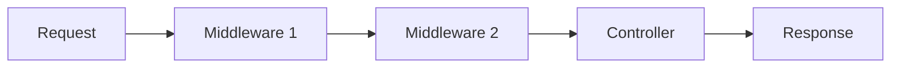
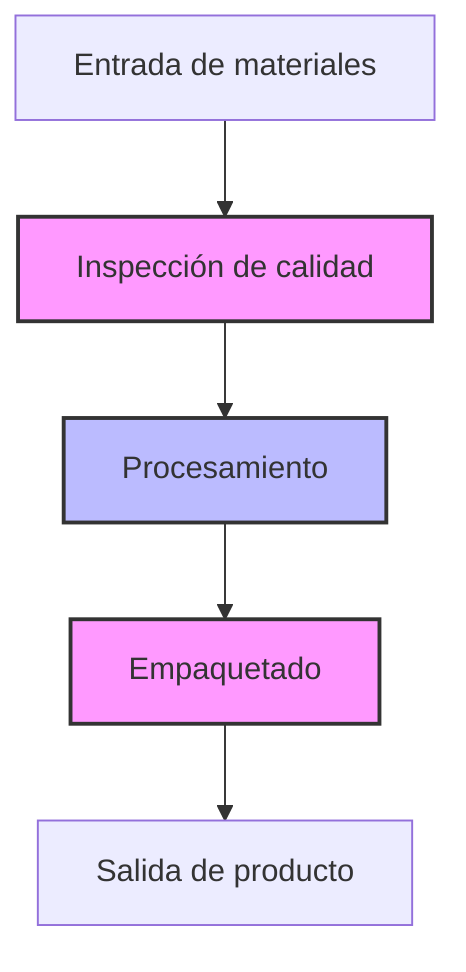
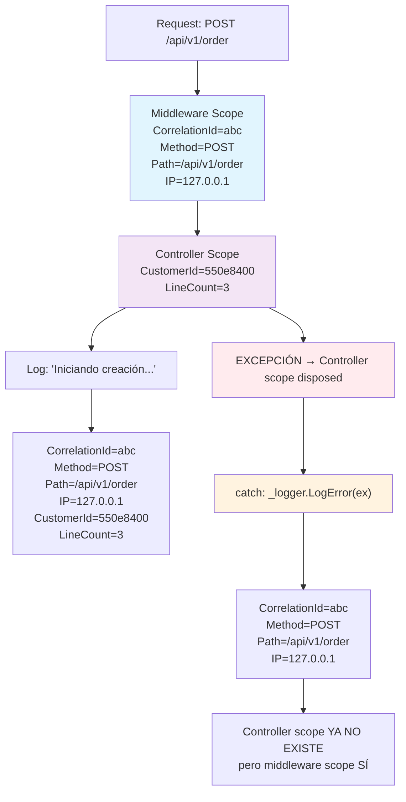
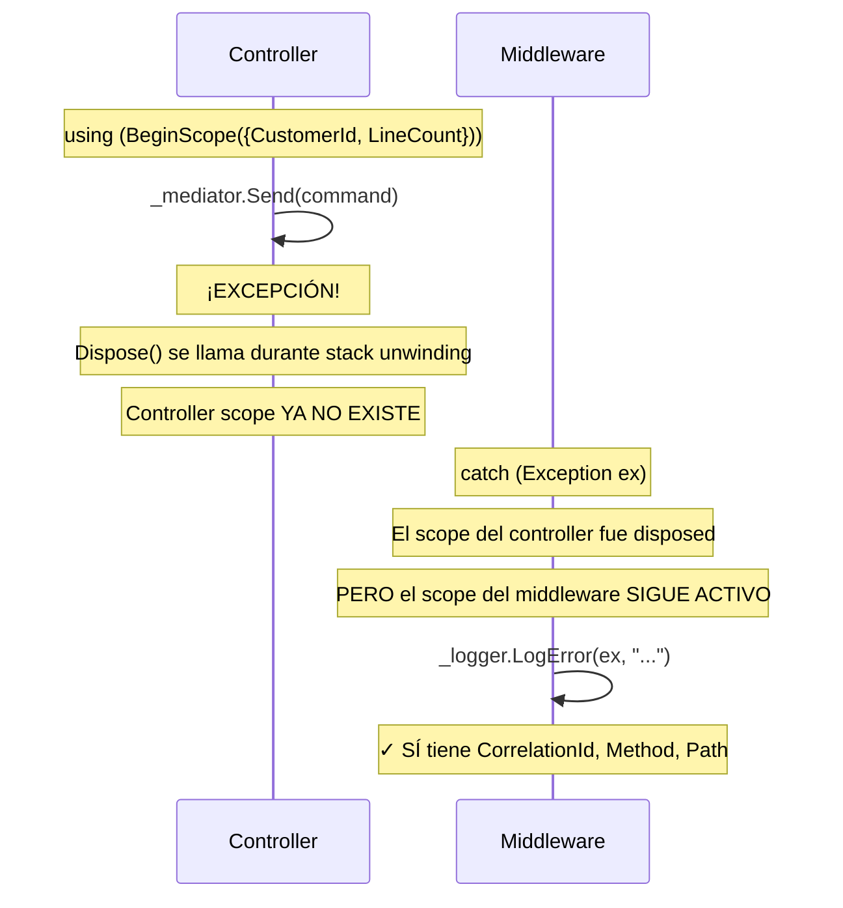
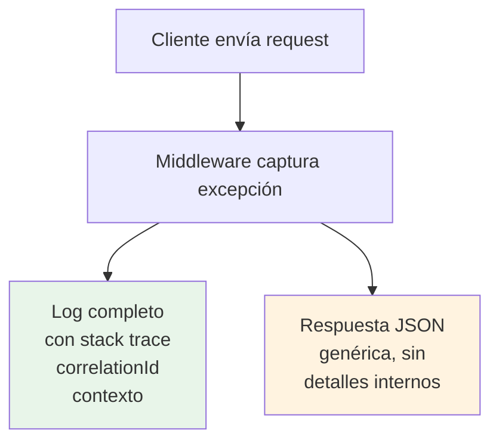
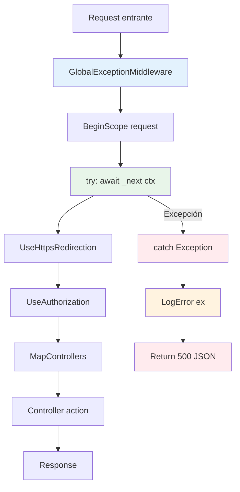
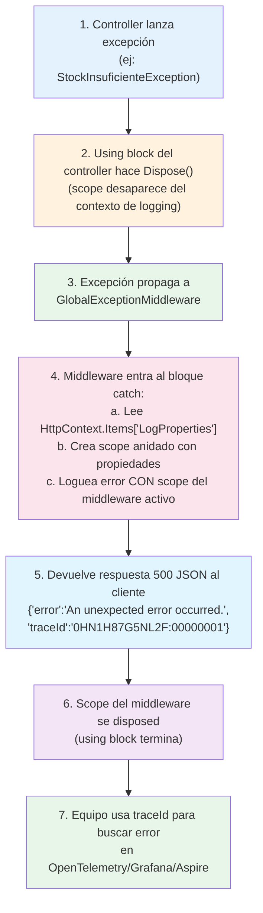
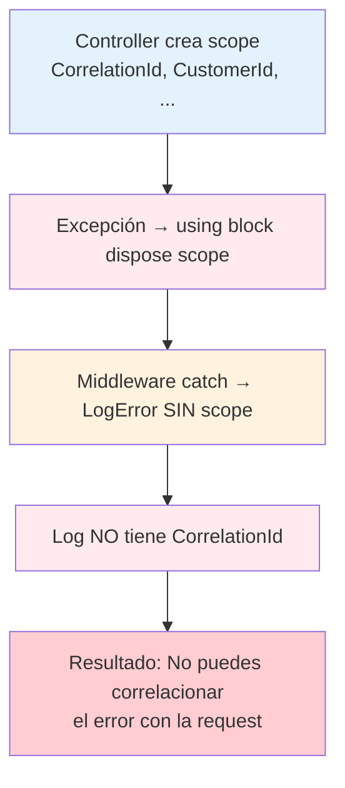
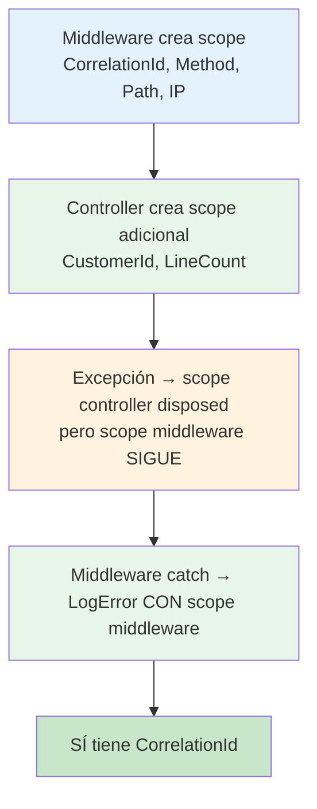

# Middleware - Global Exception Handling


Un **middleware** global captura cualquier excepción no controlada que se eleve en el pipeline HTTP, la loguea con contexto completo y devuelve una respuesta 500 al cliente. Evita que errores inesperados lleguen al usuario con HTML de error por defecto.

---

#### Tabla de Contenidos

1. [¿Qué es un Middleware?](#qué-es-un-middleware)
2. [GlobalExceptionMiddleware](#globalexceptionmiddleware)
3. [Scopes de Logging en el Middleware](#scopes-de-logging-en-el-middleware)
4. [Respuesta del Error](#respuesta-del-error)
5. [Posición en el Pipeline](#posición-en-el-pipeline)
6. [Flujo de una Excepción](#flujo-de-una-excepción)
7. [¿Por qué Scopes en el Middleware?](#por-qué-scopes-en-el-middleware)
8. [Referencia de Archivos](#referencia-de-archivos)

---

## ¿Qué es un Middleware?

Un **middleware** es una clase que procesa cada petición HTTP antes o después de que llegue al siguiente componente del pipeline. Cada middleware puede:

- Ejecutar código antes del siguiente middleware
- Modificar la petición o respuesta
- **Cortocircuitar** el pipeline (no llamar al siguiente)
- Manejar errores



### Analogía

Piensa en el middleware como una **cadena de seguridad** en una fábrica:



Si algo falla en cualquier paso, la cadena de seguridad lo atrapa y reporta el problema sin detener toda la fábrica.

Sin un middleware de excepciones global, cada controller tendría que manejar sus propias excepciones con `try-catch`. Esto genera código duplicado y, peor aún, si un controller se olvida de capturar una excepción, el usuario ve una página de error HTML fea. El middleware centraliza el manejo de errores en un solo lugar: un único punto de control que atrapa **cualquier** excepción no controlada en toda la aplicación.

---

## GlobalExceptionMiddleware

El middleware intercepta cualquier excepción no controlada que se produzca después de que una petición entra en el pipeline y antes de que la respuesta se envíe al cliente. Lo consigue ejecutando el resto de la pipeline dentro de un bloque `try/catch` envuelto en un scope de logging que persiste durante toda la duración de la petición, lo que garantiza que incluso si el scope de un controller se elimina durante el propagado de la excepción, el log de error conservará los datos de contexto (CorrelationId, Method, Path, IP).

[`SoftwareLearningGuide.Api/Middlewares/GlobalExceptionMiddleware.cs`](SoftwareLearningGuide.Api/Middlewares/GlobalExceptionMiddleware.cs)

```csharp
public sealed class GlobalExceptionMiddleware {
    private readonly RequestDelegate _next;
    private readonly ILogger<GlobalExceptionMiddleware> _logger;

    public GlobalExceptionMiddleware(RequestDelegate next, ILogger<GlobalExceptionMiddleware> logger) {
        _next = next ?? throw new ArgumentNullException(nameof(next));
        _logger = logger ?? throw new ArgumentNullException(nameof(logger));
    }

    public async Task InvokeAsync(HttpContext context) {
        using (_logger.BeginScope(new Dictionary<string, object>
        {
            { "CorrelationId", context.TraceIdentifier },
            { "RequestMethod", context.Request.Method },
            { "RequestPath", context.Request.Path },
            { "RemoteIpAddress", context.Connection.RemoteIpAddress?.ToString() ?? "unknown" }
        })) {
            try {
                await _next(context);
            }
            catch (Exception ex) {
                var extraProperties = context.Items["LogProperties"] as IDictionary<string, object>;

                var scope = extraProperties is { Count: > 0 }
                    ? _logger.BeginScope(extraProperties)
                    : null;

                try {
                    _logger.LogError(ex,
                        "Excepción no controlada en {Method} {Path}{QueryString}. TraceId: {TraceId} con Mensaje: {Message}",
                        context.Request.Method,
                        context.Request.Path,
                        context.Request.QueryString,
                        context.TraceIdentifier,
                        ex.Message);
                }
                finally {
                    scope?.Dispose();
                }

                await HandleExceptionAsync(context, ex);
            }
        }
    }

    private static async Task HandleExceptionAsync(HttpContext context, Exception exception) {
        context.Response.ContentType = "application/json";
        context.Response.StatusCode = (int)HttpStatusCode.InternalServerError;

        var response = new {
            error = "An unexpected error occurred.",
            traceId = context.TraceIdentifier
        };

        var json = JsonSerializer.Serialize(response, new JsonSerializerOptions {
            PropertyNamingPolicy = JsonNamingPolicy.CamelCase
        });

        await context.Response.WriteAsync(json);
    }
}
```

### Desglose del Middleware

Vamos a desglosar lo que hace este middleware paso a paso:

1. **Scope de request** (líneas 79-85): Crea un scope que envuelve toda la request con datos de contexto (CorrelationId, Method, Path, IP). Cualquier log que se escriba dentro de `_next(context)` tendrá estos campos adjuntos automáticamente.

2. **Ejecución del pipeline** (línea 89): Llama a `_next(context)` para ejecutar el siguiente middleware o controller. Si todo va bien, el scope se dispose normalmente al salir del `using`.

3. **Captura de excepciones** (líneas 92-118): Si algo falla, captura la excepción, lee las propiedades adicionales que el controller haya guardado en `HttpContext.Items`, las loguea con todo el contexto disponible, y devuelve una respuesta JSON genérica al cliente con el `traceId` para que el equipo pueda rastrear el error.

4. **Respuesta segura** (método `HandleExceptionAsync`): Devuelve un JSON genérico con `"error"` y `"traceId"`. Nunca expone detalles internos como stack traces o mensajes de error al cliente.

### Puntos Clave

| Concepto | Descripción |
|----------|-------------|
| `RequestDelegate _next` | Delegate al siguiente middleware en el pipeline |
| `ILogger _logger` | Logger inyectado por DI para loguear el error |
| **Scope de request** | Envuelve toda la request, incluido el catch |
| **Scope de controller** | Se lee de `HttpContext.Items` para enriquecer el log de error |
| `context.TraceIdentifier` | ID único de la solicitud para correlación con OpenTelemetry |
| **Respuesta JSON** | Error genérico al cliente, detalle completo en logs |

---

## Scopes de Logging en el Middleware

### ¿Qué son los Scopes?

Un **scope** es un "contexto" que se adjunta a todos los logs que se escriben dentro de él. Es como poner un sticker en cada log que dice "este log pertenece a esta request".

Sin scopes, cada log sería un evento aislado. Con scopes, cada log lleva adjunta información del contexto (como el ID de la request). Es como poner una etiqueta en cada pieza de un rompecabezas: sabes a qué request pertenece. Esto es fundamental en producción donde tienes cientos de requests concurrentes — sin scopes, sería imposible distinguir qué log pertenece a qué usuario, qué petición o qué operación.

### Scope de Request (Nivel Middleware)

El middleware crea un scope que **envuelve toda la request**. Este scope es el único que permanece activo durante el bloque `catch`, por lo que es el mecanismo principal para que los logs de error conserven contexto de correlación. La definición de los campos del scope se encuentra en [`SoftwareLearningGuide.Api/Middlewares/GlobalExceptionMiddleware.cs`](SoftwareLearningGuide.Api/Middlewares/GlobalExceptionMiddleware.cs).

[`SoftwareLearningGuide.Api/Middlewares/GlobalExceptionMiddleware.cs`](SoftwareLearningGuide.Api/Middlewares/GlobalExceptionMiddleware.cs)

```csharp
using (_logger.BeginScope(new Dictionary<string, object>
{
    { "CorrelationId", context.TraceIdentifier },
    { "RequestMethod", context.Request.Method },
    { "RequestPath", context.Request.Path },
    { "RemoteIpAddress", ... }
}))
{
    await _next(context);
    // TODOS los logs aquí (controllers, handlers, repositories)
    // tienen CorrelationId, RequestMethod, etc. automáticamente
}
```

### Scope de Controller (Nivel Acción)

El controller enriquece el contexto de logging con datos específicos de la acción que se está ejecutando. En la práctica, esto permite que cada log dentro de esa acción se correlacione no solo con la request (gracias al scope del middleware) sino también con la entidad o operación concreta que se está procesando. A diferencia del scope del middleware, el scope del controller se elimina al finalizar la acción o al propagarse una excepción, por lo que los logs de error solo conservan el scope del middleware. La implementación se puede ver en [`SoftwareLearningGuide.Api/Controllers/OrderControllerExample/OrderController.cs`](SoftwareLearningGuide.Api/Controllers/OrderControllerExample/OrderController.cs).

[`SoftwareLearningGuide.Api/Controllers/OrderControllerExample/OrderController.cs`](SoftwareLearningGuide.Api/Controllers/OrderControllerExample/OrderController.cs)

```csharp
// En el controller:
HttpContext.Items["CustomerId"] = command.CustomerId;
HttpContext.Items["LineCount"] = command.Lines.Count;

using (_logger.BeginScope(new Dictionary<string, object>
{
    { "CustomerId", command.CustomerId },
    { "LineCount", command.Lines.Count }
})) {
    _logger.LogInformation(
        "Iniciando creación de orden para cliente {CustomerId} con {LineCount} líneas",
        command.CustomerId, command.Lines.Count);
}
```

### Jerarquía Visual



### ¿Por qué el Scope del Middleware es Crítico para Excepciones?

Cuando una excepción ocurre dentro del `using` block del controller:



**Por eso el middleware crea su propio scope**: es el **único** que garantiza que los datos de contexto estén disponibles cuando se loguea la excepción.

---

## Respuesta del Error

El cliente recibe una respuesta **500** con JSON:

```json
{
  "error": "An unexpected error occurred.",
  "traceId": "0HN1H87G5NL2F:00000001"
}
```

### ¿Por qué un error genérico?

| Razón | Descripción |
|-------|-------------|
| **Seguridad** | No exponer detalles internos del servidor al cliente |
| **Producción** | Un `NullReferenceException` no debe llegar al usuario |
| **Logging** | El detalle completo queda en los logs del servidor |
| **Correlación** | El `traceId` permite al equipo rastrear el error en OpenTelemetry |

### Flujo del Error



---

## Posición en el Pipeline

El middleware se registra **antes** de `UseHttpsRedirection` para capturar errores de cualquier middleware o controller posterior:

```csharp
// Program.cs
var app = builder.Build();

// ... Swagger/OpenAPI (solo Development) ...

app.UseMiddleware<GlobalExceptionMiddleware>();  // ← Aquí

app.UseHttpsRedirection();
app.UseAuthorization();
app.MapControllers();

app.Run();
```

### Flujo del Pipeline



---

## Flujo de una Excepción



---

## ¿Por qué Scopes en el Middleware?

### El Problema Original

Antes de usar scopes en el middleware, el problema era:



### La Solución

El middleware crea su **propio scope** que vive durante toda la request:



### HttpContext.Items como Puente

`HttpContext.Items` es un diccionario que vive durante **toda la request** (a diferencia de los scopes que se disposed). El controller guarda datos ahí, y el middleware los lee en el catch:

```csharp
// Controller:
HttpContext.Items["CustomerId"] = command.CustomerId;

// Middleware (en el catch):
var extraProperties = context.Items["LogProperties"] as IDictionary<string, object>;
```

Esto permite que cualquier parte de la app enriquezca el log de error sin acoplarse al middleware.

### Diferencia clave: Scopes vs. HttpContext.Items

Los **scopes** se disposed automáticamente al salir del bloque `using` — tienen un ciclo de vida limitado. Pero `HttpContext.Items` vive durante **toda la request**, desde que llega hasta que se responde. Por eso el middleware lee de `Items` en el `catch`: el scope del controller ya no existe (se disposed al propagarse la excepción), pero `Items` sigue ahí con los datos que el controller guardó. Es el mecanismo de respaldo que garantiza que no se pierda información de contexto cuando algo falla.

---

## Referencia de Archivos

| Archivo | Descripción |
|---------|-------------|
| `SoftwareLearningGuide.Api/Middlewares/GlobalExceptionMiddleware.cs` | Middleware de excepciones globales con scopes |
| `SoftwareLearningGuide.Api/Program.cs` | Registro en el pipeline HTTP (línea 68) |
| `SoftwareLearningGuide.Api/Controllers/OrderControllerExample/OrderController.cs` | Controller que usa scopes y HttpContext.Items |

---

## Notas

- El middleware **no re-lanza** la excepción (`throw`). Si lo hiciera, el pipeline se detendría y Kestrel devolvería una respuesta HTML por defecto.
- Se registra como `UseMiddleware<T>()` porque no necesita configuración. Si necesitara opciones, se usaría `UseMiddleware<T>(options)`.
- Funciona con **cualquier excepción** no controlada, independientemente de dónde se produzca en el pipeline.
- Los scopes son **thread-safe** y se propagan correctamente en código asíncrono (`async/await`).
- El scope del middleware es el **único** que garantiza disponibilidad durante el log de excepciones.
