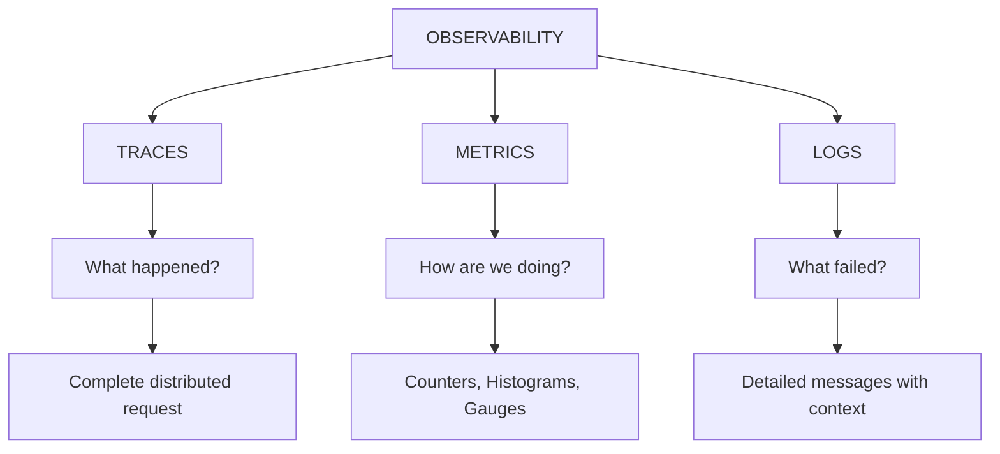
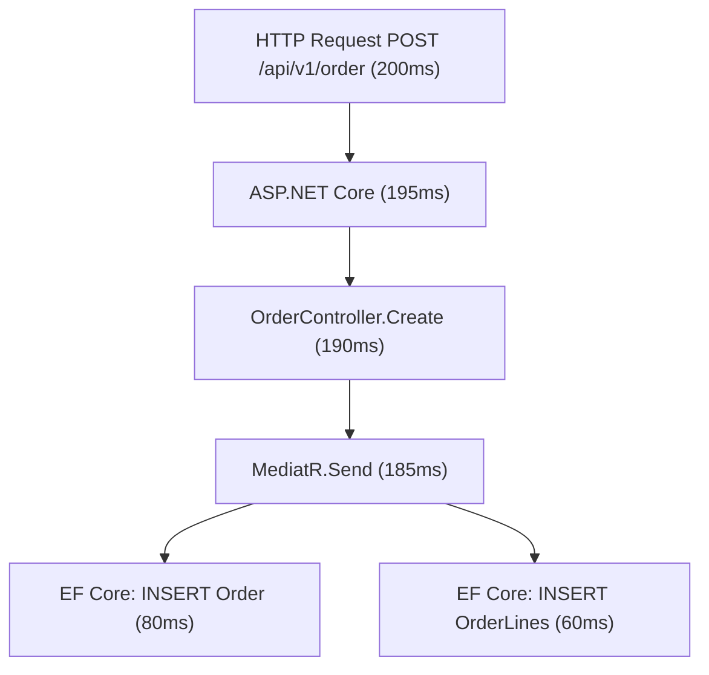
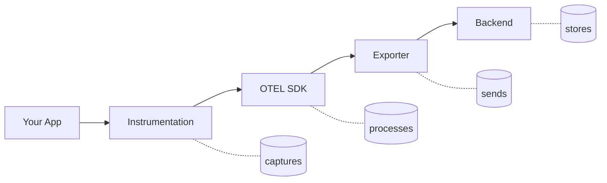
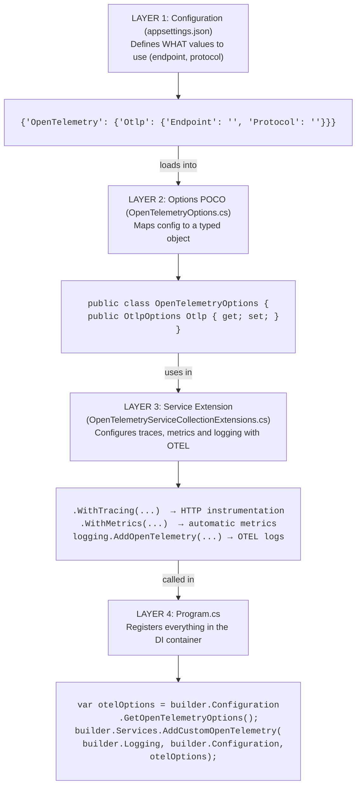
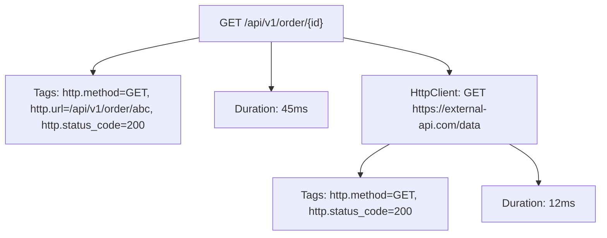
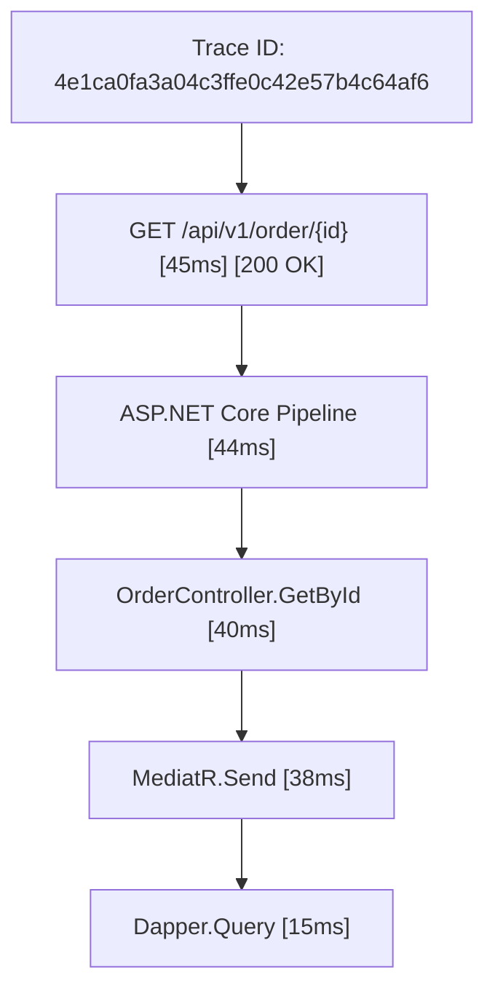
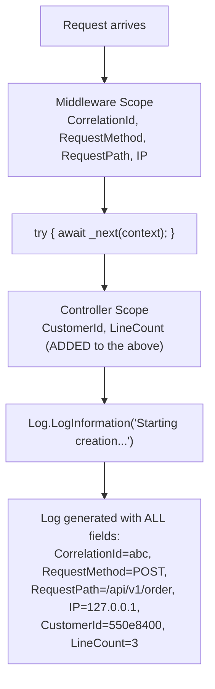
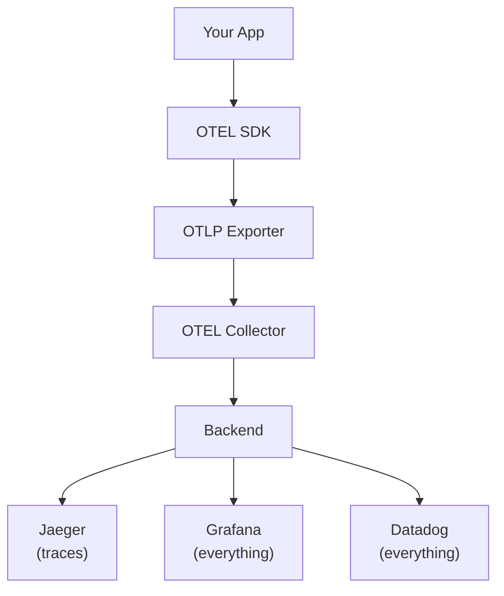
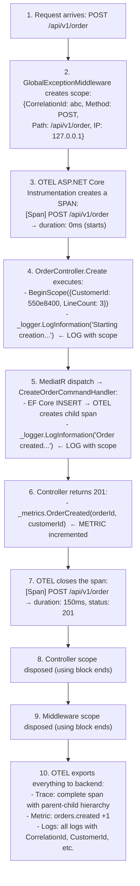
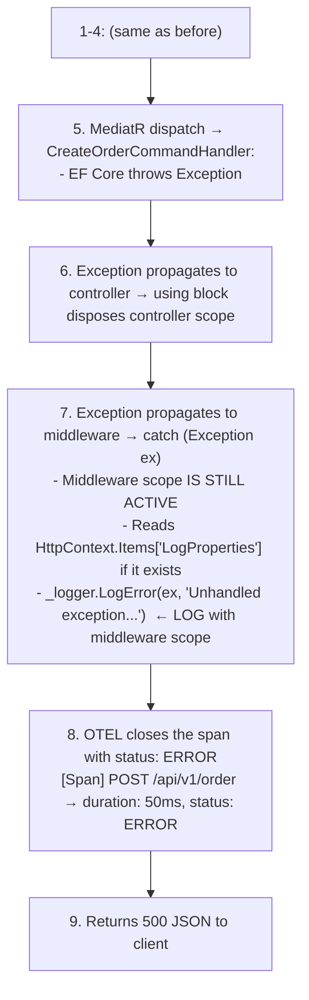

# OpenTelemetry - Observability in .NET 10


**OpenTelemetry** is an open standard (and vendor-neutral) for collecting and exporting telemetry data from distributed applications. Instead of tying you to a specific provider (Datadog, New Relic, etc.), OTEL gives you a unified format that you can send to any backend.

Without observability, your application is a black box. When something fails in production, you have no idea why. The three pillars (traces, metrics, logs) give you different angles to understand what's happening: traces show you the flow of a request, metrics tell you how long it takes, and logs tell you what happened step by step.

---

#### Table of Contents

1. [The 3 Pillars of Observability](#the-3-pillars-of-observability)
2. [NuGet Packages](#nuget-packages)
3. [Configuration Architecture](#configuration-architecture)
4. [Pillar 1: Traces](#pillar-1-traces)
5. [Pillar 2: Metrics](#pillar-2-metrics)
6. [Pillar 3: Structured Logs](#pillar-3-structured-logs)
7. [Logging Scopes - Context in Logs](#logging-scopes---context-in-logs)
8. [Custom Metrics](#custom-metrics)
9. [Exporters](#exporters)
10. [How Everything Connects](#how-everything-connects)
11. [Best Practices](#best-practices)
12. [File Reference](#file-reference)

---

## The 3 Pillars of Observability

Observability stands on **3 pillars**. Each answers a different question:



### Traces - "What happened?"

A **trace** reconstructs the complete path of a request through your system. Each operation within the request is a **span** (segment).



**When to use traces**: To understand the flow of a request, find bottlenecks in a service chain, or diagnose latency in distributed systems.

### Metrics - "How are we doing?"

**Metrics** are aggregated numbers measured over time. They don't tell you what happened in a specific request, but how the system behaves overall.

```
orders.created    = 1,234 (last hour)
orders.created    = +45/min (rate)
response.time.p95 = 230ms (95th percentile)
errors.total      = 12 (errors)
```

**Metric types**:
| Type | What it measures | Example |
|------|------------------|---------|
| **Counter** | Accumulator that only goes up | Total requests, total errors |
| **Histogram** | Distribution of values | Request latency, payload size |
| **Gauge** | Current value that goes up and down | Active connections, memory usage |

**When to use metrics**: For dashboards, alerts (SLA), capacity planning, detecting gradual degradation.

### Logs - "What failed?"

**Logs** are individual messages with detailed context. They are the most granular source of truth: they tell you exactly what happened at a given moment.

```
2024-01-15T10:30:45Z [Error] OrderController
  CorrelationId: 0HN1H87G5NL2F:00000001
  CustomerId: 550e8400-e29b-41d4-a716-446655440000
  Error: Insufficient stock for product 'Laptop'
```

**When to use logs**: For point debugging, auditing, understanding the exact context of an error.

### Why all 3 together?

| Without observability | With observability |
|---|---|
| "The API is slow" | "p95 latency increased from 200ms to 800ms since 14:00, the EF Core span is the culprit" |
| "It sometimes fails" | "12% of requests fail with timeout in the payment service, correlationIds show a pattern" |
| "I don't know what happened" | "The complete trace shows the INSERT took 3s due to lock on the Orders table" |

---

## NuGet Packages

| Package | Version | Usage |
|---------|---------|-------|
| `OpenTelemetry.Extensions.Hosting` | 1.17.0 | Base OTEL framework for .NET. Integrates with host builder so OTEL lives for the entire app lifetime |
| `OpenTelemetry.Instrumentation.AspNetCore` | 1.17.0 | Automatic instrumentation of incoming HTTP requests. Creates spans for each endpoint that arrives at your API |
| `OpenTelemetry.Instrumentation.Http` | 1.17.0 | Automatic instrumentation of outgoing HTTP requests. Creates spans when your API calls other services |
| `OpenTelemetry.Exporter.Console` | 1.17.0 | Console exporter. Useful in development to see traces/metrics/logs without configuring a backend |
| `OpenTelemetry.Exporter.OpenTelemetryProtocol` | 1.17.0 | OTLP exporter. Sends data to any backend that supports OTLP (Jaeger, Grafana, Datadog, etc.) |

### Why so many packages?

OpenTelemetry is designed as a modular system:
- **Extensions.Hosting** = the "glue" that integrates OTEL with .NET's DI container
- **Instrumentation.*** = the "sensors" that automatically capture data (without you writing code)
- **Exporter.*** = the "senders" that transport data to the backend



---

## Configuration Architecture

Configuration is organized in **3 layers** separated by responsibility:



### OpenTelemetryOptions.cs

The `OpenTelemetryOptions` class maps the `OpenTelemetry` section from `appsettings.json` to a typed object. It includes a `ServiceName` property that defines the service name for OpenTelemetry resources.

```csharp
// Options/OpenTelemetryOptions.cs
namespace SoftwareLearningGuide.Api.Options
{
    public class OpenTelemetryOptions
    {
        public static string SectionName => "OpenTelemetry";
        public OtlpOptions Otlp { get; set; } = new OtlpOptions();
        public string ServiceName { get; set; } = string.Empty;

        public class OtlpOptions
        {
            public string? Endpoint { get; set; }
            public string? Protocol { get; set; } = "grpc";
        }
    }
}
```

### appsettings.json (empty values - template)

The `ServiceName` key defines the service name that will appear in telemetry data. In production it's configured with a meaningful name; in the template it's empty.

```json
{
  "OpenTelemetry": {
    "ServiceName": "",
    "Otlp": {
      "Endpoint": "",
      "Protocol": ""
    }
  }
}
```

### appsettings.Development.json (real values)

In development, `ServiceName` is set to `"SoftwareLearningGuide"` and the OTLP endpoint points to localhost.

```json
{
  "OpenTelemetry": {
    "ServiceName": "SoftwareLearningGuide",
    "Otlp": {
      "Endpoint": "http://localhost:4317",
      "Protocol": "grpc"
    }
  }
}
```

| Field | Default Value | Description |
|-------|---------------|-------------|
| `Endpoint` | `""` (empty) | OTLP backend URL. If empty, uses console (development) |
| `Protocol` | `"grpc"` | `"grpc"` or `"http"` (HTTP Protobuf) |

---

## Pillar 1: Traces

### What is a Span

A **span** is an individual unit of work within a trace. Each span contains:
- **Name**: what operation was performed (e.g., `GET /api/v1/order`)
- **Duration**: how long it took
- **Tags**: key-value metadata (e.g., `http.status_code = 200`)
- **Events**: point-in-time events within the span (e.g., exception happened)
- **Parent**: what span invoked it (forming a tree)

### Automatic Instrumentation

With `AddAspNetCoreInstrumentation()` and `AddHttpClientInstrumentation()`, OTEL **automatically** creates spans without you writing code:



### Project Configuration

Everything is encapsulated in the extension [`Extensions/OpenTelemetryServiceCollectionExtensions.cs`](Extensions/OpenTelemetryServiceCollectionExtensions.cs). The `AddCustomOpenTelemetry` method configures traces, metrics and logging in a single place. It takes the `ILoggingBuilder`, `IConfiguration`, and typed options (`OpenTelemetryOptions`) injected from `Program.cs`.

```csharp
// Extensions/OpenTelemetryServiceCollectionExtensions.cs
public static IServiceCollection AddCustomOpenTelemetry(
    this IServiceCollection services,
    ILoggingBuilder logging,
    IConfiguration configuration,
    OpenTelemetryOptions otelOptions) {

    var otlpEndpoint = otelOptions.Otlp.Endpoint;
    OtlpExportProtocol otlpProtocol = GetOtlpExportProtocol(otelOptions.Otlp.Protocol);

    // 1. Traces and Metrics
    var builder = services.AddOpenTelemetry()
        .ConfigureResource(resource => resource.AddService(otelOptions.ServiceName))
        .WithTracing(tracing => {
            tracing
                .AddAspNetCoreInstrumentation()
                .AddHttpClientInstrumentation();

            if (!string.IsNullOrEmpty(otlpEndpoint)) {
                tracing.AddOtlpExporter(o => {
                    o.Endpoint = new Uri(otlpEndpoint);
                    o.Protocol = otlpProtocol;
                });
            }
            else {
                tracing.AddConsoleExporter();
            }
        })
        .WithMetrics(metrics => {
            metrics
                .AddAspNetCoreInstrumentation();

            if (!string.IsNullOrEmpty(otlpEndpoint)) {
                metrics.AddOtlpExporter(o => {
                    o.Endpoint = new Uri(otlpEndpoint);
                    o.Protocol = otlpProtocol;
                });
            }
        });

    // 2. Structured logging
    logging.ClearProviders();
    logging.AddConsole();
    logging.AddOpenTelemetry(options => {
        options.IncludeFormattedMessage = true;
        options.IncludeScopes = true;

        if (!string.IsNullOrEmpty(otlpEndpoint)) {
            options.AddOtlpExporter(o => {
                o.Endpoint = new Uri(otlpEndpoint);
                o.Protocol = otlpProtocol;
            });
        }
        else {
            options.AddConsoleExporter();
        }
    });

    return services;
}
```

### How it Looks in the Aspire Dashboard



What is a Span? It's a unit of work within a trace. When your API receives a request, that's a parent Span. Within that Span, there are sub-Spans: the database query, the call to an external service, etc. OpenTelemetry connects all these Spans into a complete trace that you can visualize in the Aspire Dashboard.

---

## Pillar 2: Metrics

### Automatic Metrics

`AddAspNetCoreInstrumentation()` in the `.WithMetrics()` block automatically exposes HTTP metrics:

| Automatic Metric | Type | What it measures |
|---|---|---|
| `http.server.request.duration` | Histogram | Duration of each incoming HTTP request |
| `http.server.request.count` | Counter | Total requests per endpoint |
| `http.server.response.status_code` | Counter | Distribution of response codes |

### Project Configuration

The `.WithMetrics()` block in [`Extensions/OpenTelemetryServiceCollectionExtensions.cs`](Extensions/OpenTelemetryServiceCollectionExtensions.cs) configures automatic HTTP metrics collection from ASP.NET Core. If there's an OTLP endpoint, it exports there; otherwise, in development there's no console exporter for metrics (only for traces and logs).

```csharp
// Extracted from .WithMetrics() in AddCustomOpenTelemetry
.WithMetrics(metrics =>
{
    // ASP.NET Core automatic instrumentation
    // Creates HTTP metrics without additional code
    metrics.AddAspNetCoreInstrumentation();

    // OTLP or console exporter (same logic as traces)
    if (!string.IsNullOrEmpty(otlpEndpoint))
    {
        metrics.AddOtlpExporter(o =>
        {
            o.Endpoint = new Uri(otlpEndpoint);
            o.Protocol = otlpProtocol;
        });
    }
});
```

---

## Pillar 3: Structured Logs

### Structured Logs vs Flat Logs

**❌ Flat log (traditional):**
```
2024-01-15 ERROR OrderController - Error creating order for customer 550e8400
```
The log is a free-form string. To search "all errors for customer X" you need regex or grep.

**✅ Structured log (with OTEL):**
```json
{
  "Timestamp": "2024-01-15T10:30:45Z",
  "Level": "Error",
  "Message": "Error creating order for customer {CustomerId}: {Error}",
  "Properties": {
    "CustomerId": "550e8400-e29b-41d4-a716-446655440000",
    "Error": "Insufficient stock",
    "CorrelationId": "0HN1H87G5NL2F:00000001",
    "RequestMethod": "POST",
    "RequestPath": "/api/v1/order"
  }
}
```
Each field is searchable and filterable in the backend (Aspire Dashboard, Grafana Loki, etc.).

### Placeholders vs Interpolation

The difference is **critical** for OTEL to parse and structure logs:

```csharp
// ✅ GOOD - Placeholders (separate parameters)
// OTEL parses "CustomerId" as a structured field
_logger.LogInformation("Creating order for customer {CustomerId}", customerId);

// ❌ BAD - String interpolation
// OTEL only sees a flat string, can't extract fields
_logger.LogInformation($"Creating order for customer {customerId}");
```

### Project Configuration

```csharp
// Extensions/OpenTelemetryServiceCollectionExtensions.cs

// 1. Clear default providers and add console + OTEL
logging.ClearProviders();
logging.AddConsole();
logging.AddOpenTelemetry(options =>
{
    // Include the complete formatted message (with interpolated values)
    // If false, only sends the template: "Creating order for customer {CustomerId}"
    // If true, sends: "Creating order for customer 550e8400-..."
    options.IncludeFormattedMessage = true;

    // Include scopes in the log (see Scopes section below)
    options.IncludeScopes = true;

    // Export to OTLP or console
    if (!string.IsNullOrEmpty(otlpEndpoint))
    {
        options.AddOtlpExporter(o =>
        {
            o.Endpoint = new Uri(otlpEndpoint);
            o.Protocol = otlpProtocol;
        });
    }
    else
    {
        options.AddConsoleExporter();
    }
});
```

---

## Logging Scopes - Context in Logs

### What is a Scope?

A **scope** is a "context" that is attached to all logs written within it. It's like putting a sticker on each log that says "this log belongs to this request/this order/this user".

### The Problem They Solve

Without scopes, if 100 requests are processing simultaneously, your logs get mixed:

```
[INFO] Starting order creation for customer A
[INFO] Starting order creation for customer B
[ERROR] Error creating order - which one? A or B?
```

With scopes, each request has its context:

```
[INFO] CorrelationId=abc CustomerId=A Starting order creation for customer A
[INFO] CorrelationId=xyz CustomerId=B Starting order creation for customer B
[ERROR] CorrelationId=abc CustomerId=A Error creating order - we know it's A's
```

### Scopes in the Middleware (Request-Level)

The middleware creates a scope that wraps **the entire request**. This means **all** logs within the request (controllers, handlers, repositories) have access to this data. The real implementation is in [`Middlewares/GlobalExceptionMiddleware.cs`](Middlewares/GlobalExceptionMiddleware.cs).

```csharp
// Middlewares/GlobalExceptionMiddleware.cs
public async Task InvokeAsync(HttpContext context)
{
    // This scope lives for the ENTIRE request
    // Any logger used inside _next(context) will see these values
    using (_logger.BeginScope(new Dictionary<string, object>
    {
        { "CorrelationId", context.TraceIdentifier },   // Unique request ID
        { "RequestMethod", context.Request.Method },    // GET, POST, etc.
        { "RequestPath", context.Request.Path },        // /api/v1/order
        { "RemoteIpAddress", context.Connection.RemoteIpAddress?.ToString() ?? "unknown" }  // Client IP
    }))
    {
        try
        {
            await _next(context);  // Everything that happens here has the active scope
        }
        catch (Exception ex)
        {
            // The scope IS STILL active here (Dispose hasn't been called yet)
            // So LogError also includes CorrelationId, etc.
            _logger.LogError(ex, "Unhandled exception...");
        }
    }
}
```

### Scopes in the Controller (Action-Level)

The controller adds additional data specific to the action. This data **complements** the middleware's:

```csharp
// Controllers/OrderController.cs
[HttpPost]
public async Task<IActionResult> Create([FromBody] CreateOrderCommand command, ...)
{
    // Add action-specific data to the context
    HttpContext.Items["CustomerId"] = command.CustomerId;
    HttpContext.Items["LineCount"] = command.Lines.Count;

    // Nested scope: these data are ADDED to the middleware's
    using (_logger.BeginScope(new Dictionary<string, object>
    {
        { "CustomerId", command.CustomerId },
        { "LineCount", command.Lines.Count }
    }))
    {
        _logger.LogInformation("Starting order creation...");
        // This log will have: CorrelationId, RequestMethod, RequestPath, 
        //                   RemoteIpAddress (from middleware)
        //                 + CustomerId, LineCount (from controller)
    }
}
```

### Scope Hierarchy



### Why is the Middleware Scope Important for Exceptions?

When an exception occurs inside the controller:

```
Controller: using (BeginScope(...)) {
    _mediator.Send(command);  ← EXCEPTION HERE!
}
// ↑ Dispose() is called here (stack unwinding)
// Controller scope NO LONGER EXISTS

Middleware: catch (Exception ex) {
    // Controller scope was already disposed
    // BUT middleware scope IS STILL ACTIVE
    _logger.LogError(ex, "...");
    // This log DOES have CorrelationId, RequestMethod, etc.
}
```

That's why the middleware creates its own scope: it's the **only** one that guarantees context data is available when logging the exception.

### HttpContext.Items Properties

`HttpContext.Items` is a dictionary that lives for the entire request. The middleware reads it when there's an exception to enrich the log:

```csharp
// In the middleware's catch:
var extraProperties = context.Items["LogProperties"] as IDictionary<string, object>;
var scope = extraProperties is { Count: > 0 }
    ? _logger.BeginScope(extraProperties)
    : null;
```

This allows any part of the app to add properties to the error log without coupling to the middleware.

Why structured logs instead of flat logs? Because structured logs can be searched, filtered, and grouped automatically. If you log `logger.LogInformation('Order created')`, you can't search by CustomerId. But if you log `logger.LogInformation('Order created for {CustomerId}', id)`, the CustomerId field appears as a searchable field in your dashboards.

---

## Custom Metrics

### OrderMetrics - Business Metric

In addition to automatic HTTP metrics, the project defines business metrics:

```csharp
// Metrics/OrderMetrics.cs
public sealed class OrderMetrics
{
    private readonly Counter<long> _ordersCreated;

    public OrderMetrics(IMeterFactory meterFactory)
    {
        // IMeterFactory creates a "Meter" (metrics namespace)
        // "SoftwareLearningGuide.Orders" is the metrics group name
        var meter = meterFactory.Create("SoftwareLearningGuide.Orders");

        // Counter<long>: accumulator that only goes up
        // "orders.created": metric name
        // "orders": unit
        _ordersCreated = meter.CreateCounter<long>(
            "orders.created", "orders", "Total number of orders created");
    }

    public void OrderCreated(Guid orderId, Guid customerId)
    {
        // Add(1): increments the counter by 1
        // Tags: metadata that allows filtering/grouping
        _ordersCreated.Add(1,
            new KeyValuePair<string, object?>("order.id", orderId.ToString()),
            new KeyValuePair<string, object?>("customer.id", customerId.ToString()));
    }
}
```

### Metric Types in the Project

| Metric | Type | Value | Tags | Usage |
|--------|------|-------|------|-------|
| `orders.created` | Counter | Cumulative (only goes up) | `order.id`, `customer.id` | Total orders created |
| `http.server.request.duration` | Histogram | Latency distribution | `http.method`, `http.route` | Request latency |
| `http.server.request.count` | Counter | Cumulative | `http.method`, `http.status_code` | Total requests |

### Usage in the Controller

```csharp
// Controllers/OrderController.cs
public class OrderController : ControllerBase
{
    private readonly OrderMetrics _metrics;

    public OrderController(IMediator mediator, ILogger<OrderController> logger, OrderMetrics metrics)
    {
        _metrics = metrics;
    }

    [HttpPost]
    public async Task<IActionResult> Create(...)
    {
        var result = await _mediator.Send(command, cancellationToken);

        if (result.IsSuccess)
        {
            // Record metric after successful creation
            _metrics.OrderCreated((Guid)result.Value, command.CustomerId);
        }
    }
}
```

### DI Registration

```csharp
// Startup/MetricsStartup.cs
public static IServiceCollection AddCustomMetrics(this IServiceCollection services)
{
    // Singleton because metrics are thread-safe and must live for the entire app lifetime
    services.AddSingleton<OrderMetrics>();
    return services;
}
```

Why custom metrics? .NET's native metrics give you runtime info (CPU, memory, requests per second). But business metrics tell you how many orders were created, how much money was billed, or how many products are out of stock. These are the ones stakeholders want to see on dashboards.

### Useful Queries in Grafana/Prometheus

```promql
# Total orders created (last 5 minutes)
sum(rate(orders_created_total[5m]))

# Orders by customer
sum by (customer_id) (orders_created_total)

# Request p95 latency
histogram_quantile(0.95, http_server_request_duration_seconds_bucket)

# Error rate (5xx)
sum(rate(http_server_request_duration_seconds_count{http_status_code=~"5.."}[5m]))
```

---

## Exporters

### Development Mode (Console)

Without an `Endpoint` configured, OTEL exports to console. It's the easiest way to see it working:

```
Resource associated with LogRecord:
    service.name: "WeatherApi"

LogRecord:
    Timestamp: 2024-01-15T10:30:45.1234567Z
    SeverityText: Information
    Body: "Starting order creation for customer {CustomerId} with {LineCount} lines"
    Attributes:
        CorrelationId: "0HN1H87G5NL2F:00000001"
        RequestMethod: "POST"
        RequestPath: "/api/v1/order"
        CustomerId: "550e8400-e29b-41d4-a716-446655440000"
        LineCount: 3
```

### Production Mode (OTLP Backend)

Configure `appsettings.Production.json`:

```json
{
  "OpenTelemetry": {
    "Otlp": {
      "Endpoint": "http://otel-collector:4317",
      "Protocol": "grpc"
    }
  }
}
```

### Data Flow



The complete flow is: your app generates telemetry → the OTEL Collector receives it → processes it and sends it to backends (Aspire Dashboard for visualization, Prometheus for metrics). The Aspire Dashboard is like a command center where you can view traces, metrics and logs from all your applications in one place.

### Supported Backends

| Backend | Endpoint | Protocol | What it shows |
|---------|----------|----------|---------------|
| **Aspire Dashboard** (Docker) | `http://localhost:4317` | gRPC | Traces, Metrics, Logs |
| **Jaeger** | `http://localhost:4317` | gRPC | Traces |
| **Grafana** | `http://localhost:4317` | gRPC | Traces + Metrics + Logs |
| **Datadog** | `https://opentelemetry-agent.datadoghq.com` | HTTP/gRPC | Everything |

---

## How Everything Connects

### Complete Request Flow



### If there's an Exception



---

## Best Practices

### 1. Structured Logging

```csharp
// ✅ Separate parameters - OTEL can search/filter by field
_logger.LogInformation("User {UserId} performed {Action}", userId, action);

// ❌ Interpolation - just a flat string, not filterable
_logger.LogInformation($"User {userId} performed {action}");
```

### 2. Scopes for Context

```csharp
// In the middleware: request scope (lives for the entire request)
using (_logger.BeginScope(new Dictionary<string, object>
{
    { "CorrelationId", context.TraceIdentifier },
    { "RequestMethod", context.Request.Method }
}))

// In the controller: action scope (complements the above)
using (_logger.BeginScope(new Dictionary<string, object>
{
    { "OrderId", orderId },
    { "CustomerId", customerId }
}))
```

### 3. Metrics with Tags

```csharp
// Tags allow filtering and grouping
_metrics.OrderCreated(orderId, customerId);
// → orders_created_total{order.id="abc", customer.id="xyz"} += 1

// In Grafana you can ask:
// "How many orders did customer xyz create?"
// → sum(orders_created_total{customer.id="xyz"})
```

### 4. Don't Log Sensitive Data

```csharp
// ✅ Safe log
_logger.LogInformation("Login successful for user {UserId}", userId);

// ❌ Log with sensitive data
_logger.LogInformation("Login successful for user {Email}, password {Password}", email, password);
```

---

## File Reference

| File | Description |
|------|-------------|
| `SoftwareLearningGuide.Api/Options/OpenTelemetryOptions.cs` | OTEL options model. Maps appsettings to typed objects |
| `SoftwareLearningGuide.Api/Extensions/OpenTelemetryServiceCollectionExtensions.cs` | Central configuration of traces, metrics and logging |
| `SoftwareLearningGuide.Api/Extensions/OptionConfigurationExtensions.cs` | Loads options from appsettings using `IOptions<T>` |
| `SoftwareLearningGuide.Api/Metrics/OrderMetrics.cs` | Custom business metric (orders.created) |
| `SoftwareLearningGuide.Api/Startup/MetricsStartup.cs` | Metrics registration in DI |
| `SoftwareLearningGuide.Api/Middlewares/GlobalExceptionMiddleware.cs` | Middleware with request scopes |
| `SoftwareLearningGuide.Api/Controllers/OrderControllerExample/OrderController.cs` | Controller with action scopes + metric |
| `SoftwareLearningGuide.Api/Program.cs` | Service registration and pipeline |

---

## Additional Resources

- [OpenTelemetry .NET Documentation](https://opentelemetry.io/docs/instrumentation/net/) - Official docs
- [OTEL Specification](https://opentelemetry.io/docs/specs/otel/) - Complete specification
- [Aspire Dashboard](https://learn.microsoft.com/en-us/dotnet/aspire/fundamentals/dashboard) - .NET observability dashboard
- [Jaeger Documentation](https://www.jaegertracing.io/docs/) - Distributed tracing backend
- [Grafana Tempo](https://grafana.com/oss/tempo/) - Traces backend
- [OpenTelemetry Demo](https://opentelemetry.io/docs/demo/) - Example app with complete OTEL