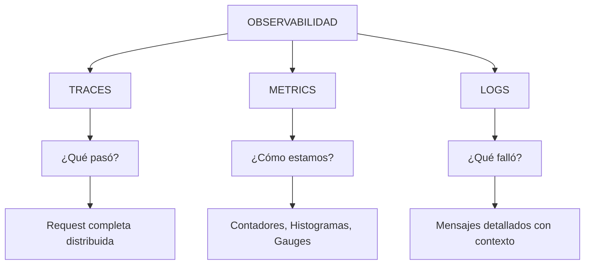
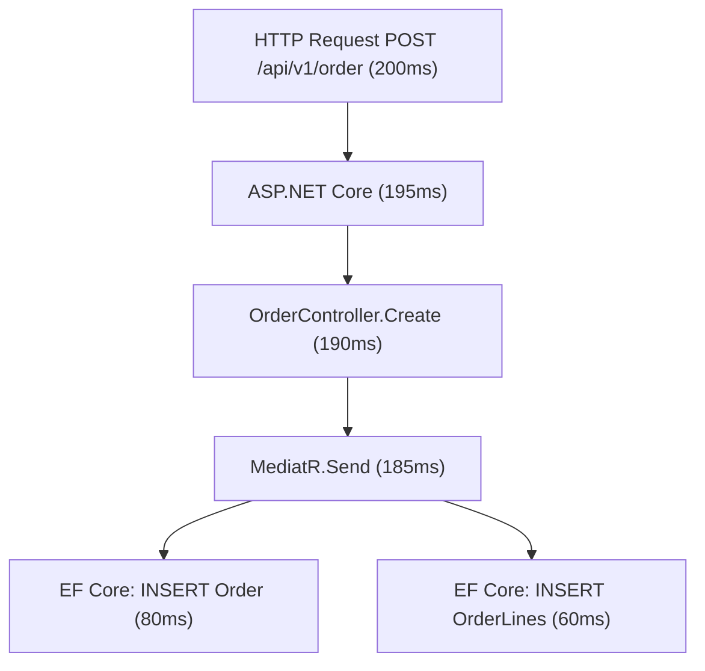
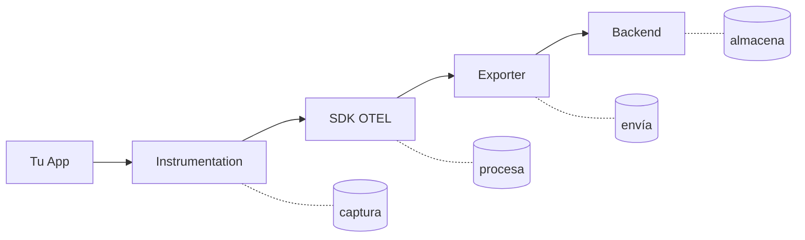
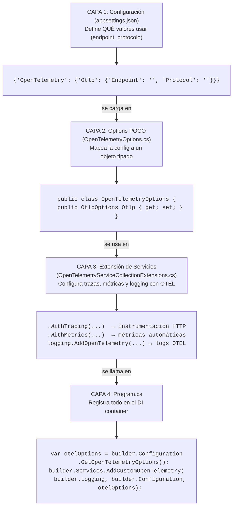
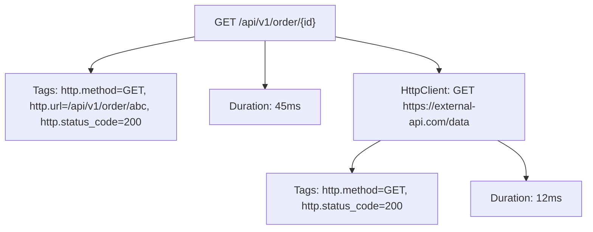
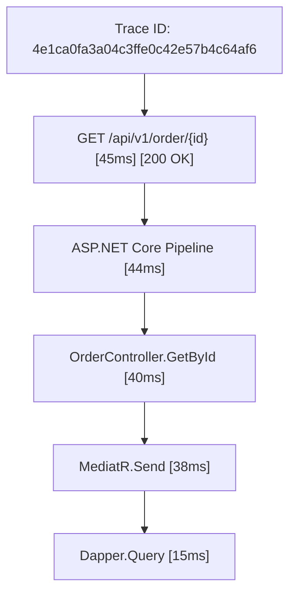
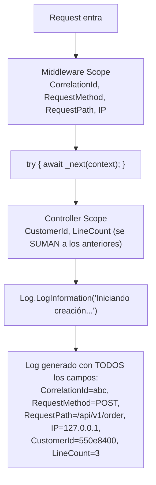
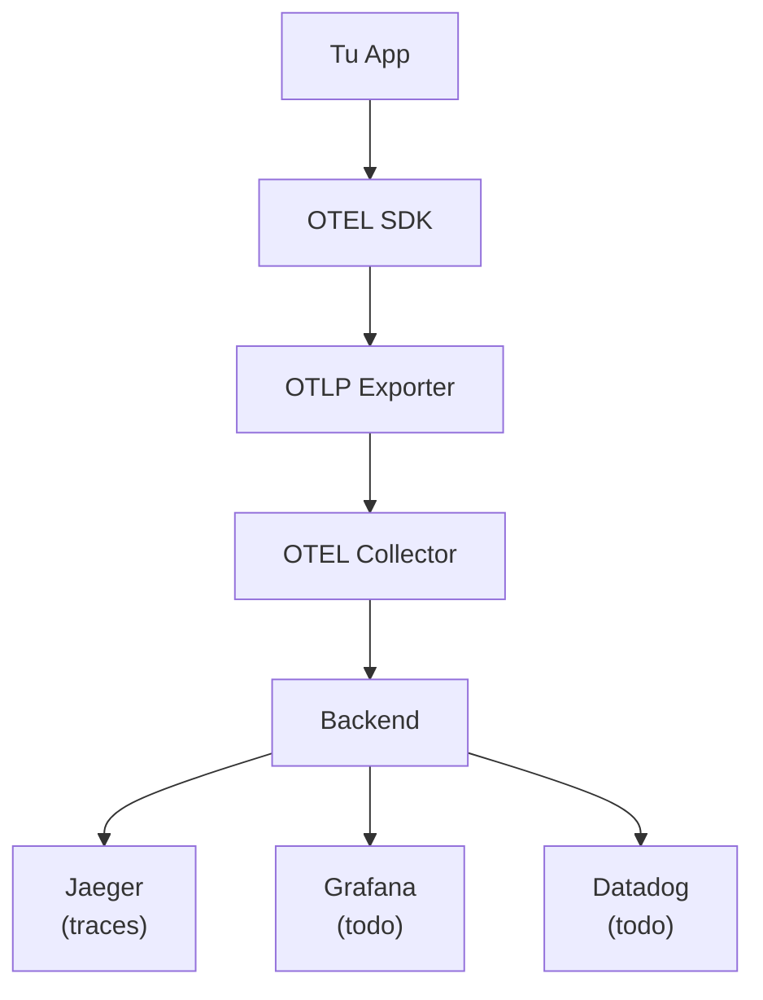
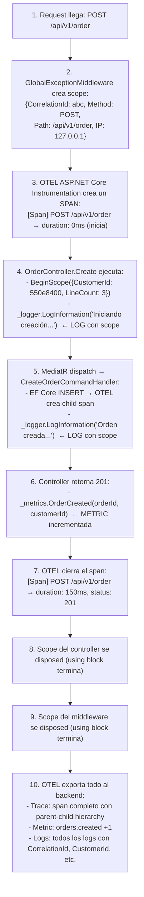
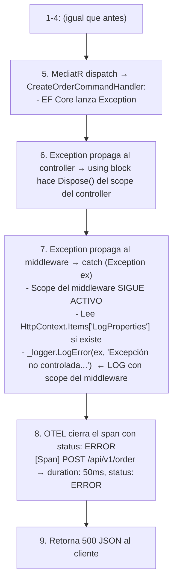

# OpenTelemetry - Observabilidad en .NET 10


**OpenTelemetry** es un estándar abierto (y vendor-neutral) para recolectar y exportar datos de telemetría de aplicaciones distribuidas. En lugar de atarte a un proveedor específico (Datadog, New Relic, etc.), OTEL te da un formato unificado que puedes enviar a cualquier backend.

Sin observabilidad, tu aplicación es una caja negra. Cuando algo falla en producción, no tienes idea de por qué. Los tres pilares (trazas, métricas, logs) te dan diferentes ángulos para entender qué está pasando: las trazas te muestran el flujo de una request, las métricas te dicen cuánto tarda, y los logs te cuentan qué pasó paso a paso.

---

#### Tabla de Contenidos

1. [Los 3 Pilares de la Observabilidad](#los-3-pilares-de-la-observabilidad)
2. [Paquetes NuGet](#paquetes-nugget)
3. [Arquitectura de Configuración](#arquitectura-de-configuración)
4. [Pilar 1: Trazas (Traces)](#pilar-1-trazas-traces)
5. [Pilar 2: Métricas (Metrics)](#pilar-2-métricas-metrics)
6. [Pilar 3: Logs Estructurados](#pilar-3-logs-estructurados)
7. [Logging Scopes - Contexto en Logs](#logging-scopes---contexto-en-logs)
8. [Métricas Personalizadas](#métricas-personalizadas)
9. [Exportadores](#exportadores)
10. [Cómo se Conecta Todo](#cómo-se-conecta-todo)
11. [Mejores Prácticas](#mejores-prácticas)
12. [Referencia de Archivos](#referencia-de-archivos)

---

## Los 3 Pilares de la Observabilidad

La observabilidad se sostiene sobre **3 pilares**. Cada uno responde una pregunta diferente:



### Trazas (Traces) - "¿Qué pasó?"

Una **traza** reconstruye el camino completo de una request a través de tu sistema. Cada operación dentro de la request es un **span** (tramo).



**Cuándo usar trazas**: Para entender el flujo de una request, encontrar cuellos de botella en una cadena de servicios, o diagnosticar latencia en sistemas distribuidos.

### Métricas (Metrics) - "¿Cómo estamos?"

Las **métricas** son números agregados que se miden en el tiempo. No te dicen qué pasó en una request específica, sino cómo se comporta el sistema en general.

```
orders.created    = 1,234 (última hora)
orders.created    = +45/min (tasa)
response.time.p95 = 230ms (percentil 95)
errors.total      = 12 (errores)
```

**Tipos de métricas**:
| Tipo | Qué mide | Ejemplo |
|------|----------|---------|
| **Counter** | Acumulador que solo sube | Total de requests, total de errores |
| **Histogram** | Distribución de valores | Latencia de requests, tamaño de payloads |
| **Gauge** | Valor actual que sube y baja | Conexiones activas, uso de memoria |

**Cuándo usar métricas**: Para dashboards, alertas (SLA), capacity planning, detectar degradación gradual.

### Logs - "¿Qué falló?"

Los **logs** son mensajes individuales con contexto detallado. Son la fuente de verdad más granular: te dicen exactamente qué pasó en un momento dado.

```
2024-01-15T10:30:45Z [Error] OrderController
  CorrelationId: 0HN1H87G5NL2F:00000001
  CustomerId: 550e8400-e29b-41d4-a716-446655440000
  Error: Stock insuficiente para el producto 'Laptop'
```

**Cuándo usar logs**: Para debugging puntual, auditoría, entender el contexto exacto de un error.

### ¿Por qué los 3 juntos?

| Sin observabilidad | Con observabilidad |
|---|---|
| "La API está lenta" | "La p95 de latency subió de 200ms a 800ms desde las 14:00, el span de EF Core es el culpable" |
| "A veces falla" | "12% de requests fallan con timeout en el servicio de pagos, correlationIds muestran patrón" |
| "No sé qué pasó" | "El trace completo muestra que el INSERT tardó 3s por lock en la tabla Orders" |

---

## Paquetes NuGet

| Paquete | Versión | Uso |
|---------|---------|-----|
| `OpenTelemetry.Extensions.Hosting` | 1.17.0 | Framework base OTEL para .NET. Integra con el host builder para que OTEL viva durante toda la vida de la app |
| `OpenTelemetry.Instrumentation.AspNetCore` | 1.17.0 | Instrumentación automática de requests HTTP entrantes. Crea spans para cada endpoint que llega a tu API |
| `OpenTelemetry.Instrumentation.Http` | 1.17.0 | Instrumentación automática de requests HTTP salientes. Crea spans cuando tu API llama a otros servicios |
| `OpenTelemetry.Exporter.Console` | 1.17.0 | Exportador a consola. Útil en desarrollo para ver traces/metrics/logs sin configurar un backend |
| `OpenTelemetry.Exporter.OpenTelemetryProtocol` | 1.17.0 | Exportador OTLP. Envía datos a cualquier backend que soporte OTLP (Jaeger, Grafana, Datadog, etc.) |

### ¿Por qué tantos paquetes?

OpenTelemetry está diseñado como un sistema modular:
- **Extensions.Hosting** = el "pegamento" que integra OTEL con el DI container de .NET
- **Instrumentation.*** = los "sensores" que automáticamente capturan datos (sin que escribas código)
- **Exporter.*** = los "enviadores" que transportan los datos al backend



---

## Arquitectura de Configuración

La configuración se organiza en **3 capas** separadas por responsabilidad:



### OpenTelemetryOptions.cs

La clase `OpenTelemetryOptions` mapea la sección `OpenTelemetry` de `appsettings.json` a un objeto tipado. Incluye una propiedad `ServiceName` que define el nombre del servicio para los recursos de OpenTelemetry.

```csharp
// Options/OpenTelemetryOptions.cs
namespace SoftwareLearningGuide.Api.Options
{
    public class OpenTelemetryOptions
    {
        public static string SectionName => "OpenTelemetry";
        public OtlpOptions Otlp { get; set; } = new OtlpOptions();
        public string ServiceName { get; set; } = string.Empty;

        public class OtlpOptions
        {
            public string? Endpoint { get; set; }
            public string? Protocol { get; set; } = "grpc";
        }
    }
}
```

### appsettings.json (valores vacíos - plantilla)

La clave `ServiceName` define el nombre del servicio que aparecerá en los datos de telemetría. En producción se configura con un nombre significativo; en la plantilla queda vacío.

```json
{
  "OpenTelemetry": {
    "ServiceName": "",
    "Otlp": {
      "Endpoint": "",
      "Protocol": ""
    }
  }
}
```

### appsettings.Development.json (valores reales)

En desarrollo, `ServiceName` se establece como `"SoftwareLearningGuide"` y el endpoint OTLP apunta al local.

```json
{
  "OpenTelemetry": {
    "ServiceName": "SoftwareLearningGuide",
    "Otlp": {
      "Endpoint": "http://localhost:4317",
      "Protocol": "grpc"
    }
  }
}
```

| Campo | Valor por defecto | Descripción |
|-------|-------------------|-------------|
| `Endpoint` | `""` (vacío) | URL del backend OTLP. Si está vacío, usa consola (desarrollo) |
| `Protocol` | `"grpc"` | `"grpc"` o `"http"` (HTTP Protobuf) |

---

## Pilar 1: Trazas (Traces)

### Qué es un Span

Un **span** es una unidad de trabajo individual dentro de una traza. Cada span contiene:
- **Nombre**: qué operación se realizó (ej: `GET /api/v1/order`)
- **Duración**: cuánto tardó
- **Tags**: metadatos clave-valor (ej: `http.status_code = 200`)
- **Events**: eventos puntuales dentro del span (ej: exception happened)
- **Parent**: qué span lo invocó (forming a tree)

### Instrumentación Automática

Con `AddAspNetCoreInstrumentation()` y `AddHttpClientInstrumentation()`, OTEL **automáticamente** crea spans sin que escribas código:



### Configuración en el Proyecto

Todo se encapsula en la extensión [`Extensions/OpenTelemetryServiceCollectionExtensions.cs`](Extensions/OpenTelemetryServiceCollectionExtensions.cs). El método `AddCustomOpenTelemetry` configura trazas, métricas y logging en un solo lugar. Toma el `ILoggingBuilder`, el `IConfiguration`, y las opciones tipadas (`OpenTelemetryOptions`) que se inyectan desde `Program.cs`.

```csharp
// Extensions/OpenTelemetryServiceCollectionExtensions.cs
public static IServiceCollection AddCustomOpenTelemetry(
    this IServiceCollection services,
    ILoggingBuilder logging,
    IConfiguration configuration,
    OpenTelemetryOptions otelOptions) {

    var otlpEndpoint = otelOptions.Otlp.Endpoint;
    OtlpExportProtocol otlpProtocol = GetOtlpExportProtocol(otelOptions.Otlp.Protocol);

    // 1. Trazas y Métricas
    var builder = services.AddOpenTelemetry()
        .ConfigureResource(resource => resource.AddService(otelOptions.ServiceName))
        .WithTracing(tracing => {
            tracing
                .AddAspNetCoreInstrumentation()
                .AddHttpClientInstrumentation();

            if (!string.IsNullOrEmpty(otlpEndpoint)) {
                tracing.AddOtlpExporter(o => {
                    o.Endpoint = new Uri(otlpEndpoint);
                    o.Protocol = otlpProtocol;
                });
            }
            else {
                tracing.AddConsoleExporter();
            }
        })
        .WithMetrics(metrics => {
            metrics
                .AddAspNetCoreInstrumentation();

            if (!string.IsNullOrEmpty(otlpEndpoint)) {
                metrics.AddOtlpExporter(o => {
                    o.Endpoint = new Uri(otlpEndpoint);
                    o.Protocol = otlpProtocol;
                });
            }
        });

    // 2. Logging estructurado
    logging.ClearProviders();
    logging.AddConsole();
    logging.AddOpenTelemetry(options => {
        options.IncludeFormattedMessage = true;
        options.IncludeScopes = true;

        if (!string.IsNullOrEmpty(otlpEndpoint)) {
            options.AddOtlpExporter(o => {
                o.Endpoint = new Uri(otlpEndpoint);
                o.Protocol = otlpProtocol;
            });
        }
        else {
            options.AddConsoleExporter();
        }
    });

    return services;
}
```

### Cómo se Ve en el Aspire Dashboard



¿Qué es un Span? Es una unidad de trabajo dentro de una traza. Cuando tu API recibe un request, eso es un Span padre. Dentro de ese Span, hay sub-Spans: la query a la base de datos, la llamada a un servicio externo, etc. OpenTelemetry conecta todos estos Spans en una traza completa que puedes visualizar en el Aspire Dashboard.

---

## Pilar 2: Métricas (Metrics)

### Métricas Automáticas

`AddAspNetCoreInstrumentation()` en el bloque `.WithMetrics()` automáticamente expone métricas HTTP:

| Métrica Automática | Tipo | Qué mide |
|---|---|---|
| `http.server.request.duration` | Histogram | Duración de cada request HTTP entrante |
| `http.server.request.count` | Counter | Total de requests por endpoint |
| `http.server.response.status_code` | Counter | Distribución de códigos de respuesta |

### Configuración en el Proyecto

El bloque `.WithMetrics()` dentro de [`Extensions/OpenTelemetryServiceCollectionExtensions.cs`](Extensions/OpenTelemetryServiceCollectionExtensions.cs) configura la recolección automática de métricas HTTP de ASP.NET Core. Si hay un endpoint OTLP, los exporta ahí; de lo contrario, en desarrollo no hay exportador de consola para métricas (solo para trazas y logs).

```csharp
// Extracted from .WithMetrics() in AddCustomOpenTelemetry
.WithMetrics(metrics =>
{
    // Instrumentación automática de ASP.NET Core
    // Crea métricas HTTP sin código adicional
    metrics.AddAspNetCoreInstrumentation();

    // Exportador OTLP o consola (misma lógica que traces)
    if (!string.IsNullOrEmpty(otlpEndpoint))
    {
        metrics.AddOtlpExporter(o =>
        {
            o.Endpoint = new Uri(otlpEndpoint);
            o.Protocol = otlpProtocol;
        });
    }
});
```

---

## Pilar 3: Logs Estructurados

### Logs Estructurados vs Logs Planos

**❌ Log plano (tradicional):**
```
2024-01-15 ERROR OrderController - Error al crear orden para cliente 550e8400
```
El log es un string libre. Para buscar "todos los errores del cliente X" necesitas regex o grep.

**✅ Log estructurado (con OTEL):**
```json
{
  "Timestamp": "2024-01-15T10:30:45Z",
  "Level": "Error",
  "Message": "Error al crear orden para cliente {CustomerId}: {Error}",
  "Properties": {
    "CustomerId": "550e8400-e29b-41d4-a716-446655440000",
    "Error": "Stock insuficiente",
    "CorrelationId": "0HN1H87G5NL2F:00000001",
    "RequestMethod": "POST",
    "RequestPath": "/api/v1/order"
  }
}
```
Cada campo es buscable y filtrable en el backend (Aspire Dashboard, Grafana Loki, etc.).

### Placeholders vs Interpolación

La diferencia es **crítica** para que OTEL pueda parsear y estructurar los logs:

```csharp
// ✅ BIEN - Placeholders (parámetros separados)
// OTEL parsea "CustomerId" como campo estructurado
_logger.LogInformation("Creando orden para cliente {CustomerId}", customerId);

// ❌ MAL - Interpolación de strings
// OTEL solo ve un string plano, no puede extraer campos
_logger.LogInformation($"Creando orden para cliente {customerId}");
```

### Configuración en el Proyecto

```csharp
// Extensions/OpenTelemetryServiceCollectionExtensions.cs

// 1. Limpiar providers por defecto y agregar console + OTEL
logging.ClearProviders();
logging.AddConsole();
logging.AddOpenTelemetry(options =>
{
    // Incluir el mensaje formateado completo (con valores interpolados)
    // Si es false, solo envía el template: "Creando orden para cliente {CustomerId}"
    // Si es true, envía: "Creando orden para cliente 550e8400-..."
    options.IncludeFormattedMessage = true;

    // Incluir scopes en el log (ver sección de Scopes más abajo)
    options.IncludeScopes = true;

    // Exportar a OTLP o consola
    if (!string.IsNullOrEmpty(otlpEndpoint))
    {
        options.AddOtlpExporter(o =>
        {
            o.Endpoint = new Uri(otlpEndpoint);
            o.Protocol = otlpProtocol;
        });
    }
    else
    {
        options.AddConsoleExporter();
    }
});
```

---

## Logging Scopes - Contexto en Logs

### ¿Qué es un Scope?

Un **scope** es un "contexto" que se adjunta a todos los logs que se escriben dentro de él. Es como poner un sticker en cada log que dice "este log pertenece a esta request/esta orden/este usuario".

### El Problema que Resuelven

Sin scopes, si 100 requests están procesándose al mismo tiempo, tus logs se mezclan:

```
[INFO] Iniciando creación de orden para cliente A
[INFO] Iniciando creación de orden para cliente B
[ERROR] Error al crear orden - ¿de cuál? ¿A o B?
```

Con scopes, cada request tiene su contexto:

```
[INFO] CorrelationId=abc CustomerId=A Iniciando creación de orden para cliente A
[INFO] CorrelationId=xyz CustomerId=B Iniciando creación de orden para cliente B
[ERROR] CorrelationId=abc CustomerId=A Error al crear orden - sabemos que es de A
```

### Scopes en el Middleware (Request-Level)

El middleware crea un scope que envuelve **toda la request**. Esto significa que **todos** los logs dentro de la request (controllers, handlers, repositories) tienen acceso a estos datos. La implementación real está en [`Middlewares/GlobalExceptionMiddleware.cs`](Middlewares/GlobalExceptionMiddleware.cs).

```csharp
// Middlewares/GlobalExceptionMiddleware.cs
public async Task InvokeAsync(HttpContext context)
{
    // Este scope vive durante TODA la request
    // Cualquier logger que se use dentro de _next(context) verá estos valores
    using (_logger.BeginScope(new Dictionary<string, object>
    {
        { "CorrelationId", context.TraceIdentifier },   // ID único de la request
        { "RequestMethod", context.Request.Method },    // GET, POST, etc.
        { "RequestPath", context.Request.Path },        // /api/v1/order
        { "RemoteIpAddress", context.Connection.RemoteIpAddress?.ToString() ?? "unknown" }  // IP del cliente
    }))
    {
        try
        {
            await _next(context);  // Todo lo que pase aquí tiene el scope activo
        }
        catch (Exception ex)
        {
            // El scope SIGUE activo aquí (aún no se hizo Dispose)
            // Así que el LogError también incluye CorrelationId, etc.
            _logger.LogError(ex, "Excepción no controlada...");
        }
    }
}
```

### Scopes en el Controller (Action-Level)

El controller agrega datos adicionales específicos de la acción. Estos datos **complementan** los del middleware:

```csharp
// Controllers/OrderController.cs
[HttpPost]
public async Task<IActionResult> Create([FromBody] CreateOrderCommand command, ...)
{
    // Agregar datos específicos de esta acción al contexto
    HttpContext.Items["CustomerId"] = command.CustomerId;
    HttpContext.Items["LineCount"] = command.Lines.Count;

    // Scope anidado: estos datos se SUMAN a los del middleware
    using (_logger.BeginScope(new Dictionary<string, object>
    {
        { "CustomerId", command.CustomerId },
        { "LineCount", command.Lines.Count }
    }))
    {
        _logger.LogInformation("Iniciando creación de orden...");
        // Este log tendrá: CorrelationId, RequestMethod, RequestPath, 
        //                   RemoteIpAddress (del middleware)
        //                 + CustomerId, LineCount (del controller)
    }
}
```

### Jerarquía de Scopes



### ¿Por qué el Scope del Middleware es Importante para Excepciones?

Cuando una excepción ocurre dentro del controller:

```
Controller: using (BeginScope(...)) {
    _mediator.Send(command);  ← ¡EXCEPCIÓN AQUÍ!
}
// ↑ Dispose() se llama aquí (stack unwinding)
// El scope del controller YA NO EXISTE

Middleware: catch (Exception ex) {
    // El scope del controller ya fue disposed
    // PERO el scope del middleware SIGUE ACTIVO
    _logger.LogError(ex, "...");
    // Este log SÍ tiene CorrelationId, RequestMethod, etc.
}
```

Por eso el middleware crea su propio scope: es el **único** que garantiza que los datos de contexto estén disponibles cuando se loguea la excepción.

### Propiedades de HttpContext.Items

`HttpContext.Items` es un diccionario que vive durante toda la request. El middleware lo lee cuando hay una excepción para enriquecer el log:

```csharp
// En el catch del middleware:
var extraProperties = context.Items["LogProperties"] as IDictionary<string, object>;
var scope = extraProperties is { Count: > 0 }
    ? _logger.BeginScope(extraProperties)
    : null;
```

Esto permite que cualquier parte de la app agregue propiedades al log de error sin acoplarse al middleware.

¿Por qué logs estructurados en lugar de logs planos? Porque los logs estructurados se pueden buscar, filtrar y agrupar automáticamente. Si logueas `logger.LogInformation('Pedido creado')`, no puedes buscar por CustomerId. Pero si logueas `logger.LogInformation('Pedido creado para {CustomerId}', id)`, el campo CustomerId aparece como un campo searchable en tus dashboards.

---

## Métricas Personalizadas

### OrderMetrics - Métrica de Negocio

Además de las métricas automáticas de HTTP, el proyecto define métricas de negocio:

```csharp
// Metrics/OrderMetrics.cs
public sealed class OrderMetrics
{
    private readonly Counter<long> _ordersCreated;

    public OrderMetrics(IMeterFactory meterFactory)
    {
        // IMeterFactory crea un "Meter" (namespace de métricas)
        // "SoftwareLearningGuide.Orders" es el nombre del grupo de métricas
        var meter = meterFactory.Create("SoftwareLearningGuide.Orders");

        // Counter<long>: acumulador que solo sube
        // "orders.created": nombre de la métrica
        // "orders": unidad
        _ordersCreated = meter.CreateCounter<long>(
            "orders.created", "orders", "Total number of orders created");
    }

    public void OrderCreated(Guid orderId, Guid customerId)
    {
        // Add(1): incrementa el contador en 1
        // Tags: metadatos que permiten filtrar/agrupar
        _ordersCreated.Add(1,
            new KeyValuePair<string, object?>("order.id", orderId.ToString()),
            new KeyValuePair<string, object?>("customer.id", customerId.ToString()));
    }
}
```

### Tipos de Métricas en el Proyecto

| Métrica | Tipo | Valor | Tags | Uso |
|---------|------|-------|------|-----|
| `orders.created` | Counter | Acumulativo (solo sube) | `order.id`, `customer.id` | Total de órdenes creadas |
| `http.server.request.duration` | Histogram | Distribución de latencia | `http.method`, `http.route` | Latencia de requests |
| `http.server.request.count` | Counter | Acumulativo | `http.method`, `http.status_code` | Total de requests |

### Uso en el Controller

```csharp
// Controllers/OrderController.cs
public class OrderController : ControllerBase
{
    private readonly OrderMetrics _metrics;

    public OrderController(IMediator mediator, ILogger<OrderController> logger, OrderMetrics metrics)
    {
        _metrics = metrics;
    }

    [HttpPost]
    public async Task<IActionResult> Create(...)
    {
        var result = await _mediator.Send(command, cancellationToken);

        if (result.IsSuccess)
        {
            // Registrar métrica después de crear exitosamente
            _metrics.OrderCreated((Guid)result.Value, command.CustomerId);
        }
    }
}
```

### Registro en DI

```csharp
// Startup/MetricsStartup.cs
public static IServiceCollection AddCustomMetrics(this IServiceCollection services)
{
    // Singleton porque las métricas son thread-safe y deben vivir toda la vida de la app
    services.AddSingleton<OrderMetrics>();
    return services;
}
```

¿Por qué métricas personalizadas? Las métricas nativas de .NET te dan info del runtime (CPU, memoria, requests por segundo). Pero las métricas de negocio te dicen cuántos pedidos se crearon, cuánto dinero se facturó, o cuántos productos están sin stock. Son las que los stakeholders quieren ver en los dashboards.

### Queries Útiles en Grafana/Prometheus

```promql
# Total de órdenes creadas (últimos 5 minutos)
sum(rate(orders_created_total[5m]))

# Órdenes por cliente
sum by (customer_id) (orders_created_total)

# Latencia p95 de requests
histogram_quantile(0.95, http_server_request_duration_seconds_bucket)

# Tasa de errores (5xx)
sum(rate(http_server_request_duration_seconds_count{http_status_code=~"5.."}[5m]))
```

---

## Exportadores

### Modo Desarrollo (Consola)

Sin `Endpoint` configurado, OTEL exporta a consola. Es la forma más fácil de ver que funciona:

```
Resource associated with LogRecord:
    service.name: "WeatherApi"

LogRecord:
    Timestamp: 2024-01-15T10:30:45.1234567Z
    SeverityText: Information
    Body: "Iniciando creación de orden para cliente {CustomerId} con {LineCount} líneas"
    Attributes:
        CorrelationId: "0HN1H87G5NL2F:00000001"
        RequestMethod: "POST"
        RequestPath: "/api/v1/order"
        CustomerId: "550e8400-e29b-41d4-a716-446655440000"
        LineCount: 3
```

### Modo Producción (Backend OTLP)

Configura `appsettings.Production.json`:

```json
{
  "OpenTelemetry": {
    "Otlp": {
      "Endpoint": "http://otel-collector:4317",
      "Protocol": "grpc"
    }
  }
}
```

### Flujo de Datos



El flujo completo es: tu app genera telemetría → el OTEL Collector la recibe → la procesa y la envía a los backends (Aspire Dashboard para visualización, Prometheus para métricas). El Aspire Dashboard es como un centro de mando donde puedes ver trazas, métricas y logs de todas tus aplicaciones en un solo lugar.

### Backends Soportados

| Backend | Endpoint | Protocolo | Qué muestra |
|---------|----------|-----------|-------------|
| **Aspire Dashboard** (Docker) | `http://localhost:4317` | gRPC | Traces, Metrics, Logs |
| **Jaeger** | `http://localhost:4317` | gRPC | Traces |
| **Grafana** | `http://localhost:4317` | gRPC | Traces + Metrics + Logs |
| **Datadog** | `https://opentelemetry-agent.datadoghq.com` | HTTP/gRPC | Todo |

---

## Cómo se Conecta Todo

### Flujo Completo de una Request



### Si hay una Excepción



---

## Mejores Prácticas

### 1. Logging Estructurado

```csharp
// ✅ Parámetros separados - OTEL puede buscar/filtrar por campo
_logger.LogInformation("Usuario {UserId} realizó {Action}", userId, action);

// ❌ Interpolación - solo un string plano, no filtrable
_logger.LogInformation($"Usuario {userId} realizó {action}");
```

### 2. Scopes para Contexto

```csharp
// En el middleware: scope de request (vive toda la request)
using (_logger.BeginScope(new Dictionary<string, object>
{
    { "CorrelationId", context.TraceIdentifier },
    { "RequestMethod", context.Request.Method }
}))

// En el controller: scope de acción (complementa al anterior)
using (_logger.BeginScope(new Dictionary<string, object>
{
    { "OrderId", orderId },
    { "CustomerId", customerId }
}))
```

### 3. Métricas con Tags

```csharp
// Tags permiten filtrar y agrupar
_metrics.OrderCreated(orderId, customerId);
// → orders_created_total{order.id="abc", customer.id="xyz"} += 1

// En Grafana puedes preguntar:
// "¿Cuántas órdenes creó el cliente xyz?"
// → sum(orders_created_total{customer.id="xyz"})
```

### 4. No Loguear Datos Sensibles

```csharp
// ✅ Log seguro
_logger.LogInformation("Login exitoso para usuario {UserId}", userId);

// ❌ Log con datos sensibles
_logger.LogInformation("Login exitoso para usuario {Email}, password {Password}", email, password);
```

---

## Referencia de Archivos

| Archivo | Descripción |
|---------|-------------|
| `SoftwareLearningGuide.Api/Options/OpenTelemetryOptions.cs` | Modelo de opciones OTEL. Mapea appsettings a objetos tipados |
| `SoftwareLearningGuide.Api/Extensions/OpenTelemetryServiceCollectionExtensions.cs` | Configuración central de trazas, métricas y logging |
| `SoftwareLearningGuide.Api/Extensions/OptionConfigurationExtensions.cs` | Carga opciones desde appsettings usando `IOptions<T>` |
| `SoftwareLearningGuide.Api/Metrics/OrderMetrics.cs` | Métrica personalizada de negocio (orders.created) |
| `SoftwareLearningGuide.Api/Startup/MetricsStartup.cs` | Registro de métricas en DI |
| `SoftwareLearningGuide.Api/Middlewares/GlobalExceptionMiddleware.cs` | Middleware con scopes de request |
| `SoftwareLearningGuide.Api/Controllers/OrderControllerExample/OrderController.cs` | Controller con scopes de acción + métrica |
| `SoftwareLearningGuide.Api/Program.cs` | Registro de servicios y pipeline |

---

## Recursos Adicionales

- [OpenTelemetry .NET Documentation](https://opentelemetry.io/docs/instrumentation/net/) - Docs oficiales
- [OTEL Specification](https://opentelemetry.io/docs/specs/otel/) - Especificación completa
- [Aspire Dashboard](https://learn.microsoft.com/en-us/dotnet/aspire/fundamentals/dashboard) - Dashboard de observabilidad .NET
- [Jaeger Documentation](https://www.jaegertracing.io/docs/) - Distributed tracing backend
- [Grafana Tempo](https://grafana.com/oss/tempo/) - Backend de traces
- [OpenTelemetry Demo](https://opentelemetry.io/docs/demo/) - App de ejemplo con OTEL completo
