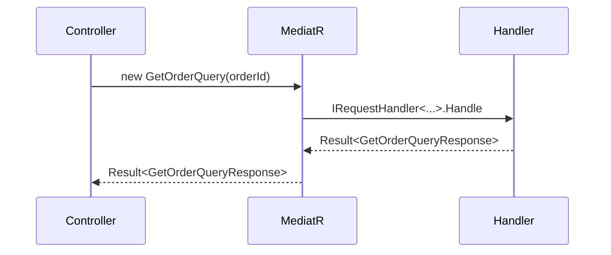
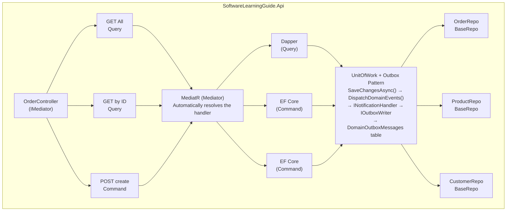

# CQRS - Command Query Responsibility Segregation


**CQRS** separates read operations (Query) from write operations (Command) in your application. In this project we use **MediatR** to dispatch queries and commands to their corresponding handlers.

---

#### Table of Contents

1. [What is CQRS?](#what-is-cqrs)
2. [Why MediatR](#why-mediatr)
3. [Request Flow](#request-flow)
4. [Queries - Read Side](#queries---read-side)
5. [Commands - Write Side](#commands---write-side)
6. [Controller Only Dispatches](#controller-only-dispatches)
7. [Outbox Pattern](#outbox-pattern)
8. [Architecture Diagram](#architecture-diagram)
9. [File Reference](#file-reference)

---

## What is CQRS?

**CQRS** (Command Query Responsibility Segregation) is a design pattern that separates the read model from the write model:

- **Query**: An operation that reads data without modifying state. Returns a result.
- **Command**: An operation that modifies state. May or may not return a result.

**Practical example:** Imagine an online store. When a customer searches for products (query), they need speed and may see cached data. But when they place an order (command), they need validation, transactionality, and tracking. CQRS allows optimizing each case separately instead of using the same model for both. Without CQRS, your "search products" endpoint and "create order" endpoint would share the same logic, forcing compromises that harm both use cases.

### Benefits

| Benefit | Description |
|---------|-------------|
| **Separation of concerns** | Reads and writes have independent handlers |
| **Independent optimization** | Queries can use Dapper (fast), Commands use EF Core (tracking) |
| **Scalability** | You can scale reads and writes independently |
| **Testability** | Each handler can be tested in isolation |

---

## Why MediatR?

**MediatR** implements the **Mediator** pattern that integrates perfectly with CQRS:

- The controller **doesn't know** the handler that resolves its request.
- The controller only calls `IMediator.Send(request)` and MediatR resolves automatically.
- It's registered by **assemblies** in [`SoftwareLearningGuide.Api/Startup/CqrsStartup.cs`](../SoftwareLearningGuide.Api/Startup/CqrsStartup.cs), no need to register each handler manually.

---

## Request Flow



---

## Queries - Read Side

A **Query** is a record that implements `IRequest<TResponse>`:

> **Why a record?** Records are immutable by default, which guarantees that once created, the query cannot be modified during its journey through the MediatR pipeline. This is key for predictability and thread-safety in concurrent scenarios.

```csharp
// [`SoftwareLearningGuide.Application.Query/GetOrder/GetOrderQuery.cs`](../../SoftwareLearningGuide.Application.Query/GetOrder/GetOrderQuery.cs)
namespace SoftwareLearningGuide.Application.Query.GetOrder;

public sealed record GetOrderQuery(Guid OrderId) : IRequest<Result<GetOrderQueryResponse>>;
```

### GetOrderQueryHandler

The handler resolves the query using **Dapper** for direct reads, without the overhead of EF Core's change tracker. On the read side we want total control: knowing exactly what SQL executes, doing optimized joins, and mapping directly to DTOs.

> **Why does the handler have direct SQL instead of using EF Core?** Because on the read side we want total control: knowing exactly what SQL executes, doing optimized joins, and mapping directly to DTOs without the overhead of EF Core's change tracker. EF Core is designed to track changes and persist entities; for pure reads, it's unnecessarily heavy. Dapper executes SQL and returns flat objects — nothing more, nothing less. This is especially valuable when you need a complex JOIN that EF Core would represent as multiple queries.

```csharp
// [`SoftwareLearningGuide.Application.Query/GetOrder/GetOrderQueryHandler.cs`](../../SoftwareLearningGuide.Application.Query/GetOrder/GetOrderQueryHandler.cs)
public sealed class GetOrderQueryHandler : IRequestHandler<GetOrderQuery, Result<GetOrderQueryResponse>>
{
    private readonly IDbConnection _connection;

    public GetOrderQueryHandler(IDbConnection connection)
    {
        _connection = connection ?? throw new ArgumentNullException(nameof(connection));
    }

    public async Task<Result<GetOrderQueryResponse>> Handle(GetOrderQuery request, CancellationToken cancellationToken)
    {
        const string orderSql = @"
            SELECT
                o.Id, o.CustomerId, o.Status,
                o.ShippingStreet, o.ShippingCity, o.ShippingState,
                o.ShippingPostalCode, o.ShippingCountry,
                o.CreatedAt, o.ConfirmedAt, o.ShippedAt, o.DeliveredAt, o.CancelledAt,
                c.FirstName + ' ' + c.LastName AS CustomerName,
                c.Email AS CustomerEmail
            FROM Orders o
            INNER JOIN Customers c ON c.Id = o.CustomerId
            WHERE o.Id = @OrderId;";

        const string linesSql = @"
            SELECT
                ol.Id, ol.ProductId, ol.ProductName,
                ol.UnitPrice, ol.Currency, ol.Quantity,
                (ol.UnitPrice * ol.Quantity) AS Subtotal
            FROM OrderLines ol
            WHERE ol.OrderId = @OrderId;";

        var commandOrder = new CommandDefinition(
            orderSql,
            new { request.OrderId },
            cancellationToken: cancellationToken);

        var order = await _connection.QueryFirstOrDefaultAsync<OrderDto>(commandOrder);

        if (order is null)
            return Result<GetOrderQueryResponse>.Failure(DomainErrors.Order.NotFound(request.OrderId));

        var commandLines = new CommandDefinition(
            linesSql,
            new { request.OrderId },
            cancellationToken: cancellationToken);

        var lines = (await _connection.QueryAsync<OrderLineDto>(commandLines)).ToList();

        var result = order with {
            Lines = lines,
            TotalAmount = lines.Sum(l => l.Subtotal),
            TotalItems = lines.Sum(l => l.Quantity),
            LineCount = lines.Count,
            Currency = lines.FirstOrDefault()?.Currency ?? "USD"
        };

        return Result<GetOrderQueryResponse>.Success(new GetOrderQueryResponse { Order = result });
    }
}
```

**Note about `GetOrderQueryResponse`:** Notice that the response lives in the namespace `SoftwareLearningGuide.Application.Query.GetOrderQuery` (with the "Query" suffix), which is different from the namespace `SoftwareLearningGuide.Application.Query.GetOrder` where `GetOrderQuery` lives. This is a project convention: the query response is grouped in its own namespace.

```csharp
// [`SoftwareLearningGuide.Application.Query/GetOrder/GetOrderQueryResponse.cs`](../../SoftwareLearningGuide.Application.Query/GetOrder/GetOrderQueryResponse.cs)
namespace SoftwareLearningGuide.Application.Query.GetOrderQuery;

public sealed record GetOrderQueryResponse {
    public OrderDto Order { get; set; }
}
```

**Why two SQLs instead of a JOIN with all data?** Because loading order lines in a separate query allows controlling mapping to different DTOs (`OrderDto` vs `OrderLineDto`). It also facilitates future line pagination and allows adding calculated metrics (like `TotalAmount`, `TotalItems`) directly in the handler without affecting the main DTO mapping.

---

## Commands - Write Side

We've seen the read side. Now let's look at the write side, where the magic of DDD happens. Commands don't just save data; they validate business rules, create aggregates, and trigger domain events. This is where the architecture truly shines: each command encapsulates a user intention that translates into domain changes.

A **Command** is a record that implements `IRequest<TResult>`:

```csharp
// [`SoftwareLearningGuide.Application.Command/CreateOrder/CreateOrderCommand.cs`](../../SoftwareLearningGuide.Application.Command/CreateOrder/CreateOrderCommand.cs)
namespace SoftwareLearningGuide.Application.Command.CreateOrder;

public sealed record CreateOrderCommand : IRequest<Result<Guid>>
{
    public Guid CustomerId { get; init; }
    public string ShippingStreet { get; init; } = string.Empty;
    public string ShippingCity { get; init; } = string.Empty;
    public string ShippingState { get; init; } = string.Empty;
    public string ShippingPostalCode { get; init; } = string.Empty;
    public string ShippingCountry { get; init; } = string.Empty;
    public List<CreateOrderLineCommand> Lines { get; init; } = new();
}

public sealed record CreateOrderLineCommand
{
    public Guid ProductId { get; init; }
    public int Quantity { get; init; }
}
```

### CreateOrderCommandHandler

The handler resolves the command using **EF Core** through repositories, but actual saving is done through `IUnitOfWork` to guarantee transactionality. The handler also depends on `ICustomerWriteRepository` and `IProductWriteRepository` to validate that the customer and products exist before creating the order.

> **Why doesn't the handler save directly to the database?** Because the handler shouldn't know the internal unit of work. The UoW pattern ensures that all repository operations (insert Order, update Products if applicable, etc.) are committed in a single SQL transaction. If something fails, everything reverts — no partial data or inconsistencies.

```csharp
// [`SoftwareLearningGuide.Application.Command/CreateOrder/CreateOrderCommandHandler.cs`](../../SoftwareLearningGuide.Application.Command/CreateOrder/CreateOrderCommandHandler.cs)
public sealed class CreateOrderCommandHandler : IRequestHandler<CreateOrderCommand, Result<Guid>>
{
    private readonly IOrderWriteRepository _orderRepository;
    private readonly ICustomerWriteRepository _customerRepository;
    private readonly IProductWriteRepository _productRepository;
    private readonly IUnitOfWork _unitOfWork;

    public CreateOrderCommandHandler(
        IOrderWriteRepository orderRepository,
        ICustomerWriteRepository customerRepository,
        IProductWriteRepository productRepository,
        IUnitOfWork unitOfWork) {
        _orderRepository = orderRepository ?? throw new ArgumentNullException(nameof(orderRepository));
        _customerRepository = customerRepository ?? throw new ArgumentNullException(nameof(customerRepository));
        _productRepository = productRepository ?? throw new ArgumentNullException(nameof(productRepository));
        _unitOfWork = unitOfWork ?? throw new ArgumentNullException(nameof(unitOfWork));
    }

    public async Task<Result<Guid>> Handle(CreateOrderCommand request, CancellationToken cancellationToken) {
        var customerIdResult = CustomerId.From(request.CustomerId);
        if (!customerIdResult.IsSuccess)
            return Result<Guid>.Failure(customerIdResult.Error!);

        var customer = await _customerRepository.GetByIdAsync(request.CustomerId, cancellationToken);
        if (customer is null)
            return Result<Guid>.Failure(DomainErrors.Customer.NotFound(request.CustomerId));

        var addressResult = Address.Create(
            request.ShippingStreet,
            request.ShippingCity,
            request.ShippingState,
            request.ShippingPostalCode,
            request.ShippingCountry);

        if (!addressResult.IsSuccess)
            return Result<Guid>.Failure(addressResult.Error!);

        var orderId = OrderId.Create();
        var orderResult = Order.Create(orderId, customerIdResult.Value!, addressResult.Value!);
        if (!orderResult.IsSuccess)
            return Result<Guid>.Failure(orderResult.Error!);

        var order = orderResult.Value!;

        foreach (var lineCommand in request.Lines) {
            var product = await _productRepository.GetByIdAsync(lineCommand.ProductId, cancellationToken);
            if (product is null)
                return Result<Guid>.Failure(DomainErrors.Product.NotFound(lineCommand.ProductId));

            var addResult = order.AddProduct(product, lineCommand.Quantity);
            if (!addResult.IsSuccess)
                return Result<Guid>.Failure(addResult.Error!);
        }

        var confirmResult = order.Confirm();
        if (!confirmResult.IsSuccess)
            return Result<Guid>.Failure(confirmResult.Error!);

        await _orderRepository.AddAsync(order, cancellationToken);
        await _unitOfWork.SaveChangesAsync(cancellationToken);

        return Result<Guid>.Success(order.Id.Value);
    }
}
```

**Step-by-step breakdown of the handler:** Let's break down what this handler does: First it validates `CustomerId` as a value object and then verifies the customer exists in the database. Then it creates `Address` and `OrderId` as value objects, and builds the `Order` aggregate. After that it searches for each product by ID and adds it to the order (validating stock and rules). Then it confirms the order and persists everything through `IUnitOfWork.SaveChangesAsync()`. Each step can fail and return a descriptive `Result.Failure`, without unhandled exceptions. The `OrderCreatedDomainEvent` domain event is triggered when the order is confirmed and is propagated by `UnitOfWork` to the corresponding `INotificationHandler`.

### Ports - IBaseRepository, IOrderWriteRepository and IUnitOfWork

The handler depends on interfaces (ports), not concrete implementations. Let's look at each port:

> **Why separate `IBaseRepository` from specific ports?** Because `IBaseRepository<TEntity, TId>` defines the generic CRUD operations that all entities need (`GetByIdAsync`, `AddAsync`). Each specific write repository (like `IOrderWriteRepository`) inherits from this base port and can add specific methods if needed. However, in this project `IOrderWriteRepository` is empty — it inherits everything from `IBaseRepository<Order, Guid>`. This is intentional: if the `Order` entity only needs generic CRUD operations, there's no point duplicating signatures in the interface. The DRY principle tells us inheritance already communicates that reuse.

**`IBaseRepository<TEntity, TId>`** ([`SoftwareLearningGuide.Application/Ports/IBaseRepository.cs`](../../SoftwareLearningGuide.Application/Ports/IBaseRepository.cs)):

```csharp
namespace SoftwareLearningGuide.Application.Command.Ports;

public interface IBaseRepository<TEntity, TId> where TEntity : class {
    Task<TEntity?> GetByIdAsync(TId id, CancellationToken cancellationToken = default);
    Task AddAsync(TEntity entity, CancellationToken cancellationToken = default);
}
```

**`IOrderWriteRepository`** ([`SoftwareLearningGuide.Application/Ports/IOrderWriteRepository.cs`](../../SoftwareLearningGuide.Application/Ports/IOrderWriteRepository.cs)):

> **Why doesn't `IOrderWriteRepository` have `SaveChangesAsync`?** Because saving is done through `IUnitOfWork`, not the repository. The Unit of Work pattern ensures that multiple repository operations are committed in a single transaction. If each repository had its own `SaveChangesAsync`, there would be no way to group atomic operations across different repositories (for example, updating an Order and a Product in the same transaction). `IBaseRepository` and `IOrderWriteRepository` don't have `SaveChangesAsync` — that responsibility belongs to `IUnitOfWork`.

```csharp
namespace SoftwareLearningGuide.Application.Command.Ports;

public interface IOrderWriteRepository : IBaseRepository<Order, Guid> {
}
```

**`IUnitOfWork`** ([`SoftwareLearningGuide.Application/Ports/IUnitOfWork.cs`](../../SoftwareLearningGuide.Application/Ports/IUnitOfWork.cs)):

```csharp
namespace SoftwareLearningGuide.Application.Command.Ports;

public interface IUnitOfWork {
    Task<int> SaveChangesAsync(CancellationToken cancellationToken = default);
}
```

**`IOutboxWriter`** ([`SoftwareLearningGuide.Application.Command/Ports/IOutboxWriter.cs`](../../SoftwareLearningGuide.Application.Command/Ports/IOutboxWriter.cs)):

```csharp
namespace SoftwareLearningGuide.Application.Command.Ports;

public interface IOutboxWriter {
    Task WriteAsync<T>(T message, CancellationToken cancellationToken = default) where T : class;
}
```

**Why does the handler depend on interfaces instead of implementations?** Because this allows changing the implementation (from EF Core to Dapper, or to a mock for tests) without modifying the handler. It's the Dependency Inversion Principle in action. The handler defines WHAT it needs (interface), and the infrastructure decides HOW it's implemented. When you write tests for this handler, you'll inject mocks of `IOrderWriteRepository`, `ICustomerWriteRepository`, `IProductWriteRepository`, and `IUnitOfWork` instead of a real database.

### Repository Implementations

The concrete implementations live in the infrastructure layer. `BaseRepository<TEntity, TId, TIdValue>` provides the generic EF Core operations, and `OrderWriteRepository` simply inherits without adding anything new:

```csharp
// [`SoftwareLearningGuide.Infraestructure/Repositories/BaseRepository.cs`](../../SoftwareLearningGuide.Infraestructure/Repositories/BaseRepository.cs)
public abstract class BaseRepository<TEntity, TId, TIdValue> : IBaseRepository<TEntity, TIdValue>
    where TEntity : class {
    // GetByIdAsync and AddAsync implemented with EF Core DbSet
}
```

```csharp
// [`SoftwareLearningGuide.Infraestructure/Repositories/OrderWriteRepository.cs`](../../SoftwareLearningGuide.Infraestructure/Repositories/OrderWriteRepository.cs)
public sealed class OrderWriteRepository : BaseRepository<Order, OrderId, Guid>, IOrderWriteRepository {
    public OrderWriteRepository(ApplicationDbContext context)
        : base(context, guid => new OrderId(guid)) {
    }
}
```

> **Why does `BaseRepository` have `TIdValue` as an additional generic parameter?** Because `OrderId` is a value object (not a simple `Guid`), and `GetByIdAsync` needs to convert the received `Guid` to an `OrderId` internally. The `_idFactory` factory handles that conversion encapsulated.

---

## Outbox Pattern

The Outbox Pattern guarantees eventual delivery of integration events transactionally. When a Domain Event is triggered within an EF Core transaction, `UnitOfWork.SaveChangesAsync()` first dispatches domain events to the corresponding `INotificationHandler`, and each handler writes the Integration Event to the `DomainOutboxMessages` table. Then, the `OutboxProcessor` (a separate background service) reads the outbox table and publishes events to RabbitMQ.

> **Why the Outbox Pattern instead of publishing directly?** Because publishing an integration event directly from the handler breaks the transaction: if the handler fails after publishing the event but before committing the database transaction, the event would have been published but the domain state wouldn't have been saved — inconsistency. The outbox ensures the event is written in the same transaction as the domain data, eliminating this risk.

**Outbox Flow:**

```
1. CreateOrderCommandHandler.Confirm() → triggers OrderCreatedDomainEvent
2. UnitOfWork.SaveChangesAsync() → dispatches Domain Events within the transaction
3. OrderCreatedNotificationHandler → writes OrderCreatedEvent to DomainOutboxMessages
4. Context.SaveChangesAsync() → commits everything in the same SQL transaction
5. OutboxProcessor (BackgroundService) → reads DomainOutboxMessages and publishes to RabbitMQ
```

---

## Controller Only Dispatches

The controller **doesn't know** the handlers. It only creates the request and sends it to MediatR. In this project, the controller is protected by Feature Flags and has logging and metrics instrumentation.

> **Production file:** [`SoftwareLearningGuide.Api/Controllers/OrderControllerExample/OrderController.cs`](../SoftwareLearningGuide.Api/Controllers/OrderControllerExample/OrderController.cs)

```csharp
// [`SoftwareLearningGuide.Api/Controllers/OrderControllerExample/OrderController.cs`](../SoftwareLearningGuide.Api/Controllers/OrderControllerExample/OrderController.cs)
using Asp.Versioning;
using MediatR;
using Microsoft.AspNetCore.Mvc;
using Microsoft.FeatureManagement;
using Microsoft.FeatureManagement.Mvc;
using SoftwareLearningGuide.Api.FeatureToggles;
using SoftwareLearningGuide.Api.Metrics;
using SoftwareLearningGuide.Application.Command.CreateOrder;
using SoftwareLearningGuide.Application.Query.GetAllOrders;
using SoftwareLearningGuide.Application.Query.GetOrder;
using SoftwareLearningGuide.Application.Query.GetOrderQuery;

namespace SoftwareLearningGuide.Api.Controllers.OrderControllerExample;

[ApiController]
[ApiVersion("1.0")]
[FeatureGate(FeatureToggleNames.FT_ENABLE_ORDER_CONTROLLER)]
[Route("api/v{version:apiVersion}/[controller]")]
public class OrderController : ControllerBase {
    private readonly IMediator _mediator;
    private readonly ILogger<OrderController> _logger;
    private readonly OrderMetrics _metrics;
    private readonly IFeatureManagerSnapshot _featureManager;

    public OrderController(IMediator mediator, ILogger<OrderController> logger, OrderMetrics metrics, IFeatureManagerSnapshot featureManager) {
        _mediator = mediator;
        _logger = logger;
        _metrics = metrics;
        _featureManager = featureManager;
    }

    [HttpGet]
    [FeatureGate(FeatureToggleNames.FT_ENABLE_ORDER_LIST)]
    [ProducesResponseType(typeof(GetAllOrdersQueryResponse), StatusCodes.Status200OK)]
    public async Task<IActionResult> GetAll(CancellationToken cancellationToken) {
        using (_logger.BeginScope(new Dictionary<string, object> { { "CorrelationId", HttpContext.TraceIdentifier } })) {
            _logger.LogInformation("Starting retrieval of all orders");

            var query = new GetAllOrdersQuery();
            var result = await _mediator.Send(query, cancellationToken);

            if (!result.IsSuccess) {
                _logger.LogWarning("Error retrieving orders: {Error}", result.Error);
                return BadRequest(new { error = result.Error });
            }

            _logger.LogInformation("Retrieved {Count} orders", result.Value!.TotalCount);
            return Ok(result.Value);
        }
    }

    [HttpGet("{id:guid}")]
    [FeatureGate(FeatureToggleNames.FT_ENABLE_ORDER_RETRIEVAL)]
    [ProducesResponseType(typeof(GetOrderQueryResponse), StatusCodes.Status200OK)]
    [ProducesResponseType(StatusCodes.Status404NotFound)]
    public async Task<IActionResult> GetById(Guid id, CancellationToken cancellationToken) {
        using (_logger.BeginScope(new Dictionary<string, object> { { "OrderId", id } })) {
            _logger.LogInformation("Starting retrieval of order {OrderId}", id);

            var query = new GetOrderQuery(id);
            var result = await _mediator.Send(query, cancellationToken);

            if (!result.IsSuccess) {
                _logger.LogWarning("Order {OrderId} not found: {Error}", id, result.Error);
                return NotFound(new { error = result.Error });
            }

            _logger.LogInformation("Order {OrderId} retrieved successfully", id);
            return Ok(result.Value);
        }
    }

    [HttpPost]
    [ProducesResponseType(typeof(object), StatusCodes.Status201Created)]
    [ProducesResponseType(StatusCodes.Status400BadRequest)]
    public async Task<IActionResult> Create([FromBody] CreateOrderCommand command, CancellationToken cancellationToken) {

        if (await _featureManager.IsEnabledAsync(FeatureToggleNames.FT_ENABLE_ORDER_CREATION) is false) {
            _logger.LogWarning("Attempt to create order while ORDERS_MODULE is disabled.");
            return NotFound();
        }

        HttpContext.Items["CustomerId"] = command.CustomerId;
        HttpContext.Items["LineCount"] = command.Lines.Count;

        using (_logger.BeginScope(new Dictionary<string, object> { { "CustomerId", command.CustomerId }, { "LineCount", command.Lines.Count } })) {
            _logger.LogInformation(
                "Starting order creation for customer {CustomerId} with {LineCount} lines",
                command.CustomerId, command.Lines.Count);

            var result = await _mediator.Send(command, cancellationToken);

            if (!result.IsSuccess) {
                _logger.LogWarning(
                    "Error creating order for customer {CustomerId}: {Error}",
                    command.CustomerId, result.Error);
                return BadRequest(new { error = result.Error });
            }

            _logger.LogInformation(
                "Order {OrderId} created successfully for customer {CustomerId}",
                result.Value, command.CustomerId);

            _metrics.OrderCreated(result.Value, command.CustomerId);

            return CreatedAtAction(
                nameof(GetById),
                new { id = result.Value },
                new { orderId = result.Value });
        }
    }
}
```

**Note about the controller:** Notice how the controller has no business logic. It only creates the request, sends it to MediatR, and handles the HTTP response. Each action has logging scopes with correlated data (`CorrelationId`, `OrderId`, `CustomerId`, `LineCount`), making it easy to track requests in production through distributed logs. The use of feature flags allows disabling complete actions or modules without deploying new code: if FT_ENABLE_ORDER_CREATION is disabled, the POST endpoint returns 404 instead of processing the command.

---

## Dependency Registration (CQRS and Repositories)

MediatR is registered by assemblies in [`SoftwareLearningGuide.Api/Startup/CqrsStartup.cs`](../SoftwareLearningGuide.Api/Startup/CqrsStartup.cs), scanning handler assemblies:

```csharp
// [`SoftwareLearningGuide.Api/Startup/CqrsStartup.cs`](../SoftwareLearningGuide.Api/Startup/CqrsStartup.cs)
services.AddMediatR(cfg => cfg.RegisterServicesFromAssemblies(
    typeof(CreateOrderCommandHandler).Assembly,
    typeof(GetOrderQueryHandler).Assembly));
```

Repositories and UoW are registered in [`SoftwareLearningGuide.Api/Startup/ReporitoriesStartup.cs`](../SoftwareLearningGuide.Api/Startup/ReporitoriesStartup.cs):

```csharp
// [`SoftwareLearningGuide.Api/Startup/ReporitoriesStartup.cs`](../SoftwareLearningGuide.Api/Startup/ReporitoriesStartup.cs)
services.AddScoped<IOrderWriteRepository, OrderWriteRepository>();
services.AddScoped<IProductWriteRepository, ProductWriteRepository>();
services.AddScoped<ICustomerWriteRepository, CustomerWriteRepository>();
services.AddScoped<IUnitOfWork, UnitOfWork>();
```

> **Why `RegisterServicesFromAssemblies` instead of registering each handler manually?** Because MediatR supports automatic handler discovery by assembly. By pointing to the `Application.Command` and `Application.Query` assemblies, any new handler is registered automatically without touching the bootstrapping code. This is crucial for maintaining the Open/Closed Principle: adding a new command doesn't require modifying the API startup.

---

## Architecture Diagram



---

## File Reference

| File | Description |
|------|-------------|
| [`SoftwareLearningGuide.Application.Query/GetOrder/GetOrderQuery.cs`](../../SoftwareLearningGuide.Application.Query/GetOrder/GetOrderQuery.cs) | Query definition |
| [`SoftwareLearningGuide.Application.Query/GetOrder/GetOrderQueryHandler.cs`](../../SoftwareLearningGuide.Application.Query/GetOrder/GetOrderQueryHandler.cs) | Query handler (Dapper) |
| [`SoftwareLearningGuide.Application.Query/GetOrder/OrderDto.cs`](../../SoftwareLearningGuide.Application.Query/GetOrder/OrderDto.cs) | Read DTOs |
| [`SoftwareLearningGuide.Application.Query/GetOrder/GetOrderQueryResponse.cs`](../../SoftwareLearningGuide.Application.Query/GetOrder/GetOrderQueryResponse.cs) | Response wrapper |
| [`SoftwareLearningGuide.Application.Command/CreateOrder/CreateOrderCommand.cs`](../../SoftwareLearningGuide.Application.Command/CreateOrder/CreateOrderCommand.cs) | Command definition |
| [`SoftwareLearningGuide.Application.Command/CreateOrder/CreateOrderCommandHandler.cs`](../../SoftwareLearningGuide.Application.Command/CreateOrder/CreateOrderCommandHandler.cs) | Command handler (EF Core + UoW) |
| [`SoftwareLearningGuide.Application/Ports/IBaseRepository.cs`](../../SoftwareLearningGuide.Application/Ports/IBaseRepository.cs) | Base generic port |
| [`SoftwareLearningGuide.Application/Ports/IOrderWriteRepository.cs`](../../SoftwareLearningGuide.Application/Ports/IOrderWriteRepository.cs) | Write port for Order |
| [`SoftwareLearningGuide.Application/Ports/IUnitOfWork.cs`](../../SoftwareLearningGuide.Application/Ports/IUnitOfWork.cs) | Unit of work port |
| [`SoftwareLearningGuide.Application/Ports/IOutboxWriter.cs`](../../SoftwareLearningGuide.Application.Command/Ports/IOutboxWriter.cs) | Port for writing to outbox |
| [`SoftwareLearningGuide.Infraestructure/Repositories/BaseRepository.cs`](../../SoftwareLearningGuide.Infraestructure/Repositories/BaseRepository.cs) | Base repository implementation |
| [`SoftwareLearningGuide.Infraestructure/Repositories/OrderWriteRepository.cs`](../../SoftwareLearningGuide.Infraestructure/Repositories/OrderWriteRepository.cs) | Order port implementation |
| [`SoftwareLearningGuide.Infraestructure/Repositories/UnitOfWork.cs`](../../SoftwareLearningGuide.Infraestructure/Repositories/UnitOfWork.cs) | UoW implementation + outbox dispatching |
| [`SoftwareLearningGuide.Infraestructure/Services/OutboxWriter.cs`](../../SoftwareLearningGuide.Infraestructure/Services/OutboxWriter.cs) | Outbox writer implementation |
| [`SoftwareLearningGuide.Api/Controllers/OrderControllerExample/OrderController.cs`](../SoftwareLearningGuide.Api/Controllers/OrderControllerExample/OrderController.cs) | Controller that dispatches |
| [`SoftwareLearningGuide.Api/Startup/CqrsStartup.cs`](../SoftwareLearningGuide.Api/Startup/CqrsStartup.cs) | MediatR registration |
| [`SoftwareLearningGuide.Api/Startup/ReporitoriesStartup.cs`](../SoftwareLearningGuide.Api/Startup/ReporitoriesStartup.cs) | Repository and UoW registration |

---

## NuGet Packages

| Package | Version | Usage |
|---------|---------|-------|
| `MediatR` | 12.4.1 | Query and command dispatcher |
| `Dapper` | 2.1.66 | SQL to object mapping (query side) |
| `Microsoft.EntityFrameworkCore` | 10.0.0 | ORM for command side |
`Microsoft.Extensions.DependencyInjection` | 10.0.0 | Dependency registration