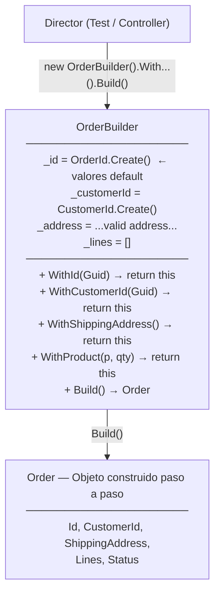
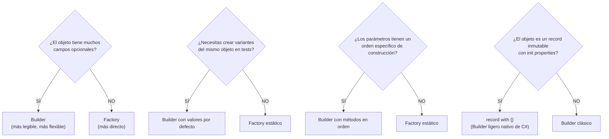

# Patrón Builder (Constructor)


El **Patrón Builder** construye objetos complejos **paso a paso**. Separa la construcción de un objeto de su representación final, permitiendo crear variantes del mismo tipo con el mismo proceso de construcción.

---

#### Tabla de Contenidos

1. [¿Qué es el Patrón Builder?](#qué-es-el-patrón-builder)
2. [Builder vs Factory](#builder-vs-factory)
3. [Builder Fluido para Tests](#builder-fluido-para-tests)
4. [Builder para Commands complejos](#builder-para-commands-complejos)
5. [Builder implícito: Record with](#builder-implícito-record-with)
6. [Diagrama del Patrón](#diagrama-del-patrón)
7. [Cuándo usar Builder vs Factory](#cuándo-usar-builder-vs-factory)

---

## ¿Qué es el Patrón Builder?

> **"Separa la construcción de un objeto complejo de su representación, permitiendo que el mismo proceso de construcción pueda crear diferentes representaciones."** — GoF

El Builder es ideal cuando:
- El objeto tiene **muchos parámetros opcionales**
- La construcción requiere **múltiples pasos** en un orden específico
- Quieres crear variantes de un objeto con diferente configuración
- Necesitas **objetos de test** preconfigurados rápidamente

---

## Builder vs Factory

| Aspecto | Factory | Builder |
|---------|---------|---------|
| **Complejidad** | Objetos simples o medianos | Objetos complejos con muchos campos |
| **Parámetros** | Pocos, todos obligatorios | Muchos, varios opcionales |
| **Paso a paso** | No — todo de una vez | Sí — método a método |
| **Variantes** | Pocas variantes | Múltiples configuraciones |
| **Uso típico** | Value Objects, Agregados | Tests, configuración compleja, DTOs |

---

## Builder Fluido para Tests

El uso más práctico del patrón Builder en un proyecto como este es **construir objetos de test** sin repetir código de inicialización en cada test.

### OrderBuilder para Tests

```csharp
// Tests/Builders/OrderBuilder.cs
public sealed class OrderBuilder
{
    // Valores por defecto — cualquier test tiene un Order válido de base
    private OrderId _id = OrderId.Create();
    private CustomerId _customerId = CustomerId.Create();
    private Address _address = Address.Create("Calle 123", "Madrid", "Madrid", "28001", "ES").Value!;
    private OrderStatus _status = OrderStatus.Pending;
    private readonly List<(Product product, int quantity)> _lines = new();

    // Métodos fluidos — retornan this para encadenar
    public OrderBuilder WithId(Guid id)
    {
        _id = OrderId.From(id).Value;
        return this;
    }

    public OrderBuilder WithCustomerId(Guid customerId)
    {
        _customerId = CustomerId.From(customerId).Value;
        return this;
    }

    public OrderBuilder WithShippingAddress(string street, string city, string country)
    {
        var result = Address.Create(street, city, "", "", country);
        _address = result.Value!;
        return this;
    }

    public OrderBuilder WithStatus(OrderStatus status)
    {
        _status = status;
        return this;
    }

    public OrderBuilder WithProduct(Product product, int quantity = 1)
    {
        _lines.Add((product, quantity));
        return this;
    }

    // Método terminal — construye el objeto final
    public Order Build()
    {
        var orderResult = Order.Create(_id, _customerId, _address);
        var order = orderResult.Value!;

        foreach (var (product, quantity) in _lines)
            order.AddProduct(product, quantity);

        if (_status == OrderStatus.Confirmed)
            order.Confirm();

        return order;
    }
}
```

**Uso en tests:**

```csharp
[Fact]
public async Task CreateOrder_WithValidData_ShouldSucceed()
{
    // Builder simplifica la creación — sin repetir parámetros en cada test
    var order = new OrderBuilder()
        .WithCustomerId(Guid.NewGuid())
        .WithShippingAddress("Gran Vía 45", "Madrid", "ES")
        .WithProduct(new ProductBuilder().Build(), quantity: 3)
        .Build();

    Assert.Equal(OrderStatus.Pending, order.Status);
    Assert.Single(order.Lines);
}

[Fact]
public async Task ConfirmedOrder_ShouldHaveDomainEvent()
{
    var order = new OrderBuilder()
        .WithStatus(OrderStatus.Confirmed)
        .Build();

    Assert.Contains(order.DomainEvents, e => e is OrderCreatedDomainEvent);
}

[Fact]
public async Task OrderWithMultipleProducts_ShouldCalculateTotalCorrectly()
{
    var laptop = new ProductBuilder().WithPrice(1200, "USD").WithStock(5).Build();
    var mouse = new ProductBuilder().WithPrice(30, "USD").WithStock(10).Build();

    var order = new OrderBuilder()
        .WithProduct(laptop, quantity: 1)
        .WithProduct(mouse, quantity: 2)
        .Build();

    // Total esperado: 1200 + 60 = 1260
    Assert.Equal(1260m, order.TotalAmount);
}
```

### ProductBuilder para Tests

```csharp
// Tests/Builders/ProductBuilder.cs
public sealed class ProductBuilder
{
    private ProductId _id = ProductId.Create();
    private string _name = "Producto Test";
    private string _description = "Descripción de test";
    private Money _price = Money.Create(100m, "USD").Value!;
    private int _stock = 10;

    public ProductBuilder WithName(string name) { _name = name; return this; }
    public ProductBuilder WithDescription(string desc) { _description = desc; return this; }
    public ProductBuilder WithPrice(decimal amount, string currency)
    {
        _price = Money.Create(amount, currency).Value!;
        return this;
    }
    public ProductBuilder WithStock(int stock) { _stock = stock; return this; }

    public Product Build() {
        var result = Product.Create(_id, _name, _description, _price, _stock);
        if (!result.IsSuccess)
            throw new InvalidOperationException($"ProductBuilder failed: {result.Error}");
        return result.Value!;
    }
}
```

---

## Builder para Commands complejos

Cuando un Command tiene muchos campos opcionales, un Builder hace que el código sea más legible.

### CreateOrderCommandBuilder

```csharp
// Application.Command/CreateOrder/CreateOrderCommandBuilder.cs
public sealed class CreateOrderCommandBuilder
{
    private Guid _customerId = Guid.NewGuid();
    private string _street = "Calle Mayor 1";
    private string _city = "Madrid";
    private string _state = "Madrid";
    private string _postalCode = "28001";
    private string _country = "ES";
    private readonly List<CreateOrderLineCommand> _lines = new();

    public CreateOrderCommandBuilder ForCustomer(Guid customerId)
    {
        _customerId = customerId;
        return this;
    }

    public CreateOrderCommandBuilder ShippingTo(
        string street, string city, string state, string postalCode, string country)
    {
        _street = street; _city = city; _state = state;
        _postalCode = postalCode; _country = country;
        return this;
    }

    public CreateOrderCommandBuilder AddLine(Guid productId, int quantity)
    {
        _lines.Add(new CreateOrderLineCommand { ProductId = productId, Quantity = quantity });
        return this;
    }

    public CreateOrderCommand Build() => new CreateOrderCommand
    {
        CustomerId = _customerId,
        ShippingStreet = _street,
        ShippingCity = _city,
        ShippingState = _state,
        ShippingPostalCode = _postalCode,
        ShippingCountry = _country,
        Lines = _lines
    };
}
```

**Uso:**

```csharp
var command = new CreateOrderCommandBuilder()
    .ForCustomer(customerId)
    .ShippingTo("Gran Vía 45", "Madrid", "Madrid", "28013", "ES")
    .AddLine(productId1, quantity: 2)
    .AddLine(productId2, quantity: 1)
    .Build();

var result = await _mediator.Send(command);
```

---

## Builder implícito: Record `with`

C# 9+ tiene una forma de "Builder ligero" incorporada en los records mediante la expresión `with`, que crea una copia modificada de un record inmutable.

```csharp
// Los records de Command/Query ya actúan como builders inmutables
public sealed record CreateProductCommand : IRequest<Result<Guid>>
{
    public string Name { get; init; } = string.Empty;
    public string Description { get; init; } = string.Empty;
    public decimal Price { get; init; }
    public string Currency { get; init; } = "USD";
    public int Stock { get; init; }
}

// "with" actúa como un Builder de una sola línea — crea copias modificadas
var baseCommand = new CreateProductCommand { Name = "Laptop", Price = 1200, Currency = "USD", Stock = 5 };

// Variante 1: mismo producto, diferente moneda
var euroCommand = baseCommand with { Currency = "EUR", Price = 1100 };

// Variante 2: mismo producto, sin stock
var outOfStockCommand = baseCommand with { Stock = 0 };

// Uso en tests — muy limpio
[Theory]
[InlineData("USD", 1200)]
[InlineData("EUR", 1100)]
[InlineData("GBP", 950)]
public async Task CreateProduct_WithDifferentCurrencies_ShouldSucceed(string currency, decimal price)
{
    var command = baseCommand with { Currency = currency, Price = price };
    var result = await _handler.Handle(command, CancellationToken.None);
    Assert.True(result.IsSuccess);
}
```

---

## Diagrama del Patrón



---

## Cuándo usar Builder vs Factory



---

**Ver también:**
- [`README.Pattern.Factory.md`](README.Pattern.Factory.md) — Patrón Factory para Value Objects y Agregados
- [`README.Pattern.SOLID.md`](README.Pattern.SOLID.md) — Principios SOLID (SRP y OCP aplicados al Builder)
- [`README.ResultPattern.md`](../SoftwareLearningGuide.Core.Business/README.ResultPattern.md) — Result\<T\> retornado por las factories
