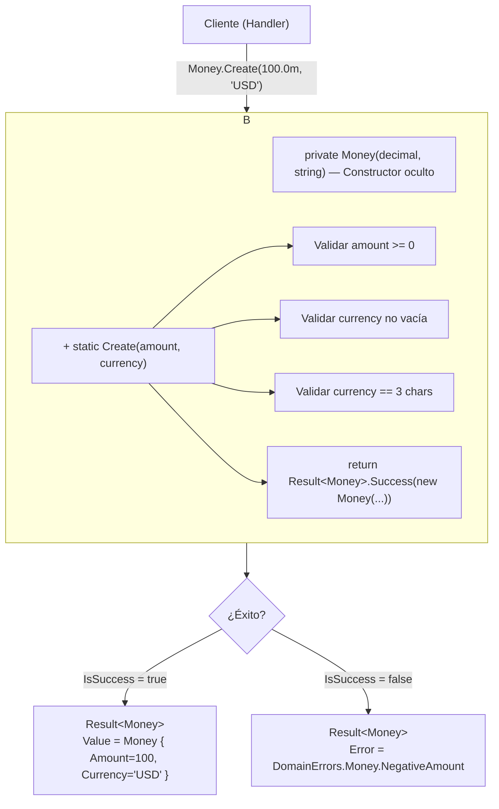

# Patrón Factory (Fábrica)


El **Patrón Factory** centraliza la creación de objetos en un método especializado, ocultando la lógica de construcción al cliente. En lugar de usar `new` directamente, el cliente llama a un método `Create()` que devuelve el objeto ya construido y validado.

---

#### Tabla de Contenidos

1. [¿Qué es el Patrón Factory?](#qué-es-el-patrón-factory)
2. [Tipos de Factory](#tipos-de-factory)
3. [Factory Method en Value Objects](#factory-method-en-value-objects)
4. [Factory Method en Agregados](#factory-method-en-agregados)
5. [Static Factory vs Constructor](#static-factory-vs-constructor)
6. [Factory en la creación de IDs](#factory-en-la-creación-de-ids)
7. [Diagrama del Patrón](#diagrama-del-patrón)
8. [Resumen](#resumen)

---

## ¿Qué es el Patrón Factory?

> **"Define una interfaz para crear un objeto, pero deja que las subclases decidan qué clase instanciar."** — GoF

En la práctica moderna (especialmente en DDD), se usa sobre todo como **Static Factory Method**: un método estático en la clase que devuelve una instancia ya construida y validada.

**Problema que resuelve:**

```csharp
// SIN Factory: el cliente construye directamente y puede crear objetos inválidos
var money = new Money(-500, "")  // Precio negativo y moneda vacía — ¡objeto inválido!
var email = new Email("esto no es un email");  // Sin validación posible en el constructor público
```

**Con Factory:**

```csharp
// CON Factory: la creación pasa por validación obligatoria
var moneyResult = Money.Create(100, "USD");   // Devuelve Result<Money>
if (!moneyResult.IsSuccess) return moneyResult.Error;  // Fallo explícito

var emailResult = Email.Create("user@domain.com");  // Valida el formato
var email = emailResult.Value!;  // Solo accedes al valor si es válido
```

---

## Tipos de Factory

| Tipo | Descripción | En este proyecto |
|------|-------------|-----------------|
| **Static Factory Method** | Método estático en la propia clase | `Money.Create()`, `Address.Create()`, `Order.Create()` |
| **Factory Method** (GoF) | Método en clase base, subclases lo sobreescriben | No aplica directamente |
| **Abstract Factory** | Familia de factories relacionados | No aplica directamente |
| **Factory Class** | Clase separada solo para crear objetos | No aplica directamente |

Este proyecto usa principalmente **Static Factory Method**, el patrón más limpio para Value Objects y Agregados en DDD.

---

## Factory Method en Value Objects

Los **Value Objects** son inmutables y solo pueden crearse en un estado válido. La factory garantiza esta invariante.

### Money

```csharp
// SoftwareLearningGuide.Core.Business/ValueObjects/Money.cs
public sealed class Money
{
    public decimal Amount { get; }
    public string Currency { get; }

    // Constructor PRIVADO: nadie puede hacer new Money() directamente
    private Money(decimal amount, string currency)
    {
        Amount = amount;
        Currency = currency;
    }

    // ← STATIC FACTORY METHOD: único punto de creación
    public static Result<Money> Create(decimal amount, string currency)
    {
        // Validaciones de negocio centralizadas
        if (amount < 0)
            return Result<Money>.Failure(DomainErrors.Money.NegativeAmount);

        if (string.IsNullOrWhiteSpace(currency))
            return Result<Money>.Failure(DomainErrors.Money.InvalidCurrency);

        if (currency.Length != 3)
            return Result<Money>.Failure(DomainErrors.Money.CurrencyMustBeThreeChars);

        return Result<Money>.Success(new Money(amount, currency.ToUpperInvariant()));
    }
}
```

**Uso:**

```csharp
// En el handler — devuelve Result<Money>, no lanza excepciones
var priceResult = Money.Create(command.Price, command.Currency);
if (!priceResult.IsSuccess)
    return Result<Guid>.Failure(priceResult.Error!);

var price = priceResult.Value!;  // Solo aquí tienes el objeto válido
```

### Email

```csharp
public sealed class Email
{
    public string Value { get; }

    private Email(string value) => Value = value;

    public static Result<Email> Create(string email)
    {
        if (string.IsNullOrWhiteSpace(email))
            return Result<Email>.Failure(DomainErrors.Email.Required);

        // Validación con Regex o lógica propia
        if (!email.Contains('@') || !email.Contains('.'))
            return Result<Email>.Failure(DomainErrors.Email.InvalidFormat);

        return Result<Email>.Success(new Email(email.ToLowerInvariant().Trim()));
    }
}
```

### Address

```csharp
public sealed class Address
{
    public string Street { get; }
    public string City { get; }
    public string State { get; }
    public string PostalCode { get; }
    public string Country { get; }

    private Address(string street, string city, string state, string postalCode, string country)
    {
        Street = street; City = city; State = state;
        PostalCode = postalCode; Country = country;
    }

    // Factory acepta todos los campos y los valida juntos
    public static Result<Address> Create(
        string street, string city, string state, string postalCode, string country)
    {
        if (string.IsNullOrWhiteSpace(street))
            return Result<Address>.Failure(DomainErrors.Address.StreetRequired);

        if (string.IsNullOrWhiteSpace(city))
            return Result<Address>.Failure(DomainErrors.Address.CityRequired);

        if (string.IsNullOrWhiteSpace(country))
            return Result<Address>.Failure(DomainErrors.Address.CountryRequired);

        return Result<Address>.Success(new Address(street, city, state, postalCode, country));
    }
}
```

---

## Factory Method en Agregados

Los **Agregados** también usan Factory Method para garantizar que se crean con todos sus invariantes cubiertos y que disparan los domain events correctos.

### Order.Create()

```csharp
public sealed class Order : ProduceEvents
{
    public OrderId Id { get; private set; }
    public CustomerId CustomerId { get; private set; }
    public Address ShippingAddress { get; private set; }
    public OrderStatus Status { get; private set; }

    // Constructor PRIVADO: nadie puede crear un Order "vacío"
    private Order() { }

    // ← FACTORY METHOD en el Agregado
    public static Result<Order> Create(OrderId id, CustomerId customerId, Address shippingAddress)
    {
        // Validaciones del agregado (pre-condiciones de negocio)
        if (id is null)
            return Result<Order>.Failure(DomainErrors.Order.InvalidId);

        if (customerId is null)
            return Result<Order>.Failure(DomainErrors.Order.CustomerRequired);

        if (shippingAddress is null)
            return Result<Order>.Failure(DomainErrors.Order.AddressRequired);

        var order = new Order
        {
            Id = id,
            CustomerId = customerId,
            ShippingAddress = shippingAddress,
            Status = OrderStatus.Pending,
            CreatedAt = DateTime.UtcNow
        };

        // Domain Event disparado en el momento de creación
        order.AddDomainEvent(new OrderCreatedDomainEvent
        {
            OrderId = id.Value,
            CustomerId = customerId.Value,
            CreatedAt = order.CreatedAt
        });

        return Result<Order>.Success(order);
    }
}
```

**Uso en el handler:**

```csharp
// El handler usa la factory — nunca hace new Order() directamente
var orderResult = Order.Create(orderId, customerIdResult.Value!, addressResult.Value!);
if (!orderResult.IsSuccess)
    return Result<Guid>.Failure(orderResult.Error!);

var order = orderResult.Value!;
```

---

## Static Factory vs Constructor

| Aspecto | Constructor Público | Static Factory Method |
|---------|---------------------|----------------------|
| **Validación** | Difícil devolver Result — solo throw | Puede devolver `Result<T>` |
| **Nombre descriptivo** | No: siempre el nombre de la clase | Sí: `Create()`, `FromEmail()`, `Of()` |
| **Inmutabilidad** | Puede ser violada desde fuera | Constructor privado garantiza inmutabilidad |
| **Domain Events** | Difícil disparar en constructor | Se disparan en la factory |
| **Testabilidad** | Acoplado a excepciones | Retorno de Result facilita el test |

```csharp
// Constructor: lanza excepción si falla
var money = new Money(-100, "USD");  // throws DomainException

// Factory: devuelve Result — sin excepciones
var result = Money.Create(-100, "USD");
if (!result.IsSuccess)
    Console.WriteLine(result.Error?.Message);  // Manejo explícito
```

> **¿Por qué preferir Factory con Result\<T\>?** Porque las excepciones rompen el flujo de control normal y son difíciles de testear. Un `Result<T>` es un valor que el compilador te obliga a manejar. Además, en un pipeline con varios value objects (Address tiene 5 campos), puedes retornar el primer error sin un bloque `try/catch` enorme.

---

## Factory en la creación de IDs

Los **Value Objects de identidad** también usan factory:

```csharp
public record OrderId
{
    public Guid Value { get; }

    // Constructor privado para reconstrucción desde BD
    private OrderId(Guid value)
    {
        if (value == Guid.Empty)
            throw new ArgumentException(DomainErrors.IdErrors.OrderIdCannotBeEmpty());

        Value = value;
    }

    // Factory para crear un ID nuevo (genera el GUID)
    public static OrderId Create() => new(Guid.NewGuid());

    // Factory para reconstruir desde un Guid ya existente (desde BD o request)
    public static Result<OrderId> From(Guid value)
    {
        try
        {
            return Result<OrderId>.Success(new OrderId(value));
        }
        catch (ArgumentException ex)
        {
            return Result<OrderId>.Failure(ex.Message);
        }
    }

    public override string ToString() => Value.ToString();
}
```

**Uso:**

```csharp
// Crear una orden nueva — genera ID automáticamente
var orderId = OrderId.Create();

// Reconstruir desde un GUID del request HTTP
var orderIdResult = OrderId.From(request.OrderId);
if (!orderIdResult.IsSuccess)
    return Result<Guid>.Failure(orderIdResult.Error!);
```

---

## Diagrama del Patrón



---

## Resumen

| Value Object | Factory | Validaciones |
|-------------|---------|-------------|
| `Money` | `Money.Create(amount, currency)` | amount >= 0, currency 3 chars, no vacío |
| `Email` | `Email.Create(email)` | formato válido, no vacío |
| `Address` | `Address.Create(street, city, ...)` | campos requeridos no vacíos |
| `OrderId` | `OrderId.Create()` / `OrderId.From(guid)` | guid != Guid.Empty |
| `Order` | `Order.Create(id, customerId, address)` | todos los campos requeridos, dispara evento |
| `Product` | `Product.Create(id, name, description, price, stock)` | validaciones en factory + evento |

---

**Ver también:**
- [`README.Pattern.Builder.md`](README.Pattern.Builder.md) — Patrón Builder para construcción paso a paso
- [`README.Pattern.SOLID.md`](README.Pattern.SOLID.md) — Principios SOLID que justifican el uso de Factory
- [`README.ResultPattern.md`](../SoftwareLearningGuide.Core.Business/README.ResultPattern.md) — Result\<T\> devuelto por las factories
- [`README.DDD.md`](../SoftwareLearningGuide.Core.Business/README.DDD.md) — Value Objects y Agregados donde viven las factories
