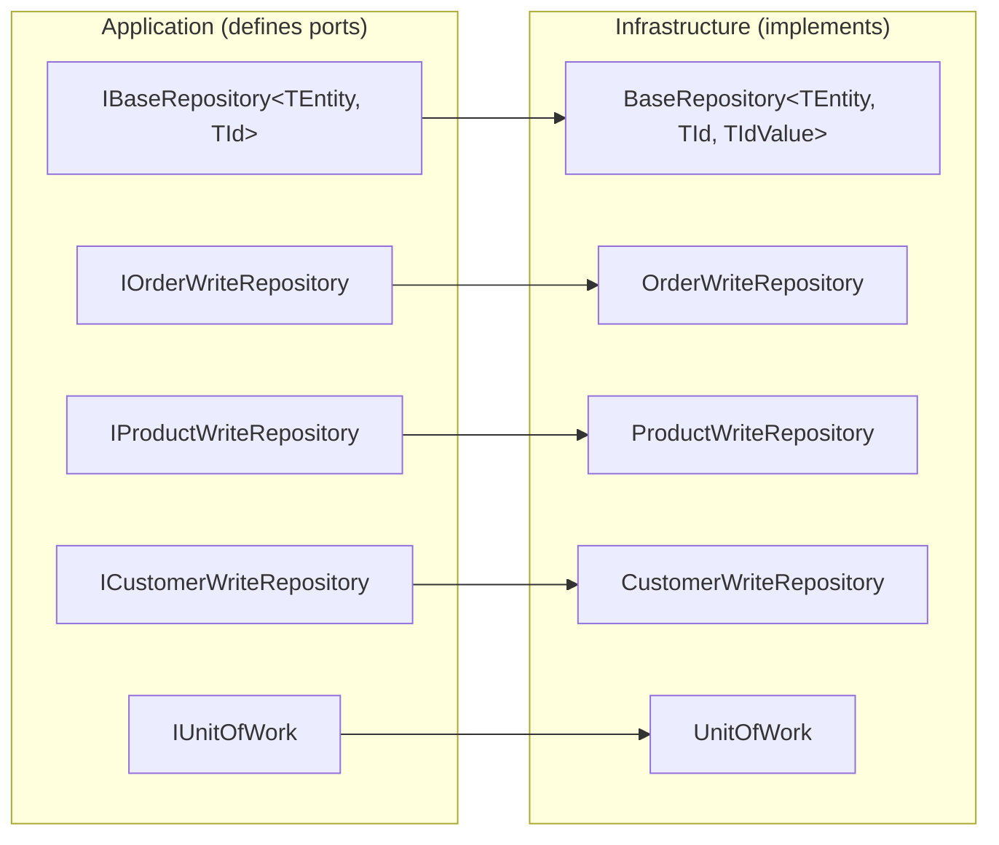
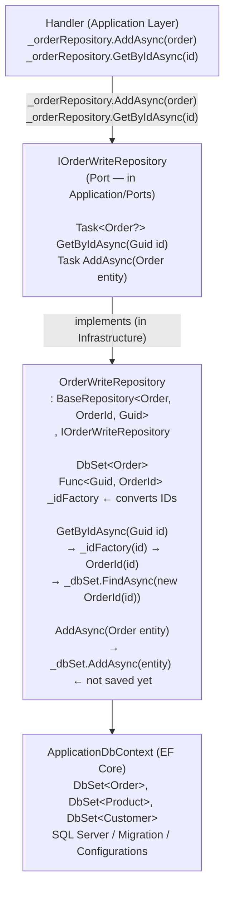

# Repository Pattern


The **Repository Pattern** abstracts data access behind a collection-oriented interface. The domain works with business objects, and the repository handles translation between the domain world and the persistence world.

---

#### Table of Contents

1. [What is the Repository Pattern?](#what-is-the-repository-pattern)
2. [Repository in this Project](#repository-in-this-project)
3. [IBaseRepository — Generic Port](#ibaserepository--generic-port)
4. [Specific Repositories](#specific-repositories)
5. [BaseRepository — Generic Implementation](#baserepository--generic-implementation)
6. [Read vs Write Repository](#read-vs-write-repository)
7. [Pattern Diagram](#pattern-diagram)
8. [File Reference](#file-reference)

---

## What is the Repository Pattern?

> **"Mediates between the domain and data mapping layers, acting as an in-memory collection of domain objects."** — Eric Evans, Domain-Driven Design

**Without Repository:**

```csharp
// The handler accesses the DB directly — coupled to EF Core
public async Task<Result<Guid>> Handle(CreateOrderCommand request, CancellationToken ct)
{
    var order = new Order(...);
    _context.Orders.Add(order);             // ← EF Core directly
    await _context.SaveChangesAsync(ct);    // ← EF Core directly
    return Result<Guid>.Success(order.Id.Value);
}
// Problems: can't test without DB, can't switch ORMs
```

**With Repository:**

```csharp
// The handler uses the abstraction — doesn't know EF Core, SQL, or DbContext
public async Task<Result<Guid>> Handle(CreateOrderCommand request, CancellationToken ct)
{
    var order = new Order(...);
    await _orderRepository.AddAsync(order, ct);  // ← Interface, no EF Core
    await _unitOfWork.SaveChangesAsync(ct);       // ← Interface, no DbContext
    return Result<Guid>.Success(order.Id.Value);
}
// Testable with mocks, interchangeable with any ORM
```

---

## Repository in this Project

The project implements a repository hierarchy with dual purpose: **write** (EF Core, with change tracking) and **read** (Dapper, direct SQL).



---

## IBaseRepository — Generic Port

Defines the minimum contract any entity needs for writing:

```csharp
// SoftwareLearningGuide.Application/Ports/IBaseRepository.cs
namespace SoftwareLearningGuide.Application.Command.Ports;

public interface IBaseRepository<TEntity, TId> where TEntity : class
{
    Task<TEntity?> GetByIdAsync(TId id, CancellationToken cancellationToken = default);
    Task AddAsync(TEntity entity, CancellationToken cancellationToken = default);
}
```

> **Why only `GetById` and `Add`?** In a CQRS model, the write repository only needs to retrieve an aggregate (to modify it) and add a new one. Reads go through Dapper with direct SQL. This minimalist interface applies the Interface Segregation Principle: write handlers don't need `GetAll`, `Delete`, or `Update` — those are responsibilities of the query side and domain respectively.

---

## Specific Repositories

Each main entity has its own port that inherits from `IBaseRepository`:

```csharp
// IOrderWriteRepository — inherited, no own methods
// If Order only needs GetById and AddAsync, the interface is intentionally empty
public interface IOrderWriteRepository : IBaseRepository<Order, Guid> { }

// IProductWriteRepository
public interface IProductWriteRepository : IBaseRepository<Product, Guid> { }

// ICustomerWriteRepository
public interface ICustomerWriteRepository : IBaseRepository<Customer, Guid> { }
```

> **Why empty interfaces?** Because if the entity only needs generic CRUD operations, duplicating the signatures in the specific interface violates the DRY principle. Inheritance communicates reuse. When `Order` needs specific methods (like `GetActiveOrdersForCustomer`), they're added to `IOrderWriteRepository` without touching `IBaseRepository`.

---

## BaseRepository — Generic Implementation

The concrete implementation uses EF Core and implements the base contract generically:

```csharp
// SoftwareLearningGuide.Infraestructure/Repositories/BaseRepository.cs
public abstract class BaseRepository<TEntity, TId, TIdValue>
    : IBaseRepository<TEntity, TIdValue>
    where TEntity : class
{
    protected readonly ApplicationDbContext Context;
    private readonly DbSet<TEntity> _dbSet;
    private readonly Func<TIdValue, TId> _idFactory;

    protected BaseRepository(ApplicationDbContext context, Func<TIdValue, TId> idFactory)
    {
        Context = context ?? throw new ArgumentNullException(nameof(context));
        _dbSet = context.Set<TEntity>();
        _idFactory = idFactory ?? throw new ArgumentNullException(nameof(idFactory));
    }

    // Finds by ID, converting the external Guid to the internal Value Object
    public async Task<TEntity?> GetByIdAsync(TIdValue id, CancellationToken cancellationToken = default)
    {
        var entityId = _idFactory(id);  // Guid → OrderId (Value Object)
        return await _dbSet.FindAsync(new object[] { entityId }, cancellationToken);
    }

    // Adds without saving — UnitOfWork handles the saving
    public async Task AddAsync(TEntity entity, CancellationToken cancellationToken = default)
    {
        await _dbSet.AddAsync(entity, cancellationToken);
    }
}
```

> **Why `TIdValue` as a third generic parameter?** Because `OrderId` is a Value Object, not a simple `Guid`. `FindAsync` needs the real `OrderId` (not the underlying `Guid`), but the handler works with `Guid`. The `_idFactory` automatically converts `Guid → OrderId` without exposing that complexity to the handler.

### OrderWriteRepository

```csharp
// SoftwareLearningGuide.Infraestructure/Repositories/OrderWriteRepository.cs
public sealed class OrderWriteRepository
    : BaseRepository<Order, OrderId, Guid>, IOrderWriteRepository
{
    public OrderWriteRepository(ApplicationDbContext context)
        : base(context, guid => new OrderId(guid)) { }
    // The lambda "guid => new OrderId(guid)" is the factory that converts Guid → OrderId
}
```

```csharp
// SoftwareLearningGuide.Infraestructure/Repositories/ProductWriteRepository.cs
public sealed class ProductWriteRepository
    : BaseRepository<Product, ProductId, Guid>, IProductWriteRepository
{
    public ProductWriteRepository(ApplicationDbContext context)
        : base(context, guid => new ProductId(guid)) { }
}
```

---

## Read vs Write Repository

In CQRS, reading doesn't use traditional repositories — it uses direct SQL with Dapper:

### Write (EF Core + Repository)

```csharp
// Command side: uses repositories with change tracking
public sealed class CreateOrderCommandHandler : IRequestHandler<CreateOrderCommand, Result<Guid>>
{
    private readonly IOrderWriteRepository _orderRepository;

    public async Task<Result<Guid>> Handle(CreateOrderCommand request, CancellationToken ct)
    {
        var order = Order.Create(...).Value!;
        await _orderRepository.AddAsync(order, ct);  // EF Core tracks the object
        await _unitOfWork.SaveChangesAsync(ct);       // EF Core persists the changes
        return Result<Guid>.Success(order.Id.Value);
    }
}
```

### Read (Dapper + Direct SQL)

```csharp
// Query side: doesn't use repositories — direct SQL with Dapper
public sealed class GetOrderQueryHandler : IRequestHandler<GetOrderQuery, Result<GetOrderQueryResponse>>
{
    private readonly IDbConnection _connection;

    public async Task<Result<GetOrderQueryResponse>> Handle(GetOrderQuery request, CancellationToken ct)
    {
        const string sql = @"
            SELECT o.Id, o.Status, c.FirstName + ' ' + c.LastName AS CustomerName
            FROM Orders o
            INNER JOIN Customers c ON c.Id = o.CustomerId
            WHERE o.Id = @OrderId";

        var order = await _connection.QueryFirstOrDefaultAsync<OrderDto>(sql, new { request.OrderId });
        // No repository, no EF Core, no change tracking — just SQL and mapping
        if (order is null)
            return Result<GetOrderQueryResponse>.Failure(DomainErrors.Order.NotFound(request.OrderId));

        return Result<GetOrderQueryResponse>.Success(new GetOrderQueryResponse { Order = order });
    }
}
```

| Aspect | Write Side (Repository) | Read Side (Dapper) |
|--------|------------------------|-------------------|
| **ORM** | EF Core (change tracking) | Dapper (no tracking) |
| **Abstraction** | `IOrderWriteRepository` | `IDbConnection` (direct SQL) |
| **Returned Object** | Domain entity (`Order`) | Read DTO (`OrderDto`) |
| **Validations** | Yes (business rules) | No (projection only) |
| **Transaction** | Yes (via `IUnitOfWork`) | Read only |

---

## Pattern Diagram



---

## File Reference

| File | Layer | Description |
|------|-------|-------------|
| [`Application/Ports/IBaseRepository.cs`](../../SoftwareLearningGuide.Application/Ports/IBaseRepository.cs) | Application | Base generic port |
| [`Application.Command/Ports/IOrderWriteRepository.cs`](../../SoftwareLearningGuide.Application.Command/Ports/IOrderWriteRepository.cs) | Application | Order-specific port |
| [`Application.Command/Ports/IProductWriteRepository.cs`](../../SoftwareLearningGuide.Application.Command/Ports/IProductWriteRepository.cs) | Application | Product-specific port |
| [`Infraestructure/Repositories/BaseRepository.cs`](../../SoftwareLearningGuide.Infraestructure/Repositories/BaseRepository.cs) | Infrastructure | Generic EF Core implementation |
| [`Infraestructure/Repositories/OrderWriteRepository.cs`](../../SoftwareLearningGuide.Infraestructure/Repositories/OrderWriteRepository.cs) | Infrastructure | IOrderWriteRepository implementation |
| [`Infraestructure/Repositories/UnitOfWork.cs`](../../SoftwareLearningGuide.Infraestructure/Repositories/UnitOfWork.cs) | Infrastructure | Transaction coordinator |

---

**See also:**
- [`README.UnitOfWork.md`](../../SoftwareLearningGuide.Infraestructure/README.UnitOfWork.md) — How UoW coordinates repositories
- [`README.CQRS.md`](README.CQRS.md) — Why there are write repositories but not read repositories
- [`README.Pattern.SOLID.md`](README.Pattern.SOLID.md) — ISP and DIP that make Repository work
- [`README.CleanArchitecture.md`](../SoftwareLearningGuide.Api/README.CleanArchitecture.md) — How Repository fits into the layers