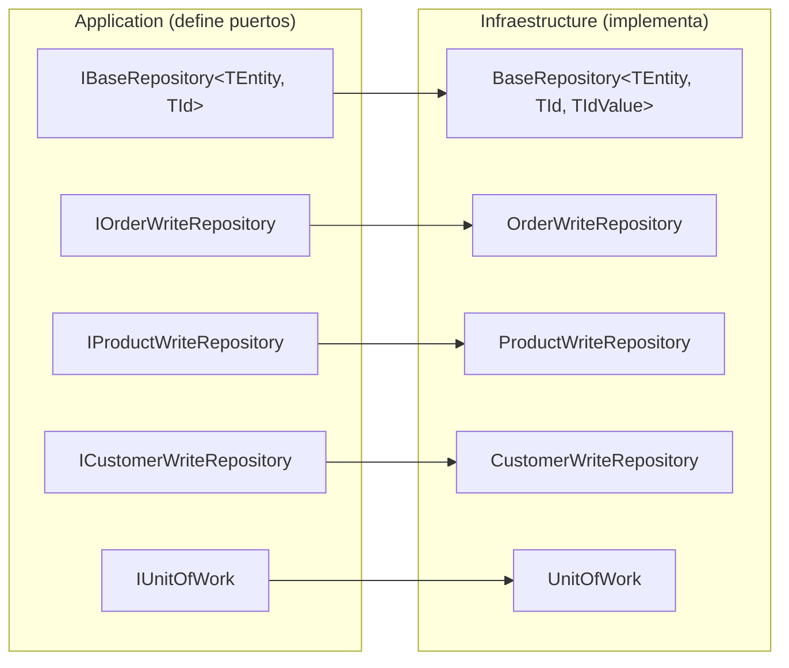
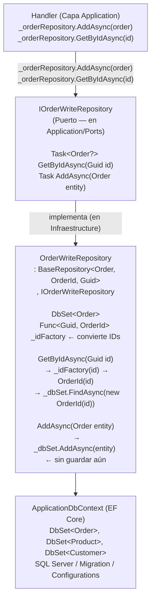

# Patrón Repository


El **Patrón Repository** abstrae el acceso a datos detrás de una interfaz orientada a colecciones. El dominio trabaja con objetos de negocio y el repositorio se encarga de traducir entre el mundo del dominio y el mundo de la persistencia.

---

#### Tabla de Contenidos

1. [¿Qué es el Patrón Repository?](#qué-es-el-patrón-repository)
2. [Repository en este Proyecto](#repository-en-este-proyecto)
3. [IBaseRepository — Puerto Genérico](#ibaserepository--puerto-genérico)
4. [Repositorios Específicos](#repositorios-específicos)
5. [BaseRepository — Implementación Genérica](#baserepository--implementación-genérica)
6. [Repositorio de Lectura vs Escritura](#repositorio-de-lectura-vs-escritura)
7. [Diagrama del Patrón](#diagrama-del-patrón)
8. [Referencia de Archivos](#referencia-de-archivos)

---

## ¿Qué es el Patrón Repository?

> **"Medita entre el dominio y las capas de mapeo de datos, actuando como una colección en memoria de objetos del dominio."** — Eric Evans, Domain-Driven Design

**Sin Repository:**

```csharp
// El handler accede directamente a la BD — acoplado a EF Core
public async Task<Result<Guid>> Handle(CreateOrderCommand request, CancellationToken ct)
{
    var order = new Order(...);
    _context.Orders.Add(order);             // ← EF Core directamente
    await _context.SaveChangesAsync(ct);    // ← EF Core directamente
    return Result<Guid>.Success(order.Id.Value);
}
// Problemas: no puedes testear sin BD, no puedes cambiar de ORM
```

**Con Repository:**

```csharp
// El handler usa la abstracción — no conoce EF Core, SQL, ni DbContext
public async Task<Result<Guid>> Handle(CreateOrderCommand request, CancellationToken ct)
{
    var order = new Order(...);
    await _orderRepository.AddAsync(order, ct);  // ← Interfaz, sin EF Core
    await _unitOfWork.SaveChangesAsync(ct);       // ← Interfaz, sin DbContext
    return Result<Guid>.Success(order.Id.Value);
}
// Testeable con mocks, intercambiable con cualquier ORM
```

---

## Repository en este Proyecto

El proyecto implementa una jerarquía de repositorios con doble propósito: **escritura** (EF Core, con change tracking) y **lectura** (Dapper, SQL directo).



---

## IBaseRepository — Puerto Genérico

Define el contrato mínimo que cualquier entidad necesita para escritura:

```csharp
// SoftwareLearningGuide.Application/Ports/IBaseRepository.cs
namespace SoftwareLearningGuide.Application.Command.Ports;

public interface IBaseRepository<TEntity, TId> where TEntity : class
{
    Task<TEntity?> GetByIdAsync(TId id, CancellationToken cancellationToken = default);
    Task AddAsync(TEntity entity, CancellationToken cancellationToken = default);
}
```

> **¿Por qué solo `GetById` y `Add`?** En un modelo CQRS, el repositorio de escritura solo necesita recuperar un agregado (para modificarlo) y añadir uno nuevo. Las lecturas van por Dapper con SQL directo. Esta interfaz minimalista aplica el Interface Segregation Principle: los handlers de escritura no necesitan `GetAll`, `Delete`, ni `Update` — son responsabilidad de la query side y del dominio respectivamente.

---

## Repositorios Específicos

Cada entidad principal tiene su propio puerto que hereda de `IBaseRepository`:

```csharp
// IOrderWriteRepository — heredado, sin métodos propios
// Si Order solo necesita GetById y AddAsync, la interfaz queda vacía intencionalmente
public interface IOrderWriteRepository : IBaseRepository<Order, Guid> { }

// IProductWriteRepository
public interface IProductWriteRepository : IBaseRepository<Product, Guid> { }

// ICustomerWriteRepository
public interface ICustomerWriteRepository : IBaseRepository<Customer, Guid> { }
```

> **¿Por qué interfaces vacías?** Porque si la entidad solo necesita las operaciones CRUD genéricas, duplicar las firmas en la interfaz específica viola el principio DRY. La herencia comunica la reutilización. Cuando `Order` necesite métodos específicos (como `GetActiveOrdersForCustomer`), se añaden en `IOrderWriteRepository` sin tocar `IBaseRepository`.

---

## BaseRepository — Implementación Genérica

La implementación concreta usa EF Core e implementa el contrato base de forma genérica:

```csharp
// SoftwareLearningGuide.Infraestructure/Repositories/BaseRepository.cs
public abstract class BaseRepository<TEntity, TId, TIdValue>
    : IBaseRepository<TEntity, TIdValue>
    where TEntity : class
{
    protected readonly ApplicationDbContext Context;
    private readonly DbSet<TEntity> _dbSet;
    private readonly Func<TIdValue, TId> _idFactory;

    protected BaseRepository(ApplicationDbContext context, Func<TIdValue, TId> idFactory)
    {
        Context = context ?? throw new ArgumentNullException(nameof(context));
        _dbSet = context.Set<TEntity>();
        _idFactory = idFactory ?? throw new ArgumentNullException(nameof(idFactory));
    }

    // Busca por ID, convirtiendo el Guid externo al Value Object interno
    public async Task<TEntity?> GetByIdAsync(TIdValue id, CancellationToken cancellationToken = default)
    {
        var entityId = _idFactory(id);  // Guid → OrderId (Value Object)
        return await _dbSet.FindAsync(new object[] { entityId }, cancellationToken);
    }

    // Añade sin guardar — el guardado lo hace UnitOfWork
    public async Task AddAsync(TEntity entity, CancellationToken cancellationToken = default)
    {
        await _dbSet.AddAsync(entity, cancellationToken);
    }
}
```

> **¿Por qué `TIdValue` como tercer parámetro genérico?** Porque `OrderId` es un Value Object, no un `Guid` simple. `FindAsync` necesita el `OrderId` real (no el `Guid` subyacente), pero el handler trabaja con `Guid`. El factory `_idFactory` convierte automáticamente `Guid → OrderId` sin exponer esa complejidad al handler.

### OrderWriteRepository

```csharp
// SoftwareLearningGuide.Infraestructure/Repositories/OrderWriteRepository.cs
public sealed class OrderWriteRepository
    : BaseRepository<Order, OrderId, Guid>, IOrderWriteRepository
{
    public OrderWriteRepository(ApplicationDbContext context)
        : base(context, guid => new OrderId(guid)) { }
    // La lambda "guid => new OrderId(guid)" es el factory que convierte Guid → OrderId
}
```

```csharp
// SoftwareLearningGuide.Infraestructure/Repositories/ProductWriteRepository.cs
public sealed class ProductWriteRepository
    : BaseRepository<Product, ProductId, Guid>, IProductWriteRepository
{
    public ProductWriteRepository(ApplicationDbContext context)
        : base(context, guid => new ProductId(guid)) { }
}
```

---

## Repositorio de Lectura vs Escritura

En CQRS, la lectura no usa repositorios traditional — usa SQL directo con Dapper:

### Escritura (EF Core + Repository)

```csharp
// Command side: usa repositorios con change tracking
public sealed class CreateOrderCommandHandler : IRequestHandler<CreateOrderCommand, Result<Guid>>
{
    private readonly IOrderWriteRepository _orderRepository;

    public async Task<Result<Guid>> Handle(CreateOrderCommand request, CancellationToken ct)
    {
        var order = Order.Create(...).Value!;
        await _orderRepository.AddAsync(order, ct);  // EF Core trackea el objeto
        await _unitOfWork.SaveChangesAsync(ct);       // EF Core persiste los cambios
        return Result<Guid>.Success(order.Id.Value);
    }
}
```

### Lectura (Dapper + SQL directo)

```csharp
// Query side: no usa repositorios — SQL directo con Dapper
public sealed class GetOrderQueryHandler : IRequestHandler<GetOrderQuery, Result<GetOrderQueryResponse>>
{
    private readonly IDbConnection _connection;

    public async Task<Result<GetOrderQueryResponse>> Handle(GetOrderQuery request, CancellationToken ct)
    {
        const string sql = @"
            SELECT o.Id, o.Status, c.FirstName + ' ' + c.LastName AS CustomerName
            FROM Orders o
            INNER JOIN Customers c ON c.Id = o.CustomerId
            WHERE o.Id = @OrderId";

        var order = await _connection.QueryFirstOrDefaultAsync<OrderDto>(sql, new { request.OrderId });
        // Sin repositorio, sin EF Core, sin change tracking — solo SQL y mapeo
        if (order is null)
            return Result<GetOrderQueryResponse>.Failure(DomainErrors.Order.NotFound(request.OrderId));

        return Result<GetOrderQueryResponse>.Success(new GetOrderQueryResponse { Order = order });
    }
}
```

| Aspecto | Write Side (Repository) | Read Side (Dapper) |
|---------|------------------------|-------------------|
| **ORM** | EF Core (change tracking) | Dapper (sin tracking) |
| **Abstracción** | `IOrderWriteRepository` | `IDbConnection` (SQL directo) |
| **Objeto devuelto** | Entidad del dominio (`Order`) | DTO de lectura (`OrderDto`) |
| **Validaciones** | Sí (reglas de negocio) | No (solo proyección) |
| **Transacción** | Sí (via `IUnitOfWork`) | Solo lectura |

---

## Diagrama del Patrón



---

## Referencia de Archivos

| Archivo | Capa | Descripción |
|---------|------|-------------|
| [`Application/Ports/IBaseRepository.cs`](../../SoftwareLearningGuide.Application/Ports/IBaseRepository.cs) | Application | Puerto genérico base |
| [`Application.Command/Ports/IOrderWriteRepository.cs`](../../SoftwareLearningGuide.Application.Command/Ports/IOrderWriteRepository.cs) | Application | Puerto específico de Order |
| [`Application.Command/Ports/IProductWriteRepository.cs`](../../SoftwareLearningGuide.Application.Command/Ports/IProductWriteRepository.cs) | Application | Puerto específico de Product |
| [`Infraestructure/Repositories/BaseRepository.cs`](../../SoftwareLearningGuide.Infraestructure/Repositories/BaseRepository.cs) | Infraestructura | Implementación genérica con EF Core |
| [`Infraestructure/Repositories/OrderWriteRepository.cs`](../../SoftwareLearningGuide.Infraestructure/Repositories/OrderWriteRepository.cs) | Infraestructura | Implementación de IOrderWriteRepository |
| [`Infraestructure/Repositories/UnitOfWork.cs`](../../SoftwareLearningGuide.Infraestructure/Repositories/UnitOfWork.cs) | Infraestructura | Coordinador de transacciones |

---

**Ver también:**
- [`README.UnitOfWork.md`](../../SoftwareLearningGuide.Infraestructure/README.UnitOfWork.md) — Cómo el UoW coordina los repositorios
- [`README.CQRS.md`](README.CQRS.md) — Por qué hay repositorios de escritura pero no de lectura
- [`README.Pattern.SOLID.md`](README.Pattern.SOLID.md) — ISP y DIP que hacen funcionar el Repository
- [`README.CleanArchitecture.md`](../SoftwareLearningGuide.Api/README.CleanArchitecture.md) — Cómo el Repository encaja en las capas
