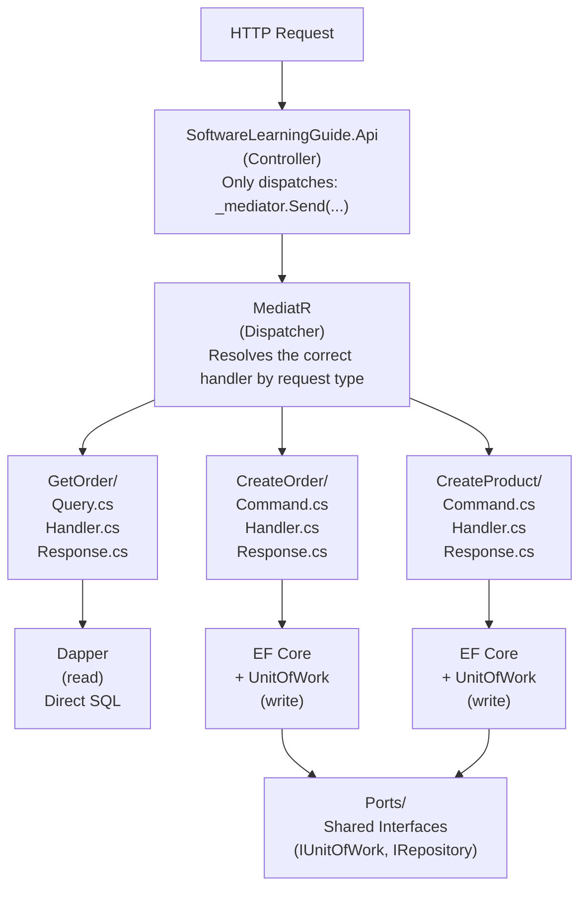

# Vertical Slicing Architecture


**Vertical Slicing** organizes code by **complete features** rather than by horizontal technical layers. Each "slice" contains everything needed to implement a feature: query/command, handler, DTO, validation, and response, all together in the same folder.

---

#### Table of Contents

1. [What is Vertical Slicing?](#what-is-vertical-slicing)
2. [Horizontal vs Vertical](#horizontal-vs-vertical)
3. [Structure in this Project](#structure-in-this-project)
4. [Anatomy of a Slice](#anatomy-of-a-slice)
5. [Query Slice: GetOrder](#query-slice-getorder)
6. [Command Slice: CreateOrder](#command-slice-createorder)
7. [How to Add a New Slice](#how-to-add-a-new-slice)
8. [Architecture Diagram](#architecture-diagram)
9. [Benefits and Trade-offs](#benefits-and-trade-offs)
10. [File Reference](#file-reference)

---

## What is Vertical Slicing?

**Vertical Slicing** is a code organization style where each business feature groups all its artifacts in the same folder or module.

> **Analogy:** Imagine a layered cake. Traditional architecture cuts it horizontally: one layer of sponge, one of cream, another of sponge. Vertical Slicing cuts it into vertical slices: each slice includes its own piece of sponge, cream, and decoration. Each slice is completely autonomous and independent.

Instead of this:

```
Application/
├── Commands/
│   ├── CreateOrderCommand.cs
│   ├── CreateProductCommand.cs
│   └── CreateCustomerCommand.cs
├── Queries/
│   ├── GetOrderQuery.cs
│   ├── GetProductQuery.cs
│   └── GetCustomerQuery.cs
└── Handlers/
    ├── CreateOrderCommandHandler.cs
    └── GetOrderQueryHandler.cs
```

We have this:

```
Application/
├── GetOrder/
│   ├── GetOrderQuery.cs
│   ├── GetOrderQueryHandler.cs
│   └── GetOrderQueryResponse.cs
└── CreateOrder/
    ├── CreateOrderCommand.cs
    ├── CreateOrderCommandHandler.cs
    └── CreateOrderCommandResponse.cs
```

---

## Horizontal vs Vertical

| Criterion | Horizontal (Layers) | Vertical (Slices) |
|-----------|---------------------|-------------------|
| **Organization** | By technical type (Commands/, Queries/, Handlers/) | By business feature (GetOrder/, CreateOrder/) |
| **Cohesion** | Low: related files are in different folders | High: everything about a feature is together |
| **Coupling** | High between technical layers | Low between features |
| **Navigation** | Need to jump between multiple folders | Everything is in one place |
| **Scalability** | Folders grow indefinitely | Each feature is independent |
| **Teams** | Difficult to work in parallel without conflicts | Teams can work on different features without conflict |

> **Why Vertical Slicing in this project?** Because when you need to understand or modify "how an order is created," you open `CreateOrder/` and have everything there: the command, the handler, the DTOs. You don't need to search in three different folders, remember naming conventions, or coordinate with other scattered files. Functional cohesion surpasses technical cohesion in medium and large applications.

---

## Structure in this Project

This project implements Vertical Slicing at the `Application.Command` and `Application.Query` project levels:

```
SoftwareLearningGuide.Application.Command/    ← Write slices
├── CreateOrder/
│   ├── CreateOrderCommand.cs                 ← Command definition
│   ├── CreateOrderCommandHandler.cs          ← Feature logic
│   └── CreateOrderCommandResponse.cs        ← Response DTO
├── CreateProduct/
│   ├── CreateProductCommand.cs
│   ├── CreateProductCommandHandler.cs
│   └── CreateProductCommandResponse.cs
├── CreateCustomer/
│   ├── CreateCustomerCommand.cs
│   ├── CreateCustomerCommandHandler.cs
│   └── CreateCustomerCommandResponse.cs
└── Ports/                                    ← Shared interfaces (not a slice)
    ├── IBaseRepository.cs
    ├── IOrderWriteRepository.cs
    └── IUnitOfWork.cs

SoftwareLearningGuide.Application.Query/      ← Read slices
├── GetOrder/
│   ├── GetOrderQuery.cs                      ← Query definition
│   ├── GetOrderQueryHandler.cs               ← Read logic (Dapper)
│   ├── GetOrderQueryResponse.cs              ← Response DTO
│   └── OrderDto.cs                           ← Data DTO
├── GetAllOrders/
│   ├── GetAllOrdersQuery.cs
│   ├── GetAllOrdersQueryHandler.cs
│   └── GetAllOrdersQueryResponse.cs
└── GetProduct/
    ├── GetProductQuery.cs
    ├── GetProductQueryHandler.cs
    └── GetProductQueryResponse.cs
```

> **Note about `Ports/`:** The `Ports/` folder is an exception to the rule. Interfaces like `IBaseRepository<T>` and `IUnitOfWork` are shared contracts between multiple features and don't belong to a specific slice. However, each slice **references** these ports rather than duplicating them.

---

## Anatomy of a Slice

Each slice has a single responsibility and a predictable set of files:

```
CreateOrder/
├── CreateOrderCommand.cs          ← Input data (immutable record)
│                                     Implements IRequest<Result<Guid>>
├── CreateOrderCommandHandler.cs   ← All business logic for the feature
│                                     Implements IRequestHandler<TCommand, TResult>
└── CreateOrderCommandResponse.cs  ← Output data (DTO)
                                      Contains only properties, no logic
```

**Rules for a well-designed slice:**

1. **One slice, one responsibility**: `CreateOrder` only knows how to create orders.
2. **No dependencies between slices**: `CreateOrder` doesn't import anything from `GetOrder`.
3. **Technology isolation**: the handler can change from EF Core to Dapper without affecting other slices.
4. **Contracts via Ports**: if you need something from infrastructure, use it through an interface in `Ports/`.

---

## Query Slice: GetOrder

A **read** slice is the simplest. It contains a query, its handler, and the response DTO.

### GetOrderQuery.cs

```csharp
// SoftwareLearningGuide.Application.Query/GetOrder/GetOrderQuery.cs
namespace SoftwareLearningGuide.Application.Query.GetOrder;

// Immutable record: once the query is created, no one can modify it
public sealed record GetOrderQuery(Guid OrderId) : IRequest<Result<GetOrderQueryResponse>>;
```

> **Why a record?** Records are immutable by value. They guarantee the query isn't modified during its journey through the MediatR pipeline. They also automatically generate `Equals`, `GetHashCode`, and `ToString`, useful for logging and debugging.

### GetOrderQueryHandler.cs

```csharp
// SoftwareLearningGuide.Application.Query/GetOrder/GetOrderQueryHandler.cs
public sealed class GetOrderQueryHandler : IRequestHandler<GetOrderQuery, Result<GetOrderQueryResponse>>
{
    private readonly IDbConnection _connection;

    public GetOrderQueryHandler(IDbConnection connection)
    {
        _connection = connection ?? throw new ArgumentNullException(nameof(connection));
    }

    public async Task<Result<GetOrderQueryResponse>> Handle(GetOrderQuery request, CancellationToken cancellationToken)
    {
        // Direct SQL with Dapper — no EF Core overhead
        const string sql = @"SELECT Id, CustomerId, Status FROM Orders WHERE Id = @OrderId";
        var order = await _connection.QueryFirstOrDefaultAsync<OrderDto>(sql, new { request.OrderId });

        if (order is null)
            return Result<GetOrderQueryResponse>.Failure(DomainErrors.Order.NotFound(request.OrderId));

        return Result<GetOrderQueryResponse>.Success(new GetOrderQueryResponse { Order = order });
    }
}
```

> **Why does the handler use Dapper instead of EF Core?** On the read side we want speed and full SQL control. Dapper maps directly to DTOs without the change tracker overhead. If the SQL changes, only this handler changes, without affecting any other slice.

---

## Command Slice: CreateOrder

A **write** slice is richer: it validates business rules, creates aggregates, and can trigger domain events.

### CreateOrderCommand.cs

```csharp
// SoftwareLearningGuide.Application.Command/CreateOrder/CreateOrderCommand.cs
namespace SoftwareLearningGuide.Application.Command.CreateOrder;

public sealed record CreateOrderCommand : IRequest<Result<Guid>>
{
    public Guid CustomerId { get; init; }
    public string ShippingStreet { get; init; } = string.Empty;
    public string ShippingCity { get; init; } = string.Empty;
    public string ShippingState { get; init; } = string.Empty;
    public string ShippingPostalCode { get; init; } = string.Empty;
    public string ShippingCountry { get; init; } = string.Empty;
    public List<CreateOrderLineCommand> Lines { get; init; } = new();
}
```

### CreateOrderCommandHandler.cs

```csharp
// SoftwareLearningGuide.Application.Command/CreateOrder/CreateOrderCommandHandler.cs
public sealed class CreateOrderCommandHandler : IRequestHandler<CreateOrderCommand, Result<Guid>>
{
    private readonly IOrderWriteRepository _orderRepository;
    private readonly IUnitOfWork _unitOfWork;

    public CreateOrderCommandHandler(IOrderWriteRepository orderRepository, IUnitOfWork unitOfWork)
    {
        _orderRepository = orderRepository;
        _unitOfWork = unitOfWork;
    }

    public async Task<Result<Guid>> Handle(CreateOrderCommand request, CancellationToken cancellationToken)
    {
        // 1. Validate and build value objects
        var addressResult = Address.Create(request.ShippingStreet, request.ShippingCity,
            request.ShippingState, request.ShippingPostalCode, request.ShippingCountry);
        if (!addressResult.IsSuccess)
            return Result<Guid>.Failure(addressResult.Error!);

        // 2. Create the aggregate (triggers domain events internally)
        var order = Order.Create(OrderId.Create(), customerIdResult.Value!, addressResult.Value!);

        // 3. Persist through Unit of Work (transactional)
        await _orderRepository.AddAsync(order.Value!, cancellationToken);
        await _unitOfWork.SaveChangesAsync(cancellationToken);  // ← Domain events are dispatched here

        return Result<Guid>.Success(order.Value!.Id.Value);
    }
}
```

---

## How to Add a New Slice

When you need a new feature (for example, "Cancel an order"), follow these steps:

### 1. Create the slice folder

```
SoftwareLearningGuide.Application.Command/
└── CancelOrder/          ← New folder
    ├── CancelOrderCommand.cs
    ├── CancelOrderCommandHandler.cs
    └── CancelOrderCommandResponse.cs
```

### 2. Define the Command

```csharp
namespace SoftwareLearningGuide.Application.Command.CancelOrder;

public sealed record CancelOrderCommand(Guid OrderId, string Reason) : IRequest<Result<bool>>;
```

### 3. Implement the Handler

```csharp
namespace SoftwareLearningGuide.Application.Command.CancelOrder;

public sealed class CancelOrderCommandHandler : IRequestHandler<CancelOrderCommand, Result<bool>>
{
    private readonly IOrderWriteRepository _orderRepository;
    private readonly IUnitOfWork _unitOfWork;

    public CancelOrderCommandHandler(IOrderWriteRepository orderRepository, IUnitOfWork unitOfWork)
    {
        _orderRepository = orderRepository;
        _unitOfWork = unitOfWork;
    }

    public async Task<Result<bool>> Handle(CancelOrderCommand request, CancellationToken cancellationToken)
    {
        var order = await _orderRepository.GetByIdAsync(request.OrderId, cancellationToken);
        if (order is null)
            return Result<bool>.Failure(DomainErrors.Order.NotFound(request.OrderId));

        var result = order.Cancel(request.Reason);
        if (!result.IsSuccess)
            return Result<bool>.Failure(result.Error!);

        await _unitOfWork.SaveChangesAsync(cancellationToken);
        return Result<bool>.Success(true);
    }
}
```

### 4. Register the endpoint

MediatR discovers handlers automatically by assembly. **You don't need to register anything else** in the startup. Just add the endpoint in the controller:

```csharp
[HttpDelete("{id:guid}")]
public async Task<IActionResult> Cancel(Guid id, [FromBody] string reason, CancellationToken ct)
{
    var result = await _mediator.Send(new CancelOrderCommand(id, reason), ct);
    return result.IsSuccess ? NoContent() : BadRequest(new { error = result.Error });
}
```

> **Key of Vertical Slicing:** To add `CancelOrder`, you touched **exactly** 2 files: the new handler and the controller. Without modifying anything else. Without breaking other slices. This is the Open/Closed Principle at its finest.

---

## Architecture Diagram



---

## Benefits and Trade-offs

### ✅ Benefits

| Benefit | Description |
|---------|-------------|
| **High cohesion** | Everything about a feature is together, no jumping between folders |
| **Low coupling** | Slices don't know about each other |
| **Open/Closed** | Adding features doesn't modify existing code |
| **Testability** | Each slice can be tested completely isolated |
| **Parallel teams** | Multiple developers can work on different features without merge conflicts |
| **Safe refactoring** | Changing a slice's implementation doesn't affect others |

### ⚠️ Trade-offs

| Trade-off | Description |
|-----------|-------------|
| **Controlled duplication** | Two slices may have similar code (validations, mappings). Accepted for the autonomy it provides |
| **Naming convention** | Requires discipline to name files consistently |
| **Initial curve** | Developers accustomed to Layer Architecture need a mindset shift |

> **When NOT to use Vertical Slicing?** In very simple CRUD applications where all features are identical (read, write, delete entities without logic), layer architecture may be more straightforward. Vertical Slicing shines when features have their own logic, differ from each other, and grow in number.

---

## File Reference

| File | Slice | Description |
|------|-------|-------------|
| [`Application.Query/GetOrder/GetOrderQuery.cs`](../../SoftwareLearningGuide.Application.Query/GetOrder/GetOrderQuery.cs) | GetOrder | Query definition |
| [`Application.Query/GetOrder/GetOrderQueryHandler.cs`](../../SoftwareLearningGuide.Application.Query/GetOrder/GetOrderQueryHandler.cs) | GetOrder | Handler with Dapper |
| [`Application.Query/GetOrder/GetOrderQueryResponse.cs`](../../SoftwareLearningGuide.Application.Query/GetOrder/GetOrderQueryResponse.cs) | GetOrder | Response DTO |
| [`Application.Command/CreateOrder/CreateOrderCommand.cs`](../../SoftwareLearningGuide.Application.Command/CreateOrder/CreateOrderCommand.cs) | CreateOrder | Command definition |
| [`Application.Command/CreateOrder/CreateOrderCommandHandler.cs`](../../SoftwareLearningGuide.Application.Command/CreateOrder/CreateOrderCommandHandler.cs) | CreateOrder | Handler with EF Core + UoW |
| [`Application/Ports/IBaseRepository.cs`](../../SoftwareLearningGuide.Application/Ports/IBaseRepository.cs) | Shared | Generic repository port |
| [`Application/Ports/IUnitOfWork.cs`](../../SoftwareLearningGuide.Application/Ports/IUnitOfWork.cs) | Shared | Unit of Work port |

---

**See also:**
- [`README.CQRS.md`](README.CQRS.md) - Command/Query separation with MediatR
- [`README.CleanArchitecture.md`](../SoftwareLearningGuide.Api/README.CleanArchitecture.md) - How the layers relate
- [`README.Pattern.SOLID.md`](README.Pattern.SOLID.md) - Principles that make slices work