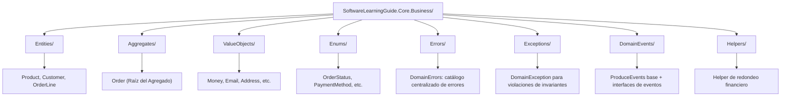

# Domain-Driven Design (DDD) en SoftwareLearningGuide

Este documento explica los conceptos fundamentales de **Domain-Driven Design** y cómo se implementan en el proyecto `SoftwareLearningGuide.Core.Business`.


### 📚 Tabla de Contenidos

1. [¿Qué es Domain-Driven Design?](#qué-es-domain-driven-design)
2. [Estructura del Proyecto](#estructura-del-proyecto)
3. [Value Objects](#value-objects)
4. [Entidades](#entidades)
5. [Agregados](#agregados)
6. [Comparativas y Diferencias](#comparativas-y-diferencias)
7. [Ejemplos del Proyecto](#ejemplos-del-proyecto)

---

## Estructura del Proyecto



---

## ¿Qué es Domain-Driven Design?

**Domain-Driven Design (DDD)** es un enfoque arquitectónico que centra el desarrollo de software en el dominio del negocio. El objetivo es crear un modelo de software que refleje fielmente las reglas y procesos del negocio.

### Principios Clave de DDD:

- ✅ **Ubiquitous Language** - Usar el lenguaje del negocio en el código
- ✅ **Bounded Contexts** - División clara del dominio en contextos
- ✅ **Modeling** - Crear modelos que representen la realidad del negocio
- ✅ **Isolation** - Aislar las reglas de negocio de la infraestructura

> **¿Por qué los constructores en DDD son privados (`private`)?**
>
> 1. **Protección de Invariantes del Dominio:** En DDD, un objeto de dominio (Entidad, Agregado o Value Object) jamás debe existir en un estado inconsistente o inválido. Si el constructor fuera `public`, cualquier parte del código podría instanciar el objeto usando `new MyEntity(...)` omitiendo las validaciones del negocio.
> 2. **Encapsulación y Métodos de Fábrica (`Create`):** Al hacer el constructor `private`, todas las instanciaciones se canalizan obligatoriamente a través de métodos estáticos de fábrica (como `Result<Money>.Create(...)` o `Result<Order>.Create(...)`). Estos métodos validan las reglas e invariantes del negocio y retornan un `Result<T>`, impidiendo la creación del objeto si alguna validación falla.
> 3. **Compatibilidad con ORMs (EF Core):** EF Core requiere un constructor sin parámetros para reconstruir entidades desde la base de datos mediante reflexión. Este constructor también se declara `private` (o `protected`), manteniendo la encapsulación intacta para el resto de la aplicación.
---

## Value Objects

### ¿Qué es un Value Object?

Un **Value Object** es un objeto que representa un concepto del dominio que **no tiene identidad única**, sino que se define por sus **atributos o valores**. Su igualdad se determina por el contenido, no por la referencia.

### Características:

| Característica | Descripción |
|---|---|
| **Inmutabilidad** | No pueden cambiar después de su creación |
| **Sin Identidad** | Se comparan por valor, no por ID |
| **Validación** | Garantizan invariantes del dominio |
| **Reutilizable** | Se pueden usar en múltiples entidades |

### Ejemplo Real - Money

Antes de mostrar el código, conviene entender por qué existe `Money`: encapsula dos cosas que juntas tienen significado — el monto y la moneda. Sin él, podrías tener un `decimal 100` que podría ser dólares, euros o pesos, y el compilador no te detendría. `Money` garantiza que siempre sepas qué moneda estás manejando y que las operaciones como sumar o comparar validen que las monedas coincidan. Esto previene errores clásicos como sumar 100 USD + 50 EUR = 150 "algo", que en un sistema de e-commerce sería un bug catastrófico.

> **Archivo productivo:** [`SoftwareLearningGuide.Core.Business/ValueObjects/Money.cs`](SoftwareLearningGuide.Core.Business/ValueObjects/Money.cs)

```csharp
using SoftwareLearningGuide.Core.Business.Errors;
using SoftwareLearningGuide.Core.Business.Exceptions;

namespace SoftwareLearningGuide.Core.Business.ValueObjects;

/// <summary>
/// Value Object que representa una cantidad de dinero con moneda.
/// Garantiza que nunca se realicen operaciones con monedas incompatibles.
/// Inmutable por diseño (record).
/// </summary>
public record Money {
    private const decimal MinAmount = 0;

    public decimal Amount { get; }
    public string Currency { get; }

    public Money(decimal amount, string currency) {
        if (amount < MinAmount)
            throw new ArgumentException(DomainErrors.MoneyErrors.AmountCannotBeNegative(amount));

        if (string.IsNullOrWhiteSpace(currency))
            throw new ArgumentException(DomainErrors.MoneyErrors.CurrencyCannotBeEmpty());

        if (currency.Length != 3)
            throw new ArgumentException(DomainErrors.MoneyErrors.CurrencyMustBeThreeCharacters());

        Amount = amount;
        Currency = currency.ToUpperInvariant();
    }

    /// <summary>
    /// Crea una instancia de Money con validación.
    /// </summary>
    public static Result<Money> Create(decimal amount, string currency) {
        try {
            return Result<Money>.Success(new Money(amount, currency));
        }
        catch (ArgumentException ex) {
            return Result<Money>.Failure(ex.Message);
        }
    }

    /// <summary>
    /// Crea una instancia de Money con valor cero en USD.
    /// </summary>
    public static Money Zero(string currency = "USD") => new(0, currency);

    /// <summary>
    /// Crea una instancia de Money con valor cero en la moneda especificada.
    /// </summary>
    public static Result<Money> ZeroIn(string currency) {
        try {
            return Result<Money>.Success(new(0, currency));
        }
        catch (ArgumentException ex) {
            return Result<Money>.Failure(ex.Message);
        }
    }

    /// <summary>
    /// Suma dos monedas. Devuelve Failure si las monedas son diferentes.
    /// </summary>
    public Result<Money> Add(Money other) {
        if (other == null)
            return Result<Money>.Failure(DomainErrors.MoneyErrors.OtherMoneyCannotBeNull());

        if (Currency != other.Currency)
            return Result<Money>.Failure(
                DomainErrors.MoneyErrors.CannotAddDifferentCurrencies(Currency, other.Currency));

        return Result<Money>.Success(new Money(Amount + other.Amount, Currency));
    }

    /// <summary>
    /// Resta dos monedas. Devuelve Failure si las monedas son diferentes o el resultado es negativo.
    /// </summary>
    public Result<Money> Subtract(Money other) {
        if (other == null)
            return Result<Money>.Failure(DomainErrors.MoneyErrors.OtherMoneyCannotBeNull());

        if (Currency != other.Currency)
            return Result<Money>.Failure(
                DomainErrors.MoneyErrors.CannotSubtractDifferentCurrencies(Currency, other.Currency));

        var result = Amount - other.Amount;
        if (result < MinAmount)
            return Result<Money>.Failure(
                DomainErrors.MoneyErrors.SubtractionResultCannotBeNegative(result));

        return Result<Money>.Success(new Money(result, Currency));
    }

    /// <summary>
    /// Multiplica la cantidad de dinero por un factor.
    /// </summary>
    public Result<Money> Multiply(decimal factor) {
        if (factor < 0)
            return Result<Money>.Failure(DomainErrors.MoneyErrors.MultiplyFactorCannotBeNegative(factor));

        return Result<Money>.Success(new Money(Amount * factor, Currency));
    }

    /// <summary>
    /// Divide la cantidad de dinero por un divisor.
    /// </summary>
    public Result<Money> Divide(decimal divisor) {
        if (divisor == 0)
            return Result<Money>.Failure(DomainErrors.MoneyErrors.CannotDivideByZero());

        if (divisor < 0)
            return Result<Money>.Failure(DomainErrors.MoneyErrors.DivisorCannotBeNegative(divisor));

        return Result<Money>.Success(new Money(Amount / divisor, Currency));
    }

    /// <summary>
    /// Compara si dos monedas son iguales (mismo monto y moneda).
    /// </summary>
    public bool IsEqual(Money other) {
        if (other == null)
            return false;

        return Amount == other.Amount && Currency == other.Currency;
    }

    /// <summary>
    /// Compara si este monto es mayor que otro. Devuelve Failure si las monedas son diferentes.
    /// </summary>
    public Result<bool> IsGreaterThan(Money other) {
        if (other == null)
            return Result<bool>.Failure(DomainErrors.MoneyErrors.OtherMoneyCannotBeNull());

        if (Currency != other.Currency)
            return Result<bool>.Failure(
                DomainErrors.MoneyErrors.CannotCompareDifferentCurrencies(Currency, other.Currency));

        return Result<bool>.Success(Amount > other.Amount);
    }

    /// <summary>
    /// Compara si este monto es menor que otro. Devuelve Failure si las monedas son diferentes.
    /// </summary>
    public Result<bool> IsLessThan(Money other) {
        if (other == null)
            return Result<bool>.Failure(DomainErrors.MoneyErrors.OtherMoneyCannotBeNull());

        if (Currency != other.Currency)
            return Result<bool>.Failure(
                DomainErrors.MoneyErrors.CannotCompareDifferentCurrencies(Currency, other.Currency));

        return Result<bool>.Success(Amount < other.Amount);
    }

    /// <summary>
    /// Compara si este monto es mayor o igual a otro.
    /// </summary>
    public Result<bool> IsGreaterThanOrEqual(Money other) {
        if (other == null)
            return Result<bool>.Failure(DomainErrors.MoneyErrors.OtherMoneyCannotBeNull());

        if (Currency != other.Currency)
            return Result<bool>.Failure(
                DomainErrors.MoneyErrors.CannotCompareDifferentCurrencies(Currency, other.Currency));

        return Result<bool>.Success(Amount >= other.Amount);
    }

    public override string ToString() => $"{Amount:F2} {Currency}";
}
```

**¿Por qué es importante Money?** Money encapsula dos cosas que juntas tienen significado: el monto y la moneda. Sin Money, podrías tener un `decimal 100` que podría ser dólares, euros o pesos. Con Money, siempre sabes qué moneda estás manejando, y las operaciones como sumar o comparar validan que las monedas coincidan. Esto previene errores clásicos como sumar 100 USD + 50 EUR = 150 "algo", que en un sistema de e-commerce sería un bug catastrófico.

### Igualdad en Value Objects

```csharp
// Con records, la igualdad se basa en los valores automáticamente
var money1 = Money.Create(100, "USD").Value!;
var money2 = Money.Create(100, "USD").Value!;

money1 == money2; // true - Son iguales por valor
money1.Equals(money2); // true
```

### Otros Value Objects en el Proyecto

#### **Email**

Antes de ver el código, es importante entender por qué `Email` es un Value Object y no un simple `string`: un email mal formateado puede causar desde errores de envío hasta problemas de seguridad (inyección de datos). `Email` garantiza que siempre tengas un correo válido antes de que se guarde en la base de datos. Además, normaliza el formato (trim, lowercase) para que `"User@Email.COM"` y `"user@email.com"` se traten como el mismo email.

> **Archivo productivo:** [`SoftwareLearningGuide.Core.Business/ValueObjects/Email.cs`](SoftwareLearningGuide.Core.Business/ValueObjects/Email.cs)

```csharp
namespace SoftwareLearningGuide.Core.Business.ValueObjects;

using SoftwareLearningGuide.Core.Business.Errors;
using SoftwareLearningGuide.Core.Business.Exceptions;
using System.Text.RegularExpressions;

/// <summary>
/// Value Object que representa un correo electrónico.
/// Valida el formato del email según especificación RFC 5322 simplificada.
/// Inmutable por diseño (record).
/// </summary>
public record Email {
    private const int MaxLength = 254;

    private static readonly Regex EmailRegex = new(
        @"^[a-zA-Z0-9._%+-]+@[a-zA-Z0-9.-]+\.[a-zA-Z]{2,}$",
        RegexOptions.Compiled | RegexOptions.IgnoreCase);

    public string Value { get; }

    public Email(string value) {
        if (string.IsNullOrWhiteSpace(value))
            throw new ArgumentException(DomainErrors.EmailErrors.CannotBeEmpty());

        var trimmedEmail = value.Trim().ToLowerInvariant();

        if (trimmedEmail.Length > MaxLength)
            throw new ArgumentException(DomainErrors.EmailErrors.CannotExceedMaxLength(MaxLength));

        if (!EmailRegex.IsMatch(trimmedEmail))
            throw new ArgumentException(DomainErrors.EmailErrors.InvalidFormat(value));

        Value = trimmedEmail;
    }

    /// <summary>
    /// Crea una instancia de Email con validación.
    /// </summary>
    public static Result<Email> Create(string value) {
        try {
            return Result<Email>.Success(new Email(value));
        }
        catch (ArgumentException ex) {
            return Result<Email>.Failure(ex.Message);
        }
    }

    public override string ToString() => Value;
}
```

#### **Address**

Una dirección de envío no es solo un string: tiene componentes estructurados (calle, ciudad, estado, código postal, país) que deben validarse individualmente. Sin `Address`, podrías guardar `"Calle 123, Madrid, Madrid, 28001, España"` como un solo string, pero luego no podrías buscar por ciudad o país. `Address` garantiza que cada componente sea válido y esté presente.

> **Archivo productivo:** [`SoftwareLearningGuide.Core.Business/ValueObjects/Address.cs`](SoftwareLearningGuide.Core.Business/ValueObjects/Address.cs)

```csharp
using SoftwareLearningGuide.Core.Business.Errors;
using SoftwareLearningGuide.Core.Business.Exceptions;

namespace SoftwareLearningGuide.Core.Business.ValueObjects;

/// <summary>
/// Value Object que representa una dirección de envío.
/// Garantiza que todos los campos requeridos estén presentes y sean válidos.
/// Inmutable por diseño (record).
/// </summary>
public record Address {
    public string Street { get; }
    public string City { get; }
    public string State { get; }
    public string PostalCode { get; }
    public string Country { get; }

    public Address(string street, string city, string state, string postalCode, string country) {
        if (string.IsNullOrWhiteSpace(street))
            throw new ArgumentException(DomainErrors.AddressErrors.StreetCannotBeEmpty());

        if (string.IsNullOrWhiteSpace(city))
            throw new ArgumentException(DomainErrors.AddressErrors.CityCannotBeEmpty());

        if (string.IsNullOrWhiteSpace(state))
            throw new ArgumentException(DomainErrors.AddressErrors.StateCannotBeEmpty());

        if (string.IsNullOrWhiteSpace(postalCode))
            throw new ArgumentException(DomainErrors.AddressErrors.PostalCodeCannotBeEmpty());

        if (string.IsNullOrWhiteSpace(country))
            throw new ArgumentException(DomainErrors.AddressErrors.CountryCannotBeEmpty());

        Street = street.Trim();
        City = city.Trim();
        State = state.Trim();
        PostalCode = postalCode.Trim();
        Country = country.Trim();
    }

    /// <summary>
    /// Crea una instancia de Address con validación.
    /// </summary>
    public static Result<Address> Create(string street, string city, string state, string postalCode, string country) {
        try {
            return Result<Address>.Success(new Address(street, city, state, postalCode, country));
        }
        catch (ArgumentException ex) {
            return Result<Address>.Failure(ex.Message);
        }
    }

    public override string ToString() =>
        $"{Street}, {City}, {State} {PostalCode}, {Country}";
}
```

**¿Por qué es importante Address?** Una dirección de envío no es solo un string: tiene componentes estructurados (calle, ciudad, estado, código postal, país) que deben validarse individualmente. Sin Address, podrías guardar `"Calle 123, Madrid, Madrid, 28001, España"` como un solo string, pero luego no podrías buscar por ciudad o país. Address garantiza que cada componente sea válido y esté presente.

#### **StronglyTypedIds**

Sin estos IDs, podrías escribir `AddProduct(orderId, productId)` y el compilador no te detendría si intercambias los argumentos: `AddProduct(productId, orderId)` — ambos son `Guid`. Con StronglyTypedIds, el código ni compila si intentas pasar un `OrderId` donde se espera un `ProductId`. Es un error de compilación en lugar de un error en producción.

El proyecto define estos IDs como Value Objects directamente en el directorio `ValueObjects/`:

> **Archivo productivo:** [`SoftwareLearningGuide.Core.Business/ValueObjects/OrderId.cs`](SoftwareLearningGuide.Core.Business/ValueObjects/OrderId.cs)

```csharp
namespace SoftwareLearningGuide.Core.Business.ValueObjects;

using SoftwareLearningGuide.Core.Business.Errors;
using SoftwareLearningGuide.Core.Business.Exceptions;

/// <summary>
/// Value Object que representa un ID de Pedido.
/// Proporciona type-safety evitando que se mezclen IDs de diferentes dominios.
/// </summary>
public record OrderId {
    public Guid Value { get; }

    public OrderId(Guid value) {
        if (value == Guid.Empty)
            throw new ArgumentException(DomainErrors.IdErrors.OrderIdCannotBeEmpty());

        Value = value;
    }

    public static OrderId Create() => new(Guid.NewGuid());

    public static Result<OrderId> From(Guid value) {
        try {
            return Result<OrderId>.Success(new OrderId(value));
        }
        catch (ArgumentException ex) {
            return Result<OrderId>.Failure(ex.Message);
        }
    }

    public override string ToString() => Value.ToString();
}

/// <summary>
/// Value Object que representa un ID de Producto.
/// </summary>
public record ProductId {
    public Guid Value { get; }

    public ProductId(Guid value) {
        if (value == Guid.Empty)
            throw new ArgumentException(DomainErrors.IdErrors.ProductIdCannotBeEmpty());

        Value = value;
    }

    public static ProductId Create() => new(Guid.NewGuid());

    public static Result<ProductId> From(Guid value) {
        try {
            return Result<ProductId>.Success(new ProductId(value));
        }
        catch (ArgumentException ex) {
            return Result<ProductId>.Failure(ex.Message);
        }
    }

    public override string ToString() => Value.ToString();
}

/// <summary>
/// Value Object que representa un ID de Cliente.
/// </summary>
public record CustomerId {
    public Guid Value { get; }

    public CustomerId(Guid value) {
        if (value == Guid.Empty)
            throw new ArgumentException(DomainErrors.IdErrors.CustomerIdCannotBeEmpty());

        Value = value;
    }

    public static CustomerId Create() => new(Guid.NewGuid());

    public static Result<CustomerId> From(Guid value) {
        try {
            return Result<CustomerId>.Success(new CustomerId(value));
        }
        catch (ArgumentException ex) {
            return Result<CustomerId>.Failure(ex.Message);
        }
    }

    public override string ToString() => Value.ToString();
}

/// <summary>
/// Value Object que representa un ID de Línea de Pedido.
/// </summary>
public record OrderLineId {
    public Guid Value { get; }

    public OrderLineId(Guid value) {
        if (value == Guid.Empty)
            throw new ArgumentException(DomainErrors.IdErrors.OrderLineIdCannotBeEmpty());

        Value = value;
    }

    public static OrderLineId Create() => new(Guid.NewGuid());

    public static Result<OrderLineId> From(Guid value) {
        try {
            return Result<OrderLineId>.Success(new OrderLineId(value));
        }
        catch (ArgumentException ex) {
            return Result<OrderLineId>.Failure(ex.Message);
        }
    }

    public override string ToString() => Value.ToString();
}
```

**¿Por qué son importantes los StronglyTypedIds?** Sin estos IDs, podrías escribir `AddProduct(orderId, productId)` y el compilador no te detendría si intercambias los argumentos: `AddProduct(productId, orderId)` — ambos son `Guid`. Con StronglyTypedIds, el código ni compila si intentas pasar un `OrderId` donde se espera un `ProductId`. Es un error de compilación en lugar de un error en producción.

---

## Entidades

Los Value Objects son inmutables y se comparan por valor. Pero hay cosas en el negocio que necesitan identidad y pueden cambiar: un producto puede cambiar de precio, un cliente puede cambiar de dirección. Para eso existen las Entidades.

### ¿Qué es una Entidad?

Una **Entidad** es un objeto que tiene una **identidad única y persistente** que lo distingue de otros objetos. Aunque sus atributos cambien, la entidad sigue siendo la misma mientras tenga el mismo ID.

### Características:

| Característica | Descripción |
|---|---|
| **Identidad Única** | Tiene un ID (generalmente un GUID o similar) |
| **Mutabilidad** | Sus atributos pueden cambiar |
| **Igualdad por ID** | Dos entidades son iguales si tienen el mismo ID |
| **Ciclo de Vida** | Nace, vive, se modifica y muere |
| **Persistencia** | Generalmente se persisten en la base de datos |

### Ejemplo Real - Product

> **Archivo productivo:** [`SoftwareLearningGuide.Core.Business/Entities/Product.cs`](SoftwareLearningGuide.Core.Business/Entities/Product.cs)

```csharp
namespace SoftwareLearningGuide.Core.Business.Entities;

using SoftwareLearningGuide.Core.Business.DomainEvents;
using SoftwareLearningGuide.Core.Business.Errors;
using SoftwareLearningGuide.Core.Business.Exceptions;
using SoftwareLearningGuide.Core.Business.ValueObjects;

/// <summary>
/// Entidad que representa un Producto en el dominio de e-commerce.
/// Tiene identidad única y puede cambiar a lo largo del tiempo.
/// Los atributos cambian pero mantienen el ID como identificador.
/// </summary>
public class Product : ProduceEvents {
    public ProductId Id { get; }
    public string Name { get; private set; }
    public string Description { get; private set; }
    public Money Price { get; private set; }
    public int StockQuantity { get; private set; }
    public DateTime CreatedAt { get; }
    public DateTime? UpdatedAt { get; private set; }

    private Product() { }

    public Product(ProductId id, string name, string description, Money price, int stockQuantity) {
        if (id == null)
            throw new ArgumentNullException(nameof(id));

        if (string.IsNullOrWhiteSpace(name))
            throw new ArgumentException(DomainErrors.Product.NameCannotBeEmpty(id.Value));

        if (string.IsNullOrWhiteSpace(description))
            throw new ArgumentException(DomainErrors.Product.DescriptionCannotBeEmpty(id.Value));

        if (price == null)
            throw new ArgumentNullException(nameof(price));

        if (price.Amount <= 0)
            throw new ArgumentException(DomainErrors.Product.PriceMustBeGreaterThanZero(id.Value));

        if (stockQuantity < 0)
            throw new ArgumentException(DomainErrors.Product.StockCannotBeNegative(id.Value));

        Id = id;
        Name = name.Trim();
        Description = description.Trim();
        Price = price;
        StockQuantity = stockQuantity;
        CreatedAt = DateTime.UtcNow;

        AddDomainEvent(new ProductCreatedDomainEvent {
            ProductId = id.Value,
            Name = name.Trim(),
            Price = price.Amount,
            Currency = price.Currency
        });
    }

    /// <summary>
    /// Crea una instancia de Product con validación.
    /// </summary>
    public static Result<Product> Create(ProductId id, string name, string description, Money price, int stockQuantity) {
        try {
            return Result<Product>.Success(new Product(id, name, description, price, stockQuantity));
        }
        catch (Exception ex) {
            return Result<Product>.Failure(ex.Message);
        }
    }

    /// <summary>
    /// Actualiza el nombre del producto.
    /// </summary>
    public Result UpdateName(string newName) {
        if (string.IsNullOrWhiteSpace(newName))
            return Result.Failure(DomainErrors.Product.NameCannotBeEmpty(Id.Value));

        Name = newName.Trim();
        UpdatedAt = DateTime.UtcNow;
        return Result.Success();
    }

    /// <summary>
    /// Actualiza la descripción del producto.
    /// </summary>
    public Result UpdateDescription(string newDescription) {
        if (string.IsNullOrWhiteSpace(newDescription))
            return Result.Failure(DomainErrors.Product.DescriptionCannotBeEmpty(Id.Value));

        Description = newDescription.Trim();
        UpdatedAt = DateTime.UtcNow;
        return Result.Success();
    }

    /// <summary>
    /// Actualiza el precio del producto.
    /// </summary>
    public Result UpdatePrice(Money newPrice) {
        if (newPrice == null)
            return Result.Failure(DomainErrors.Product.PriceCannotBeNull());

        if (newPrice.Amount <= 0)
            return Result.Failure(DomainErrors.Product.PriceMustBeGreaterThanZero(Id.Value));

        Price = newPrice;
        UpdatedAt = DateTime.UtcNow;
        return Result.Success();
    }

    /// <summary>
    /// Añade stock al producto.
    /// </summary>
    public Result AddStock(int quantity) {
        if (quantity <= 0)
            return Result.Failure(DomainErrors.Product.QuantityToAddMustBeGreaterThanZero(Id.Value));

        StockQuantity += quantity;
        UpdatedAt = DateTime.UtcNow;
        return Result.Success();
    }

    /// <summary>
    /// Reduce stock del producto. Devuelve Failure si no hay suficiente stock.
    /// Cuando el stock baja de 10, dispara un ProductStockLowDomainEvent.
    /// </summary>
    public Result RemoveStock(int quantity) {
        if (quantity <= 0)
            return Result.Failure(DomainErrors.Product.QuantityToRemoveMustBeGreaterThanZero(Id.Value));

        if (StockQuantity < quantity)
            return Result.Failure(
                DomainErrors.Product.InsufficientStock(Id.Value, StockQuantity, quantity));

        StockQuantity -= quantity;
        UpdatedAt = DateTime.UtcNow;

        if (StockQuantity <= 10) {
            AddDomainEvent(new ProductStockLowDomainEvent {
                ProductId = Id.Value,
                CurrentStock = StockQuantity
            });
        }

        return Result.Success();
    }

    /// <summary>
    /// Verifica si hay stock disponible (más de 0 unidades).
    /// </summary>
    public bool IsInStock() => StockQuantity > 0;

    /// <summary>
    /// Verifica si hay suficiente stock disponible.
    /// </summary>
    public bool HasSufficientStock(int quantity) => StockQuantity >= quantity;

    /// <summary>
    /// Verifica si el producto puede ser comprado en la cantidad indicada.
    /// Valida stock y precio usando Money.IsGreaterThan.
    /// </summary>
    public Result<bool> CanBePurchased(int quantity) {
        if (quantity <= 0)
            return Result<bool>.Failure(DomainErrors.Product.QuantityMustBeGreaterThanZero(Id.Value));

        if (!HasSufficientStock(quantity))
            return Result<bool>.Success(false);

        var minimumPrice = Money.Create(0, Price.Currency);
        if (!minimumPrice.IsSuccess)
            return Result<bool>.Failure(DomainErrors.Product.PriceValidationFailed(Id.Value));

        var hasValidPrice = Price.IsGreaterThan(minimumPrice.Value!);
        if (!hasValidPrice.IsSuccess)
            return Result<bool>.Failure(hasValidPrice.Error ?? DomainErrors.Product.PriceValidationFailed(Id.Value));

        return Result<bool>.Success(hasValidPrice.Value!);
    }

    /// <summary>
    /// Calcula el subtotal para una cantidad específica del producto.
    /// </summary>
    public Result<Money> CalculateSubtotal(int quantity) {
        if (quantity <= 0)
            return Result<Money>.Failure(DomainErrors.Product.QuantityMustBeGreaterThanZero(Id.Value));

        return Price.Multiply(quantity);
    }

    public override bool Equals(object? obj) {
        if (obj is not Product other)
            return false;

        return Id.Equals(other.Id);
    }

    public override int GetHashCode() => Id.GetHashCode();
}
```

**Puntos clave de esta implementación:**

- `Product : ProduceEvents` le permite disparar `ProductCreatedDomainEvent` y `ProductStockLowDomainEvent`
- Los errores usan `DomainErrors.Product.*` (catálogo centralizado) en lugar de strings inline
- El constructor valida invariantes y lanza `ArgumentException` si fallan
- Los métodos de negocio devuelven `Result` sin excepciones
- `AddDomainEvent()` se llama en el constructor y en `RemoveStock()` (cuando el stock baja de 10)
- Hay un constructor privado `private Product() { }` requerido por EF Core
- `Create()` es un factory method estático que envuelve el constructor en un `Result`

**¿Por qué Product hereda de ProduceEvents?** Porque cuando se crea un producto nuevo, queremos notificar a otros sistemas (inventario, marketing, etc.). ProduceEvents le da esa capacidad sin acoplarlo a la infraestructura de mensajería. El producto no sabe quién escucha sus eventos; solo los dispara y se desocupa. Esto es el Principio de Abierto/Cerrado: abierto para extensión (nuevos suscriptores), cerrado para modificación (el producto no cambia).

### Ejemplo Real - Customer

Al igual que `Product`, `Customer` hereda de `ProduceEvents` para poder disparar domain events — en este caso, `CustomerCreatedDomainEvent` cuando se registra un nuevo cliente. También usa `DomainErrors.Customer.*` para errores estandarizados y expone métodos de negocio como `UpdateLastName`, `UpdateEmail`, `ClearDefaultShippingAddress` y utilidades como `HasCompleteProfile`.

> **Archivo productivo:** [`SoftwareLearningGuide.Core.Business/Entities/Customer.cs`](SoftwareLearningGuide.Core.Business/Entities/Customer.cs)

```csharp
namespace SoftwareLearningGuide.Core.Business.Entities;

using SoftwareLearningGuide.Core.Business.DomainEvents;
using SoftwareLearningGuide.Core.Business.Errors;
using SoftwareLearningGuide.Core.Business.Exceptions;
using SoftwareLearningGuide.Core.Business.ValueObjects;

/// <summary>
/// Entidad que representa un Cliente en el dominio de e-commerce.
/// Tiene identidad única y agrupa información personal del cliente.
/// </summary>
public class Customer : ProduceEvents {
    public CustomerId Id { get; }
    public string FirstName { get; private set; }
    public string LastName { get; private set; }
    public Email Email { get; private set; }
    public Address? DefaultShippingAddress { get; private set; }
    public DateTime CreatedAt { get; }
    public DateTime? UpdatedAt { get; private set; }

    private Customer() { }

    public Customer(CustomerId id, string firstName, string lastName, Email email) {
        if (id == null)
            throw new ArgumentNullException(nameof(id));

        if (string.IsNullOrWhiteSpace(firstName))
            throw new ArgumentException(DomainErrors.Customer.FirstNameCannotBeEmpty(id.Value));

        if (string.IsNullOrWhiteSpace(lastName))
            throw new ArgumentException(DomainErrors.Customer.LastNameCannotBeEmpty(id.Value));

        if (email == null)
            throw new ArgumentNullException(nameof(email));

        Id = id;
        FirstName = firstName.Trim();
        LastName = lastName.Trim();
        Email = email;
        CreatedAt = DateTime.UtcNow;

        AddDomainEvent(new CustomerCreatedDomainEvent {
            CustomerId = id.Value,
            Email = email.Value,
            Name = $"{firstName.Trim()} {lastName.Trim()}"
        });
    }

    /// <summary>
    /// Crea una instancia de Customer con validación.
    /// </summary>
    public static Result<Customer> Create(CustomerId id, string firstName, string lastName, Email email) {
        try {
            return Result<Customer>.Success(new Customer(id, firstName, lastName, email));
        }
        catch (Exception ex) {
            return Result<Customer>.Failure(ex.Message);
        }
    }

    /// <summary>
    /// Obtiene el nombre completo del cliente.
    /// </summary>
    public string GetFullName() => $"{FirstName} {LastName}";

    /// <summary>
    /// Actualiza el nombre del cliente.
    /// </summary>
    public Result UpdateFirstName(string newFirstName) {
        if (string.IsNullOrWhiteSpace(newFirstName))
            return Result.Failure(DomainErrors.Customer.FirstNameCannotBeEmpty(Id.Value));

        FirstName = newFirstName.Trim();
        UpdatedAt = DateTime.UtcNow;
        return Result.Success();
    }

    /// <summary>
    /// Actualiza el apellido del cliente.
    /// </summary>
    public Result UpdateLastName(string newLastName) {
        if (string.IsNullOrWhiteSpace(newLastName))
            return Result.Failure(DomainErrors.Customer.LastNameCannotBeEmpty(Id.Value));

        LastName = newLastName.Trim();
        UpdatedAt = DateTime.UtcNow;
        return Result.Success();
    }

    /// <summary>
    /// Actualiza el correo del cliente.
    /// </summary>
    public Result UpdateEmail(Email newEmail) {
        if (newEmail == null)
            return Result.Failure(DomainErrors.Customer.EmailCannotBeNull());

        Email = newEmail;
        UpdatedAt = DateTime.UtcNow;
        return Result.Success();
    }

    /// <summary>
    /// Establece la dirección predeterminada de envío para el cliente.
    /// </summary>
    public Result SetDefaultShippingAddress(Address address) {
        if (address == null)
            return Result.Failure(DomainErrors.Customer.ShippingAddressCannotBeNull());

        DefaultShippingAddress = address;
        UpdatedAt = DateTime.UtcNow;
        return Result.Success();
    }

    /// <summary>
    /// Limpia la dirección predeterminada de envío.
    /// </summary>
    public Result ClearDefaultShippingAddress() {
        DefaultShippingAddress = null;
        UpdatedAt = DateTime.UtcNow;
        return Result.Success();
    }

    /// <summary>
    /// Verifica si el cliente tiene una dirección de envío preestablecida.
    /// </summary>
    public bool HasDefaultShippingAddress() => DefaultShippingAddress != null;

    /// <summary>
    /// Verifica si el cliente tiene un perfil completo (nombre, apellido y email).
    /// </summary>
    public bool HasCompleteProfile() {
        return !string.IsNullOrWhiteSpace(FirstName)
            && !string.IsNullOrWhiteSpace(LastName)
            && Email != null;
    }

    public override bool Equals(object? obj) {
        if (obj is not Customer other)
            return false;

        return Id.Equals(other.Id);
    }

    public override int GetHashCode() => Id.GetHashCode();
}
```

---

## Agregados

Las entidades individuales son útiles, pero a menudo necesitas agrupar varias entidades que deben mantenerse consistentes juntas. Un pedido no es solo una `Order`: tiene `OrderLines`, referencia a un `Customer`, etc. El Agregado es el mecanismo de DDD para agrupar estas entidades y garantizar que se modifiquen atómicamente.

### ¿Qué es un Agregado?

Un **Agregado** es un grupo de entidades y value objects que se tratan como una unidad atómica de cambio. Tiene una **Raíz del Agregado** (la entidad principal) que controla el acceso a todos los demás objetos dentro del agregado.

### Características:

| Característica | Descripción |
|---|---|
| **Raíz del Agregado** | Entidad principal que expone la interfaz pública |
| **Cohesión** | Objetos relacionados que se cargan juntos |
| **Consistencia** | Si uno cambia de manera inválida, todo el agregado es inválido |
| **Transaccionalidad** | Se persisten como una unidad atómica |
| **Encapsulamiento** | Solo la raíz es accesible desde afuera |

### Ejemplo Real - Order Aggregate

El agregado `Order` es la raíz que controla el acceso a sus `OrderLine`s. No puedes modificar una `OrderLine` directamente; debes hacerlo a través de `Order`. Esto garantiza que las reglas de negocio — como el máximo de 10 productos por línea — se cumplan siempre. `Order` hereda de `ProduceEvents` para disparar `OrderCreatedDomainEvent`, `OrderCancelledDomainEvent` y otros eventos cuando su estado cambia.

> **Archivo productivo:** [`SoftwareLearningGuide.Core.Business/Aggregates/Order.cs`](SoftwareLearningGuide.Core.Business/Aggregates/Order.cs)

```csharp
namespace SoftwareLearningGuide.Core.Business.Aggregates;

using SoftwareLearningGuide.Core.Business.DomainEvents;
using SoftwareLearningGuide.Core.Business.Entities;
using SoftwareLearningGuide.Core.Business.Errors;
using SoftwareLearningGuide.Core.Business.Exceptions;
using SoftwareLearningGuide.Core.Business.ValueObjects;

/// <summary>
/// Agregado Order (Raíz del Agregado).
/// Representa un pedido completo en el dominio de e-commerce.
/// Encapsula y protege todas las reglas de negocio relacionadas con los pedidos.
/// </summary>
public class Order : ProduceEvents {
    private const int MaxProductsPerLine = 10;
    private readonly List<OrderLine> _lines = new();

    public OrderId Id { get; }
    public CustomerId CustomerId { get; }
    public Address ShippingAddress { get; private set; }
    public OrderStatus Status { get; private set; }
    public IReadOnlyCollection<OrderLine> Lines => _lines.AsReadOnly();
    public DateTime CreatedAt { get; }
    public DateTime? ConfirmedAt { get; private set; }
    public DateTime? ShippedAt { get; private set; }
    public DateTime? DeliveredAt { get; private set; }
    public DateTime? CancelledAt { get; private set; }

    private Order() { }

    public Order(OrderId id, CustomerId customerId, Address shippingAddress) {
        if (id == null)
            throw new ArgumentNullException(nameof(id));
        if (customerId == null)
            throw new ArgumentNullException(nameof(customerId));
        if (shippingAddress == null)
            throw new ArgumentNullException(nameof(shippingAddress));

        Id = id;
        CustomerId = customerId;
        ShippingAddress = shippingAddress;
        Status = OrderStatus.Pending;
        CreatedAt = DateTime.UtcNow;

        var totalAmount = GetTotalAmount();
        AddDomainEvent(new OrderCreatedDomainEvent {
            OrderId = id.Value,
            CustomerId = customerId.Value,
            TotalAmount = totalAmount.IsSuccess ? totalAmount.Value!.Amount : 0m,
            Currency = totalAmount.IsSuccess ? totalAmount.Value!.Currency : "USD",
            CreatedAt = CreatedAt
        });
    }

    /// <summary>
    /// Crea una instancia de Order con validación.
    /// </summary>
    public static Result<Order> Create(OrderId id, CustomerId customerId, Address shippingAddress) {
        try {
            return Result<Order>.Success(new Order(id, customerId, shippingAddress));
        }
        catch (Exception ex) {
            return Result<Order>.Failure(ex.Message);
        }
    }

    #region Helpers de Validación

    private Result EnsurePending() {
        if (Status != OrderStatus.Pending)
            return Result.Failure(DomainErrors.Order.RequiresPendingState(Status.ToString()));
        return Result.Success();
    }

    private Result ValidateProductForOrder(Product product, int quantity) {
        if (product == null)
            return Result.Failure(DomainErrors.Order.ProductCannotBeNull());

        if (quantity <= 0)
            return Result.Failure(DomainErrors.Order.QuantityMustBeGreaterThanZero(product.Id.Value));

        if (quantity > MaxProductsPerLine)
            return Result.Failure(
                DomainErrors.Order.ExceedsMaxQuantityPerProduct(product.Id.Value, MaxProductsPerLine));

        var pendingResult = EnsurePending();
        if (!pendingResult.IsSuccess)
            return pendingResult;

        if (!product.HasSufficientStock(quantity))
            return Result.Failure(
                DomainErrors.Product.InsufficientStock(product.Name, product.StockQuantity, quantity));

        return Result.Success();
    }

    private Result ValidateQuantityWithinLimit(int quantity) {
        if (quantity > MaxProductsPerLine)
            return Result.Failure(
                DomainErrors.Order.ExceedsMaxQuantityPerProduct(MaxProductsPerLine));
        return Result.Success();
    }

    private OrderLine? FindLine(ProductId productId)
        => _lines.FirstOrDefault(l => l.ProductId.Equals(productId));

    #endregion

    #region Métodos de Consulta

    public bool IsEmpty() => _lines.Count == 0;

    public int GetLineCount() => _lines.Count;

    public int GetTotalItems() => _lines.Sum(line => line.Quantity);

    public bool HasProduct(ProductId productId) => FindLine(productId) != null;

    public int GetProductQuantity(ProductId productId) => FindLine(productId)?.Quantity ?? 0;

    public Result<Money> GetTotalAmount() {
        if (_lines.Count == 0)
            return Result<Money>.Success(Money.Zero());

        var firstLineResult = _lines.First().GetSubtotal();
        if (!firstLineResult.IsSuccess)
            return firstLineResult;

        Money totalAmount = firstLineResult.Value!;
        for (int i = 1; i < _lines.Count; i++) {
            var subtotalResult = _lines[i].GetSubtotal();
            if (!subtotalResult.IsSuccess)
                return Result<Money>.Failure(
                    DomainErrors.Order.ErrorCalculatingSubtotal(i, subtotalResult.Error!));

            var addResult = totalAmount.Add(subtotalResult.Value!);
            if (!addResult.IsSuccess)
                return addResult;

            totalAmount = addResult.Value!;
        }

        return Result<Money>.Success(totalAmount);
    }

    /// <summary>
    /// Calcula el precio promedio por línea del pedido usando Money.Divide.
    /// </summary>
    public Result<Money> GetAverageLinePrice() {
        if (_lines.Count == 0)
            return Result<Money>.Failure(DomainErrors.Order.NoLinesToCalculateAverage());

        var totalResult = GetTotalAmount();
        if (!totalResult.IsSuccess)
            return totalResult;

        return totalResult.Value!.Divide(_lines.Count);
    }

    /// <summary>
    /// Obtiene la línea con mayor precio unitario usando Money.IsGreaterThan.
    /// </summary>
    public Result<OrderLine?> GetMostExpensiveLine() {
        if (_lines.Count == 0)
            return Result<OrderLine?>.Success(null);

        OrderLine mostExpensive = _lines.First();
        foreach (var line in _lines.Skip(1)) {
            var comparison = line.UnitPrice.IsGreaterThan(mostExpensive.UnitPrice);
            if (comparison.IsSuccess && comparison.Value!)
                mostExpensive = line;
        }

        return Result<OrderLine?>.Success(mostExpensive);
    }

    /// <summary>
    /// Obtiene la línea con menor precio unitario usando Money.IsLessThan.
    /// </summary>
    public Result<OrderLine?> GetCheapestLine() {
        if (_lines.Count == 0)
            return Result<OrderLine?>.Success(null);

        OrderLine cheapest = _lines.First();
        foreach (var line in _lines.Skip(1)) {
            var comparison = line.UnitPrice.IsLessThan(cheapest.UnitPrice);
            if (comparison.IsSuccess && comparison.Value!)
                cheapest = line;
        }

        return Result<OrderLine?>.Success(cheapest);
    }

    /// <summary>
    /// Verifica si alguna línea tiene precio unitario mayor al umbral usando Money.IsGreaterThan.
    /// </summary>
    public Result<bool> HasItemsAbovePrice(Money threshold) {
        if (threshold == null)
            return Result<bool>.Failure(DomainErrors.Order.PriceThresholdCannotBeNull());

        foreach (var line in _lines) {
            var comparison = line.UnitPrice.IsGreaterThan(threshold);
            if (comparison.IsSuccess && comparison.Value!)
                return Result<bool>.Success(true);
        }

        return Result<bool>.Success(false);
    }

    /// <summary>
    /// Verifica si el total del pedido alcanza el mínimo requerido usando Money.IsGreaterThanOrEqual.
    /// Útil para reglas como "envío gratuito a partir de $X".
    /// </summary>
    public Result<bool> MeetsMinimumOrderValue(Money minimum) {
        if (minimum == null)
            return Result<bool>.Failure(DomainErrors.Order.MinimumOrderValueCannotBeNull());

        var totalResult = GetTotalAmount();
        if (!totalResult.IsSuccess)
            return Result<bool>.Failure(totalResult.Error!);

        return totalResult.Value!.IsGreaterThanOrEqual(minimum);
    }

    /// <summary>
    /// Calcula el monto a reembolsar para un producto y cantidad específicos usando Money.Multiply.
    /// </summary>
    public Result<Money> CalculateRefundForProduct(ProductId productId, int quantity) {
        if (productId == null)
            return Result<Money>.Failure(DomainErrors.Order.ProductIdCannotBeNull());

        if (quantity <= 0)
            return Result<Money>.Failure(DomainErrors.Order.RefundQuantityMustBeGreaterThanZero(productId.Value));

        var line = FindLine(productId);
        if (line == null)
            return Result<Money>.Failure(DomainErrors.Order.ProductNotFoundInOrder(productId.Value));

        if (quantity > line.Quantity)
            return Result<Money>.Failure(
                DomainErrors.Order.RefundExceedsAvailable(productId.Value, line.Quantity));

        return line.UnitPrice.Multiply(quantity);
    }

    /// <summary>
    /// Calcula la diferencia entre el total del pedido y otro monto usando Money.Subtract.
    /// Útil para comparar precios o calcular diferencias entre pedidos.
    /// </summary>
    public Result<Money> CalculateTotalDifference(Money otherTotal) {
        if (otherTotal == null)
            return Result<Money>.Failure(DomainErrors.Order.OtherTotalCannotBeNull());

        var totalResult = GetTotalAmount();
        if (!totalResult.IsSuccess)
            return totalResult;

        return totalResult.Value!.Subtract(otherTotal);
    }

    /// <summary>
    /// Verifica si dos líneas tienen el mismo precio unitario usando Money.IsEqual.
    /// </summary>
    public Result<bool> HasEqualPriceLines(ProductId productId1, ProductId productId2) {
        if (productId1 == null)
            return Result<bool>.Failure(DomainErrors.Order.ProductId1CannotBeNull());
        if (productId2 == null)
            return Result<bool>.Failure(DomainErrors.Order.ProductId2CannotBeNull());

        var line1 = FindLine(productId1);
        var line2 = FindLine(productId2);

        if (line1 == null)
            return Result<bool>.Failure(DomainErrors.Order.ProductNotFoundInOrder(productId1.Value));
        if (line2 == null)
            return Result<bool>.Failure(DomainErrors.Order.ProductNotFoundInOrder(productId2.Value));

        return line1.UnitPrice.IsEqual(line2.UnitPrice)
            ? Result<bool>.Success(true)
            : Result<bool>.Success(false);
    }

    #endregion

    #region Métodos de Comando

    /// <summary>
    /// Añade un producto al pedido o incrementa su cantidad si ya existe.
    /// </summary>
    public Result AddProduct(Product product, int quantity) {
        var validationResult = ValidateProductForOrder(product, quantity);
        if (!validationResult.IsSuccess)
            return validationResult;

        var existingLine = FindLine(product!.Id);
        if (existingLine != null) {
            var newQuantity = existingLine.Quantity + quantity;
            var limitResult = ValidateQuantityWithinLimit(newQuantity);
            if (!limitResult.IsSuccess)
                return limitResult;

            return existingLine.UpdateQuantity(newQuantity);
        }

        var lineResult = OrderLine.Create(
            OrderLineId.Create(),
            product.Id,
            product.Name,
            product.Price,
            quantity);

        if (!lineResult.IsSuccess)
            return Result.Failure(lineResult.Error!);

        _lines.Add(lineResult.Value!);
        return Result.Success();
    }

    /// <summary>
    /// Remueve un producto del pedido por su ProductId.
    /// </summary>
    public Result RemoveProduct(ProductId productId) {
        if (productId == null)
            return Result.Failure(DomainErrors.Order.ProductIdCannotBeNull());

        var pendingResult = EnsurePending();
        if (!pendingResult.IsSuccess)
            return pendingResult;

        var line = FindLine(productId);
        if (line == null)
            return Result.Failure(DomainErrors.Order.ProductNotFoundInOrder(productId.Value));

        _lines.Remove(line);
        return Result.Success();
    }

    /// <summary>
    /// Actualiza la cantidad de un producto en el pedido.
    /// Si la cantidad es 0, elimina la línea.
    /// </summary>
    public Result UpdateProductQuantity(ProductId productId, int newQuantity) {
        if (productId == null)
            return Result.Failure(DomainErrors.Order.ProductIdCannotBeNull());

        if (newQuantity < 0)
            return Result.Failure(DomainErrors.Order.QuantityCannotBeNegative(productId.Value));

        var pendingResult = EnsurePending();
        if (!pendingResult.IsSuccess)
            return pendingResult;

        var line = FindLine(productId);
        if (line == null)
            return Result.Failure(DomainErrors.Order.ProductNotFoundInOrder(productId.Value));

        if (newQuantity == 0) {
            _lines.Remove(line);
            return Result.Success();
        }

        var limitResult = ValidateQuantityWithinLimit(newQuantity);
        if (!limitResult.IsSuccess)
            return limitResult;

        return line.UpdateQuantity(newQuantity);
    }

    /// <summary>
    /// Limpia todos los productos del pedido.
    /// </summary>
    public Result Clear() {
        var pendingResult = EnsurePending();
        if (!pendingResult.IsSuccess)
            return pendingResult;

        _lines.Clear();
        return Result.Success();
    }

    /// <summary>
    /// Confirma el pedido. Valida que no esté vacío, esté en Pending y el total sea mayor a cero.
    /// </summary>
    public Result Confirm() {
        if (IsEmpty())
            return Result.Failure(DomainErrors.Order.CannotConfirmEmptyOrder());

        var pendingResult = EnsurePending();
        if (!pendingResult.IsSuccess)
            return pendingResult;

        var totalResult = GetTotalAmount();
        if (!totalResult.IsSuccess)
            return Result.Failure(totalResult.Error!);

        var zeroResult = Money.Create(0, totalResult.Value!.Currency);
        if (!zeroResult.IsSuccess)
            return Result.Failure(DomainErrors.Order.TotalAmountValidationFailed());

        var isPositive = totalResult.Value!.IsGreaterThan(zeroResult.Value!);
        if (!isPositive.IsSuccess)
            return Result.Failure(isPositive.Error ?? DomainErrors.Order.TotalAmountMustBeGreaterThanZero());

        if (!isPositive.Value!)
            return Result.Failure(DomainErrors.Order.TotalAmountMustBeGreaterThanZero());

        Status = OrderStatus.Confirmed;
        ConfirmedAt = DateTime.UtcNow;
        return Result.Success();
    }

    /// <summary>
    /// Marca el pedido como enviado.
    /// </summary>
    public Result Ship() {
        if (Status != OrderStatus.Confirmed)
            return Result.Failure(
                DomainErrors.Order.CannotShipOrderInState(Status.ToString()));

        Status = OrderStatus.Shipped;
        ShippedAt = DateTime.UtcNow;
        return Result.Success();
    }

    /// <summary>
    /// Marca el pedido como entregado.
    /// </summary>
    public Result Deliver() {
        if (Status != OrderStatus.Shipped)
            return Result.Failure(
                DomainErrors.Order.CannotDeliverOrderInState(Status.ToString()));

        Status = OrderStatus.Delivered;
        DeliveredAt = DateTime.UtcNow;
        return Result.Success();
    }

    /// <summary>
    /// Cancela el pedido. Solo puede ser cancelado si está en Pending o Confirmed.
    /// </summary>
    public Result Cancel() {
        if (Status == OrderStatus.Shipped || Status == OrderStatus.Delivered || Status == OrderStatus.Cancelled)
            return Result.Failure(
                DomainErrors.Order.CannotCancelOrderInState(Status.ToString()));

        Status = OrderStatus.Cancelled;
        CancelledAt = DateTime.UtcNow;

        AddDomainEvent(new OrderCancelledDomainEvent {
            OrderId = Id.Value,
            Reason = "Cancelled by user",
            CancelledAt = CancelledAt.Value
        });

        return Result.Success();
    }

    /// <summary>
    /// Actualiza la dirección de envío del pedido.
    /// </summary>
    public Result UpdateShippingAddress(Address newAddress) {
        if (newAddress == null)
            return Result.Failure(DomainErrors.Order.ShippingAddressCannotBeNull());

        var pendingResult = EnsurePending();
        if (!pendingResult.IsSuccess)
            return pendingResult;

        ShippingAddress = newAddress;
        return Result.Success();
    }

    #endregion

    public override bool Equals(object? obj) {
        if (obj is not Order other)
            return false;

        return Id.Equals(other.Id);
    }

    public override int GetHashCode() => Id.GetHashCode();
}
```

**Puntos clave:**

- `Order : ProduceEvents` le permite disparar `OrderCreatedDomainEvent` y `OrderCancelledDomainEvent`
- `AddDomainEvent()` se llama en el constructor y en `Cancel()`
- Los errores usan `DomainErrors.Order.*` (catálogo centralizado)
- `EnsurePending()` es un helper privado que valida el estado antes de operaciones de escritura
- `Cancel()` despatacha un domain event que el UnitOfWork después publicará via Outbox
- `AddProduct()` ahora tiene la implementación completa: valida el producto, verifica límites, y crea una nueva `OrderLine` o incrementa la cantidad de una existente
- Hay un constructor privado `private Order() { }` requerido por EF Core
- `Create()` es un factory method estático que envuelve el constructor en un `Result`
- El agregado expone muchos métodos de consulta (`GetTotalAmount`, `GetAverageLinePrice`, `GetMostExpensiveLine`, `GetCheapestLine`, `HasItemsAbovePrice`, `MeetsMinimumOrderValue`, `CalculateRefundForProduct`, `CalculateTotalDifference`, `HasEqualPriceLines`) que internamente usan los métodos de comparación de Money (`IsGreaterThan`, `IsLessThan`, `IsGreaterThanOrEqual`, `IsEqual`)

**¿Por qué Order es un Agregado y no solo una Entidad?** Order es un Agregado porque controla el acceso a sus OrderLines. No puedes modificar una OrderLine directamente; debes hacerlo a través de Order. Esto garantiza que las reglas de negocio (como "máximo 10 unidades por producto") se cumplan siempre. Si OrderLines fueran accesibles directamente, alguien podría agregar 100 unidades de un producto sin que Order lo supiera, rompiendo la consistencia del negocio.

### OrderLine - Entidad dentro del Agregado

> **Archivo productivo:** [`SoftwareLearningGuide.Core.Business/Entities/OrderLine.cs`](SoftwareLearningGuide.Core.Business/Entities/OrderLine.cs)

> **Nota:** Aunque `OrderLine` vive dentro del agregado `Order`, su archivo fuente reside en `Entities/`, no en `Aggregates/`. El agregado `Order` (en `Aggregates/`) referencia a `OrderLine` como una entidad contenida.

```csharp
namespace SoftwareLearningGuide.Core.Business.Entities;

using SoftwareLearningGuide.Core.Business.Errors;
using SoftwareLearningGuide.Core.Business.Exceptions;
using SoftwareLearningGuide.Core.Business.ValueObjects;

/// <summary>
/// Entidad que representa una línea dentro de un Pedido (Order).
/// Forma parte del agregado Order y no debe ser persistida independientemente.
/// </summary>
public class OrderLine {
    public OrderLineId Id { get; }
    public ProductId ProductId { get; }
    public string ProductName { get; }
    public Money UnitPrice { get; }
    public int Quantity { get; private set; }
    public DateTime CreatedAt { get; }

    private OrderLine() { }

    public OrderLine(OrderLineId id, ProductId productId, string productName, Money unitPrice, int quantity) {
        if (id == null)
            throw new ArgumentNullException(nameof(id));

        if (productId == null)
            throw new ArgumentNullException(nameof(productId));

        if (string.IsNullOrWhiteSpace(productName))
            throw new ArgumentException(DomainErrors.OrderLine.ProductNameCannotBeEmpty(productId.Value));

        if (unitPrice == null)
            throw new ArgumentNullException(nameof(unitPrice));

        if (unitPrice.Amount <= 0)
            throw new ArgumentException(DomainErrors.OrderLine.UnitPriceMustBeGreaterThanZero(productId.Value));

        if (quantity <= 0)
            throw new ArgumentException(DomainErrors.OrderLine.QuantityMustBeGreaterThanZero(productId.Value));

        Id = id;
        ProductId = productId;
        ProductName = productName.Trim();
        UnitPrice = unitPrice;
        Quantity = quantity;
        CreatedAt = DateTime.UtcNow;
    }

    /// <summary>
    /// Crea una instancia de OrderLine con validación.
    /// </summary>
    public static Result<OrderLine> Create(OrderLineId id, ProductId productId, string productName, Money unitPrice, int quantity) {
        try {
            return Result<OrderLine>.Success(new OrderLine(id, productId, productName, unitPrice, quantity));
        }
        catch (Exception ex) {
            return Result<OrderLine>.Failure(ex.Message);
        }
    }

    /// <summary>
    /// Calcula el subtotal de esta línea (UnitPrice * Quantity).
    /// </summary>
    public Result<Money> GetSubtotal() => UnitPrice.Multiply(Quantity);

    /// <summary>
    /// Actualiza la cantidad de la línea. Devuelve Failure si la cantidad es inválida.
    /// </summary>
    public Result UpdateQuantity(int newQuantity) {
        if (newQuantity <= 0)
            return Result.Failure(DomainErrors.OrderLine.QuantityMustBeGreaterThanZero(ProductId.Value));

        Quantity = newQuantity;
        return Result.Success();
    }

    public override bool Equals(object? obj) {
        if (obj is not OrderLine other)
            return false;

        return Id.Equals(other.Id);
    }

    public override int GetHashCode() => Id.GetHashCode();
}
```

---

## Producir Eventos de Dominio

Tanto `Product`, `Customer` como `Order` heredan de `ProduceEvents`, que es la clase base para Aggregate Roots y Entidades que soporta Domain Events. Cada evento se acumula en memoria y se despacha atómicamente antes de confirmar la transacción SQL (vía `SaveChangesInterceptor`).

> **Archivo productivo:** [`SoftwareLearningGuide.Core.Business/DomainEvents/ProduceEvents.cs`](SoftwareLearningGuide.Core.Business/DomainEvents/ProduceEvents.cs)

```csharp
namespace SoftwareLearningGuide.Core.Business.DomainEvents;

/// <summary>
/// Clase base para Aggregate Roots y Entidades que soporta Domain Events.
/// Cada evento se acumula en memoria y se despacha atómicamente
/// antes de confirmar la transacción SQL (via SaveChangesInterceptor).
/// </summary>
public abstract class ProduceEvents {
    private readonly List<IDomainEvent> _domainEvents = [];

    /// <summary>
    /// Lista de solo lectura de eventos de dominio pendientes de despacho.
    /// </summary>
    public IReadOnlyList<IDomainEvent> DomainEvents => _domainEvents.AsReadOnly();

    /// <summary>
    /// Añade un evento de dominio a la cola pendiente.
    /// </summary>
    protected void AddDomainEvent(IDomainEvent domainEvent) {
        _domainEvents.Add(domainEvent);
    }

    /// <summary>
    /// Elimina un evento específico de la cola pendiente.
    /// </summary>
    public void RemoveDomainEvent(IDomainEvent domainEvent) {
        _domainEvents.Remove(domainEvent);
    }

    /// <summary>
    /// Limpia todos los eventos de dominio pendientes.
    /// Se invoca después de que todos los eventos han sido despachados.
    /// </summary>
    public void ClearDomainEvents() {
        _domainEvents.Clear();
    }
}
```

**Puntos clave de ProduceEvents:**

- `AddDomainEvent(IDomainEvent)` — protegido, las entidades lo llaman para encolar eventos
- `RemoveDomainEvent(IDomainEvent)` — público, permite eliminar un evento específico de la cola
- `ClearDomainEvents()` — público, se invoca después de que todos los eventos han sido despachados
- `DomainEvents` expone una lista de solo lectura para que el interceptor de persistencia pueda leer los eventos pendientes
- Es `abstract`, así que solo las entidades del dominio heredan de él

---

## Comparativas y Diferencias

La clave es entender cuándo usar cada uno: **Value Objects** para conceptos sin identidad (dinero, emails, direcciones), **Entidades** para objetos con identidad que cambian (productos, clientes), y **Agregados** para grupos de entidades que deben ser consistentes (pedido con sus líneas). No son conceptos mutuamente excluyentes: un Agregado contiene Entidades, y las Entidades contienen Value Objects. Son capas de abstracción que se complementan.

### Value Objects vs Entidades

| Aspecto | Value Object | Entidad |
|--------|--------------|---------|
| **Identidad** | Sin identidad única | Identidad única (ID) |
| **Igualdad** | Por valor | Por ID |
| **Mutabilidad** | Inmutable | Mutable |
| **Ciclo de Vida** | No tiene | Nace, vive, se modifica, muere |
| **Persistencia** | Se persiste como parte de una entidad | Se persiste independientemente |
| **Ejemplo** | Money, Email, Address | Product, Customer, Order |
| **Creación** | `Money.Create(100, "USD")` | `Product.Create(...)` (factory) |
| **Validación** | En constructor | En constructor y métodos |

### Entidades vs Agregados

| Aspecto | Entidad | Agregado |
|--------|---------|----------|
| **Scope** | Un objeto individual | Grupo de objetos relacionados |
| **Raíz** | No aplica | Una entidad es la raíz |
| **Acceso** | Acceso directo | Solo a través de la raíz |
| **Consistencia** | Responsabilidad individual | Responsabilidad compartida |
| **Transacciones** | Cambios individuales | Cambios atómicos |
| **Ejemplo** | Product, Customer | Order (con OrderLines) |

### Value Objects vs Primitivos

❌ **Con primitivos:**
```csharp
public class Product
{
	public decimal Price { get; set; } // ¿En qué moneda?
	public string Name { get; set; } // ¿Validado?

	public decimal CalculateTotal(decimal quantity)
	{
		return Price * quantity; // ¿Qué si Price es negativo?
	}
}

// Problema: nada garantiza que Price sea válido
var product = new Product { Price = -100, Name = "" };
```

✅ **Con Value Objects:**
```csharp
public class Product
{
	public Money Price { get; set; } // Monto + Moneda garantizados
	public string Name { get; set; }

	public Result<Money> CalculateTotal(int quantity)
	{
		return Price.Multiply(quantity); // Retorna Result
	}
}

// El factory valida automáticamente
var priceResult = Money.Create(-100m, "USD");
// Result: Failure - El monto no puede ser negativo
```

---

## Ejemplos del Proyecto

### 1. Flujo Completo: Crear un Pedido

```csharp
// Crear agregado Order
var orderId = OrderId.Create();
var customerId = CustomerId.Create();

var addressResult = Address.Create("Calle 123", "Madrid", "Madrid", "28001", "España");
if (!addressResult.IsSuccess) return;

var orderResult = Order.Create(orderId, customerId, addressResult.Value!);
if (!orderResult.IsSuccess) return;

var order = orderResult.Value!;

// Agregar productos
var productId = ProductId.Create();

var priceResult = Money.Create(1000m, "USD");
if (!priceResult.IsSuccess) return;

var productResult = Product.Create(
	productId,
	"Laptop",
	"Laptop de alta performance",
	priceResult.Value!,
	5);
if (!productResult.IsSuccess) return;

var product = productResult.Value!;

var addResult = order.AddProduct(product, 2);
if (!addResult.IsSuccess)
{
	Console.WriteLine($"Error: {addResult.Error}");
	return;
}

// Calcular total
var totalResult = order.GetTotalAmount();
if (!totalResult.IsSuccess)
{
	Console.WriteLine($"Error al calcular total: {totalResult.Error}");
	return;
}

Console.WriteLine($"Total del pedido: {totalResult.Value}");

// Confirmar pedido
var confirmResult = order.Confirm();
if (!confirmResult.IsSuccess)
{
	Console.WriteLine($"No se puede confirmar: {confirmResult.Error}");
	return;
}

Console.WriteLine("Pedido confirmado exitosamente");
```

### 2. Protección de Invariantes

```csharp
// Intento de agregar más de 10 productos
var addResult = order.AddProduct(product, 15);
// Resultado: Failure - "No se pueden agregar más de 10 unidades del mismo producto."

// Intento de agregar cantidad negativa
var negativeResult = order.AddProduct(product, -1);
// Resultado: Failure - "La cantidad debe ser mayor a cero."

// Intento de confirmar un pedido vacío
var emptyOrder = Order.Create(OrderId.Create(), customerId, addressResult.Value!).Value!;
var confirmResult = emptyOrder.Confirm();
// Resultado: Failure - "No se puede confirmar un pedido vacío."

// Intento de confirmar un pedido ya cancelado
order.Cancel();
var confirmCancelledResult = order.Confirm();
// Resultado: Failure - "No se puede confirmar un pedido en estado Cancelled."

// Intento de cambiar dirección después de confirmar
var updateAddressResult = order.UpdateShippingAddress(newAddress);
// Resultado: Failure - "No se puede actualizar la dirección de envío en estado Confirmed."
```

### 3. Máquina de Estados

```csharp
// El agregado garantiza transiciones válidas
Console.WriteLine($"Estado inicial: {order.Status}"); // Pending

order.Confirm(); // Pending → Confirmed
Console.WriteLine($"Después de confirmar: {order.Status}"); // Confirmed

order.Ship(); // Confirmed → Shipped
Console.WriteLine($"Después de enviar: {order.Status}"); // Shipped

order.Deliver(); // Shipped → Delivered
Console.WriteLine($"Después de entregar: {order.Status}"); // Delivered

// Intento de confirmar nuevamente después de enviar
var confirmAgain = order.Confirm();
// Resultado: Failure - "No se puede confirmar un pedido en estado Shipped."

// Intento de cancelar después de entregar
var cancelResult = order.Cancel();
// Resultado: Failure - "No se puede cancelar un pedido en estado Delivered."
```

---

## Beneficios de DDD en Este Proyecto

✅ **Seguridad del Dominio** - Las reglas de negocio se garantizan en el código, no en la base de datos  
✅ **Testabilidad** - Fácil de testear sin dependencias de infraestructura  
✅ **Mantenibilidad** - El código refleja el lenguaje del negocio  
✅ **Reutilización** - Value Objects y Entidades se pueden usar en múltiples lugares  
✅ **Type-Safety** - Los IDs fuertemente tipados previenen errores  
✅ **Rendimiento** - Los agregados encapsulan conjuntos cohesivos de datos  

---

## Recursos Recomendados

- 📖 [Domain-Driven Design - Eric Evans](https://www.domainlanguage.com/ddd/)
- 📖 [Implementing Domain-Driven Design - Vaughn Vernon](https://vaughnvernon.com/)
- 🎥 [DDD en .NET - Nick Chapsas](https://www.youtube.com/c/NickChapsas)
- 🔗 [Microsoft - Domain-Driven Design in C#](https://docs.microsoft.com/en-us/dotnet/architecture/domain-driven-design/)

---

**Última actualización:** 2024  
**Proyecto:** SoftwareLearningGuide.Core.Business
