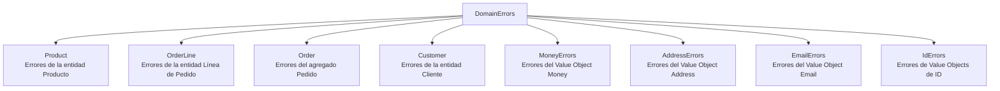

# DomainErrors - Catálogo Centralizado de Errores del Dominio

Este documento explica la clase `DomainErrors` implementada en `SoftwareLearningGuide.Core.Business.Errors` y por qué es fundamental para maintainability, debugging y una buena experiencia de usuario.


#### Tabla de Contenidos

1. [Problema: Errores Genéricos](#problema-errores-genéricos)
2. [Solución: DomainErrors](#solución-domainerrors)
3. [Estructura del Catálogo](#estructura-del-catálogo)
4. [Implementación](#implementación)
5. [Antes vs Después](#antes-vs-después)
6. [Ejemplos de Uso](#ejemplos-de-uso)
7. [Categorías de Errores](#categorías-de-errores)
8. [Mejores Prácticas](#mejores-prácticas)

---

## Problema: Errores Genéricos

Cuando los errores de validación son strings inline sin contexto, el debugging se vuelve una pesadilla:

```csharp
// ❌ Mensajes genéricos - no dicen QUÉ entidad falló ni CUÁL es el ID
if (quantity <= 0)
    return Result.Failure("La cantidad debe ser mayor a cero.");

if (price.Amount <= 0)
    return Result.Failure("El precio del producto debe ser mayor a cero.");

if (string.IsNullOrWhiteSpace(name))
    return Result.Failure("El nombre no puede estar vacío.");
```

**Ejemplo concreto:** Imagina que estás en soporte técnico y recibes este error: *"La cantidad debe ser mayor a cero"*. ¿De qué producto? ¿En qué orden? ¿Para qué cliente? Sin contexto, es imposible diagnosticar el problema rápidamente. Tendrías que revisar logs, buscar en la base de datos, y preguntar al usuario qué hizo exactamente. Con un error descriptivo, el diagnóstico se reduce a una búsqueda por ID.

### Consecuencias

| Problema | Impacto |
|----------|---------|
| No se sabe qué entidad falló | El usuario no puede identificar el problema |
| No se incluye el ID | Imposible hacer referencia al registro en soporte |
| Strings duplicados | El mismo mensaje aparece en 5+ archivos |
| Difícil de localizar | Si cambias un mensaje, debes buscar en todos lados |
| Sin catálogo centralizado | No hay una fuente de verdad para los errores |

---

## Solución: DomainErrors

`DomainErrors` es una clase estática con clases anidadas que centraliza **todos** los mensajes de error del dominio. Cada método genera un mensaje descriptivo con contexto de la entidad afectada y su ID.

**La idea es simple pero poderosa:** cada error sabe QUÉ entidad falló y CUÁL es el ID. En lugar de *"La cantidad debe ser mayor a cero"*, obtienes *"La cantidad del Producto con ID: a1b2c3d4-... debe ser mayor a cero"*. Ahora el soporte puede buscar el producto exacto en la base de datos, revisar su historial, y resolver el problema en minutos en lugar de horas.

### Archivo

```
SoftwareLearningGuide.Core.Business/
  Errors/
    DomainErrors.cs       <-- Catálogo centralizado
```

---

## Estructura del Catálogo

`DomainErrors` se organiza por categorías que reflejan las entidades y value objects del dominio:



---

## Implementación

### Definición General

`DomainErrors` es una clase estática en el namespace `SoftwareLearningGuide.Core.Business.Errors`. Su propósito es centralizar todos los mensajes de error del dominio en un único lugar, eliminando los strings hardcodeados distribuidos por toda la codebase. Cada clase anidada representa una entidad o value object, y cada método genera un mensaje con contexto suficiente para el diagnóstico.

> **Archivo fuente:** [`SoftwareLearningGuide.Core.Business/Errors/DomainErrors.cs`](SoftwareLearningGuide.Core.Business/Errors/DomainErrors.cs)

```csharp
namespace SoftwareLearningGuide.Core.Business.Errors;

/// <summary>
/// Catálogo centralizado de mensajes de error del dominio.
/// Cada método genera un mensaje descriptivo con contexto de la entidad afectada y su ID.
/// </summary>
public static class DomainErrors
{
    // Clases anidadas por categoría
    public static class Product { ... }
    public static class Order { ... }
    public static class Customer { ... }
    // etc.
}
```

### Ejemplo: Errores de Producto

Dentro de `DomainErrors.Product`, cada mensaje tiene dos variantes: una que recibe el `Guid` del producto (cuando se conoce la entidad) y otra sin parámetros (para contextos genéricos o constructores). Esto permite que cada consumidor del error elija el nivel de detalle que necesita.

> **Archivo fuente:** [`SoftwareLearningGuide.Core.Business/Errors/DomainErrors.cs`](SoftwareLearningGuide.Core.Business/Errors/DomainErrors.cs)

```csharp
public static class Product
{
    // Con ID - para cuando tenemos acceso al Producto
    public static string QuantityMustBeGreaterThanZero(Guid productId)
        => $"La cantidad del Producto con ID: {productId} debe ser mayor a cero.";

    public static string PriceMustBeGreaterThanZero(Guid productId)
        => $"El precio del Producto con ID: {productId} debe ser mayor a cero.";

    public static string InsufficientStock(Guid productId, int currentStock, int requested)
        => $"Stock insuficiente del Producto con ID: {productId}. " +
           $"Stock actual: {currentStock}, solicitado: {requested}";

    // Sin ID - para contextos genéricos o constructores
    public static string NameCannotBeEmpty()
        => "El nombre del Producto no puede estar vacío.";
}
```

### Ejemplo: Errores de Pedido

```csharp
public static class Order
{
    public static string QuantityMustBeGreaterThanZero(Guid productId)
        => $"La cantidad del Producto con ID: {productId} debe ser mayor a cero.";

    public static string ExceedsMaxQuantityPerProduct(Guid productId, int maxQuantity)
        => $"No se pueden agregar más de {maxQuantity} unidades del Producto con ID: {productId}.";

    public static string RequiresPendingState(string currentState)
        => $"La operación requiere estado Pending. Estado actual: {currentState}";

    public static string CannotCancelOrderInState(string currentState)
        => $"No se puede cancelar un Pedido en estado {currentState}.";
}
```

### Ejemplo: Errores de Money

```csharp
public static class MoneyErrors
{
    public static string AmountCannotBeNegative(decimal amount)
        => $"El monto de dinero no puede ser negativo. Monto recibido: {amount}";

    public static string CannotAddDifferentCurrencies(string currency1, string currency2)
        => $"No se pueden sumar montos con monedas diferentes: {currency1} y {currency2}";

    public static string CannotDivideByZero()
        => "No se puede dividir un monto Money por cero.";
}
```

---

## Antes vs Después

### Ejemplo 1: Cantidad inválida en OrderLine

**❌ Antes:**
```csharp
// Entities/OrderLine.cs
if (quantity <= 0)
    throw new ArgumentException("La cantidad debe ser mayor a cero.");

// Resultado para el usuario:
// "La cantidad debe ser mayor a cero."
```

**✅ Después:**
```csharp
// Entities/OrderLine.cs
using SoftwareLearningGuide.Core.Business.Errors;

if (quantity <= 0)
    throw new ArgumentException(
        DomainErrors.OrderLine.QuantityMustBeGreaterThanZero(productId.Value));

// Resultado para el usuario:
// "La cantidad del Producto con ID: a1b2c3d4-... en la línea de pedido debe ser mayor a cero."
```

**¿Ves la diferencia?** El mensaje ahora incluye el ID del producto. Cuando un usuario reporta un error, el soporte puede copiar el ID y buscar directamente en la base de datos. Esto reduce el tiempo de debugging de horas a minutos.

### Ejemplo 2: Stock insuficiente

**❌ Antes:**
```csharp
// Aggregates/Order.cs
if (!product.HasSufficientStock(quantity))
    return Result.Failure(
        $"Stock insuficiente para '{product.Name}'. " +
        $"Disponible: {product.StockQuantity}, solicitado: {quantity}");
```

**✅ Después:**
```csharp
// Aggregates/Order.cs
if (!product.HasSufficientStock(quantity))
    return Result.Failure(
        DomainErrors.Product.InsufficientStock(
            product.Name, product.StockQuantity, quantity));
```

**Beneficio:** Antes tenías un string hardcodeado en el código del agregado. Ahora el mensaje viene del catálogo centralizado. Si mañana decides cambiar el formato del mensaje (por ejemplo, agregar un enlace a la documentación), solo modificas `DomainErrors.cs` y todos los lugares que lo usan se actualizan automáticamente.

### Ejemplo 3: Estado inválido del Pedido

**❌ Antes:**
```csharp
// Aggregates/Order.cs
if (Status != OrderStatus.Confirmed)
    return Result.Failure(
        $"Solo se pueden enviar pedidos confirmados. Estado actual: {Status}");
```

**✅ Después:**
```csharp
// Aggregates/Order.cs
if (Status != OrderStatus.Confirmed)
    return Result.Failure(
        DomainErrors.Order.CannotShipOrderInState(Status.ToString()));
```

**Beneficio:** El mensaje ahora incluye el estado actual del pedido. Si el error dice *"Solo se pueden enviar pedidos confirmados. Estado actual: Shipped"*, el usuario sabe exactamente qué pasó: el pedido ya fue enviado. Sin el estado, el usuario no tendría idea de por qué la operación falló.

### Ejemplo 4: Not found en Command Handler

**❌ Antes:**
```csharp
// CreateOrderCommandHandler.cs
if (customer is null)
    return Result<Guid>.Failure($"No se encontró el cliente con ID {request.CustomerId}.");

if (product is null)
    return Result<Guid>.Failure($"No se encontró el producto con ID {lineCommand.ProductId}.");
```

**✅ Después:**
```csharp
// CreateOrderCommandHandler.cs
if (customer is null)
    return Result<Guid>.Failure(DomainErrors.Customer.NotFound(request.CustomerId));

if (product is null)
    return Result<Guid>.Failure(DomainErrors.Product.NotFound(lineCommand.ProductId));
```

**Beneficio:** Los mensajes de "not found" ahora son consistentes en toda la aplicación. No importa si el error viene de un controller, un handler o un servicio: siempre dice *"No se encontró el [Entidad] con ID: [id]"*. Esta consistencia facilita el parsing automático de errores y la creación de dashboards de monitoreo.

---

## Ejemplos de Uso

### En Constructores (throw ArgumentException)

```csharp
public OrderLine(OrderLineId id, ProductId productId, string productName, 
                  Money unitPrice, int quantity)
{
    // ...null checks...

    if (string.IsNullOrWhiteSpace(productName))
        throw new ArgumentException(
            DomainErrors.OrderLine.ProductNameCannotBeEmpty(productId.Value));

    if (unitPrice.Amount <= 0)
        throw new ArgumentException(
            DomainErrors.OrderLine.UnitPriceMustBeGreaterThanZero(productId.Value));

    if (quantity <= 0)
        throw new ArgumentException(
            DomainErrors.OrderLine.QuantityMustBeGreaterThanZero(productId.Value));
}
```

### En Métodos de Negocio (return Result.Failure)

```csharp
public Result UpdateQuantity(int newQuantity)
{
    if (newQuantity <= 0)
        return Result.Failure(
            DomainErrors.OrderLine.QuantityMustBeGreaterThanZero(ProductId.Value));

    Quantity = newQuantity;
    return Result.Success();
}
```

### En Command Handlers

```csharp
var customer = await _customerRepository.GetByIdAsync(request.CustomerId, cancellationToken);
if (customer is null)
    return Result<Guid>.Failure(DomainErrors.Customer.NotFound(request.CustomerId));

var product = await _productRepository.GetByIdAsync(lineCommand.ProductId, cancellationToken);
if (product is null)
    return Result<Guid>.Failure(DomainErrors.Product.NotFound(lineCommand.ProductId));
```

### En Validaciones de Estado

```csharp
private Result EnsurePending()
{
    if (Status != OrderStatus.Pending)
        return Result.Failure(
            DomainErrors.Order.RequiresPendingState(Status.ToString()));
    return Result.Success();
}
```

**Patrón a observar:** En constructores usamos `DomainErrors` con `throw ArgumentException` (porque el objeto no puede existir en un estado inválido), pero en métodos de negocio usamos `Result.Failure` (porque el error es manejable y el flujo puede continuar). Esta distinción es intencional: los constructores protegen invariantes críticos, mientras que los métodos de negocio manejan errores que el caller puede decidir cómo resolver.

---

## Categorías de Errores

> **Archivo productivo:** [`SoftwareLearningGuide.Core.Business/Errors/DomainErrors.cs`](SoftwareLearningGuide.Core.Business/Errors/DomainErrors.cs)

### Product (16 métodos)

| Método | Mensaje Generado |
|--------|------------------|
| `NameCannotBeEmpty(Guid)` | El nombre del Producto con ID: {id} no puede estar vacío. |
| `NameCannotBeEmpty()` | El nombre del Producto no puede estar vacío. |
| `DescriptionCannotBeEmpty(Guid)` | La descripción del Producto con ID: {id} no puede estar vacía. |
| `DescriptionCannotBeEmpty()` | La descripción del Producto no puede estar vacía. |
| `PriceMustBeGreaterThanZero(Guid)` | El precio del Producto con ID: {id} debe ser mayor a cero. |
| `PriceMustBeGreaterThanZero()` | El precio del Producto debe ser mayor a cero. |
| `PriceCannotBeNull()` | El precio del Producto no puede ser nulo. |
| `StockCannotBeNegative(Guid)` | La cantidad de stock del Producto con ID: {id} no puede ser negativa. |
| `QuantityMustBeGreaterThanZero(Guid)` | La cantidad del Producto con ID: {id} debe ser mayor a cero. |
| `QuantityMustBeGreaterThanZero()` | La cantidad debe ser mayor a cero. |
| `QuantityToAddMustBeGreaterThanZero(Guid)` | La cantidad a añadir del Producto con ID: {id} debe ser mayor a cero. |
| `QuantityToRemoveMustBeGreaterThanZero(Guid)` | La cantidad a remover del Producto con ID: {id} debe ser mayor a cero. |
| `InsufficientStock(Guid, int, int)` | Stock insuficiente del Producto con ID: {id}. Stock actual: {x}, solicitado: {y} |
| `InsufficientStock(string, int, int)` | Stock insuficiente para '{name}'. Disponible: {x}, solicitado: {y} |
| `PriceValidationFailed(Guid)` | Error al validar el precio del Producto con ID: {id}. |
| `NotFound(Guid)` | No se encontró el Producto con ID: {id} en el sistema. |

### OrderLine (6 métodos)

| Método | Mensaje Generado |
|--------|------------------|
| `ProductNameCannotBeEmpty(Guid)` | El nombre del producto en la línea con ProductId: {id} no puede estar vacío. |
| `ProductNameCannotBeEmpty()` | El nombre del producto en la línea no puede estar vacío. |
| `UnitPriceMustBeGreaterThanZero(Guid)` | El precio unitario del Producto con ID: {id} debe ser mayor a cero. |
| `UnitPriceMustBeGreaterThanZero()` | El precio unitario debe ser mayor a cero. |
| `QuantityMustBeGreaterThanZero(Guid)` | La cantidad del Producto con ID: {id} en la línea de pedido debe ser mayor a cero. |
| `QuantityMustBeGreaterThanZero()` | La cantidad de la línea de pedido debe ser mayor a cero. |

### Order (25 métodos)

| Método | Mensaje Generado |
|--------|------------------|
| `ProductCannotBeNull()` | El producto no puede ser nulo al agregar al Pedido. |
| `QuantityMustBeGreaterThanZero(Guid)` | La cantidad del Producto con ID: {id} debe ser mayor a cero. |
| `QuantityCannotBeNegative(Guid)` | La cantidad del Producto con ID: {id} no puede ser negativa. |
| `ExceedsMaxQuantityPerProduct(Guid, int)` | No se pueden agregar más de {n} unidades del Producto con ID: {id}. |
| `ExceedsMaxQuantityPerProduct(int)` | No se pueden superar {n} unidades del mismo producto. |
| `ProductNotFoundInOrder(Guid)` | El Producto con ID: {id} no existe en el Pedido. |
| `RequiresPendingState(string)` | La operación requiere estado Pending. Estado actual: {state} |
| `CannotConfirmEmptyOrder()` | No se puede confirmar un Pedido vacío. |
| `TotalAmountMustBeGreaterThanZero()` | El monto total del Pedido debe ser mayor a cero. |
| `TotalAmountValidationFailed()` | Error al validar el monto total del Pedido. |
| `CannotShipOrderInState(string)` | Solo se pueden enviar Pedidos confirmados. Estado actual: {state} |
| `CannotDeliverOrderInState(string)` | Solo se pueden entregar Pedidos enviados. Estado actual: {state} |
| `CannotCancelOrderInState(string)` | No se puede cancelar un Pedido en estado {state}. |
| `ShippingAddressCannotBeNull()` | La dirección de envío del Pedido no puede ser nula. |
| `RefundQuantityMustBeGreaterThanZero(Guid)` | La cantidad a reembolsar del Producto con ID: {id} debe ser mayor a cero. |
| `RefundExceedsAvailable(Guid, int)` | No se pueden reembolsar unidades del Producto con ID: {id}. Solo hay {n} en el Pedido. |
| `NoLinesToCalculateAverage()` | No hay líneas en el Pedido para calcular el promedio. |
| `ErrorCalculatingSubtotal(int, string)` | Error al calcular subtotal en línea {i}: {error} |
| `PriceThresholdCannotBeNull()` | El umbral de precio no puede ser nulo. |
| `MinimumOrderValueCannotBeNull()` | El monto mínimo no puede ser nulo. |
| `OtherTotalCannotBeNull()` | El otro total no puede ser nulo. |
| `NotFound(Guid)` | No se encontró el Pedido con ID: {id}. |
| `ProductIdCannotBeNull()` | El ProductId no puede ser nulo. |
| `ProductId1CannotBeNull()` | El Primer ProductId no puede ser nulo. |
| `ProductId2CannotBeNull()` | El Segundo ProductId no puede ser nulo. |

### Customer (8 métodos)

| Método | Mensaje Generado |
|--------|------------------|
| `FirstNameCannotBeEmpty(Guid)` | El nombre del Cliente con ID: {id} no puede estar vacío. |
| `FirstNameCannotBeEmpty()` | El nombre del Cliente no puede estar vacío. |
| `LastNameCannotBeEmpty(Guid)` | El apellido del Cliente con ID: {id} no puede estar vacío. |
| `LastNameCannotBeEmpty()` | El apellido del Cliente no puede estar vacío. |
| `EmailCannotBeNull()` | El correo del Cliente no puede ser nulo. |
| `ShippingAddressCannotBeNull()` | La dirección de envío del Cliente no puede ser nula. |
| `NotFound(Guid)` | No se encontró el Cliente con ID: {id}. |
| `NotFound(string)` | No se encontró el Cliente con ID: {id}. |

### MoneyErrors (11 métodos)

| Método | Mensaje Generado |
|--------|------------------|
| `AmountCannotBeNegative(decimal)` | El monto de dinero no puede ser negativo. Monto recibido: {amount} |
| `CurrencyCannotBeEmpty()` | La moneda no puede estar vacía. |
| `CurrencyMustBeThreeCharacters()` | La moneda debe ser un código de 3 caracteres (ej: USD, EUR, MXN). |
| `OtherMoneyCannotBeNull()` | El otro valor Money no puede ser nulo. |
| `CannotAddDifferentCurrencies(string, string)` | No se pueden sumar montos con monedas diferentes: {c1} y {c2} |
| `CannotSubtractDifferentCurrencies(string, string)` | No se pueden restar montos con monedas diferentes: {c1} y {c2} |
| `SubtractionResultCannotBeNegative(decimal)` | El resultado de la resta no puede ser negativo: {result} |
| `MultiplyFactorCannotBeNegative(decimal)` | El factor de multiplicación no puede ser negativo: {factor} |
| `CannotDivideByZero()` | No se puede dividir un monto Money por cero. |
| `DivisorCannotBeNegative(decimal)` | El divisor no puede ser negativo: {divisor} |
| `CannotCompareDifferentCurrencies(string, string)` | No se pueden comparar montos con monedas diferentes: {c1} y {c2} |

### AddressErrors (6 métodos)

| Método | Mensaje Generado |
|--------|------------------|
| `StreetCannotBeEmpty()` | La calle de la Dirección no puede estar vacía. |
| `CityCannotBeEmpty()` | La ciudad de la Dirección no puede estar vacía. |
| `StateCannotBeEmpty()` | El estado/provincia de la Dirección no puede estar vacío. |
| `PostalCodeCannotBeEmpty()` | El código postal de la Dirección no puede estar vacío. |
| `CountryCannotBeEmpty()` | El país de la Dirección no puede estar vacío. |
| `CannotBeNull()` | La Dirección no puede ser nula. |

### EmailErrors (3 métodos)

| Método | Mensaje Generado |
|--------|------------------|
| `CannotBeEmpty()` | El correo electrónico no puede estar vacío. |
| `CannotExceedMaxLength(int)` | El correo electrónico no puede exceder {maxLength} caracteres. |
| `InvalidFormat(string)` | El correo electrónico '{email}' tiene un formato inválido. |

### IdErrors (4 métodos)

| Método | Mensaje Generado |
|--------|------------------|
| `OrderIdCannotBeEmpty()` | El OrderId no puede ser un GUID vacío. |
| `ProductIdCannotBeEmpty()` | El ProductId no puede ser un GUID vacío. |
| `CustomerIdCannotBeEmpty()` | El CustomerId no puede ser un GUID vacío. |
| `OrderLineIdCannotBeEmpty()` | El OrderLineId no puede ser un GUID vacío. |

---

## Mejores Prácticas

### 1. Siempre usar DomainErrors en lugar de strings inline

```csharp
// ❌ Evitar
return Result.Failure("La cantidad debe ser mayor a cero.");

// ✅ Preferir
return Result.Failure(DomainErrors.Product.QuantityMustBeGreaterThanZero(productId));
```

**¿Por qué?** Los strings inline se duplican por toda la codebase. Si mañana decides cambiar el formato del mensaje, tendrías que buscar y reemplazar en 20 archivos diferentes. Con DomainErrors, el cambio es en un solo lugar. Además, el catálogo centralizado te da una vista completa de todos los errores posibles del sistema.

### 2. Preferir sobrecarga con ID cuando esté disponible

```csharp
// ✅ Cuando tenemos acceso al ID
DomainErrors.Product.NameCannotBeEmpty(product.Id.Value);

// ✅ Cuando NO tenemos acceso al ID (contextos genéricos)
DomainErrors.Product.NameCannotBeEmpty();
```

**¿Por qué preferir sobrecarga con ID?** Porque cuando estás depurando un error a las 3 AM, ver *"El nombre del Producto con ID: a1b2c3d4-..."* te dice exactamente dónde buscar. Ver solo *"El nombre del Producto no puede estar vacío"* no te dice nada. El ID es el puente entre el error y la solución.

### 3. No agregar errores genéricos nuevos - usar los existentes

Antes de crear un nuevo método en `DomainErrors`, revisa si ya existe uno similar. La consistencia en los mensajes es clave.

**¿Por qué?** Si creas `Product.NameIsEmpty()` y otro desarrollador crea `Product.NameCannotBeBlank()`, ahora tienes dos mensajes para el mismo error. Los usuarios verán mensajes inconsistentes, y el equipo de soporte no sabrá cuál es el "oficial". Reusar errores existentes mantiene el lenguaje del negocio coherente.

### 4. Mantener los mensajes consistentes en tono y formato

- Siempre mencionar la entidad: "El **Producto** con ID: {id}..."
- Siempre incluir el ID cuando se conoce
- Usar verbos en infinitivo: "debe ser", "no puede ser", "no se pueden"
- Formato: `{Entidad} {acción requerida}. {contexto adicional}`

**¿Por qué importa el formato?** Porque los mensajes de error son la interfaz entre tu sistema y los humanos que lo usan (usuarios, soporte, desarrolladores). Un formato consistente permite crear herramientas de monitoreo que parsean automáticamente los errores, agrupar errores similares en dashboards, y entrenar al equipo de soporte para responder rápidamente. Si un día dices "no puede estar vacío" y al siguiente "debe ser mayor a cero", nadie sabrá si son el mismo error o diferentes.

### 5. Los constructores usan DomainErrors con throw, los métodos de negocio con Result.Failure

```csharp
// Constructor: protege invariantes con excepciones
if (quantity <= 0)
    throw new ArgumentException(DomainErrors.OrderLine.QuantityMustBeGreaterThanZero(productId.Value));

// Método de negocio: devuelve Result con el error
if (quantity <= 0)
    return Result.Failure(DomainErrors.OrderLine.QuantityMustBeGreaterThanZero(ProductId.Value));
```

**¿Por qué esta distinción?** Porque un objeto en estado inválido es un bug — no debería existir. Un error manejable en un método de negocio es un flujo normal — el usuario cometió un error y el sistema lo maneja gracefully. Mezclar estos dos patrones (usar `throw` en métodos de negocio o `Result` en constructores) crea confusión: o el sistema se cae cuando no debería, o permite objetos inválidos cuando no debería.

---

## Impacto en Debugging

### Antes ( mensaje genérico)

```
Error al crear orden: La cantidad debe ser mayor a cero.
```

El desarrollador no sabe: ¿Qué producto? ¿En qué línea? ¿En qué contexto?

### Después (mensaje descriptivo)

```
Error al crear orden: La cantidad del Producto con ID: a1b2c3d4-e5f6-7890-abcd-ef1234567890 debe ser mayor a cero.
```

El desarrollador sabe exactamente qué producto falló y puede rastrear el problema inmediatamente.

---

**Última actualización:** 2026
**Proyecto:** SoftwareLearningGuide.Core.Business
