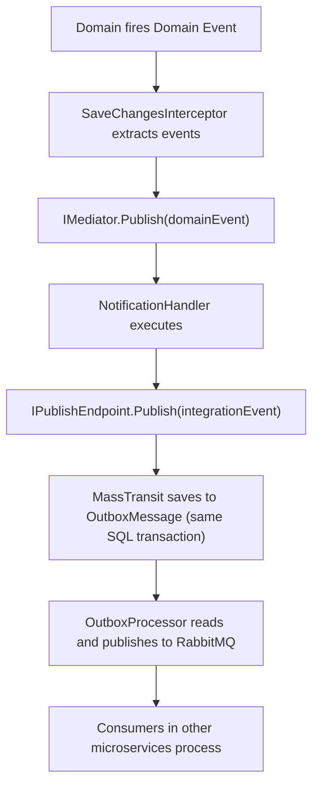
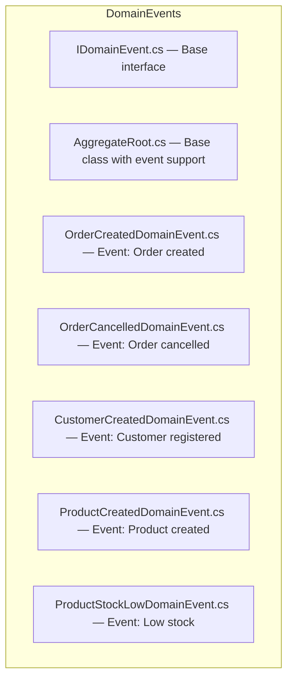
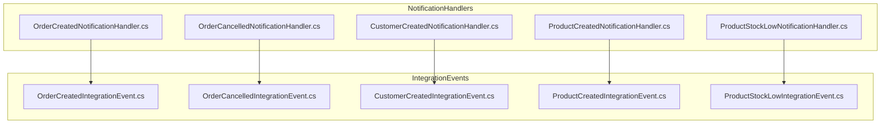
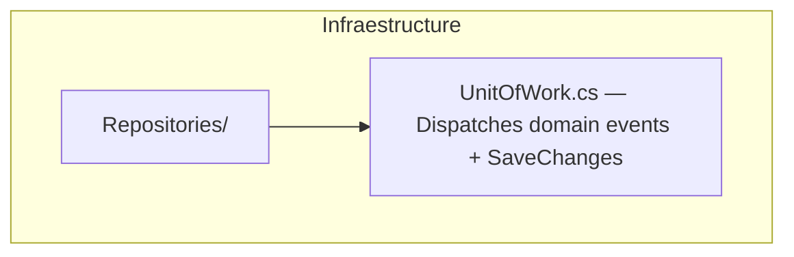
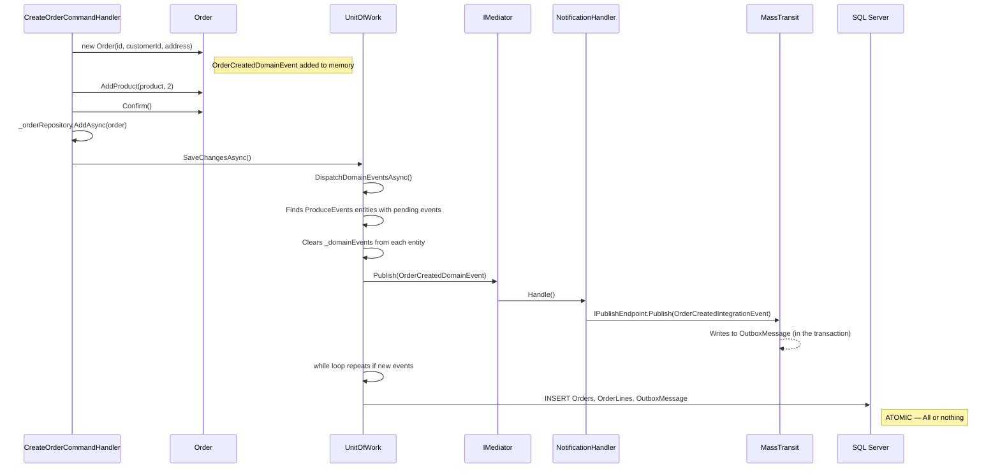

# Domain Events in SoftwareLearningGuide


**Domain Events** are facts that occur within the business domain and that other parts of the system need to know about. They enable **total decoupling** between who generates the event and who reacts to it.

---

#### Table of Contents

1. [What is a Domain Event](#what-is-a-domain-event)
2. [Domain Event vs Integration Event](#domain-event-vs-integration-event)
3. [Implemented Architecture](#implemented-architecture)
4. [IDomainEvent](#idomainevent)
5. [ProduceEvents - Base Class with Event Support](#produceevents---base-class-with-event-support)
6. [Implemented Domain Events](#implemented-domain-events)
7. [Domain Events Dispatch - Unit of Work](#domain-events-dispatch---unit-of-work)
8. [Complete Flow](#complete-flow)
9. [Why this Architecture is the Best Solution](#why-this-architecture-is-the-best-solution)

---

## What is a Domain Event

A **Domain Event** is an object that represents something that happened in the business domain and that other components may need to know about. Unlike an infrastructure event (like a log), a Domain Event has **business meaning**.

### Domain Events Examples in this Project

| Event | When it fires | What it means |
|-------|---------------|---------------|
| `OrderCreatedDomainEvent` | A new Order is created | The customer placed an order |
| `OrderCancelledDomainEvent` | An Order is cancelled | The order was cancelled |
| `CustomerCreatedDomainEvent` | A Customer is registered | New customer in the system |
| `ProductCreatedDomainEvent` | A Product is added | New product in the catalog |
| `ProductStockLowDomainEvent` | Stock drops below 10 units | Restocking alert |

### Key Principles

- **Immutability**: Events are C# records, once created they don't change
- **Dated**: Each event carries `EventId` (GUID) and `OccurredOn` (DateTime)
- **Semantically rich**: They contain all the information needed to react
- **Decoupling**: The emitter doesn't know who listens

---

## Domain Event vs Integration Event

This architecture distinguishes two types of events:

| Aspect | Domain Event | Integration Event |
|--------|--------------|-------------------|
| **Scope** | Within the same database | Through messaging (RabbitMQ, Service Bus) |
| **Mediator** | MediatR (`IMediator.Publish()`) | MassTransit (`IPublishEndpoint.Publish()`) |
| **Transaction** | Same SQL transaction (ACID) | Same transaction via Outbox Pattern |
| **Consumer** | Internal Notification Handlers | Consumers in other microservices |
| **Purpose** | React immediately in the same app | Notify external systems |

### Flow between both



---

## Implemented Architecture

### Domain Layer (Core.Business)



### Application Layer (Application.Command)



### Infrastructure Layer



### Why 3 separate layers?

This separation is not arbitrary — it's the essence of **Clean Architecture**. Each layer has a clear role and cannot cross its boundaries:

- **Domain (Core.Business):** Contains only events and business logic. **Doesn't know** that EF Core, MediatR, or MassTransit exist. A domain event is a simple record with data; it doesn't know who consumes it or how it's persisted. This allows the domain to be tested without any infrastructure.
- **Application (Application.Command):** Is the **orchestrator**. Receives the command, executes use case logic, and coordinates between domain and infrastructure. NotificationHandlers live here because they are the "seam" that connects a Domain Event with an Integration Event. The application **knows** both layers, but the domain and infrastructure don't know about it.
- **Infrastructure:** Executes what the other layers command. The UnitOfWork dispatches events and persists, repositories talk to EF Core, MassTransit talks to RabbitMQ. It's the "muscle" of the system: does the heavy lifting but doesn't make business decisions.

If the domain depended on infrastructure, you couldn't swap EF Core for Dapper without touching business code. If infrastructure depended on the domain, you'd have circular coupling. This separation ensures each piece is **replaceable** without breaking the others.

---

## IDomainEvent

```csharp
using MediatR;

namespace SoftwareLearningGuide.Core.Business.DomainEvents;

public interface IDomainEvent : INotification
{
    Guid EventId { get; }
    DateTime OccurredOn { get; }
}
```

**Key points:**

- Implements MediatR's `INotification` to be dispatched via `IMediator.Publish()`
- `EventId`: Unique event identifier (GUID)
- `OccurredOn`: Timestamp of when it occurred (UTC)
- Each concrete event is a `record` (immutability by default)

---

## ProduceEvents - Base Class with Event Support

The `ProduceEvents` class is the abstract base that enables Domain Events support. Both Aggregate Roots and simple Entities can inherit from it to fire events.

> **Productive file:** [`SoftwareLearningGuide.Core.Business/DomainEvents/ProduceEvents.cs`](SoftwareLearningGuide.Core.Business/DomainEvents/ProduceEvents.cs)

```csharp
namespace SoftwareLearningGuide.Core.Business.DomainEvents;

/// <summary>
/// Base class for Aggregate Roots and Entities that supports Domain Events.
/// Each event accumulates in memory and is dispatched atomically
/// before confirming the SQL transaction (via UnitOfWork).
/// </summary>
public abstract class ProduceEvents
{
    private readonly List<IDomainEvent> _domainEvents = [];

    public IReadOnlyList<IDomainEvent> DomainEvents => _domainEvents.AsReadOnly();

    protected void AddDomainEvent(IDomainEvent domainEvent)
    {
        _domainEvents.Add(domainEvent);
    }

    public void RemoveDomainEvent(IDomainEvent domainEvent)
    {
        _domainEvents.Remove(domainEvent);
    }

    public void ClearDomainEvents()
    {
        _domainEvents.Clear();
    }
}
```

**Key points:**

- The name `ProduceEvents` reflects that the class **produces** events, not that it's a generic "AggregateRoot"
- `AddDomainEvent()` is `protected` - only the domain can generate events
- `RemoveDomainEvent()` and `ClearDomainEvents()` are `public` - the UnitOfWork uses them
- `DomainEvents` is `IReadOnlyList` - read-only from outside
- Events accumulate in memory and are dispatched atomically before `SaveChangesAsync()`

### Entities that inherit from ProduceEvents

| Entity | Role | Inherits from |
|--------|------|---------------|
| `Order` | Aggregate Root | `ProduceEvents` |
| `Product` | Entity | `ProduceEvents` |

**Note:** `Customer` currently doesn't fire domain events, so it doesn't inherit from `ProduceEvents`.

---

## Implemented Domain Events

All domain events follow exactly the same structure: they implement `IDomainEvent`, are `record` (immutable by default), and carry the properties `EventId` (unique GUID) and `OccurredOn` (UTC timestamp). This is not a coincidence — it's a **design convention** that allows the UnitOfWork to find any entity with pending events regardless of the event type. Below, `OrderCreatedDomainEvent` as an expanded example, and the rest in a summary table:

### OrderCreatedDomainEvent

```csharp
public sealed record OrderCreatedDomainEvent : IDomainEvent
{
    public Guid EventId { get; init; } = Guid.NewGuid();
    public DateTime OccurredOn { get; init; } = DateTime.UtcNow;

    public required Guid OrderId { get; init; }
    public required Guid CustomerId { get; init; }
    public required decimal TotalAmount { get; init; }
    public required string Currency { get; init; }
    public required DateTime CreatedAt { get; init; }
}
```

**Why so many properties?** Because the event must contain **all the information** that a NotificationHandler needs to create the Integration Event. If `TotalAmount` were missing, the handler would need to make an additional database query to get it, which would violate the principle that events are self-contained.

### Summary of other events

| Event | Specific properties | When does it fire? |
|-------|-------------------|-------------------|
| `OrderCancelledDomainEvent` | `OrderId`, `Reason`, `CancelledAt` | When an existing Order is cancelled |
| `CustomerCreatedDomainEvent` | `CustomerId`, `Email`, `Name` | When a new Customer is registered |
| `ProductCreatedDomainEvent` | `ProductId`, `Name`, `Price`, `Currency` | When a Product is added to the catalog |
| `ProductStockLowDomainEvent` | `ProductId`, `CurrentStock` | When a Product's stock drops below 10 units |

**Note:** Notice that each event only carries the properties its consumer needs. `ProductStockLowDomainEvent` only needs the product ID and current stock — it doesn't need the name or price because the consumer (e.g., a restocking service) can query that information on its own.

Once the domain generates the events, we need a mechanism to dispatch them. This is where the **Unit of Work** comes in, acting as the orchestra conductor: it coordinates event dispatch and persistence in a single transaction. Without it, events would remain dormant in memory and never reach the NotificationHandlers.

---

## Domain Events Dispatch - Unit of Work

In this project, Domain Events dispatch is **not** done with an EF Core `SaveChangesInterceptor`. Instead, the `UnitOfWork` dispatches events **before** executing `SaveChangesAsync()`, ensuring that Integration Events generated by handlers are written as rows in the `OutboxMessages` table within the same SQL transaction.

> **Productive file:** [`SoftwareLearningGuide.Infraestructure/Repositories/UnitOfWork.cs`](../SoftwareLearningGuide.Infraestructure/Repositories/UnitOfWork.cs)

### Why not SaveChangesInterceptor?

The main reason is that `NotificationHandlers` need MassTransit to write to the `OutboxMessage` table **within the same transaction**. If we used an EF Core interceptor, events would be dispatched after the transaction already closed, losing atomicity.

### How UnitOfWork works with Domain Events

```csharp
// SoftwareLearningGuide.Infraestructure/Repositories/UnitOfWork.cs
public sealed class UnitOfWork : IUnitOfWork
{
    private readonly ApplicationDbContext _context;
    private readonly IMediator _mediator;
    private readonly ILogger<UnitOfWork> _logger;

    public async Task<int> SaveChangesAsync(CancellationToken cancellationToken = default)
    {
        // 1. Dispatch domain events BEFORE SaveChanges
        await DispatchDomainEventsAsync(cancellationToken);

        // 2. Persist changes (includes OutboxMessage if handler wrote to it)
        return await _context.SaveChangesAsync(cancellationToken);
    }

    private async Task DispatchDomainEventsAsync(CancellationToken cancellationToken)
    {
        while (true)
        {
            // Find all ProduceEvents entities with pending events
            var aggregateRoots = _context.ChangeTracker
                .Entries<ProduceEvents>()
                .Where(e => e.Entity.DomainEvents.Any())
                .Select(e => e.Entity)
                .ToList();

            if (aggregateRoots.Count == 0) break;

            foreach (var aggregate in aggregateRoots)
            {
                var domainEvents = aggregate.DomainEvents.ToList();
                aggregate.ClearDomainEvents();

                foreach (var domainEvent in domainEvents)
                {
                    // IMediator.Publish() executes the NotificationHandlers
                    await _mediator.Publish(domainEvent, cancellationToken);
                }
            }
        }
    }
}
```

**Key points:**

- The `while(true)` loop is necessary because a handler can generate **new domain events**
- It searches for `ProduceEvents` entities (not just `AggregateRoot`) because `Product` also fires them
- `ClearDomainEvents()` is called **before** `Publish()` to avoid re-processing
- `NotificationHandlers` create Integration Events that MassTransit saves to `OutboxMessage` **in the same transaction**

### Why is `while(true)` indispensable?

Imagine this scenario: you create an Order → `OrderCreatedDomainEvent` is generated → the NotificationHandler creates the Integration Event → MassTransit saves it to OutboxMessage. So far so good. But now suppose the handler also checks stock and finds it's below 10 units. The handler generates a **new** `ProductStockLowDomainEvent`. Without `while(true)`, that second event would stay in memory and never be dispatched. `while(true)` rescans the ChangeTracker, finds the new events, and repeats the cycle. This is known as **event cascade** and is a fundamental characteristic of event-driven systems. The condition `if (aggregateRoots.Count == 0) break` ensures the loop ends when there are no pending events, preventing an infinite loop.

### DI Registration

```csharp
// SoftwareLearningGuide.Infraestructure/Dependencies.cs
services.AddScoped<IUnitOfWork, UnitOfWork>();
```

There's no EF Core interceptor. The UnitOfWork orchestrates everything.

---

## Complete Flow

### Example: Create an Order



### Flow Diagram

```mermaid
graph TD
    subgraph CreateOrderCommandHandler
        H1["1. new Order(id, customerId, address)"]
        H2["→ AddDomainEvent(OrderCreatedDomainEvent) [in memory]"]
        H3["2. order.AddProduct(product, quantity)"]
        H4["3. order.Confirm()"]
        H5["4. _orderRepository.AddAsync(order)"]
        H6["5. _unitOfWork.SaveChangesAsync()"]

        subgraph UnitOfWork.DispatchDomainEventsAsync
            U1["1. ChangeTracker.Entries — Finds"]
            U2["2. aggregate.ClearDomainEvents — Clears"]
            U3["3. IMediator.Publish — Dispatches"]
            U3a["NotificationHandler → IPublishEndpoint"]
            U3b["MassTransit → OutboxMessage (in memory)"]
            U4["4. while (new events exist) repeats the cycle"]
        end

        subgraph SQL Server Transaction
            S1["INSERT INTO Orders (...)"]
            S2["INSERT INTO OrderLines (...)"]
            S3["INSERT INTO OutboxMessage (...) — Integration Event"]
            S4["COMMIT — ATOMIC (All or nothing)"]
        end
    end

    H1 --> H2 --> H3 --> H4 --> H5 --> H6
    H6 --> U1 --> U2 --> U3 --> U3a --> U3b --> U4
    U4 --> S1 --> S2 --> S3 --> S4
```



---

In summary, when a Command Handler creates an Order, the complete flow is: the **domain generates the event** (`OrderCreatedDomainEvent`) → the **UnitOfWork dispatches it** via MediatR → a **NotificationHandler creates the Integration Event** → **MassTransit saves it to OutboxMessage** → everything is persisted **atomically** in a single SQL transaction. If any step fails, everything is rolled back. If the messaging broker is down, the message stays safe in the `OutboxMessage` table waiting for recovery. This flow ensures you never lose an event and that the system is resilient to partial failures.

---

## Why this Architecture is the Best Solution

### Atomic Guarantee (ACID)

By using **MassTransit's Transactional Outbox with EF Core**, the entity (Order) and the event message are saved within the **same SQL transaction**. If the database goes down, no events are lost and no inconsistent states are generated.

### Total Decoupling

**Domain Events** live within your process/memory (MediatR) to react immediately in the same database. **Integration Events** are emitted through MassTransit (RabbitMQ, Service Bus, etc.) via the Outbox so that other microservices or external systems are notified.

### No Lost Messages

If the messaging service (RabbitMQ) goes down, messages remain in the `OutboxMessage` table. The `OutboxProcessor` automatically retries sending them when the broker recovers.

### Scalability

You can add more `NotificationHandlers` or `Consumers` without modifying the domain. The domain only generates events; it doesn't care who consumes them.

### Observability

Each event has a unique `EventId` that allows correlating the complete flow from creation to processing by the final consumer.

---

## Recommended Resources

- [Domain Events - Martin Fowler](https://martinfowler.com/articles/domainEvent.html)
- [Transactional Outbox Pattern - Microservices.io](https://microservices.io/patterns/data/transactional-outbox.html)
- [MassTransit Outbox Documentation](https://masstransit.io/documentation/configuration/persistence/entity-framework)
- [MediatR Notifications](https://github.com/jbogard/MediatR/wiki)
- [Clean Architecture with Domain Events](https://learn.microsoft.com/en-us/dotnet/architecture/modern-web-apps-azure/architectural-principles)

---

**Last updated:** 2026
**Project:** SoftwareLearningGuide.Core.Business