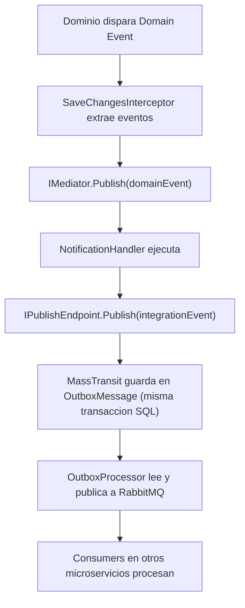
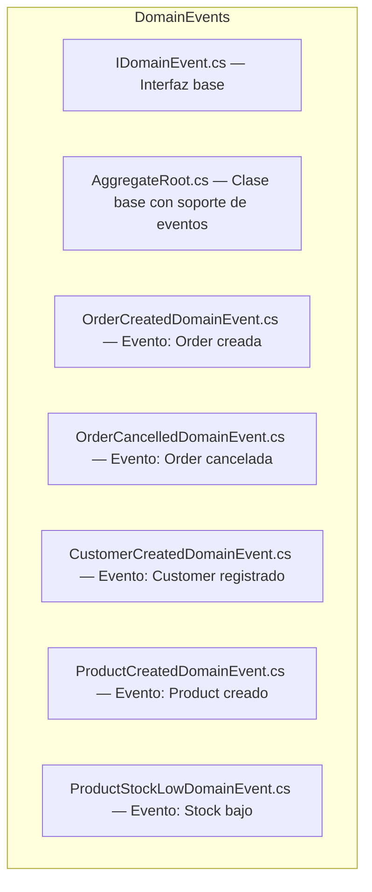
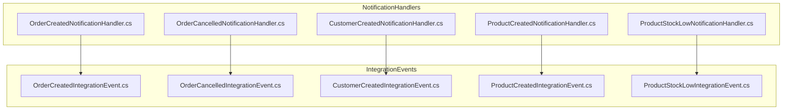
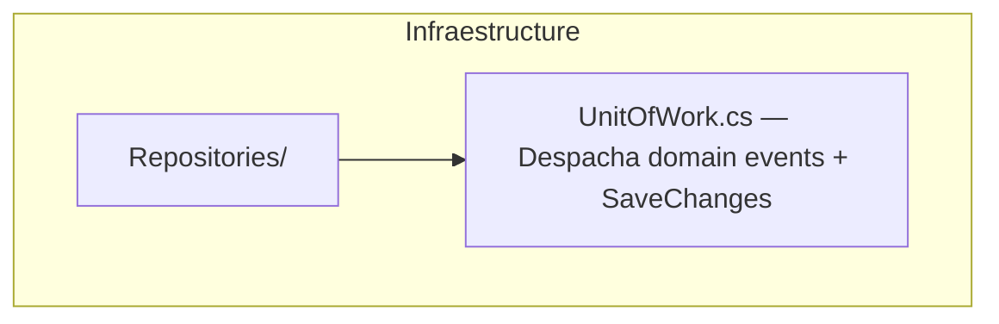
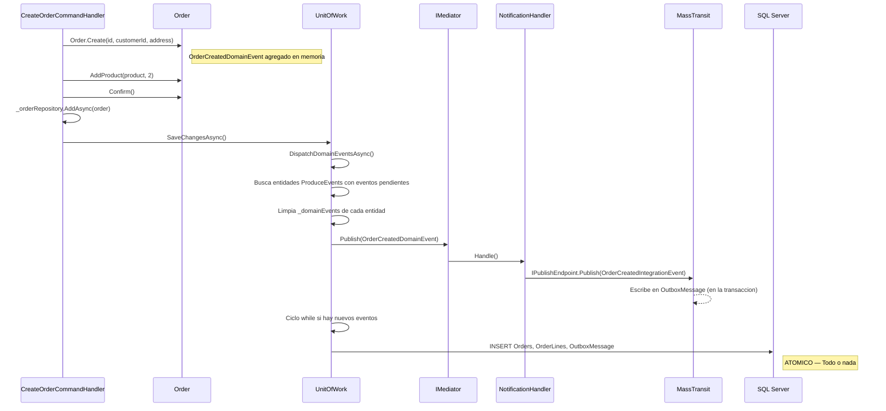

# Domain Events (Eventos de Dominio) en SoftwareLearningGuide


Los **Domain Events** son hechos que ocurren dentro del dominio del negocio y que otras partes del sistema necesitan conocer. Permiten un **desacoplamiento total** entre quién genera el evento y quién reacciona a él.

---

#### Tabla de Contenidos

1. [Que es un Domain Event](#que-es-un-domain-event)
2. [Domain Event vs Integration Event](#domain-event-vs-integration-event)
3. [Arquitectura Implementada](#arquitectura-implementada)
4. [IDomainEvent](#idomainevent)
5. [ProduceEvents - Clase Base con Soporte de Eventos](#produceevents---clase-base-con-soporte-de-eventos)
6. [Eventos de Dominio Implementados](#eventos-de-dominio-implementados)
7. [Despacho de Domain Events - Unit of Work](#despacho-de-domain-events---unit-of-work)
8. [Flujo Completo](#flujo-completo)
9. [Por que esta Arquitectura es la Mejor Solucion](#por-que-esta-arquitectura-es-la-mejor-solucion)

---

## Que es un Domain Event

Un **Domain Event** es un objeto que representa algo que paso en el dominio del negocio y que otros componentes pueden necesitar saber. A diferencia de un evento de infraestructura (como un log), un Domain Event tiene **significado de negocio**.

### Ejemplos de Domain Events en este Proyecto

| Evento | Quando se dispara | Que significa |
|--------|-------------------|---------------|
| `OrderCreatedDomainEvent` | Se crea una nueva Order | El cliente hizo un pedido |
| `OrderCancelledDomainEvent` | Se cancela una Order | El pedido fue cancelado |
| `CustomerCreatedDomainEvent` | Se registra un Customer | Nuevo cliente en el sistema |
| `ProductCreatedDomainEvent` | Se agrega un Product | Nuevo producto en el catalogo |
| `ProductStockLowDomainEvent` | Stock baja de 10 unidades | Alerta de reaprovisionamiento |

### Principios Clave

- **Inmutabilidad**: Los eventos son records C#, una vez creados no cambian
- **Datado**: Cada evento lleva `EventId` (GUID) y `OccurredOn` (DateTime)
- **Semanticamente ricos**: Contienen toda la informacion necesaria para reaccionar
- **Desacoplamiento**: El emisor no sabe quien escucha

---

## Domain Event vs Integration Event

Esta arquitectura distingue dos tipos de eventos:

| Aspecto | Domain Event | Integration Event |
|---------|--------------|-------------------|
| **Alcance** | Dentro de la misma base de datos | A traves de la mensajeria (RabbitMQ, Service Bus) |
| **Mediador** | MediatR (`IMediator.Publish()`) | MassTransit (`IPublishEndpoint.Publish()`) |
| **Transaccion** | Misma transaccion SQL (ACID) | Misma transaccion via Outbox Pattern |
| **Consumidor** | Notificaction Handlers internos | Consumers en otros microservicios |
| **Proposito** | Reaccionar inmediatamente en la misma app | Notificar a sistemas externos |

### Flujo entre ambos



---

## Arquitectura Implementada

### Capa de Dominio (Core.Business)



### Capa de Aplicacion (Application.Command)



### Capa de Infraestructura



### ¿Por qué 3 capas separadas?

Esta separación no es caprichosa, es la esencia de **Clean Architecture**. Cada capa tiene un rol claro y no puede cruzar sus límites:

- **Dominio (Core.Business):** Contiene solo los eventos y la lógica de negocio. **No sabe** que existen EF Core, MediatR, ni MassTransit. Un evento de dominio es un simple record con datos; no sabe quién lo consume ni cómo se persiste. Esto permite que el dominio sea testeable sin ninguna infraestructura.
- **Aplicación (Application.Command):** Es el **orquestador**. Recibe el command, ejecuta la lógica de caso de uso, y coordina entre dominio e infraestructura. Los NotificationHandlers viven aquí porque son la "costura" que conecta un Domain Event con un Integration Event. La aplicación **sabe** de ambas capas, pero el dominio y la infraestructura no saben de ella.
- **Infraestructura:** Ejecuta lo que las otras capas ordenan. El UnitOfWork despacha eventos y persiste, los repositorios hablan con EF Core, MassTransit habla con RabbitMQ. Es el "músculo" del sistema: hace el trabajo pesado pero no toma decisiones de negocio.

Si el dominio dependiera de la infraestructura, no podrías cambiar EF Core por Dapper sin tocar el negocio. Si la infraestructura dependiera del dominio, tendrías acoplamiento circular. Esta separación garantiza que cada pieza sea **reemplazable** sin romper las demás.

---

## IDomainEvent

```csharp
using MediatR;

namespace SoftwareLearningGuide.Core.Business.DomainEvents;

public interface IDomainEvent : INotification
{
    Guid EventId { get; }
    DateTime OccurredOn { get; }
}
```

**Puntos clave:**

- Implementa `INotification` de MediatR para ser despachado via `IMediator.Publish()`
- `EventId`: Identificador unico del evento (GUID)
- `OccurredOn`: Timestamp de cuando ocurrio (UTC)
- Cada evento concreto es un `record` (inmutabilidad por defecto)

---

## ProduceEvents - Clase Base con Soporte de Eventos

La clase `ProduceEvents` es la base abstracta que habilita el soporte de Domain Events. Tanto Aggregate Roots como Entidades simples pueden heredar de ella para disparar eventos.

> **Archivo productivo:** [`SoftwareLearningGuide.Core.Business/DomainEvents/ProduceEvents.cs`](SoftwareLearningGuide.Core.Business/DomainEvents/ProduceEvents.cs)

```csharp
namespace SoftwareLearningGuide.Core.Business.DomainEvents;

/// <summary>
/// Clase base para Aggregate Roots y Entidades que soporta Domain Events.
/// Cada evento se acumula en memoria y se despacha atomicamente
/// antes de confirmar la transaccion SQL (via UnitOfWork).
/// </summary>
public abstract class ProduceEvents
{
    private readonly List<IDomainEvent> _domainEvents = [];

    public IReadOnlyList<IDomainEvent> DomainEvents => _domainEvents.AsReadOnly();

    protected void AddDomainEvent(IDomainEvent domainEvent)
    {
        _domainEvents.Add(domainEvent);
    }

    public void RemoveDomainEvent(IDomainEvent domainEvent)
    {
        _domainEvents.Remove(domainEvent);
    }

    public void ClearDomainEvents()
    {
        _domainEvents.Clear();
    }
}
```

**Puntos clave:**

- El nombre `ProduceEvents` refleja que la clase **produce** eventos, no que es un "AggregateRoot" genérico
- `AddDomainEvent()` es `protected` - solo el dominio puede generar eventos
- `RemoveDomainEvent()` y `ClearDomainEvents()` son `public` - el UnitOfWork las usa
- `DomainEvents` es `IReadOnlyList` - solo lectura desde afuera
- Los eventos se acumulan en memoria y se despachan atomicamente antes de `SaveChangesAsync()`

### Entidades que heredan de ProduceEvents

| Entidad | Rol | Hereda de |
|---------|-----|-----------|
| `Order` | Raiz del Agregado | `ProduceEvents` |
| `Product` | Entidad | `ProduceEvents` |

**Nota:** `Customer` actualmente no dispara domain events, por lo que no hereda de `ProduceEvents`.

---

## Eventos de Dominio Implementados

Todos los eventos de dominio siguen exactamente la misma estructura: implementan `IDomainEvent`, son `record` (inmutables por defecto), y llevan las propiedades `EventId` (GUID único) y `OccurredOn` (timestamp UTC). Esto no es coincidencia — es una **convención de diseño** que permite al UnitOfWork buscar cualquier entidad con eventos pendientes sin importar de qué tipo sea el evento. A continuación, `OrderCreatedDomainEvent` como ejemplo expandido, y el resto en tabla resumen:

### OrderCreatedDomainEvent

```csharp
public sealed record OrderCreatedDomainEvent : IDomainEvent
{
    public Guid EventId { get; init; } = Guid.NewGuid();
    public DateTime OccurredOn { get; init; } = DateTime.UtcNow;

    public required Guid OrderId { get; init; }
    public required Guid CustomerId { get; init; }
    public required decimal TotalAmount { get; init; }
    public required string Currency { get; init; }
    public required DateTime CreatedAt { get; init; }
}
```

**¿Por qué tantas propiedades?** Porque el evento debe contener **toda la información** que un NotificationHandler necesita para crear el Integration Event. Si faltara `TotalAmount`, el handler tendría que hacer una consulta adicional a la base de datos para obtenerlo, lo que violaría el principio de que los eventos son auto-contenidos.

### Resumen de los demás eventos

| Evento | Propiedades específicas | ¿Cuándo se dispara? |
|--------|------------------------|---------------------|
| `OrderCancelledDomainEvent` | `OrderId`, `Reason`, `CancelledAt` | Cuando se cancela una Order existente |
| `CustomerCreatedDomainEvent` | `CustomerId`, `Email`, `Name` | Cuando se registra un nuevo Customer |
| `ProductCreatedDomainEvent` | `ProductId`, `Name`, `Price`, `Currency` | Cuando se agrega un Product al catálogo |
| `ProductStockLowDomainEvent` | `ProductId`, `CurrentStock` | Cuando el stock de un Product baja de 10 unidades |

**Nota:** Observa que cada evento solo lleva las propiedades que su consumidor necesita. `ProductStockLowDomainEvent` solo necesita el ID del producto y el stock actual — no necesita el nombre ni el precio porque el consumidor (por ejemplo, un servicio de reposición) puede consultar esa información por su cuenta.

Una vez que el dominio genera los eventos, necesitamos un mecanismo para despacharlos. Aquí es donde entra el **Unit of Work**, que actúa como el director de orquesta: coordina el despacho de eventos y la persistencia en una sola transacción. Sin él, los eventos se quedarían dormidos en memoria y nunca llegarían a los NotificationHandlers.

---

## Despacho de Domain Events - Unit of Work

En este proyecto, el despacho de Domain Events **no** se hace con un `SaveChangesInterceptor` de EF Core. En su lugar, el `UnitOfWork` despacha los eventos **antes** de ejecutar `SaveChangesAsync()`, garantizando que los Integration Events generados por los handlers se escriban como filas en la tabla `OutboxMessages` dentro de la misma transaccion SQL.

> **Archivo productivo:** [`SoftwareLearningGuide.Infraestructure/Repositories/UnitOfWork.cs`](../SoftwareLearningGuide.Infraestructure/Repositories/UnitOfWork.cs)

### Por que no SaveChangesInterceptor?

La razon principal es que los `NotificationHandler` necesitan que MassTransit escriba en la tabla `OutboxMessage` **dentro de la misma transaccion**. Si usaramos un interceptor de EF Core, los eventos se despacharian despues de que la transaccion ya se cerro, perdiendo la atomicidad.

### Como funciona el UnitOfWork con Domain Events

```csharp
// SoftwareLearningGuide.Infraestructure/Repositories/UnitOfWork.cs
public sealed class UnitOfWork : IUnitOfWork
{
    private readonly ApplicationDbContext _context;
    private readonly IMediator _mediator;
    private readonly ILogger<UnitOfWork> _logger;

    public async Task<int> SaveChangesAsync(CancellationToken cancellationToken = default)
    {
        // 1. Despachar domain events ANTES de SaveChanges
        await DispatchDomainEventsAsync(cancellationToken);

        // 2. Persistir cambios (incluye OutboxMessage si el handler escribio en el)
        return await _context.SaveChangesAsync(cancellationToken);
    }

    private async Task DispatchDomainEventsAsync(CancellationToken cancellationToken)
    {
        while (true)
        {
            // Buscar todas las entidades ProduceEvents con eventos pendientes
            var aggregateRoots = _context.ChangeTracker
                .Entries<ProduceEvents>()
                .Where(e => e.Entity.DomainEvents.Any())
                .Select(e => e.Entity)
                .ToList();

            if (aggregateRoots.Count == 0) break;

            foreach (var aggregate in aggregateRoots)
            {
                var domainEvents = aggregate.DomainEvents.ToList();
                aggregate.ClearDomainEvents();

                foreach (var domainEvent in domainEvents)
                {
                    // IMediator.Publish() ejecuta los NotificationHandlers
                    await _mediator.Publish(domainEvent, cancellationToken);
                }
            }
        }
    }
}
```

**Puntos clave:**

- El ciclo `while(true)` es necesario porque un handler puede generar **nuevos domain events**
- Se buscan entidades `ProduceEvents` (no solo `AggregateRoot`) porque `Product` tambien los dispara
- `ClearDomainEvents()` se llama **antes** de `Publish()` para evitar re-procesamiento
- Los `NotificationHandler` crean Integration Events que MassTransit guarda en `OutboxMessage` **en la misma transaccion**

### ¿Por qué el `while(true)` es indispensable?

Imagina este escenario: creas una Order → se genera `OrderCreatedDomainEvent` → el NotificationHandler crea el Integration Event → MassTransit lo guarda en OutboxMessage. Hasta aquí todo bien. Pero ahora supón que en el handler también verificas el stock y descubres que está bajo 10 unidades. El handler genera un **nuevo** `ProductStockLowDomainEvent`. Si no tuviéramos el `while(true)`, ese segundo evento se quedaría en memoria y nunca se despacharía. El `while(true)` vuelve a escanear el ChangeTracker, encuentra los nuevos eventos, y repite el ciclo. Esto se conoce como **event cascade** (cascada de eventos) y es una característica fundamental de sistemas event-driven. La condición `if (aggregateRoots.Count == 0) break` garantiza que el ciclo termina cuando no quedan eventos pendientes, evitando un loop infinito.

### Registro en DI

```csharp
// SoftwareLearningGuide.Infraestructure/Dependencies.cs
services.AddScoped<IUnitOfWork, UnitOfWork>();
```

No hay interceptor de EF Core. El UnitOfWork orquesta todo.

---

## Flujo Completo

### Ejemplo: Crear una Order



### Diagrama de Flujo

```mermaid
graph TD
    subgraph CreateOrderCommandHandler
        H1["1. Order.Create(id, customerId, address)"]
        H2["→ AddDomainEvent(OrderCreatedDomainEvent) [en memoria]"]
        H3["2. order.AddProduct(product, quantity)"]
        H4["3. order.Confirm()"]
        H5["4. _orderRepository.AddAsync(order)"]
        H6["5. _unitOfWork.SaveChangesAsync()"]

        subgraph UnitOfWork.DispatchDomainEventsAsync
            U1["1. ChangeTracker.Entries — Busca"]
            U2["2. aggregate.ClearDomainEvents — Limpia"]
            U3["3. IMediator.Publish — Despacha"]
            U3a["NotificationHandler → IPublishEndpoint"]
            U3b["MassTransit → OutboxMessage (en memoria)"]
            U4["4. while (hay nuevos eventos) repite el ciclo"]
        end

        subgraph SQL Server Transaction
            S1["INSERT INTO Orders (...)"]
            S2["INSERT INTO OrderLines (...)"]
            S3["INSERT INTO OutboxMessage (...) — Integration Event"]
            S4["COMMIT — ATOMICO (Todo o nada)"]
        end
    end

    H1 --> H2 --> H3 --> H4 --> H5 --> H6
    H6 --> U1 --> U2 --> U3 --> U3a --> U3b --> U4
    U4 --> S1 --> S2 --> S3 --> S4
```



---

En resumen, cuando un Command Handler crea una Order, el flujo completo es: el **dominio genera el evento** (`OrderCreatedDomainEvent`) → el **UnitOfWork lo despacha** via MediatR → un **NotificationHandler crea el Integration Event** → **MassTransit lo guarda en OutboxMessage** → todo se persiste **atómicamente** en una sola transacción SQL. Si cualquier paso falla, todo se revierte. Si el broker de mensajería está caído, el mensaje queda seguro en la tabla `OutboxMessage` esperando a que se recupere. Este flujo garantiza que nunca pierdas un evento y que el sistema sea resiliciente a fallos parciales.

---

## Por que esta Arquitectura es la Mejor Solucion

### Garantia Atomica (ACID)

Al usar el **Transactional Outbox de MassTransit con EF Core**, la entidad (Order) y el mensaje del evento se guardan dentro de la **misma transaccion SQL**. Si la base de datos se cae, no se pierden eventos ni se generan estados inconsistentes.

### Desacoplamiento Total

Los **Domain Events** viven dentro de tu proceso/memoria (MediatR) para reaccionar inmediatamente en la misma base de datos. Los **Integration Events** se emiten a traves de MassTransit (RabbitMQ, Service Bus, etc.) mediante el Outbox para que otros microservicios o sistemas externos se enteren.

### No Pierde Mensajes

Si el servicio de mensajeria (RabbitMQ) se cae, los mensajes permanecen en la tabla `OutboxMessage`. El `OutboxProcessor` reintenta enviarlos automaticamente cuando el broker se recupera.

### Escalabilidad

Puedes agregar mas `NotificationHandlers` o `Consumers` sin modificar el dominio. El dominio solo genera eventos; no le importa quien los consume.

### Observabilidad

Cada evento tiene un `EventId` unico que permite correlacionar el flujo completo desde la creacion hasta el procesamiento por el consumer final.

---

## Recursos Recomendados

- [Domain Events - Martin Fowler](https://martinfowler.com/articles/domainEvent.html)
- [Transactional Outbox Pattern - Microservices.io](https://microservices.io/patterns/data/transactional-outbox.html)
- [MassTransit Outbox Documentation](https://masstransit.io/documentation/configuration/persistence/entity-framework)
- [MediatR Notifications](https://github.com/jbogard/MediatR/wiki)
- [Clean Architecture with Domain Events](https://learn.microsoft.com/en-us/dotnet/architecture/modern-web-apps-azure/architectural-principles)

---

**Ultima actualizacion:** 2026
**Proyecto:** SoftwareLearningGuide.Core.Business
