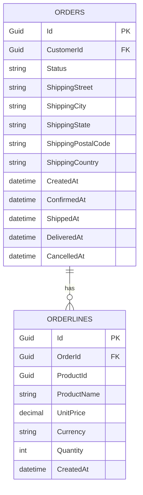

# Entity Framework Core - Command Side


**Entity Framework Core** is used on the **Command (write)** side to persist domain aggregates and entities. Read queries use Dapper instead.

In this project, EF Core is used exclusively for the command (write) side. This is because EF Core excels in write operations: automatic change tracking, relationships with Include/ThenInclude, and schema migrations. For the read side, Dapper is faster and gives us total SQL control.

---

#### Table of Contents

1. [Why EF Core Only for Commands?](#why-ef-core-only-for-commands)
2. [DbContext - ApplicationDbContext](#dbcontext---applicationdbcontext)
3. [Entity Configuration](#entity-configuration)
4. [Value Object Mapping](#value-object-mapping)
5. [Backed Fields - Private Collections](#backed-fields---private-collections)
6. [Value Conversions - IDs](#value-conversions---ids)
7. [Owned Types](#owned-types)
8. [Dependency Registration](#dependency-registration)
9. [Migration Commands](#migration-commands)
10. [File Reference](#file-reference)

---

## Why EF Core Only for Commands?

In CQRS, the **Command** side needs:

- **Tracking** of changes to persist aggregates
- **Transactions** for multiple write operations
- **Relationships** between entities (Order → OrderLine, Order → Customer)

EF Core is ideal for this. For **reads**, Dapper is used (no tracking, faster).

```
Writes (Commands) → EF Core (tracking, relationships, transactions)
Reads (Queries)   → Dapper  (no tracking, direct SQL, faster)
```

---

## DbContext - ApplicationDbContext

EF Core centralizes all writes in a single `DbContext`. This context manages domain entities, Value Objects, and the domain event outbox. To have all configurations discovered automatically, we use `ApplyConfigurationsFromAssembly`, which scans the assembly and registers each `IEntityTypeConfiguration<T>` implementation.

Before adding a new entity, just create its configuration class in `Configurations/` — no need to modify `ApplicationDbContext`.

```csharp
// SoftwareLearningGuide.Infraestructure.Data/Context/ApplicationDbContext.cs
public class ApplicationDbContext : DbContext
{
    public DbSet<Order> Orders => Set<Order>();
    public DbSet<OrderLine> OrderLines => Set<OrderLine>();
    public DbSet<Product> Products => Set<Product>();
    public DbSet<Customer> Customers => Set<Customer>();
    public DbSet<OutboxMessageEntity> OutboxMessages => Set<OutboxMessageEntity>();

    public ApplicationDbContext(DbContextOptions<ApplicationDbContext> options)
        : base(options)
    {
    }

    protected override void OnModelCreating(ModelBuilder modelBuilder)
    {
        modelBuilder.ApplyConfigurationsFromAssembly(typeof(ApplicationDbContext).Assembly);
        base.OnModelCreating(modelBuilder);
    }
}
```

**Key points:**

- `ApplyConfigurationsFromAssembly` automatically loads all `IEntityTypeConfiguration<T>` configurations from the assembly.
- `Set<T>()` is a cleaner way to expose DbSets.
- `OutboxMessageEntity` is automatically managed via `OutboxMessageConfiguration` (added as `DbSet` here so EF Core tracks it).

---

## Entity Configuration

Each entity has its own configuration class implementing `IEntityTypeConfiguration<T>`. EF Core discovers these configurations automatically thanks to `ApplyConfigurationsFromAssembly` in `ApplicationDbContext`.

### OrderConfiguration - The Aggregate

The `Order` aggregate is the root entity. It configures the main table (`Orders`), value conversions for strongly-typed IDs, owned type mapping (`ShippingAddress`), and the private order lines collection backed by a field (`_lines`). It also persists workflow state timestamps.

```csharp
// SoftwareLearningGuide.Infraestructure.Data/Configurations/OrderConfiguration.cs
public class OrderConfiguration : IEntityTypeConfiguration<Order>
{
    public void Configure(EntityTypeBuilder<Order> builder)
    {
        builder.ToTable("Orders");

        builder.HasKey(o => o.Id);

        // Value Conversion: OrderId → Guid
        builder.Property(o => o.Id)
            .HasConversion(
                id => id.Value,
                value => OrderId.From(value).Value)
            .ValueGeneratedNever();

        // Value Conversion: CustomerId → Guid
        builder.Property(o => o.CustomerId)
            .HasConversion(
                id => id.Value,
                value => CustomerId.From(value).Value);

        // Enum → string
        builder.Property(o => o.Status)
            .HasConversion<string>()
            .HasMaxLength(20);

        // Owned Type: Address mapped as flat columns
        builder.OwnsOne(o => o.ShippingAddress, addressBuilder =>
        {
            addressBuilder.Property(a => a.Street).HasColumnName("ShippingStreet").HasMaxLength(200);
            addressBuilder.Property(a => a.City).HasColumnName("ShippingCity").HasMaxLength(100);
            addressBuilder.Property(a => a.State).HasColumnName("ShippingState").HasMaxLength(100);
            addressBuilder.Property(a => a.PostalCode).HasColumnName("ShippingPostalCode").HasMaxLength(20);
            addressBuilder.Property(a => a.Country).HasColumnName("ShippingCountry").HasMaxLength(100);
        });

        // Backed Field: private collection _lines
        builder.Ignore(o => o.Lines);

        builder.HasMany<OrderLine>("_lines")
            .WithOne()
            .HasForeignKey("OrderId")
            .OnDelete(DeleteBehavior.Cascade)
            .Metadata.PrincipalToDependent
            .SetPropertyAccessMode(PropertyAccessMode.Field);

        // Order workflow timestamps
        builder.Property(o => o.CreatedAt).IsRequired();
        builder.Property(o => o.ConfirmedAt).IsRequired(false);
        builder.Property(o => o.ShippedAt).IsRequired(false);
        builder.Property(o => o.DeliveredAt).IsRequired(false);
        builder.Property(o => o.CancelledAt).IsRequired(false);
    }
}
```

Why 'Owned Types' for Address? Because Address isn't an independent entity: it doesn't have its own table, isn't referenced by ID, and lives inside Order. EF Core handles it as prefixed columns (ShippingStreet, ShippingCity, etc.) in the Orders table. This keeps the domain rich in objects but the database simple.

Why are timestamps optional? Because an Order goes through a state machine: CreatedAt always exists, but ConfirmedAt, ShippedAt, DeliveredAt, and CancelledAt are only set when the order advances to each state. They're `IsRequired(false)` to reflect they're nullable in the database.

### OrderLineConfiguration - Money as Owned Type

`OrderLine` is a separate entity with its own ID, persisted in its own table (`OrderLines`). Complex values like `Money` (mapped to two columns: `UnitPrice` and `Currency`) are configured as Owned Types. It also persists the `CreatedAt` timestamp.

```csharp
// SoftwareLearningGuide.Infraestructure.Data/Configurations/OrderLineConfiguration.cs
public class OrderLineConfiguration : IEntityTypeConfiguration<OrderLine>
{
    public void Configure(EntityTypeBuilder<OrderLine> builder)
    {
        builder.ToTable("OrderLines");

        builder.HasKey(ol => ol.Id);

        builder.Property(ol => ol.Id)
            .HasConversion(
                id => id.Value,
                value => OrderLineId.From(value).Value)
            .ValueGeneratedNever();

        builder.Property(ol => ol.ProductId)
            .HasConversion(
                id => id.Value,
                value => ProductId.From(value).Value);

        builder.Property(ol => ol.ProductName).HasMaxLength(200).IsRequired();

        // Owned Type: Money mapped as flat columns
        builder.OwnsOne(ol => ol.UnitPrice, moneyBuilder =>
        {
            moneyBuilder.Property(m => m.Amount).HasColumnName("UnitPrice").HasColumnType("decimal(18,2)");
            moneyBuilder.Property(m => m.Currency).HasColumnName("Currency").HasMaxLength(3).IsRequired();
        });

        builder.Property(ol => ol.Quantity).IsRequired();
        builder.Property(ol => ol.CreatedAt).IsRequired();
    }
}
```

Why configure OrderLine as a separate entity if it's part of the Order aggregate? Because OrderLine has its own ID (OrderLineId) and is persisted in its own table (OrderLines). But from the domain perspective, it's only accessed through Order. EF Core allows this duality: the aggregate controls access, but persistence is independent.

---

### ProductConfiguration - Owned Type for Money

`Product` is an independent entity with its own aggregate root. Its `Money` Value Object is mapped as an Owned Type, with the particularity that the `Currency` property is named `PriceCurrency` in the database to differentiate it from the `Price` value itself.

```csharp
// SoftwareLearningGuide.Infraestructure.Data/Configurations/ProductConfiguration.cs
public class ProductConfiguration : IEntityTypeConfiguration<Product>
{
    public void Configure(EntityTypeBuilder<Product> builder)
    {
        builder.ToTable("Products");

        builder.HasKey(p => p.Id);

        builder.Property(p => p.Id)
            .HasConversion(
                id => id.Value,
                value => ProductId.From(value).Value)
            .ValueGeneratedNever();

        builder.Property(p => p.Name).HasMaxLength(200).IsRequired();
        builder.Property(p => p.Description).HasMaxLength(2000).IsRequired();

        builder.OwnsOne(p => p.Price, moneyBuilder =>
        {
            moneyBuilder.Property(m => m.Amount).HasColumnName("Price").HasColumnType("decimal(18,2)");
            moneyBuilder.Property(m => m.Currency).HasColumnName("PriceCurrency").HasMaxLength(3).IsRequired();
        });

        builder.Property(p => p.StockQuantity).IsRequired();

        builder.Property(p => p.CreatedAt).IsRequired();
        builder.Property(p => p.UpdatedAt).IsRequired(false);
    }
}
```

Why `PriceCurrency` instead of just `Currency`? Because Product already has `Price` as a decimal column; without the `Price` prefix, a `Currency` column would be ambiguous. Prefixing the Value Object property name avoids name collisions.

---

### CustomerConfiguration - Two Owned Types

`Customer` has two Value Objects mapped as Owned Types: `Email` (a simple value) and `DefaultShippingAddress` (a composed Value Object like Address, but for default shipping address). They're configured with prefixed columns (`DefaultStreet`, `DefaultCity`, etc.) to differentiate from Order's `ShippingAddress` columns.

```csharp
// SoftwareLearningGuide.Infraestructure.Data/Configurations/CustomerConfiguration.cs
public class CustomerConfiguration : IEntityTypeConfiguration<Customer>
{
    public void Configure(EntityTypeBuilder<Customer> builder)
    {
        builder.ToTable("Customers");

        builder.HasKey(c => c.Id);

        builder.Property(c => c.Id)
            .HasConversion(
                id => id.Value,
                value => CustomerId.From(value).Value)
            .ValueGeneratedNever();

        builder.Property(c => c.FirstName).HasMaxLength(100).IsRequired();
        builder.Property(c => c.LastName).HasMaxLength(100).IsRequired();

        builder.OwnsOne(c => c.Email, emailBuilder =>
        {
            emailBuilder.Property(e => e.Value).HasColumnName("Email").HasMaxLength(254);
        });

        builder.OwnsOne(c => c.DefaultShippingAddress, addressBuilder =>
        {
            addressBuilder.Property(a => a.Street).HasColumnName("DefaultStreet").HasMaxLength(200);
            addressBuilder.Property(a => a.City).HasColumnName("DefaultCity").HasMaxLength(100);
            addressBuilder.Property(a => a.State).HasColumnName("DefaultState").HasMaxLength(100);
            addressBuilder.Property(a => a.PostalCode).HasColumnName("DefaultPostalCode").HasMaxLength(20);
            addressBuilder.Property(a => a.Country).HasColumnName("DefaultCountry").HasMaxLength(100);
        });

        builder.Property(c => c.CreatedAt).IsRequired();
        builder.Property(c => c.UpdatedAt).IsRequired(false);
    }
}
```

Why two Owned Types for Customer? `Email` is a simple Value Object (single `Value` property), while `DefaultShippingAddress` is a composed Value Object like `Address`, but for default shipping address. Both map as flat columns in the Customers table. The `Default` prefix on address columns avoids ambiguity with Order's `Shipping*` columns.

---

### OutboxMessageConfiguration - Outbox Pattern

The [Outbox Pattern](https://learn.microsoft.com/en-us/dotnet/architecture/microservices/microservice-ddd-cqrs-patterns/outbox-pattern) ensures domain events are persisted atomically with data model changes. `DomainOutboxMessages` is configured as a normal table in the same `DbContext` and managed by `OutboxMessageConfiguration`.

```csharp
// SoftwareLearningGuide.Infraestructure.Data/Configurations/OutboxMessageConfiguration.cs
public sealed class OutboxMessageConfiguration : IEntityTypeConfiguration<OutboxMessageEntity>
{
    public void Configure(EntityTypeBuilder<OutboxMessageEntity> builder)
    {
        builder.ToTable("DomainOutboxMessages");

        builder.HasKey(x => x.Id);

        builder.Property(x => x.Type)
            .IsRequired()
            .HasMaxLength(500);

        builder.Property(x => x.Content)
            .IsRequired();

        builder.Property(x => x.CreatedOnUtc)
            .IsRequired();

        builder.Property(x => x.ProcessedOnUtc)
            .IsRequired(false);

        builder.Property(x => x.Error)
            .IsRequired(false)
            .HasMaxLength(2000);

        builder.HasIndex(x => new { x.ProcessedOnUtc, x.CreatedOnUtc });
    }
}
```

Why a composite index on `(ProcessedOnUtc, CreatedOnUtc)`? The OutboxProcessor queries unprocessed rows (`ProcessedOnUtc IS NULL`) to publish events. The composite index optimizes that query and covers ordering by creation time.

---

## Value Object Mapping

EF Core handles Value Objects in two ways:

### 1. Owned Types (Complex Value Objects)

For Value Objects with multiple properties (Money, Address, Email):

```csharp
// Money → columns: UnitPrice (decimal), Currency (string)
builder.OwnsOne(ol => ol.UnitPrice, moneyBuilder =>
{
    moneyBuilder.Property(m => m.Amount).HasColumnName("UnitPrice").HasColumnType("decimal(18,2)");
    moneyBuilder.Property(m => m.Currency).HasColumnName("Currency").HasMaxLength(3).IsRequired();
});

// Address → columns: ShippingStreet, ShippingCity, ShippingState, ShippingPostalCode, ShippingCountry
builder.OwnsOne(o => o.ShippingAddress, addressBuilder =>
{
    addressBuilder.Property(a => a.Street).HasColumnName("ShippingStreet").HasMaxLength(200);
    // ...
});
```

Value Conversions are the bridge between the rich object world of the domain and the simple database columns. Money converts to a decimal + string, a Guid converts to a StronglyTypedId, etc. This allows the domain to use expressive objects while the database maintains simple schemas.

### 2. Value Conversions (Simple Value Objects)

For Value Objects wrapping a single value (IDs):

```csharp
// OrderId → Guid
builder.Property(o => o.Id)
    .HasConversion(
        id => id.Value,              // OrderId → Guid (for DB)
        value => OrderId.From(value).Value) // Guid → OrderId (for C#)
    .ValueGeneratedNever();
```

Value Conversions are the bridge between the rich object world of the domain and the simple database columns. Money converts to a decimal + string, a Guid converts to a StronglyTypedId, etc. This allows the domain to use expressive objects while the database maintains simple schemas.

---

## Backed Fields - Private Collections

The `Order` aggregate exposes a private collection `_lines`:

```csharp
// Core.Business/Aggregates/Order.cs
private readonly List<OrderLine> _lines = new();
public IReadOnlyCollection<OrderLine> Lines => _lines.AsReadOnly();
```

EF Core is configured to map this collection through the private field:

```csharp
builder.Ignore(o => o.Lines); // Ignores the public property

builder.HasMany<OrderLine>("_lines") // Maps the private field
    .WithOne()
    .HasForeignKey("OrderId")
    .OnDelete(DeleteBehavior.Cascade)
    .Metadata.PrincipalToDependent
    .SetPropertyAccessMode(PropertyAccessMode.Field); // Field access, not property
```

**Result in the DB:**



---

## Value Conversions - IDs

All IDs use Value Conversions to map Value Objects to `Guid`:

```csharp
builder.Property(o => o.Id)
    .HasConversion(
        id => id.Value,              // OrderId → Guid
        value => OrderId.From(value).Value) // Guid → OrderId
    .ValueGeneratedNever();

builder.Property(o => o.CustomerId)
    .HasConversion(
        id => id.Value,
        value => CustomerId.From(value).Value);
```

`ValueGeneratedNever()` indicates that EF Core **doesn't generate** the value automatically (we generate it in the domain).

---

## Owned Types

Owned Types are Value Objects that EF Core maps as columns in the owner's table:

| Owner | Owned Type | Columns in DB |
|-------|------------|---------------|
| `Order` | `ShippingAddress` | `ShippingStreet`, `ShippingCity`, `ShippingState`, `ShippingPostalCode`, `ShippingCountry` |
| `OrderLine` | `UnitPrice` (Money) | `UnitPrice` (decimal), `Currency` (string) |
| `Customer` | `Email` | `Email` (string) |
| `Customer` | `DefaultShippingAddress` | `DefaultStreet`, `DefaultCity`, `DefaultState`, `DefaultPostalCode`, `DefaultCountry` |
| `Product` | `Price` (Money) | `Price` (decimal), `PriceCurrency` (string) |

---

## Dependency Registration

The `AddInfrastructure` extension method registers EF Core's DbContext and the custom `OutboxWriter`. The `OutboxWriter` ensures domain events are written to the `DomainOutboxMessages` table within the same transaction as `SaveChangesAsync`, complying with the [Transactional Outbox Pattern](https://learn.microsoft.com/en-us/dotnet/architecture/microservices/microservice-ddd-cqrs-patterns/outbox-pattern).

```csharp
// SoftwareLearningGuide.Infraestructure/Dependencies.cs
public static class Dependencies
{
    public static IServiceCollection AddInfrastructure(
        this IServiceCollection services,
        string connectionString)
    {
        services.AddDbContext<ApplicationDbContext>(options =>
            options.UseSqlServer(connectionString));

        // Register custom Outbox Writer
        services.AddScoped<IOutboxWriter, OutboxWriter>();

        return services;
    }
}
```

It's registered in `Program.cs` with:

```csharp
builder.Services.AddInfrastructure(builder.Configuration.GetConnectionString("DefaultConnection")!);
```

Why is AddInfrastructure an extension method? Because it encapsulates all infrastructure configuration (DbContext, connections, outbox) in one place. Callers don't need to know which ORM is used or how it's configured. If tomorrow you switch from EF Core to Dapper for commands, you only change AddInfrastructure.

---

## Migration Commands

EF Core uses migrations to manage database schema changes.

### Requirements

```bash
# Install EF Core CLI tool (if not installed)
dotnet tool install --global dotnet-ef

# Verify version
dotnet ef --version
```

### Create a Migration

```bash
# Navigate to the project folder containing the DbContext
cd SoftwareLearningGuide.Infraestructure.Data

# Create a migration
dotnet ef migrations add <MigrationName> --project ..\SoftwareLearningGuide.Infraestructure.Data --startup-project ..\SoftwareLearningGuide.Api

# Example: create initial migration
dotnet ef migrations add InitialCreate --project ..\SoftwareLearningGuide.Infraestructure.Data --startup-project ..\SoftwareLearningGuide.Api
```

### Apply Migrations

```bash
# Apply migrations to the database
dotnet ef database update --project ..\SoftwareLearningGuide.Infraestructure.Data --startup-project ..\SoftwareLearningGuide.Api

# Apply to a specific migration
dotnet ef database update <MigrationName> --project ..\SoftwareLearningGuide.Infraestructure.Data --startup-project ..\SoftwareLearningGuide.Api
```

### List Migrations

```bash
# View all available migrations
dotnet ef migrations list --project ..\SoftwareLearningGuide.Infraestructure.Data --startup-project ..\SoftwareLearningGuide.Api
```

### Remove Last Migration

```bash
# Remove the last migration (only if not applied)
dotnet ef migrations remove --project ..\SoftwareLearningGuide.Infraestructure.Data --startup-project ..\SoftwareLearningGuide.Api
```

### Generate SQL Script

```bash
# Generate SQL script from all migrations
dotnet ef migrations script --project ..\SoftwareLearningGuide.Infraestructure.Data --startup-project ..\SoftwareLearningGuide.Api --output ..\docker\init.sql

# Generate idempotent script (only applies pending changes)
dotnet ef migrations script --idempotent --project ..\SoftwareLearningGuide.Infraestructure.Data --startup-project ..\SoftwareLearningGuide.Api --output ..\docker\init-idempotent.sql
```

### Command Summary

| Command | Description |
|---------|-------------|
| `dotnet ef migrations add <Name>` | Creates a new migration based on model changes |
| `dotnet ef database update` | Applies all pending migrations to the DB |
| `dotnet ef database update <Name>` | Applies up to a specific migration |
| `dotnet ef migrations list` | Lists all migrations |
| `dotnet ef migrations remove` | Removes the last migration (if not applied) |
| `dotnet ef migrations script` | Generates SQL script from migrations |
| `dotnet ef migrations script --idempotent` | Generates idempotent script (safe to run multiple times) |

### Migrations in Docker (Alternative)

If `EnsureCreated()` is used (as in this project), EF Core creates the database and schema automatically on application startup. This is practical for development but **not recommended for production**:

```csharp
// Program.cs - Create with Feature Toggle
if (featureManager.IsEnabledAsync(FeatureToggleNames.FT_APPLY_MIGRATIONS_ON_START).GetAwaiter().GetResult())
{
    dbContext.Database.EnsureCreated(); // Creates DB + schema if they don't exist
}
```

**In production, migrations are recommended** for control over schema changes:

```bash
# Generate SQL script for production
dotnet ef migrations script --idempotent --output docker/init.sql

# The script runs in the SQL Server container on startup
```

---

## File Reference

| File | Description |
|------|-------------|
| `SoftwareLearningGuide.Infraestructure.Data/Context/ApplicationDbContext.cs` | Main DbContext |
| `SoftwareLearningGuide.Infraestructure.Data/Configurations/OrderConfiguration.cs` | Order aggregate configuration |
| `SoftwareLearningGuide.Infraestructure.Data/Configurations/OrderLineConfiguration.cs` | OrderLine configuration with Money |
| `SoftwareLearningGuide.Infraestructure.Data/Configurations/ProductConfiguration.cs` | Product configuration with OwnsOne Price |
| `SoftwareLearningGuide.Infraestructure.Data/Configurations/CustomerConfiguration.cs` | Customer configuration with Email and DefaultShippingAddress |
| `SoftwareLearningGuide.Infraestructure.Data/Configurations/OutboxMessageConfiguration.cs` | DomainOutboxMessages table configuration |
| `SoftwareLearningGuide.Infraestructure/Repositories/OrderWriteRepository.cs` | Order repository implementation |
| `SoftwareLearningGuide.Infraestructure/Repositories/BaseRepository.cs` | Generic base repository |
| `SoftwareLearningGuide.Application/Ports/IOrderWriteRepository.cs` | Order write port |
| `SoftwareLearningGuide.Application/Ports/IBaseRepository.cs` | Base repository port |
| `SoftwareLearningGuide.Infraestructure/Dependencies.cs` | DI registration |
| `SoftwareLearningGuide.Infraestructure/Repositories/UnitOfWork.cs` | IUnitOfWork implementation |

---

## NuGet Packages

| Package | Version | Usage |
|---------|---------|-------|
| `Microsoft.EntityFrameworkCore` | 10.0.0 | Main ORM |
| `Microsoft.EntityFrameworkCore.SqlServer` | 10.0.0 | SQL Server provider |
| `Microsoft.EntityFrameworkCore.Tools` | 10.0.0 | Migrations and tools |