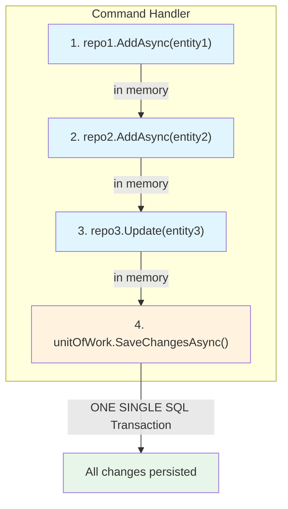
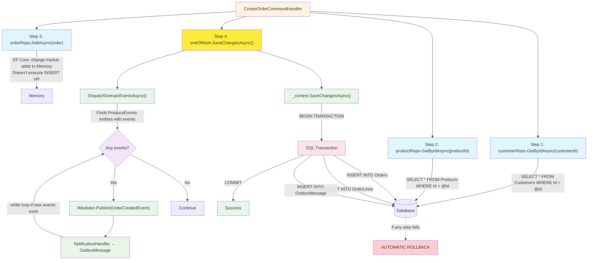

# Unit of Work


The **Unit of Work** pattern ensures that multiple repository operations are persisted in a **single SQL transaction**. If any operation fails, all changes are rolled back.

---

#### Table of Contents

1. [What is Unit of Work?](#what-is-unit-of-work)
2. [Problem without Unit of Work](#problem-without-unit-of-work)
3. [Solution with Unit of Work](#solution-with-unit-of-work)
4. [Implementation](#implementation)
5. [Data Flow](#data-flow)
6. [Before vs After](#before-vs-after)
7. [DI Registration](#di-registration)
8. [Benefits](#benefits)
9. [When to Use It](#when-to-use-it)
10. [File Reference](#file-reference)

---

## What is Unit of Work?

**Unit of Work** is a pattern that maintains a list of objects affected by a business operation and coordinates the writing of changes and the resolution of concurrency issues.

Think of Unit of Work as a **bank teller** who processes multiple transactions (transfer money, pay a bill, etc.) and confirms them all together. If any fails, everything is reversed. You don't talk to each system individually; you tell the teller "confirm everything" and they handle it. In technical terms: the handler tells the UnitOfWork "save all this" and the UnitOfWork handles opening the SQL transaction, executing all INSERTs/UPDATEs, and committing or rolling back. Without this pattern, the handler would have to coordinate each transaction manually, which is error-prone and violates the single responsibility principle.



---

## Problem without Unit of Work

When each repository has its own `SaveChangesAsync`, the handler decides when and how many times to save:

```csharp
// ❌ PROBLEM: two SaveChanges = two separate transactions
await _customerRepository.AddAsync(customer);
await _customerRepository.SaveChangesAsync();  // Transaction 1

await _orderRepository.AddAsync(order);
await _orderRepository.SaveChangesAsync();  // Transaction 2
```

**Consequences:**

| Problem | Impact |
|---------|--------|
| Partial transactions | Customer saves but order fails → inconsistent data |
| No automatic rollback | No way to reverse the first write if the second fails |
| Coupled to handler | Handler knows when to save → SRP violation |
| Hard to test | Each test needs mocking of SaveChanges in each repo |

---

## Solution with Unit of Work

**Single save point** at the end of the use case:

```csharp
// ✅ SOLUTION: single transaction
await _customerRepository.AddAsync(customer);  // in memory
await _orderRepository.AddAsync(order);        // in memory
await _unitOfWork.SaveChangesAsync();           // ONE SQL transaction
```

**Guarantees:**
- If anything fails, **EVERYTHING** rolls back (automatic rollback)
- Repositories only operate in memory (Add/Update/Delete)
- Handler only says "save everything" at the end
- Single responsibility: `IUnitOfWork` handles persistence

---

## Implementation

### Port (Application Layer)

```csharp
// SoftwareLearningGuide.Application/Ports/IUnitOfWork.cs
namespace SoftwareLearningGuide.Application.Command.Ports;

public interface IUnitOfWork
{
    Task<int> SaveChangesAsync(CancellationToken cancellationToken = default);
}
```

### Implementation (Infrastructure Layer)

The port defines **WHAT** is needed (an interface with `SaveChangesAsync`), and the implementation defines **HOW** it's done (with EF Core, MediatR, and logging). This separation is the heart of Clean Architecture: if tomorrow you decide to switch EF Core for Dapper, or MediatR for a custom event bus, you only change the implementation. Command Handlers don't even know because they depend on the port (interface), not the concrete class. Also, this separation allows injecting a UnitOfWork mock in unit tests without needing a real database.

The UnitOfWork in this project has **two responsibilities**: guaranteeing atomicity and dispatching Domain Events before persisting.

> **Production file:** [`SoftwareLearningGuide.Infraestructure/Repositories/UnitOfWork.cs`](../SoftwareLearningGuide.Infraestructure/Repositories/UnitOfWork.cs)

```csharp
// SoftwareLearningGuide.Infraestructure/Repositories/UnitOfWork.cs
using MediatR;
using Microsoft.Extensions.Logging;
using SoftwareLearningGuide.Application.Command.Ports;
using SoftwareLearningGuide.Core.Business.DomainEvents;
using SoftwareLearningGuide.Infraestructure.Data.Context;

namespace SoftwareLearningGuide.Infraestructure.Data.Repositories;

public sealed class UnitOfWork : IUnitOfWork
{
    private readonly ApplicationDbContext _context;
    private readonly IMediator _mediator;
    private readonly ILogger<UnitOfWork> _logger;

    public UnitOfWork(ApplicationDbContext context, IMediator mediator, ILogger<UnitOfWork> logger) {
        _context = context ?? throw new ArgumentNullException(nameof(context));
        _mediator = mediator ?? throw new ArgumentNullException(nameof(mediator));
        _logger = logger ?? throw new ArgumentNullException(nameof(logger));
    }

    public async Task<int> SaveChangesAsync(CancellationToken cancellationToken = default) {
        await DispatchDomainEventsAsync(cancellationToken);

        var trackedEntries = _context.ChangeTracker.Entries()
            .Select(e => $"{e.Entity.GetType().Name} (State: {e.State})")
            .ToList();

        _logger.LogInformation(
            "[UnitOfWork] Saving changes. Entities in ChangeTracker ({Count}): {Entries}",
            trackedEntries.Count, string.Join(", ", trackedEntries));

        return await _context.SaveChangesAsync(cancellationToken);
    }

    private async Task DispatchDomainEventsAsync(CancellationToken cancellationToken) {
        while (true) {
            var aggregateRoots = _context.ChangeTracker
                .Entries<ProduceEvents>()
                .Where(e => e.Entity != null && e.Entity.DomainEvents != null && e.Entity.DomainEvents.Any())
                .Select(e => e.Entity)
                .ToList();

            if (aggregateRoots.Count == 0)
                break;

            foreach (var aggregate in aggregateRoots) {
                if (aggregate is null) continue;

                var domainEvents = aggregate.DomainEvents.ToList();
                aggregate.ClearDomainEvents();

                foreach (var domainEvent in domainEvents) {
                    if (domainEvent is not null) {
                        await _mediator.Publish(domainEvent, cancellationToken);
                    }
                }
            }
        }
    }
}
```

### Step-by-Step Explanation of `DispatchDomainEventsAsync`

This is the heart of the pattern. Let's see what each line does:

1. **`while (true)`** — Starts an infinite loop that only ends when there are no more pending events. It's necessary because a handler can generate new events that create a cascade.

2. **`_context.ChangeTracker.Entries<ProduceEvents>()`** — EF Core maintains a ChangeTracker that knows all entities being modified. Here we filter to get only those inheriting from `ProduceEvents` (Order, Product, etc.) that have at least one event in their `_domainEvents` list.

3. **`.Where(e => e.Entity != null && e.Entity.DomainEvents != null && e.Entity.DomainEvents.Any())`** — We're only interested in entities with pending events. We filter out null entities, with null event lists and no events. If an entity was modified but didn't generate events, we ignore it.

4. **`.ToList()`** — Materializes the query. It's important to do this here because we're going to modify the entities (clear events) while iterating, and we can't modify a collection we're iterating over.

5. **`if (aggregateRoots.Count == 0) break`** — If there are no pending events, we exit the loop. This is the exit condition for `while(true)`.

6. **`aggregate.DomainEvents.ToList()`** — We copy events to a temporary list. It's necessary because we're going to call `ClearDomainEvents()` and don't want to lose events while iterating over them.

7. **`aggregate.ClearDomainEvents()`** — We clear events from the entity **before** publishing. This is critical: if we published first and cleared after, a handler that generates a new event would add it to the list, and in the next iteration of `while` it would be processed correctly. But if we didn't clear, the event would be processed twice (re-processing).

8. **`await _mediator.Publish(domainEvent)`** — MediatR executes all registered `NotificationHandler` for that event type. This is where a handler can: (a) create an Integration Event that MassTransit writes to OutboxMessage, or (b) generate a new Domain Event that gets added to some entity's list, causing `while(true)` to have another iteration.

**Key points:**

- `while(true)` handles event cascades: a handler can generate new domain events
- Searches for `ProduceEvents` entities (base of Order, Product, etc.)
- `ClearDomainEvents()` is called before `Publish()` to prevent re-processing
- `NotificationHandler` create Integration Events that MassTransit writes to `OutboxMessage` **within the same transaction**

### Base Repository (without SaveChanges)

The base repository encapsulates all CRUD operations in memory on the `DbContext` and EF Core's `ChangeTracker`. It doesn't have `SaveChangesAsync` — that responsibility belongs to `IUnitOfWork`, which ensures all operations from multiple repositories are committed in a single transaction. It also introduces a `_idFactory` needed because `DbSet<TEntity>` uses the entity's `TIdValue` identifier type, but the `IBaseRepository<TEntity, TIdValue>` interface exposes that same type.

> **Production file:** [`SoftwareLearningGuide.Infraestructure/Repositories/BaseRepository.cs`](../SoftwareLearningGuide.Infraestructure/Repositories/BaseRepository.cs)

```csharp
// SoftwareLearningGuide.Infraestructure/Repositories/BaseRepository.cs
using Microsoft.EntityFrameworkCore;
using SoftwareLearningGuide.Application.Command.Ports;
using SoftwareLearningGuide.Infraestructure.Data.Context;

public abstract class BaseRepository<TEntity, TId, TIdValue> : IBaseRepository<TEntity, TIdValue>
    where TEntity : class {
    protected readonly ApplicationDbContext _context;
    protected readonly DbSet<TEntity> _dbSet;
    private readonly Func<TIdValue, TId> _idFactory;

    protected BaseRepository(ApplicationDbContext context, Func<TIdValue, TId> idFactory) {
        _context = context ?? throw new ArgumentNullException(nameof(context));
        _dbSet = context.Set<TEntity>();
        _idFactory = idFactory ?? throw new ArgumentNullException(nameof(idFactory));
    }

    public virtual async Task<TEntity?> GetByIdAsync(TIdValue id, CancellationToken cancellationToken = default) {
        var typedId = _idFactory(id);

        return await _dbSet.FirstOrDefaultAsync(e => EF.Property<TId>(e, "Id").Equals(typedId), cancellationToken);
    }

    public virtual async Task AddAsync(TEntity entity, CancellationToken cancellationToken = default) {
        await _dbSet.AddAsync(entity, cancellationToken);
    }
}
```

---

## Data Flow



---

## Before vs After

### The key difference

The main difference isn't just that `SaveChangesAsync` disappears from repos, but that UnitOfWork now has a **dual responsibility**: dispatching events **AND** persisting. This centralizes transactional logic in a single point. Before, each repository owned its own transaction (if it had one). Now, UnitOfWork is the only one that knows when and how to save. This means if tomorrow you need to add logging before the save, or a transactional validation, or a second domain event, you only modify one class: the UnitOfWork. Repos and handlers don't change.

### CreateOrderCommandHandler

**❌ Before (without Unit of Work):**

```csharp
public sealed class CreateOrderCommandHandler : IRequestHandler<CreateOrderCommand, Result<Guid>>
{
    private readonly IOrderWriteRepository _orderRepository;
    private readonly ICustomerWriteRepository _customerRepository;
    private readonly IProductWriteRepository _productRepository;

    public CreateOrderCommandHandler(
        IOrderWriteRepository orderRepository,
        ICustomerWriteRepository customerRepository,
        IProductWriteRepository productRepository)
    {
        _orderRepository = orderRepository;
        _customerRepository = customerRepository;
        _productRepository = productRepository;
    }

    public async Task<Result<Guid>> Handle(CreateOrderCommand request, CancellationToken cancellationToken)
    {
        // ... validations ...

        await _orderRepository.AddAsync(order, cancellationToken);
        await _orderRepository.SaveChangesAsync(cancellationToken);  // ← coupled to repo

        return Result<Guid>.Success(order.Id.Value);
    }
}
```

**✅ After (with Unit of Work):**

```csharp
public sealed class CreateOrderCommandHandler : IRequestHandler<CreateOrderCommand, Result<Guid>>
{
    private readonly IOrderWriteRepository _orderRepository;
    private readonly ICustomerWriteRepository _customerRepository;
    private readonly IProductWriteRepository _productRepository;
    private readonly IUnitOfWork _unitOfWork;  // 👈 New dependency

    public CreateOrderCommandHandler(
        IOrderWriteRepository orderRepository,
        ICustomerWriteRepository customerRepository,
        IProductWriteRepository productRepository,
        IUnitOfWork unitOfWork)               // 👈 Clean injection
    {
        _orderRepository = orderRepository;
        _customerRepository = customerRepository;
        _productRepository = productRepository;
        _unitOfWork = unitOfWork;
    }

    public async Task<Result<Guid>> Handle(CreateOrderCommand request, CancellationToken cancellationToken)
    {
        // ... validations ...

        await _orderRepository.AddAsync(order, cancellationToken);
        await _unitOfWork.SaveChangesAsync(cancellationToken);  // 👈 Single transaction

        return Result<Guid>.Success(order.Id.Value);
    }
}
```

### IBaseRepository

**❌ Before:**

```csharp
public interface IBaseRepository<TEntity, TId> where TEntity : class
{
    Task<TEntity?> GetByIdAsync(TId id, CancellationToken cancellationToken = default);
    Task AddAsync(TEntity entity, CancellationToken cancellationToken = default);
    Task<int> SaveChangesAsync(CancellationToken cancellationToken = default);  // ← in each repo
}
```

**✅ After:**

```csharp
public interface IBaseRepository<TEntity, TId> where TEntity : class
{
    Task<TEntity?> GetByIdAsync(TId id, CancellationToken cancellationToken = default);
    Task AddAsync(TEntity entity, CancellationToken cancellationToken = default);
    // SaveChangesAsync removed — responsibility of IUnitOfWork
}
```

---

## DI Registration

```csharp
// SoftwareLearningGuide.Api/Startup/ReporitoriesStartup.cs
public static IServiceCollection AddRepositories(this IServiceCollection services)
{
    services.AddScoped<IOrderWriteRepository, OrderWriteRepository>();
    services.AddScoped<IProductWriteRepository, ProductWriteRepository>();
    services.AddScoped<ICustomerWriteRepository, CustomerWriteRepository>();
    services.AddScoped<IUnitOfWork, UnitOfWork>();  // 👈 New registration
    return services;
}
```

**Why Scoped?** Because it shares the same `ApplicationDbContext` instance within a single HTTP request. All repositories and UnitOfWork operate on the same `DbContext` and the same Change Tracker.

If UnitOfWork were **Singleton**, we'd have serious concurrency problems: two simultaneous HTTP requests would share the same DbContext, and EF Core isn't designed for that. One request could be writing while another reads, generating corrupted results or "the instance of ApplicationDbContext is currently being used by other operations" exceptions.

If it were **Transient**, each repository would have its own DbContext and couldn't share the same transaction. UnitOfWork would dispatch events on one DbContext, but the repository would be using a completely different one. Atomicity would break: Order would save on one DbContext and OutboxMessage on another, without a shared transaction.

**Scoped** is the sweet spot: one DbContext per HTTP request, shared among all participants of that request.

---

## Benefits

| Benefit | Description |
|---------|-------------|
| **Transactionality** | All operations save in a single SQL transaction |
| **Atomicity** | If anything fails, EVERYTHING rolls back (automatic rollback) |
| **Separation of concerns** | Repositories only do CRUD in memory; UnitOfWork coordinates persistence |
| **Consistency** | Prevents partially saved data (customer saved, order not) |
| **Testability** | Can mock `IUnitOfWork` for unit tests without EF Core |
| **Extension points** | Easy to add Domain Events, logging, or validations before Save |
| **Clean Architecture** | Application layer defines the port; Infrastructure implements it |

---

## When to Use It

- **Command Handlers** that modify multiple entities in a single use case
- **Operations that must be atomic** (create Order + OrderLine, transfer stock, etc.)
- **When you have multiple repositories** involved in the same business operation

**Not needed for:**
- Query Handlers (they only read, don't write)
- Operations on a single entity without cross-relationships
- Reads with Dapper (they're already without tracking)

---

## File Reference

| Layer | File | Description |
|-------|------|-------------|
| **Application** | [`Ports/IUnitOfWork.cs`](../SoftwareLearningGuide.Application/Ports/IUnitOfWork.cs) | Port (interface) |
| **Infrastructure** | [`Repositories/UnitOfWork.cs`](../SoftwareLearningGuide.Infraestructure/Repositories/UnitOfWork.cs) | Implementation with domain events + atomicity |
| **Infrastructure** | [`Repositories/BaseRepository.cs`](../SoftwareLearningGuide.Infraestructure/Repositories/BaseRepository.cs) | Base repository without SaveChanges |
| **Application** | [`Ports/IBaseRepository.cs`](../SoftwareLearningGuide.Application/Ports/IBaseRepository.cs) | Base port without SaveChanges |
| **Api** | [`Startup/ReporitoriesStartup.cs`](../SoftwareLearningGuide.Api/Startup/ReporitoriesStartup.cs) | DI registration |

---

**Last updated:** 2026
**Project:** SoftwareLearningGuide