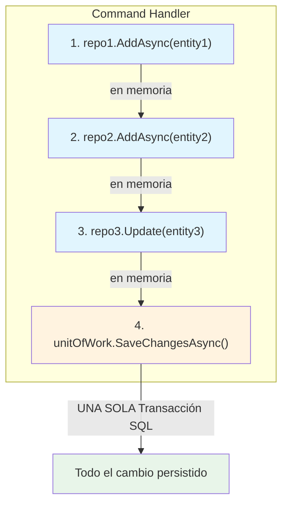
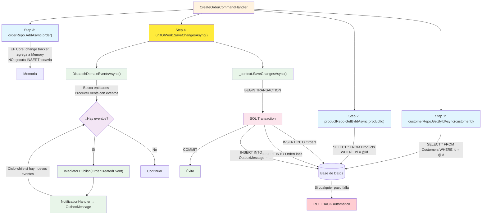

# Unit of Work (Unidad de Trabajo)


El patrón **Unit of Work** garantiza que múltiples operaciones de repositorio se persistan en una **única transacción SQL**. Si una operación falla, se revierten todos los cambios.

---

#### Tabla de Contenidos

1. [¿Qué es Unit of Work?](#qué-es-unit-of-work)
2. [Problema sin Unit of Work](#problema-sin-unit-of-work)
3. [Solución con Unit of Work](#solución-con-unit-of-work)
4. [Implementación](#implementación)
5. [Flujo de Datos](#flujo-de-datos)
6. [Antes vs Después](#antes-vs-después)
7. [Registro en DI](#registro-en-di)
8. [Beneficios](#beneficios)
9. [Cuándo usarlo](#cuándo-usarlo)
10. [Referencia de Archivos](#referencia-de-archivos)

---

## ¿Qué es Unit of Work?

**Unit of Work** es un patrón que mantiene una lista de objetos afectados por una operación de negocio y coordina la escritura de los cambios y la resolución de problemas de concurrencia.

Piensa en el Unit of Work como un **cajero de banco** que procesa varias transacciones (transferir dinero, pagar un recibo, etc.) y las confirma todas juntas. Si alguna falla, revierte todo. Tú no hablas con cada sistema individualmente; le dices al cajero "confirma todo" y él se encarga. En términos técnicos: el handler le dice al UnitOfWork "guarde todo esto" y el UnitOfWork se encarga de abrir la transacción SQL, ejecutar todos los INSERTs/UPDATEs, y confirmar o revertir. Sin este patrón, el handler tendría que coordinar cada transacción manualmente, lo cual es propenso a errores y viola el principio de responsabilidad única.



---

## Problema sin Unit of Work

Cuando cada repositorio tiene su propio `SaveChangesAsync`, el handler decide cuándo y cuántas veces guardar:

```csharp
// ❌ PROBLEMA: dos SaveChanges = dos transacciones separadas
await _customerRepository.AddAsync(customer);
await _customerRepository.SaveChangesAsync();  // Transacción 1

await _orderRepository.AddAsync(order);
await _orderRepository.SaveChangesAsync();  // Transacción 2
```

**Consecuencias:**

| Problema | Impacto |
|----------|---------|
| Transacciones parciales | El customer se guarda pero el order falla → datos inconsistentes |
| Sin rollback automático | No hay forma de revertir la primera escritura si la segunda falla |
| Acoplamiento al handler | El handler sabe cuándo guardar → violación de SRP |
| Difícil de testear | Cada test necesita mocking de SaveChanges en cada repo |

---

## Solución con Unit of Work

**Un solo punto de guardado** al final del caso de uso:

```csharp
// ✅ SOLUCIÓN: una sola transacción
await _customerRepository.AddAsync(customer);  // en memoria
await _orderRepository.AddAsync(order);        // en memoria
await _unitOfWork.SaveChangesAsync();           // UNA SOLA transacción SQL
```

**Garantías:**
- Si algo falla, **TODO** se revierte (rollback automático)
- Los repositorios solo operan en memoria (Add/Update/Delete)
- El handler solo dice "guarda todo" al final
- Una sola responsabilidad: `IUnitOfWork` maneja la persistencia

---

## Implementación

### Puerto (Application Layer)

```csharp
// SoftwareLearningGuide.Application/Ports/IUnitOfWork.cs
namespace SoftwareLearningGuide.Application.Command.Ports;

public interface IUnitOfWork
{
    Task<int> SaveChangesAsync(CancellationToken cancellationToken = default);
}
```

### Implementación (Infrastructure Layer)

El puerto define **QUÉ** se necesita (una interfaz con `SaveChangesAsync`), y la implementación define **CÓMO** se hace (con EF Core, MediatR y logging). Esta separación es el corazón de Clean Architecture: si mañana decides cambiar EF Core por Dapper, o MediatR por un event bus propio, solo cambias la implementación. Los Command Handlers ni se enteran porque dependen del puerto (la interfaz), no de la clase concreta. Además, esta separación permite inyectar un mock del UnitOfWork en tests unitarios sin necesitar una base de datos real.

El UnitOfWork en este proyecto tiene **dos responsabilidades**: garantizar atomicidad y despachar Domain Events antes de persistir.

> **Archivo productivo:** [`SoftwareLearningGuide.Infraestructure/Repositories/UnitOfWork.cs`](../SoftwareLearningGuide.Infraestructure/Repositories/UnitOfWork.cs)

```csharp
// SoftwareLearningGuide.Infraestructure/Repositories/UnitOfWork.cs
using MediatR;
using Microsoft.Extensions.Logging;
using SoftwareLearningGuide.Application.Command.Ports;
using SoftwareLearningGuide.Core.Business.DomainEvents;
using SoftwareLearningGuide.Infraestructure.Data.Context;

namespace SoftwareLearningGuide.Infraestructure.Data.Repositories;

public sealed class UnitOfWork : IUnitOfWork
{
    private readonly ApplicationDbContext _context;
    private readonly IMediator _mediator;
    private readonly ILogger<UnitOfWork> _logger;

    public UnitOfWork(ApplicationDbContext context, IMediator mediator, ILogger<UnitOfWork> logger) {
        _context = context ?? throw new ArgumentNullException(nameof(context));
        _mediator = mediator ?? throw new ArgumentNullException(nameof(mediator));
        _logger = logger ?? throw new ArgumentNullException(nameof(logger));
    }

    public async Task<int> SaveChangesAsync(CancellationToken cancellationToken = default) {
        await DispatchDomainEventsAsync(cancellationToken);

        var trackedEntries = _context.ChangeTracker.Entries()
            .Select(e => $"{e.Entity.GetType().Name} (Estado: {e.State})")
            .ToList();

        _logger.LogInformation(
            "[UnitOfWork] Guardando cambios. Entidades en ChangeTracker ({Count}): {Entries}",
            trackedEntries.Count, string.Join(", ", trackedEntries));

        return await _context.SaveChangesAsync(cancellationToken);
    }

    private async Task DispatchDomainEventsAsync(CancellationToken cancellationToken) {
        while (true) {
            var aggregateRoots = _context.ChangeTracker
                .Entries<ProduceEvents>()
                .Where(e => e.Entity != null && e.Entity.DomainEvents != null && e.Entity.DomainEvents.Any())
                .Select(e => e.Entity)
                .ToList();

            if (aggregateRoots.Count == 0)
                break;

            foreach (var aggregate in aggregateRoots) {
                if (aggregate is null) continue;

                var domainEvents = aggregate.DomainEvents.ToList();
                aggregate.ClearDomainEvents();

                foreach (var domainEvent in domainEvents) {
                    if (domainEvent is not null) {
                        await _mediator.Publish(domainEvent, cancellationToken);
                    }
                }
            }
        }
    }
}
```

### Explicación Paso a Paso de `DispatchDomainEventsAsync`

Este es el corazón del patrón. Veamos qué hace cada línea:

1. **`while (true)`** — Inicia un ciclo infinito que solo termina cuando no hay más eventos pendientes. Es necesario porque un handler puede generar nuevos eventos que crean una cascada.

2. **`_context.ChangeTracker.Entries<ProduceEvents>()`** — EF Core mantiene un ChangeTracker que sabe todas las entidades que están siendo modificadas. Aquí filtramos para obtener solo las que heredan de `ProduceEvents` (Order, Product, etc.) y que tengan al menos un evento en su lista `_domainEvents`.

3. **`.Where(e => e.Entity != null && e.Entity.DomainEvents != null && e.Entity.DomainEvents.Any())`** — Solo nos interesan las entidades que tienen eventos pendientes. Filtramos entidades no nulas, con una lista de eventos no nula y al menos un evento. Si una entidad fue modificada pero no generó eventos, la ignoramos.

4. **`.ToList()`** — Materializa la consulta. Es importante hacerlo aquí porque vamos a modificar las entidades (limpiar eventos) mientras iteramos, y no podemos modificar una colección que estamos iterando.

5. **`if (aggregateRoots.Count == 0) break`** — Si no hay eventos pendientes, salimos del ciclo. Esta es la condición de salida del `while(true)`.

6. **`aggregate.DomainEvents.ToList()`** — Copiamos los eventos a una lista temporal. Es necesario porque vamos a llamar `ClearDomainEvents()` y no queremos perder los eventos mientras iteramos sobre ellos.

7. **`aggregate.ClearDomainEvents()`** — Limpiamos los eventos de la entidad **antes** de publicar. Esto es crítico: si publicáramos primero y limpiáramos después, un handler que genere un nuevo evento lo agregaría a la lista, y en la siguiente iteración del `while` se procesaría correctamente. Pero si no limpiáramos, el evento se procesaría dos veces (re-procesamiento).

8. **`await _mediator.Publish(domainEvent)`** — MediatR ejecuta todos los `NotificationHandler` registrados para ese tipo de evento. Aquí es donde un handler puede: (a) crear un Integration Event que MassTransit guarda en OutboxMessage, o (b) generar un nuevo Domain Event que se agregará a la lista de alguna entidad, lo que hará que el `while(true)` tenga otra iteración.

**Puntos clave:**

- El `while(true)` maneja la cascada de eventos: un handler puede generar nuevos domain events
- Se buscan entidades `ProduceEvents` (base de Order, Product, etc.)
- `ClearDomainEvents()` se llama antes de `Publish()` para evitar re-procesamiento
- Los `NotificationHandler` crean Integration Events que MassTransit escribe en `OutboxMessage` **dentro de la misma transaccion**

### Repositorio Base (sin SaveChanges)

El repositorio base encapsula todas las operaciones CRUD en memoria sobre el `DbContext` y el `ChangeTracker` de EF Core. No tiene `SaveChangesAsync` — esa responsabilidad es de `IUnitOfWork`, que garantiza que todas las operaciones de múltiples repositorios se confirmen en una única transacción. También introduce un `_idFactory` necesario porque el `DbSet<TEntity>` usa el tipo de identificador `TIdValue` de la entidad, pero la interfaz `IBaseRepository<TEntity, TIdValue>` expone ese mismo tipo.

> **Archivo productivo:** [`SoftwareLearningGuide.Infraestructure/Repositories/BaseRepository.cs`](../SoftwareLearningGuide.Infraestructure/Repositories/BaseRepository.cs)

```csharp
// SoftwareLearningGuide.Infraestructure/Repositories/BaseRepository.cs
using Microsoft.EntityFrameworkCore;
using SoftwareLearningGuide.Application.Command.Ports;
using SoftwareLearningGuide.Infraestructure.Data.Context;

public abstract class BaseRepository<TEntity, TId, TIdValue> : IBaseRepository<TEntity, TIdValue>
    where TEntity : class {
    protected readonly ApplicationDbContext _context;
    protected readonly DbSet<TEntity> _dbSet;
    private readonly Func<TIdValue, TId> _idFactory;

    protected BaseRepository(ApplicationDbContext context, Func<TIdValue, TId> idFactory) {
        _context = context ?? throw new ArgumentNullException(nameof(context));
        _dbSet = context.Set<TEntity>();
        _idFactory = idFactory ?? throw new ArgumentNullException(nameof(idFactory));
    }

    public virtual async Task<TEntity?> GetByIdAsync(TIdValue id, CancellationToken cancellationToken = default) {
        var typedId = _idFactory(id);

        return await _dbSet.FirstOrDefaultAsync(e => EF.Property<TId>(e, "Id").Equals(typedId), cancellationToken);
    }

    public virtual async Task AddAsync(TEntity entity, CancellationToken cancellationToken = default) {
        await _dbSet.AddAsync(entity, cancellationToken);
    }
}
```

---

## Flujo de Datos



---

## Antes vs Después

### La diferencia clave

La diferencia principal no es solo que desaparezca `SaveChangesAsync` de los repos, sino que el UnitOfWork ahora tiene una **doble responsabilidad**: despachar eventos **Y** persistir. Esto centraliza la lógica transaccional en un solo punto. Antes, cada repositorio era dueño de su propia transacción (si es que tenía una). Ahora, el UnitOfWork es el único que sabe cuándo y cómo guardar. Esto significa que si mañana necesitas agregar logging antes del save, o una validación transaccional, o un segundo evento de dominio, solo modificas una clase: el UnitOfWork. Los repos y los handlers no cambian.

### CreateOrderCommandHandler

**❌ Antes (sin Unit of Work):**

```csharp
public sealed class CreateOrderCommandHandler : IRequestHandler<CreateOrderCommand, Result<Guid>>
{
    private readonly IOrderWriteRepository _orderRepository;
    private readonly ICustomerWriteRepository _customerRepository;
    private readonly IProductWriteRepository _productRepository;

    public CreateOrderCommandHandler(
        IOrderWriteRepository orderRepository,
        ICustomerWriteRepository customerRepository,
        IProductWriteRepository productRepository)
    {
        _orderRepository = orderRepository;
        _customerRepository = customerRepository;
        _productRepository = productRepository;
    }

    public async Task<Result<Guid>> Handle(CreateOrderCommand request, CancellationToken cancellationToken)
    {
        // ... validaciones ...

        await _orderRepository.AddAsync(order, cancellationToken);
        await _orderRepository.SaveChangesAsync(cancellationToken);  // ← acoplado al repo

        return Result<Guid>.Success(order.Id.Value);
    }
}
```

**✅ Después (con Unit of Work):**

```csharp
public sealed class CreateOrderCommandHandler : IRequestHandler<CreateOrderCommand, Result<Guid>>
{
    private readonly IOrderWriteRepository _orderRepository;
    private readonly ICustomerWriteRepository _customerRepository;
    private readonly IProductWriteRepository _productRepository;
    private readonly IUnitOfWork _unitOfWork;  // 👈 Nueva dependencia

    public CreateOrderCommandHandler(
        IOrderWriteRepository orderRepository,
        ICustomerWriteRepository customerRepository,
        IProductWriteRepository productRepository,
        IUnitOfWork unitOfWork)               // 👈 Inyección limpia
    {
        _orderRepository = orderRepository;
        _customerRepository = customerRepository;
        _productRepository = productRepository;
        _unitOfWork = unitOfWork;
    }

    public async Task<Result<Guid>> Handle(CreateOrderCommand request, CancellationToken cancellationToken)
    {
        // ... validaciones ...

        await _orderRepository.AddAsync(order, cancellationToken);
        await _unitOfWork.SaveChangesAsync(cancellationToken);  // 👈 Transacción única

        return Result<Guid>.Success(order.Id.Value);
    }
}
```

### IBaseRepository

**❌ Antes:**

```csharp
public interface IBaseRepository<TEntity, TId> where TEntity : class
{
    Task<TEntity?> GetByIdAsync(TId id, CancellationToken cancellationToken = default);
    Task AddAsync(TEntity entity, CancellationToken cancellationToken = default);
    Task<int> SaveChangesAsync(CancellationToken cancellationToken = default);  // ← en cada repo
}
```

**✅ Después:**

```csharp
public interface IBaseRepository<TEntity, TId> where TEntity : class
{
    Task<TEntity?> GetByIdAsync(TId id, CancellationToken cancellationToken = default);
    Task AddAsync(TEntity entity, CancellationToken cancellationToken = default);
    // SaveChangesAsync eliminado — responsabilidad de IUnitOfWork
}
```

---

## Registro en DI

```csharp
// SoftwareLearningGuide.Api/Startup/ReporitoriesStartup.cs
public static IServiceCollection AddRepositories(this IServiceCollection services)
{
    services.AddScoped<IOrderWriteRepository, OrderWriteRepository>();
    services.AddScoped<IProductWriteRepository, ProductWriteRepository>();
    services.AddScoped<ICustomerWriteRepository, CustomerWriteRepository>();
    services.AddScoped<IUnitOfWork, UnitOfWork>();  // 👈 Nuevo registro
    return services;
}
```

**¿Por qué Scoped?** Porque comparte la misma instancia de `ApplicationDbContext` dentro de un solo request HTTP. Todos los repositorios y el UnitOfWork operan sobre el mismo `DbContext` y el mismo Change Tracker.

Si el UnitOfWork fuera **Singleton**, tendríamos problemas de concurrencia graves: dos requests HTTP simultáneas compartirían el mismo DbContext, y EF Core no está diseñado para eso. Un request podría estar escribiendo mientras otro lee, generando resultados corruptos o excepciones de "the instance of ApplicationDbContext is currently being used by other operations".

Si fuera **Transient**, cada repositorio tendría su propio DbContext y no podrían compartir la misma transacción. El UnitOfWork despacharía eventos en un DbContext, pero el repositorio estaría usando otro completamente distinto. La atomicidad se rompería: el Order se guardaría en un DbContext y el OutboxMessage en otro, sin transacción compartida.

**Scoped** es el punto dulce: un DbContext por request HTTP, compartido entre todos los participantes de ese request.

---

## Beneficios

| Beneficio | Descripción |
|-----------|-------------|
| **Transaccionalidad** | Todas las operaciones se guardan en una sola transacción SQL |
| **Atomicidad** | Si algo falla, TODO se revierte (rollback automático) |
| **Separación de responsabilidades** | Los repositorios solo hacen CRUD en memoria; el UnitOfWork coordina la persistencia |
| **Consistencia** | Evita datos parcialmente guardados (customer guardado, order no) |
| **Testabilidad** | Se puede mockear `IUnitOfWork` para tests unitarios sin EF Core |
| **Points de extensión** | Fácil de agregar Domain Events,logging o validaciones antes del Save |
| **Clean Architecture** | El Application layer define el puerto; Infrastructure lo implementa |

---

## Cuándo usarlo

- **Command Handlers** que modifican múltiples entidades en un solo caso de uso
- **Operaciones que deben ser atómicas** (crear Order + OrderLine, transferir stock, etc.)
- **Cuando tienes múltiples repositorios** involucrados en una misma operación de negocio

**No es necesario para:**
- Query Handlers (solo leen, no escriben)
- Operaciones sobre una sola entidad sin relaciones cruzadas
- Lecturas con Dapper (ya son sin tracking)

---

## Referencia de Archivos

| Capa | Archivo | Descripción |
|------|---------|-------------|
| **Application** | [`Ports/IUnitOfWork.cs`](../SoftwareLearningGuide.Application/Ports/IUnitOfWork.cs) | Puerto (interfaz) |
| **Infrastructure** | [`Repositories/UnitOfWork.cs`](../SoftwareLearningGuide.Infraestructure/Repositories/UnitOfWork.cs) | Implementación con domain events + atomicidad |
| **Infrastructure** | [`Repositories/BaseRepository.cs`](../SoftwareLearningGuide.Infraestructure/Repositories/BaseRepository.cs) | Repositorio base sin SaveChanges |
| **Application** | [`Ports/IBaseRepository.cs`](../SoftwareLearningGuide.Application/Ports/IBaseRepository.cs) | Puerto base sin SaveChanges |
| **Api** | [`Startup/ReporitoriesStartup.cs`](../SoftwareLearningGuide.Api/Startup/ReporitoriesStartup.cs) | Registro de DI |

---

**Última actualización:** 2026
**Proyecto:** SoftwareLearningGuide
