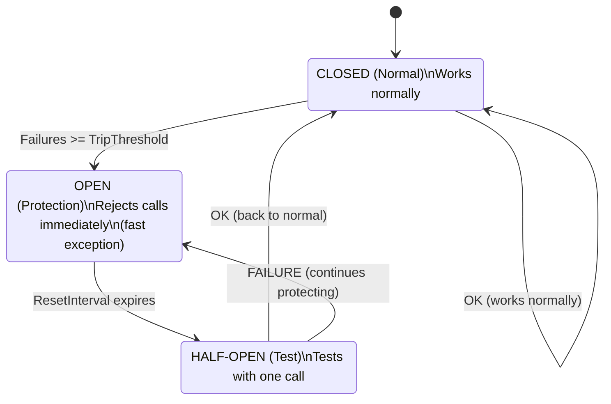
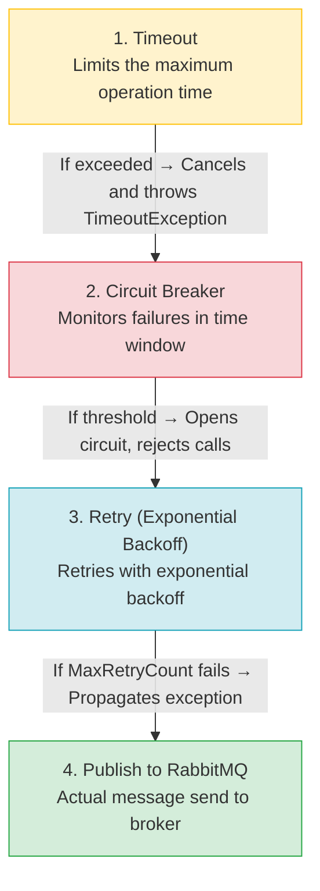

# Resilience in RabbitMQ Communication


**Resilience** is a system's ability to recover from failures and continue operating. In a distributed system where the `OutboxProcessor` communicates with RabbitMQ, network failures, timeouts, or broker overload are inevitable. This document explains how **three resilience patterns** are implemented in the MassTransit pipeline.

---

#### Table of Contents

1. [The Problem It Solves](#the-problem-it-solves)
2. [The Three Resilience Patterns](#the-three-resilience-patterns)
   - [Retry](#retry)
   - [Circuit Breaker](#circuit-breaker)
   - [Timeout](#timeout)
3. [Architecture: Resilience Pipeline in MassTransit](#architecture-resilience-pipeline-in-masstransit)
4. [Configuration](#configuration)
5. [Code Implementation](#code-implementation)
6. [Examples: What Happens on Failure](#examples-what-happens-on-failure)
7. [File Structure](#file-structure)
8. [Recommended Resources](#recommended-resources)

---

## The Problem It Solves

The `OutboxProcessor` is a Worker Service that reads messages from `DomainOutboxMessages` and publishes them to RabbitMQ. If RabbitMQ is unavailable, communication fails. Without resilience:

```
OutboxProcessor → Publishes to RabbitMQ → FAILURE (timeout, network down, broker overloaded)
```

**Result:** The message stays in the outbox table but is not delivered. Without retries or circuit breaker, the system can:

- **Get stuck** waiting for a response that never comes
- **Accumulate infinite retries** consuming resources
- **Saturate the network** with calls to a downed service

> **Think of resilience as an electrical fuse.** If a circuit receives too much current, the fuse blows to protect the system. If RabbitMQ is overloaded, the circuit breaker "opens" and stops sending it traffic, giving it time to recover. When it's healthy again, traffic flows normally.

---

## The Three Resilience Patterns

### Retry

The **Retry** pattern retries a failed operation before giving up. In MassTransit it's configured with `UseMessageRetry` and supports several strategies:

| Strategy | Description | When to Use |
|------------|-------------|---------------|
| `Immediate` | Retries immediately N times | Very transient failures (e.g., momentary connection) |
| `Interval` | Retries after a fixed interval | When you need a constant delay |
| `Intervals` | Retries with specific intervals | When you want full control |
| **`Exponential`** | Exponential backoff (1s, 2s, 4s, 8s...) | **Most common: balance between speed and load** |
| `Incremental` | Linear increment (1s, 2s, 3s...) | When exponential backoff is too aggressive |

> **Why do we use Exponential?** Because it's the most balanced strategy. If RabbitMQ goes down for 30 seconds, an immediate retry (Immediate) would generate hundreds of failed calls in that time. Exponential backoff starts fast but spaces out, reducing load on the downed broker while recovering quickly when it comes back up.

#### Visual Example: Exponential Backoff

```
Attempt 1:  0s     → FAILURE
Attempt 2:  1s     → FAILURE
Attempt 3:  6s     → FAILURE (1 + 5 delta)
Attempt 4:  11s    → FAILURE (6 + 5 delta)
Attempt 5:  16s    → FAILURE (11 + 5 delta)
Attempt 6:  21s    → OK (RabbitMQ recovered)

Maximum: 30 seconds between retries
```

### Circuit Breaker

The **Circuit Breaker** pattern monitors failures and, when they reach a threshold, "opens the circuit" and rejects calls immediately without attempting the operation. This protects both the client and the remote service.

#### Circuit Breaker States



#### Configurable Properties

| Property | Type | Description |
|-----------|------|-------------|
| `TripThreshold` | `int` | Number of failures in TrackingPeriod to open the circuit |
| `ActiveThreshold` | `int` | Minimum active calls before evaluating the threshold |
| `TrackingPeriodMinutes` | `int` | Time window in minutes for counting failures |
| `ResetIntervalMinutes` | `int` | Time in minutes before attempting to move to HALF-OPEN |

> **Why a circuit breaker with RabbitMQ?** If RabbitMQ goes down and the OutboxProcessor keeps trying to publish, each retry consumes memory, CPU, and wait time. With 20 messages in the outbox and 3 retries each, that's 60 failed calls. The circuit breaker detects the failure pattern and says "enough, no more calls until RabbitMQ recovers." When the `ResetInterval` expires, it makes a single test. If it works, it closes the circuit again.

### Timeout

The **Timeout** pattern limits the maximum time an operation can take. If the operation doesn't complete within that time, it's canceled and considered failed.

| Property | Type | Description |
|-----------|------|-------------|
| `TimeoutSeconds` | `int` | Maximum time in seconds to complete the operation |

> **Why a 30-second timeout?** RabbitMQ normally responds in milliseconds. If an operation takes more than 30 seconds, something is wrong: the network is down, the broker is overloaded, or there's a configuration issue. Without a timeout, the operation could hang indefinitely, blocking the worker.

---

## Architecture: Resilience Pipeline in MassTransit

The three patterns are applied as **middleware** in the MassTransit pipeline, in the correct order to maximize protection:



> **Why this order?** The timeout goes first because it's the most basic protection: don't wait indefinitely. The circuit breaker goes after the timeout because it needs to count failures that already include timeouts. The retry goes last (before actual sending) because it's the last resort before failing. This order ensures each layer protects the next.

---

## Configuration

### Configuration File Structure

 [`SoftwareLearningGuide.OutboxProcessor/appsettings.json`](SoftwareLearningGuide.OutboxProcessor/appsettings.json)

```json
{
  "ResilienceConfiguration": {
    "MessageBrokerApi": {
      "Retry": {
        "MaxRetryCount": 3,
        "InitialRetryIntervalSeconds": 1,
        "MaxRetryIntervalSeconds": 30,
        "IntervalDeltaSeconds": 5
      },
      "CircuitBreaker": {
        "TripThreshold": 15,
        "ActiveThreshold": 10,
        "TrackingPeriodMinutes": 1,
        "ResetIntervalMinutes": 5
      },
      "TimeOut": {
        "TimeoutSeconds": 30
      }
    }
  }
}
```

### Values by Environment Table

| Property | Development | Production | Description |
|-----------|------------|------------|-------------|
| `Retry.MaxRetryCount` | 3 | 5 | Maximum number of retries |
| `Retry.InitialRetryIntervalSeconds` | 1 | 2 | Initial interval before first retry |
| `Retry.MaxRetryIntervalSeconds` | 30 | 120 | Maximum interval between retries |
| `Retry.IntervalDeltaSeconds` | 5 | 10 | Increment between each retry |
| `CircuitBreaker.TripThreshold` | 15 | 10 | Failures to open the circuit |
| `CircuitBreaker.ActiveThreshold` | 10 | 5 | Minimum calls before evaluating |
| `CircuitBreaker.TrackingPeriodMinutes` | 1 | 2 | Time window for counting failures |
| `CircuitBreaker.ResetIntervalMinutes` | 5 | 3 | Time to attempt HALF-OPEN |
| `TimeOut.TimeoutSeconds` | 30 | 10 | Maximum time per operation |

> **In development we use permissive values** because local services are stable. **In production we use stricter values** because network failures are more frequent and we need to protect the broker more aggressively.

---

## Code Implementation

### Configuration Options

[`SoftwareLearningGuide.OutboxProcessor/Options/ResilienceOptions.cs`](SoftwareLearningGuide.OutboxProcessor/Options/ResilienceOptions.cs)

```csharp
namespace SoftwareLearningGuide.OutboxProcessor.Options;

public sealed class ResilienceOptions {
    public static string SectionName => "ResilienceConfiguration";
    public MessageBrokerResilienceOptions MessageBrokerApi { get; set; } = new();
}

public sealed class MessageBrokerResilienceOptions {
    public RetryPolicyOptions Retry { get; set; } = new();
    public CircuitBreakerPolicyOptions CircuitBreaker { get; set; } = new();
    public TimeoutPolicyOptions TimeOut { get; set; } = new();
}

public sealed class RetryPolicyOptions {
    public int MaxRetryCount { get; set; } = 3;
    public int InitialRetryIntervalSeconds { get; set; } = 1;
    public int MaxRetryIntervalSeconds { get; set; } = 30;
    public int IntervalDeltaSeconds { get; set; } = 5;
}

public sealed class CircuitBreakerPolicyOptions {
    public int TripThreshold { get; set; } = 15;
    public int ActiveThreshold { get; set; } = 10;
    public int TrackingPeriodMinutes { get; set; } = 1;
    public int ResetIntervalMinutes { get; set; } = 5;
}

public sealed class TimeoutPolicyOptions {
    public int TimeoutSeconds { get; set; } = 30;
}
```

> **Why `sealed` classes?** In .NET, sealed classes are slightly more performant because the JIT can optimize virtual calls. Additionally, they convey the intent that these classes should not be inherited: they are configuration contracts, not extensions.

### Options Binding

[`SoftwareLearningGuide.OutboxProcessor/Extensions/OptionConfigurationServiceCollectionExtensions.cs`](SoftwareLearningGuide.OutboxProcessor/Extensions/OptionConfigurationServiceCollectionExtensions.cs)

```csharp
public static IServiceCollection AddOptions(this IServiceCollection services, IConfiguration configuration) {
    // ... other options ...
    services.Configure<ResilienceOptions>(configuration.GetSection(ResilienceOptions.SectionName));
    return services;
}

public static ResilienceOptions GetResilienceOptions(this IConfiguration configuration) {
    return configuration
        .GetSection(ResilienceOptions.SectionName)
        .Get<ResilienceOptions>() ?? new ResilienceOptions();
}
```

### Application in MassTransit

[`SoftwareLearningGuide.OutboxProcessor/Program.cs`](SoftwareLearningGuide.OutboxProcessor/Program.cs)

```csharp
var resilienceOptions = builder.Configuration.GetResilienceOptions();

var retryPolicy = resilienceOptions.MessageBrokerApi.Retry;
var circuitBreakerPolicy = resilienceOptions.MessageBrokerApi.CircuitBreaker;
var timeoutPolicy = resilienceOptions.MessageBrokerApi.TimeOut;

builder.Services.AddMassTransit(x => {
    x.UsingRabbitMq((context, cfg) => {
        cfg.Host(messageBrokerOptions.Host, "/", h => {
            h.Username(messageBrokerOptions.Username);
            h.Password(messageBrokerOptions.Password);
        });

        // 1. Retry: configurable exponential backoff
        cfg.UseMessageRetry(r => r.Exponential(
            retryPolicy.MaxRetryCount,
            TimeSpan.FromSeconds(retryPolicy.InitialRetryIntervalSeconds),
            TimeSpan.FromSeconds(retryPolicy.MaxRetryIntervalSeconds),
            TimeSpan.FromSeconds(retryPolicy.IntervalDeltaSeconds)));

        // 2. Circuit Breaker: protection against sustained failures
        cfg.UseCircuitBreaker(cb => {
            cb.TripThreshold = circuitBreakerPolicy.TripThreshold;
            cb.ActiveThreshold = circuitBreakerPolicy.ActiveThreshold;
            cb.TrackingPeriod = TimeSpan.FromMinutes(circuitBreakerPolicy.TrackingPeriodMinutes);
            cb.ResetInterval = TimeSpan.FromMinutes(circuitBreakerPolicy.ResetIntervalMinutes);
        });

        // 3. Timeout: time limit per operation
        cfg.UseTimeout(t => t.Timeout = TimeSpan.FromSeconds(timeoutPolicy.TimeoutSeconds));

        cfg.ConfigureEndpoints(context);
    });
});
```

---

## Examples: What Happens on Failure

### Scenario 1: RabbitMQ goes down for 2 minutes

```
Second 0:  RabbitMQ goes down
           → OutboxProcessor tries to publish
           → Attempt 1: FAILURE (0s)
           → Attempt 2: FAILURE (1s later)
           → Attempt 3: FAILURE (6s later)
           → Attempt 4: FAILURE (11s later)
           → Attempt 5: FAILURE (16s later)
           → Max retries reached, propagates exception

Second 60: RabbitMQ recovers
           → OutboxProcessor retries in next cycle (5s)
           → Attempt 1: OK
           → Message published successfully
```

**Result:** The message is delivered with a maximum delay of ~2 minutes. No data loss.

### Scenario 2: RabbitMQ down for 10 minutes (Circuit Breaker activates)

```
Minute 0:  RabbitMQ goes down
           → OutboxProcessor tries to publish
           → SUCCESSIVE FAILURES → Circuit Breaker counts in TrackingPeriod

Minute 1:  TripThreshold reached (15 failures in 1 minute)
           → Circuit Breaker OPENS → Rejects calls immediately
           → No more failed attempts, saves resources

Minute 5:  ResetInterval expires
           → Circuit Breaker HALF-OPEN → Tests with 1 call
           → FAILURE (RabbitMQ still down)
           → Circuit Breaker returns to OPEN

Minute 8:  RabbitMQ recovers
           → ResetInterval expires
           → Circuit Breaker HALF-OPEN → Tests with 1 call
           → OK
           → Circuit Breaker CLOSES → Returns to normal operation

Minute 9:  OutboxProcessor processes pending messages
           → All outbox messages are published
```

**Result:** The circuit breaker prevents hundreds of useless retries. When RabbitMQ recovers, traffic returns automatically.

### Scenario 3: RabbitMQ responds slowly (Timeout)

```
Attempt 1:  OutboxProcessor publishes
            → RabbitMQ doesn't respond within 30 seconds
            → Timeout cancels the operation
            → FAILURE: TimeoutException

Attempt 2:  OutboxProcessor retries (1s later)
            → RabbitMQ responds in 200ms
            → OK
```

**Result:** The timeout prevents the worker from hanging. If RabbitMQ is slow but not down, the retry with backoff resolves the issue.

---

## File Structure

```
SoftwareLearningGuide.OutboxProcessor/
├── Options/
│   ├── ResilienceOptions.cs           ← Resilience configuration classes
│   ├── DatabaseOptions.cs
│   ├── MessageBrokerOptions.cs
│   └── OpenTelemetryOptions.cs
├── Extensions/
│   └── OptionConfigurationServiceCollectionExtensions.cs  ← ResilienceOptions binding
├── Workers/
│   └── CustomOutboxProcessorWorker.cs ← Worker using IPublishEndpoint (resilience applied)
├── Program.cs                         ← Applies policies to MassTransit pipeline
├── appsettings.json                   ← Production template (empty values)
├── appsettings.Development.json       ← Development values
└── README.Resilience.md               ← This file
```

### Related Files

| File | Role |
|---------|-----|
| [`ResilienceOptions.cs`](SoftwareLearningGuide.OutboxProcessor/Options/ResilienceOptions.cs) | Defines retry, circuit breaker and timeout options |
| [`OptionConfigurationServiceCollectionExtensions.cs`](SoftwareLearningGuide.OutboxProcessor/Extensions/OptionConfigurationServiceCollectionExtensions.cs) | Registers and reads options from appsettings |
| [`Program.cs`](SoftwareLearningGuide.OutboxProcessor/Program.cs) | Applies policies to MassTransit pipeline |
| [`CustomOutboxProcessorWorker.cs`](SoftwareLearningGuide.OutboxProcessor/Workers/CustomOutboxProcessorWorker.cs) | Worker that publishes messages via IPublishEndpoint |

---

## Recommended Resources

- [MassTransit - Message Retry Configuration](https://masstransit.io/documentation/configuration/middleware/retry)
- [MassTransit - Circuit Breaker Configuration](https://masstransit.io/documentation/configuration/middleware/circuit-breaker)
- [Martin Fowler - Circuit Breaker Pattern](http://martinfowler.com/bliki/CircuitBreaker.html)
- [Polly - Resilience and Transient Fault Handling](https://github.com/App-vNext/Polly)
- [Exponential Backoff and Jitter - AWS Architecture Blog](https://aws.amazon.com/blogs/architecture/exponential-backoff-and-jitter/)
- [Michael T. Nygard - Release It!](https://pragprog.com/titles/mnee2/release-it-second-edition/)

---

**Last updated:** 2026
**Project:** SoftwareLearningGuide.OutboxProcessor
