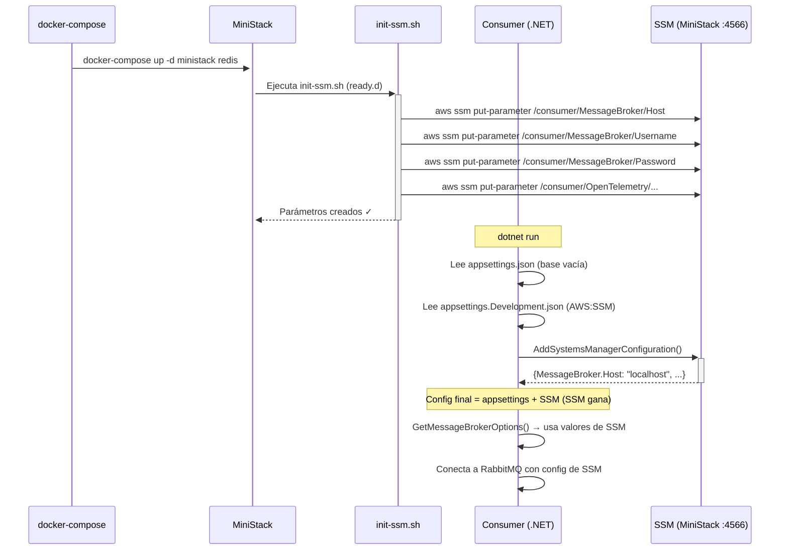
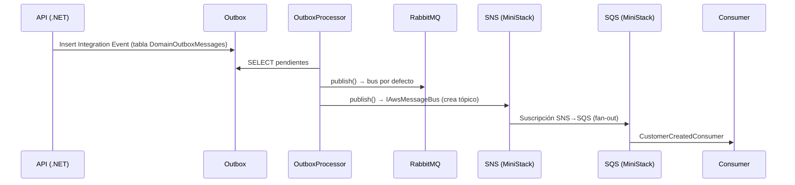
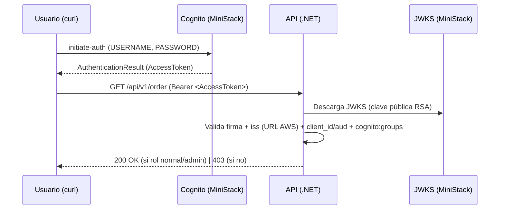

<h1 align="center">MiniStack — Emulador Local de AWS</h1>

<p align="center">
  <em>Aprende qué es MiniStack, para qué se usa, qué servicios AWS emula y cómo se implementó en este proyecto</em>
</p>

<p align="center">
  
  
  
  
</p>

---

## Tabla de Contenidos

1. [¿Qué es MiniStack?](#qué-es-ministack)
2. [¿Por qué existe? El problema de LocalStack](#por-qué-existe-el-problema-de-localstack)
3. [¿Para qué se usa?](#para-qué-se-usa)
4. [¿Cómo funciona?](#cómo-funciona)
5. [Servicios AWS disponibles en MiniStack](#servicios-aws-disponibles-en-ministack)
6. [Alternativas a MiniStack](#alternativas-a-ministack)
7. [Setup: cómo interactuar con MiniStack](#setup-cómo-interactuar-con-ministack)
8. [MiniStack en este proyecto](#ministack-en-este-proyecto)
   - [Servicios de MiniStack implementados](#servicios-de-ministack-implementados)
   - [Configuración en docker-compose](#configuración-en-docker-compose)
   - [Script de inicialización `init-ssm.sh`](#script-de-inicialización-init-ssmsh)
   - [Integración en .NET](#integración-en-net)
   - [Flujo completo: de arranque a configuración cargada](#flujo-completo-de-arranque-a-configuración-cargada)
   - [Mensajería con SNS/SQS (publicar y consumir)](#mensajería-con-snssqs-publicar-y-consumir)
   - [Autenticación con Cognito (JWT y RBAC)](#autenticación-con-cognito-jwt-y-rbac)
9. [Comandos útiles](#comandos-útiles)
10. [Documentación relacionada](#documentación-relacionada)

---

## ¿Qué es MiniStack?

**MiniStack** es un **emulador local gratuito y open-source de los servicios de AWS**. Corre en un contenedor Docker (o directamente con `pip install ministack`) y expone en un único puerto (`4566`) los mismos endpoints que AWS real, para que tus aplicaciones funcionen **sin una cuenta de AWS, sin costes y sin conectividad a Internet**.

Es "drop-in compatible": si tu código usa el **AWS SDK, AWS CLI, Terraform, CDK, Pulumi o cualquier herramienta de AWS**, funciona contra MiniStack simplemente apuntando el endpoint a `http://localhost:4566`.

| Característica | Detalle |
|----------------|---------|
| **Licencia** | MIT (gratis, open-source, "Free forever") |
| **Servicios** | 60+ servicios de AWS emulados |
| **Puerto** | `4566` (un solo puerto para todos los servicios) |
| **Instalación** | `docker run -p 4566:4566 ministackorg/ministack` o `pip install ministack` |
| **Tamaño** | ~270 MB de imagen, ~30 MB RAM en reposo |
| **Arranque** | < 2 segundos |
| **Compatibilidad** | AWS CLI, boto3, AWS SDK (.NET, Java, Go, JS), Terraform, CDK, Pulumi |
| **Infraestructura real** | RDS (Postgres/MySQL reales), ElastiCache (Redis real), ECS (Docker real), EKS (k3s real), Athena (DuckDB real) |

> **Idea clave:** un emulador local de AWS te da el mismo comportamiento que AWS real (mismos endpoints, mismos formatos, mismos errores), pero en tu máquina. Esto permite desarrollar, testear y correr CI/CD sin pagar ni un centavo.

---

## ¿Por qué existe? El problema de LocalStack

MiniStack nace como respuesta directa a **LocalStack**, el emulador de AWS más popular, que movió sus servicios principales detrás de un plan de pago. Los equipos que dependían de la edición Community de LocalStack (S3, Lambda, DynamoDB, SQS... para desarrollo local y CI/CD) se quedaron sin una opción gratuita completa.

MiniStack se construyó como reemplazo: **mismo puerto, misma compatibilidad con SDKs, licencia MIT real, sin bait-and-switch**. Hoy emula más de 60 servicios, incluidos los que LocalStack dejó de ofrecer gratis (Lambda, IAM, SSM, EventBridge) e incluso **infraestructura real** (bases de datos, contenedores, Kubernetes).

---

## ¿Para qué se usa?

MiniStack se usa siempre que necesites **simular AWS en un entorno controlado**:

| Caso de uso | Qué permite |
|-------------|-------------|
| **Desarrollo local** | Correr tu aplicación contra S3/SQS/DynamoDB/SSM sin cuenta AWS |
| **Tests de integración** | Pruebas que levantan recursos AWS reales de forma aislada y barata |
| **CI/CD** | Pipelines que validan Terraform/CloudFormation sin desplegar nada en AWS |
| **Aprender AWS** | Experimentar con servicios y CLI sin coste (lo que hace este proyecto) |
| **Desarrollar sin conexión** | Trabajar sin internet, sin depender de la red de AWS |
| **Seed de datos** | Crear estado inicial (parámetros, tablas, buckets) mediante scripts de arranque |

### Ventajas frente a usar AWS real

| Aspecto | MiniStack (local) | AWS real |
|---------|-------------------|----------|
| **Coste** | Gratis | Pay-as-you-go |
| **Cuenta / credenciales** | Cualquier valor (`test`/`test`) | IAM real |
| **Velocidad** | Arranca en < 2 s | Provisioning de minutos |
| **Riesgo** | Cero (no tocas infraestructura real) | Puede generar costes |
| **Determinismo** | Estado controlado y reseteable | Depende del entorno |
| **Internet** | No necesaria | Requerida |

---

## ¿Cómo funciona?

MiniStack es un **gateway** (un único proceso HTTP) que escucha en el puerto `4566`. Cada petición lleva el servicio en el path o en el host de la API (estilo SigV4), y MiniStack lo enruta al emulador correspondiente manteniendo el **mismo formato de respuesta que AWS real**.

```
Tu app / AWS CLI / Terraform
        │  aws --endpoint-url=http://localhost:4566
        ▼
  MiniStack (puerto 4566)  ──►  /s3    ──► emulador S3
                                /sqs   ──► emulador SQS
                                /ssm   ──► emulador SSM
                                /...   ──► 60+ servicios
```

### Arranque rápido

```bash
# Opción 1: Docker
docker run -p 4566:4566 ministackorg/ministack

# Opción 2: pip (Python)
pip install ministack
ministack

# Opción 3: con infraestructura real (RDS, ECS, Lambda en Docker)
docker run -p 4566:4566 -v /var/run/docker.sock:/var/run/docker.sock ministackorg/ministack

# Verificar que está vivo
curl http://localhost:4566/_ministack/health
```

### Endpoints internos útiles

```bash
# Estado de salud de todos los servicios
curl http://localhost:4566/_ministack/health

# Resetear todo el estado (¡ideal para entre tests!)
curl -X POST http://localhost:4566/_ministack/reset
curl -X POST "http://localhost:4566/_ministack/reset?init=1"   # reset + re-ejecutar scripts de arranque

# Ver mensajes de SQS / SES (inspección)
curl http://localhost:4566/_ministack/sqs/messages
curl http://localhost:4566/_ministack/ses/messages
```

### Configuración por variables de entorno

| Variable | Default | Descripción |
|----------|---------|-------------|
| `GATEWAY_PORT` | `4566` | Puerto del gateway |
| `MINISTACK_HOST` | `localhost` | Hostname usado en las URLs de respuesta |
| `MINISTACK_ACCOUNT_ID` | `000000000000` | ID de cuenta por defecto en los ARNs |
| `MINISTACK_REGION` | `us-east-1` | Región por defecto en los ARNs |
| `PERSIST_STATE` | `0` | Persistir el estado entre reinicios |
| `S3_PERSIST` | `0` | Persistir objetos S3 en disco |
| `LOG_LEVEL` | `INFO` | `DEBUG`, `INFO`, `WARNING`, `ERROR` |

### Multi-cuenta y multi-región

- **Multi-cuenta:** si tu `AWS_ACCESS_KEY_ID` es un número de 12 dígitos, MiniStack lo usa como **Account ID** en los ARNs, aislando los recursos por cuenta. Perfecto para que varios desarrolladores/pipelines compartan un mismo endpoint.
- **Multi-región:** el estado se aísla por región (`--region us-east-1` vs `--region eu-west-1`), imitando a AWS real.

```bash
# Multi-cuenta
export AWS_ACCESS_KEY_ID=111111111111   # → cuenta 111111111111
aws --endpoint-url=http://localhost:4566 sts get-caller-identity

# Multi-región
aws --endpoint-url=http://localhost:4566 --region us-east-1 sqs create-queue --queue-name jobs
aws --endpoint-url=http://localhost:4566 --region eu-west-1 sqs create-queue --queue-name jobs  # cola independiente
```

### Uso con AWS CLI, boto3 y .NET

```bash
# AWS CLI (credenciales dummy, MiniStack no las valida)
export AWS_ACCESS_KEY_ID=test
export AWS_SECRET_ACCESS_KEY=test
export AWS_DEFAULT_REGION=us-east-1

aws --endpoint-url=http://localhost:4566 s3 mb s3://mi-bucket
aws --endpoint-url=http://localhost:4566 sqs create-queue --queue-name mi-cola
aws --endpoint-url=http://localhost:4566 dynamodb list-tables
aws --endpoint-url=http://localhost:4566 ssm get-parameters-by-path --path "/" --recursive
```

```python
# boto3 (Python)
import boto3
s3 = boto3.client("s3", endpoint_url="http://localhost:4566",
                  aws_access_key_id="test", aws_secret_access_key="test", region_name="us-east-1")
s3.create_bucket(Bucket="mi-bucket")
s3.put_object(Bucket="mi-bucket", Key="hola.txt", Body=b"Hello, MiniStack!")
```

```csharp
// AWS SDK for .NET: se apunta a MiniStack con ServiceURL (ver sección "Integración en .NET")
new AmazonS3Config { ServiceURL = "http://localhost:4566" };
```

---

## Servicios AWS disponibles en MiniStack

MiniStack emula **más de 60 servicios** de AWS en un solo puerto. Se organizan en tres grupos:

### Servicios Core (los más usados)

| Servicio | Qué emula |
|----------|-----------|
| **S3** | Buckets, CRUD de objetos, multipart upload, versionado, lifecycle, CORS, bucket policies, Object Lock |
| **SQS** | Colas estándar y FIFO, deduplicación, DLQ, visibility timeout, batch |
| **SNS** | Tópicos, suscripciones, fan-out SNS→SQS y SNS→Lambda, tópicos FIFO, push móvil |
| **DynamoDB** | Tablas, CRUD, Query/Scan, TransactWriteItems, TTL, DynamoDB Streams |
| **Lambda** | Python y Node (warm pool), Go/Rust/C++ (Docker RIE), event source mappings, layers, aliases, Function URLs |
| **IAM** | Users, roles, policies, access keys, instance profiles, identity providers |
| **STS** | GetCallerIdentity, AssumeRole, GetSessionToken |
| **SecretsManager** | Secretos, versionado, rotación, replicación entre regiones |
| **CloudWatch Logs** | Log groups, streams, PutLogEvents, FilterLogEvents, métricas embebidas |

### Servicios Extendidos

| Servicio | Qué emula |
|----------|-----------|
| **SSM Parameter Store** | Parámetros String/SecureString/StringList, jerarquías, historial de versiones, labels |
| **EventBridge** | Buses, reglas, targets, PutEvents, archives y replays |
| **Kinesis** | Streams, shards, PutRecord/PutRecords, GetRecords |
| **CloudWatch Metrics** | Métricas, alarmas, dashboards |
| **SES / SES v2** | Envío de emails (almacenados en memoria, no se envían) |
| **Step Functions** | Máquinas de estado con ASL completo: Retry/Catch, Map/Parallel, waitForTaskToken, TestState |
| **API Gateway v1/v2** | REST APIs y HTTP APIs, Lambda proxy, WebSocket |
| **ELBv2 / ALB** | Load balancers, target groups, listeners, reglas por path |
| **KMS** | Claves, cifrado/descifrado, firma/verificación, rotación |
| **CloudFront** | Distribuciones, invalidaciones, Origin Access Control |
| **CloudTrail** | Trails y LookupEvents (auditoría) |
| **WAF v2** | Web ACLs, IP Sets, reglas |
| **MSK** | Control plane de Kafka (control-plane only) |
| **Bedrock** | Catálogo de modelos, Converse/InvokeModel (respuestas mock o conectable a Ollama/llama.cpp) |
| **AmazonMQ** | Control plane de brokers |

### Servicios de Infraestructura Real (levantan contenedores reales)

| Servicio | Qué hace de verdad |
|----------|--------------------|
| **RDS** | `CreateDBInstance` levanta un contenedor real de **Postgres/MySQL** y devuelve el endpoint real |
| **ElastiCache** | `CreateCacheCluster` levanta **Redis/Valkey/Memcached** reales |
| **ECS** | `RunTask` lanza **contenedores Docker reales** |
| **EKS** | `CreateCluster` levanta un clúster **k3s real** con el que funciona `kubectl` |
| **Athena** | Consultas SQL reales con **DuckDB** sobre datos locales |
| **Glue** | Jobs Python reales y Spark con la imagen oficial de Glue |
| **EFS / EC2 / EBS / ECR / Cognito / Route53 / AppSync / CloudFormation** | Control plane completo (EC2 no lanza VMs reales, solo metadatos) |

> **Nota:** casi todos los servicios emulados también soportan **persistencia** (`PERSIST_STATE=1`), para que los recursos sobrevivan a reinicios del contenedor.

---

## Alternativas a MiniStack

| Herramienta | Licencia | Servicios | Infraestructura real | Notas |
|-------------|----------|-----------|----------------------|-------|
| **MiniStack** | MIT (gratis) | 60+ | Sí (RDS, ElastiCache, ECS, EKS, Athena) | La alternativa gratuita a LocalStack |
| **LocalStack** | Pro (de pago) | 70+ | Sí (edición Pro) | Antes gratuita; los servicios core pasaron a pago |
| **AWS SAM Local** | Apache 2.0 | Lambda + API Gateway | No | Enfoque en serverless, usa imágenes oficiales AWS |
| **Serverless Offline** | MIT | Lambda + API Gateway (plugin) | No | Para el framework Serverless |

---

## Setup: cómo interactuar con MiniStack

Para poder consultar los recursos que MiniStack emula (por ejemplo, los parámetros SSM que se crean al arrancar con `init-ssm.sh`), necesitas el **AWS CLI**.

### 1. Instalar el AWS CLI

```powershell
winget install Amazon.AWSCLI
```

Una vez instalado, ya puedes consultar los parámetros que se inyectaron al arranque de MiniStack:

```powershell
aws --endpoint-url=http://localhost:4566 ssm describe-parameters
```

### 2. (Opcional) Crear el alias `awslocal`

Escribir `--endpoint-url=http://localhost:4566` en cada comando es tedioso. Para hacerlo más fácil, puedes añadir **permanentemente** un alias en PowerShell:

#### 2.1 Abrir el perfil de PowerShell

Ejecuta este comando para abrir tu archivo de perfil en el Bloc de Notas (si no existe, lo creará automáticamente):

```powershell
if (!(Test-Path -Path $PROFILE)) { New-Item -ItemType File -Path $PROFILE -Force }
notepad $PROFILE
```

#### 2.2 Pegar la función del alias

En el archivo que se abre en el Bloc de Notas, añade esta línea al final:

```powershell
function awslocal { aws --endpoint-url=http://localhost:4566 $args }
```

Guarda los cambios (Ctrl + S) y cierra el Bloc de Notas.

#### 2.3 Usarlo

Después de eso podrás usarlo como:

```powershell
awslocal ssm describe-parameters
```

---

## MiniStack en este proyecto

Este proyecto educativo usa MiniStack para **emular la configuración de producción**: las tres aplicaciones (.NET) leen su configuración desde **SSM Parameter Store** en local exactamente igual que lo harían en AWS real.

### Servicios de MiniStack implementados

De los **60+ servicios** que MiniStack ofrece, este proyecto implementa **cuatro**:

| Servicio de MiniStack | Uso en el proyecto |
|-----------------------|--------------------|
| **SSM Parameter Store** | Almacena la configuración de la API, OutboxProcessor y Consumer (connection strings, message broker, OpenTelemetry, AWS.Messaging, AWS.Cognito) |
| **SNS** | Tópicos donde el OutboxProcessor publica los Integration Events (además de RabbitMQ) |
| **SQS** | Colas suscritas a los tópicos SNS donde el Consumer escucha con su consumidor "extra" (`CustomerCreatedConsumer`) |
| **Cognito (cognito-idp)** | User Pool con usuarios y grupos (`admin` / `normal`) que emite los **JWT** que la API valida para autenticación y RBAC |

Para que SSM funcione, MiniStack necesita su backend de persistencia:

| Servicio de MiniStack (soporte) | Rol |
|---------------------------------|-----|
| **Redis** (via `REDIS_HOST`) | Backend donde MiniStack persiste los parámetros SSM |

> **Diseño:** el resto de servicios (S3, DynamoDB, Lambda...) no se usan en este proyecto, pero quedan disponibles porque MiniStack los expone en el mismo puerto `4566`. Si mañana el proyecto necesitara, por ejemplo, un bucket S3, se usaría sin tocar la infraestructura.

### Configuración en docker-compose

El `docker-compose.yml` levanta **dos contenedores** para que MiniStack funcione:

```yaml
# docker-compose.yml
ministack:
  image: ministackorg/ministack
  container_name: ministack-slg
  ports:
    - "4566:4566"          # Endpoint principal de los servicios AWS emulados
  volumes:
    - /var/run/docker.sock:/var/run/docker.sock
    - ./scripts/ministack:/docker-entrypoint-initaws.d/ready.d   # Scripts de inicialización
  environment:
    - REDIS_HOST=redis     # MiniStack usa Redis internamente para persistencia
  depends_on:
    - redis

redis:
  image: redis:7-alpine
  container_name: redis-slg
  ports:
    - "6379:6379"
```

| Contenedor | Imagen | Puerto | Rol |
|------------|--------|--------|-----|
| `ministack-slg` | `ministackorg/ministack` | `4566` | Emula los endpoints de AWS (SSM y el resto de servicios) |
| `redis-slg` | `redis:7-alpine` | `6379` | Backend de persistencia de MiniStack |

> **¿Por qué Redis?** MiniStack almacena el estado de los parámetros SSM en Redis. Esto significa que los parámetros que crees **persisten** entre reinicios de MiniStack (mientras Redis esté activo).

### Script de inicialización `init-ssm.sh`

El archivo `scripts/ministack/init-ssm.sh` se ejecuta **automáticamente** cuando MiniStack arranca (via el volumen montado en `ready.d`). Su función es crear todos los parámetros SSM necesarios para el proyecto. Le acompaña `cognito-init.sh`, que **seeding** el User Pool de Cognito (usuarios, grupos y app client) y guarda los ids generados en SSM.

```
scripts/
└── ministack/
    ├── init-ssm.sh      ← Se ejecuta al arrancar MiniStack (parámetros SSM)
    └── cognito-init.sh  ← Se ejecuta al arrancar MiniStack (User Pool de Cognito)
```

El script usa el AWS CLI (apuntado a `localhost:4566`) para crear parámetros organizados por servicio:

#### API (`SoftwareLearningGuide.Api`)
| Parámetro SSM | Valor |
|---------------|-------|
| `/softwarelearningguide/dev/api/ConnectionStrings/SoftwareLearningGuide` | Connection string de SQL Server |
| `/softwarelearningguide/dev/api/OpenTelemetry/ServiceName` | `SoftwareLearningGuide` |
| `/softwarelearningguide/dev/api/OpenTelemetry/Otlp/Endpoint` | `http://localhost:4317` |
| `/softwarelearningguide/dev/api/OpenTelemetry/Otlp/Protocol` | `grpc` |
| `/softwarelearningguide/dev/api/CloudProvidersConfigurations/AWS/Cognito/Enabled` | `true` |
| `/softwarelearningguide/dev/api/CloudProvidersConfigurations/AWS/Cognito/Region` | `us-east-1` |
| `/softwarelearningguide/dev/api/CloudProvidersConfigurations/AWS/Cognito/ServiceUrl` | `http://localhost:4566` |
| `/softwarelearningguide/dev/api/CloudProvidersConfigurations/AWS/Cognito/UserPoolId` | generado por `cognito-init.sh` (ej: `us-east-1_aB3dEf9Gh`) |
| `/softwarelearningguide/dev/api/CloudProvidersConfigurations/AWS/Cognito/ClientId` | generado por `cognito-init.sh` (26 caracteres) |

#### OutboxProcessor
| Parámetro SSM | Valor |
|---------------|-------|
| `/softwarelearningguide/dev/outboxprocessor/Database/SoftwareLearningGuide` | Connection string de SQL Server |
| `/softwarelearningguide/dev/outboxprocessor/MessageBroker/Host` | `localhost` |
| `/softwarelearningguide/dev/outboxprocessor/MessageBroker/Username` | `guest` |
| `/softwarelearningguide/dev/outboxprocessor/MessageBroker/Password` | `guest` |
| `/softwarelearningguide/dev/outboxprocessor/OpenTelemetry/ServiceName` | `SoftwareLearningGuide.OutboxProcessor` |
| `/softwarelearningguide/dev/outboxprocessor/CloudProvidersConfigurations/AWS/Messaging/Enabled` | `true` |
| `/softwarelearningguide/dev/outboxprocessor/CloudProvidersConfigurations/AWS/Messaging/Region` | `us-east-1` |
| `/softwarelearningguide/dev/outboxprocessor/CloudProvidersConfigurations/AWS/Messaging/ServiceUrl` | `http://localhost:4566` |

#### Consumer
| Parámetro SSM | Valor |
|---------------|-------|
| `/softwarelearningguide/dev/consumer/MessageBroker/Host` | `localhost` |
| `/softwarelearningguide/dev/consumer/MessageBroker/Username` | `guest` |
| `/softwarelearningguide/dev/consumer/MessageBroker/Password` | `guest` |
| `/softwarelearningguide/dev/consumer/OpenTelemetry/ServiceName` | `SoftwareLearningGuide.Consumer` |
| `/softwarelearningguide/dev/consumer/CloudProvidersConfigurations/AWS/Messaging/Enabled` | `true` |
| `/softwarelearningguide/dev/consumer/CloudProvidersConfigurations/AWS/Messaging/Region` | `us-east-1` |
| `/softwarelearningguide/dev/consumer/CloudProvidersConfigurations/AWS/Messaging/ServiceUrl` | `http://localhost:4566` |

#### Convención de rutas

```
/softwarelearningguide/dev/{servicio}/{seccion}/{clave}
     ↑ app            ↑ env   ↑ quién lo usa
```

Esta jerarquía imita exactamente cómo organizarías los parámetros en AWS real. Al migrar a producción, solo cambiarías `dev` por `prod`.

### Integración en .NET

#### 1. Paquetes NuGet usados

```xml
<!-- SoftwareLearningGuide.Consumer.csproj (mismo patrón en Api y OutboxProcessor) -->
<PackageReference Include="Amazon.Extensions.NETCore.Setup" />
<PackageReference Include="Amazon.Extensions.Configuration.SystemsManager" />
<PackageReference Include="AWSSDK.SimpleSystemsManagement" />
```

#### 2. Clase de opciones: `CloudProvidersConfigurationOptions`

```csharp
// Options/CloudProvidersConfigurationOptions.cs
public class CloudProvidersConfigurationOptions {
    public static string SectionName => "CloudProvidersConfigurations";

    public AwsConfigurationOptions AWS { get; set; } = new();
}

public class AwsConfigurationOptions {
    public AwsCredentialsOptions Credentials { get; set; } = new();  // AccessKey / AccessSecret
    public SsmConfigurationOptions SSM { get; set; } = new();
    public AwsMessagingConfigurationOptions Messaging { get; set; } = new();
    public AwsCognitoConfigurationOptions Cognito { get; set; } = new();
}

public class AwsCredentialsOptions {
    public string AccessKey { get; set; }     // Credenciales "test" (MiniStack no las valida)
    public string AccessSecret { get; set; }
}

public class SsmConfigurationOptions {
    public static string SectionName => "SSM";

    public bool Enabled { get; set; }           // Activa/desactiva la integración SSM
    public string Path { get; set; }             // Ruta base en SSM (ej: /softwarelearningguide/dev/consumer/)
    public string Region { get; set; } = "us-east-1";
    public string ServiceUrl { get; set; }       // URL de MiniStack (http://localhost:4566) o vacío para AWS real
    public int ReloadIntervalSeconds { get; set; } = 300;
}

public class AwsMessagingConfigurationOptions {
    public static string SectionName => "Messaging";

    public bool Enabled { get; set; }           // Activa/desactiva el bus SNS/SQS (MassTransit)
    public string Region { get; set; } = "us-east-1";
    public string ServiceUrl { get; set; }       // URL de MiniStack (http://localhost:4566) o vacío para AWS real
}

public class AwsCognitoConfigurationOptions {
    public static string SectionName => "Cognito";

    public bool Enabled { get; set; }           // Activa/desactiva la autenticación JWT con Cognito
    public string UserPoolId { get; set; }       // Id del User Pool (generado por MiniStack)
    public string ClientId { get; set; }         // Id del App Client (generado por MiniStack)
    public string Region { get; set; } = "us-east-1";
    public string ServiceUrl { get; set; }       // URL de MiniStack (http://localhost:4566) o vacío para AWS real
}
```

#### 3. Extension method: `AddSystemsManagerConfiguration`

```csharp
// Extensions/ConfigurationBuilderExtensions.cs
public static IConfigurationBuilder AddSystemsManagerConfiguration(
    this IConfigurationBuilder configurationBuilder,
    IConfiguration configuration) {

    var cloudProvidersConfiguration = configuration
        .GetSection(CloudProvidersConfigurationOptions.SectionName)
        .Get<CloudProvidersConfigurationOptions>() ?? new CloudProvidersConfigurationOptions();

    var ssmOptions = cloudProvidersConfiguration.AWS.SSM;

    // Si SSM está desactivado o no hay path, no hace nada
    if (!ssmOptions.Enabled || string.IsNullOrEmpty(ssmOptions.Path))
        return configurationBuilder;

    var awsOptions = new AWSOptions {
        // Credenciales de CloudProvidersConfigurations:AWS:Credentials ("test"/"test")
        Credentials = new BasicAWSCredentials(
            cloudProvidersConfiguration.AWS.Credentials.AccessKey,
            cloudProvidersConfiguration.AWS.Credentials.AccessSecret),
        Region = RegionEndpoint.GetBySystemName(ssmOptions.Region)
    };

    // Si hay ServiceUrl → apunta a MiniStack local; si no → usa AWS real
    if (!string.IsNullOrEmpty(ssmOptions.ServiceUrl))
        awsOptions.DefaultClientConfig.ServiceURL = ssmOptions.ServiceUrl;

    configurationBuilder.AddSystemsManager(source => {
        source.Path = ssmOptions.Path;
        source.Optional = true;           // Si SSM no está disponible, continúa sin error
        source.ReloadAfter = TimeSpan.FromSeconds(ssmOptions.ReloadIntervalSeconds);
        source.AwsOptions = awsOptions;
    });

    return configurationBuilder;
}
```

#### 4. Registro en `Program.cs`

```csharp
// Program.cs del Consumer (mismo patrón en Api y OutboxProcessor)
var builder = Host.CreateApplicationBuilder(args);

// SSM Parameter Store (MiniStack/AWS): prioriza sobre appsettings; appsettings actúa como fallback
builder.Configuration.AddSystemsManagerConfiguration(builder.Configuration);
```

> **Importante:** SSM se carga **después** de `appsettings.json`. Esto significa que los valores de SSM **sobreescriben** los de `appsettings`, permitiendo que los archivos locales actúen como fallback cuando SSM no está disponible.

#### 5. Configuración en `appsettings`

```json
// appsettings.json — valores vacíos (fallback)
{
  "CloudProvidersConfigurations": {
    "AWS": {
      "Credentials": {
        "AccessKey": "",
        "AccessSecret": ""
      },
      "SSM": {
        "Enabled": false,
        "Path": "",
        "Region": "",
        "ServiceUrl": "",
        "ReloadIntervalSeconds": 0
      },
      "Messaging": {
        "Enabled": false,
        "Region": "",
        "ServiceUrl": ""
      },
      "Cognito": {
        "Enabled": false,
        "UserPoolId": "",
        "ClientId": "",
        "Region": "",
        "ServiceUrl": ""
      }
    }
  }
}

// appsettings.Development.json — apunta a MiniStack
{
  "CloudProvidersConfigurations": {
    "AWS": {
      "Credentials": {
        "AccessKey": "test",
        "AccessSecret": "test"
      },
      "SSM": {
        "Enabled": true,
        "Path": "/softwarelearningguide/dev/consumer/",
        "Region": "us-east-1",
        "ServiceUrl": "http://localhost:4566",
        "ReloadIntervalSeconds": 300
      },
      "Messaging": {
        "Enabled": true,
        "Region": "us-east-1",
        "ServiceUrl": "http://localhost:4566"
      },
      "Cognito": {
        "Enabled": true,
        "UserPoolId": "",
        "ClientId": "",
        "Region": "us-east-1",
        "ServiceUrl": "http://localhost:4566"
      }
    }
  }
}
```

### Flujo completo: de arranque a configuración cargada



### Mensajería con SNS/SQS (publicar y consumir)

Además de RabbitMQ, el proyecto usa MiniStack para emular **SNS (tópicos)** y **SQS (colas)** como **segundo transporte** de mensajería. Así se aprende el patrón **multi-bus de MassTransit**: un mismo Integration Event se publica en los dos brokers, y el Consumer escucha el transporte AWS con un consumidor "extra".

#### El patrón multi-bus de MassTransit

MassTransit permite registrar **más de un bus** en el mismo proceso. Para distinguirlos se usa una **interfaz marcadora** que hereda de `IBus`:

```csharp
// Buses/IAwsMessageBus.cs (idéntico en Consumer y OutboxProcessor)
public interface IAwsMessageBus : IBus;
```

- El **bus por defecto** (sin interfaz marcadora) sigue siendo **RabbitMQ**.
- El **bus AWS** (`IAwsMessageBus`) usa el transporte **AmazonSQS** de MassTransit, que publica en **tópicos SNS** y consume desde **colas SQS** suscritas a esos tópicos.

#### Paquete NuGet

```xml
<!-- SoftwareLearningGuide.Consumer.csproj (mismo paquete en OutboxProcessor) -->
<PackageReference Include="MassTransit.AmazonSQS" />
```

(Transitivamente trae `AWSSDK.SQS` y `AWSSDK.SimpleNotificationService`.)

#### Registro del bus AWS

El bus solo se registra si `AWS.Enabled` y `AWS.Messaging.Enabled` son `true`:

```csharp
// Extensions/AwsMessageBusServiceCollectionExtensions.cs
services.AddMassTransit<IAwsMessageBus>(x => {
    x.UsingAmazonSqs((context, cfg) => {
        cfg.Host(awsOptions.Messaging.Region, h => {
            h.AccessKey(awsOptions.Credentials.AccessKey);
            h.SecretKey(awsOptions.Credentials.AccessSecret);

            // ServiceURL → MiniStack local; si está vacío → AWS real
            if (!string.IsNullOrEmpty(awsOptions.Messaging.ServiceUrl)) {
                h.Config(new AmazonSQSConfig { ServiceURL = awsOptions.Messaging.ServiceUrl });
                h.Config(new AmazonSimpleNotificationServiceConfig { ServiceURL = awsOptions.Messaging.ServiceUrl });
            }
        });

        cfg.ConfigureEndpoints(context);
    });
});
```

> **¿Por qué dos `Config(...)`?** Cada servicio de AWS tiene su propio cliente: SNS y SQS. MiniStack los expone **a ambos** en `http://localhost:4566`, así que ambos clientes se apuntan al mismo endpoint. En AWS real dejarías `ServiceUrl` vacío y el SDK resolvería la región.

#### Publicación dual en el OutboxProcessor

El worker publica cada Integration Event a **los dos buses**: RabbitMQ (autoritativo) y SNS/SQS (best-effort):

```csharp
// Workers/CustomOutboxProcessorWorker.cs
var publishEndpoint = scope.ServiceProvider.GetRequiredService<IPublishEndpoint>(); // RabbitMQ
var awsBus = scope.ServiceProvider.GetService<IAwsMessageBus>();                     // SNS/SQS (opcional)

await publishEndpoint.Publish(deserializedObj, messageType, stoppingToken); // → RabbitMQ

if (awsBus != null) {
    await awsBus.Publish(deserializedObj, messageType, stoppingToken);     // → SNS/SQS
}
```

> **¿Por qué best-effort?** RabbitMQ sigue siendo el broker principal. Si la publicación a SNS/SQS falla, el mensaje se marca como procesado igualmente y solo se registra un warning; así no se reintenta y se evita un duplicado en RabbitMQ.

#### Consumidor "extra" en el Consumer

El Consumer registra los consumidores de RabbitMQ en el bus por defecto y los del transporte AWS en el bus marcado:

```csharp
// Program.cs del Consumer
builder.Services.AddMassTransit(x => {          // Bus por defecto → RabbitMQ
    x.AddConsumer<OrderCreatedConsumer>();
    x.AddConsumer<ProductCreatedConsumer>();
    x.AddConsumer<OrderCancelledConsumer>();
    x.AddConsumer<ProductStockLowConsumer>();
    x.UsingRabbitMq(...);
});

builder.Services.AddAwsMessageBus(builder.Configuration, x => {  // Bus AWS → SNS/SQS
    x.AddConsumer<CustomerCreatedConsumer>();                    // Consumidor "extra"
});
```

`CustomerCreatedConsumer` escucha `CustomerCreatedEvent` desde la cola SQS que MassTransit crea y **suscribe automáticamente** al tópico SNS (lo hace `ConfigureEndpoints`).

#### Cómo se ve en MiniStack

```
OutboxProcessor (publica)                              Consumer (consume)
      │  publish(CustomerCreatedEvent)                        ▲
      ▼                                                      │
   Tópico SNS "CustomerCreatedEvent" ──► Cola SQS ───────────┘
   (SNS)                            (suscripción SNS→SQS)
```

> **Fan-out:** SNS permite que **varios** consumidores se suscriban al mismo tópico. Hoy solo hay una cola SQS, pero si mañana se registrara otro consumidor en el bus AWS, ambos recibirían el mismo evento sin tocar el publicador.

#### Flujo end-to-end con SNS/SQS



### Autenticación con Cognito (JWT y RBAC)

La API protege sus endpoints con **JWT de AWS Cognito**: un usuario se autentica contra el User Pool (emulado por MiniStack), obtiene un **access token** y lo envía en el header `Authorization: Bearer <token>`. La API valida la firma, el issuer y el audience, y aplica **RBAC** según el claim `cognito:groups`.

#### Cómo lo emula MiniStack

MiniStack implementa la API de Cognito (`cognito-idp`, 62 operaciones): User Pools, App Clients, grupos, usuarios y emisión de tokens. Los detalles que importan:

- El **UserPoolId** (`us-east-1_<9 chars>`) y el **ClientId** (26 chars) son **aleatorios** → los genera y guarda en SSM `cognito-init.sh`.
- Los tokens **JWT** se firman con una **clave RSA local** y se exponen en el JWKS: `http://localhost:4566/{poolId}/.well-known/jwks.json`.
- El discovery doc OIDC está en `http://localhost:4566/{poolId}/.well-known/openid-configuration`. Su `issuer` es la **URL real de AWS** (`https://cognito-idp.{region}.amazonaws.com/{poolId}`) — el JWT lleva ese mismo valor en `iss`, y los SDKs solo lo comparan como string (nadie lo descarga). Por eso la API valida `iss` contra la URL de AWS real aunque los tokens vengan de MiniStack.
- El claim `cognito:groups` viaja en el token cuando el usuario pertenece a un grupo.
- **Matiz importante:** el **access token** de Cognito (MiniStack y AWS real) lleva el claim `client_id`, **no** `aud`; solo el **id token** lleva `aud`. La validación acepta ambos.

#### Script de seeding `cognito-init.sh`

```bash
# Se ejecuta automáticamente al arrancar MiniStack (junto a init-ssm.sh).
# Reutiliza el pool si ya existe (idempotente). Crea:
#   - User Pool  "softwarelearningguide"
#   - App Client "softwarelearningguide-app" (sin secret, flujo USER_PASSWORD_AUTH)
#   - Grupos:  admin, normal
#   - Usuarios: admin@test.com → grupo admin   |  user@test.com → grupo normal
#   - Guarda UserPoolId y ClientId en SSM
# También se puede ejecutar manualmente:
sh scripts/ministack/cognito-init.sh
```

| Usuario | Contraseña | Grupo | Puede acceder a |
|---------|-----------|-------|-----------------|
| `admin@test.com` | `Test1234!` | `admin` | Diagnostics + Order/Customer/Product |
| `user@test.com` | `Test1234!` | `normal` | Order/Customer/Product |

#### Paquetes NuGet (API)

```xml
<!-- SoftwareLearningGuide.Api.csproj -->
<PackageReference Include="AWSSDK.CognitoIdentityProvider" />
<PackageReference Include="Microsoft.AspNetCore.Authentication.JwtBearer" />
```

> El `Microsoft.AspNetCore.Authentication.JwtBearer` **ya no viene** en el framework compartido de .NET 10: hay que referenciarlo explícitamente.

#### Registro: `AddCognitoAuthentication`

Se registra solo si `AWS.Cognito.Enabled = true` y hay `UserPoolId`/`ClientId`:

```csharp
// Extensions/CognitoAuthenticationServiceCollectionExtensions.cs
services.AddCognitoAuthentication(builder.Configuration);

// Internamente:
var issuer = $"https://cognito-idp.{cognito.Region}.amazonaws.com";
var authority = string.IsNullOrEmpty(cognito.ServiceUrl)
    ? $"{issuer}/{cognito.UserPoolId}"            // AWS real
    : $"{cognito.ServiceUrl}/{cognito.UserPoolId}"; // MiniStack (discovery local)

services.AddAuthentication(JwtBearerDefaults.AuthenticationScheme)
    .AddJwtBearer(options => {
        options.Authority = authority;                       // → discovery + JWKS
        options.RequireHttpsMetadata = string.IsNullOrEmpty(cognito.ServiceUrl);
        options.TokenValidationParameters = new TokenValidationParameters {
            ValidateIssuer = true,
            ValidIssuer = $"{issuer}/{cognito.UserPoolId}",  // iss = URL real de AWS
            ValidateAudience = true,
            ValidAudience = cognito.ClientId,
            AudienceValidator = ValidateCognitoAudience,     // acepta client_id (access) o aud (id token)
            ValidateLifetime = true,
            ClockSkew = TimeSpan.FromSeconds(30)
        };
    });
```

#### Policies RBAC

```csharp
public static class CognitoRoles {
    public const string Admin = "admin";
    public const string Normal = "normal";
}

public static class CognitoPolicies {
    public const string RequireAdminRole = "RequireAdminRole";
    public const string RequireNormalRole = "RequireNormalRole";
}

services.AddAuthorization(options => {
    // "normal" o "admin" (admin es superconjunto)
    options.AddPolicy(CognitoPolicies.RequireNormalRole, policy =>
        policy.RequireAuthenticatedUser()
              .RequireClaim("cognito:groups", CognitoRoles.Admin, CognitoRoles.Normal));

    // solo "admin"
    options.AddPolicy(CognitoPolicies.RequireAdminRole, policy =>
        policy.RequireAuthenticatedUser()
              .RequireClaim("cognito:groups", CognitoRoles.Admin));
});
```

```csharp
// Program.cs — el middleware de autenticación va ANTES del de autorización
app.UseAuthentication();
app.UseAuthorization();
```

#### Cómo se aplica en los controllers

```csharp
[ApiController]
[Authorize(Policy = CognitoPolicies.RequireAdminRole)]   // solo admin
[FeatureGate(FeatureToggleNames.FT_ENABLE_DIAGNOSIS_CONTROLLER)]
public class DiagnosticsController : ControllerBase { ... }

[ApiController]
[Authorize(Policy = CognitoPolicies.RequireNormalRole)] // admin o normal
[FeatureGate(FeatureToggleNames.FT_ENABLE_ORDER_CONTROLLER)]
public class OrderController : ControllerBase { ... }
// CustomerController y ProductController usan RequireNormalRole igual que Order.
```

| Endpoint | Policy | Sin token | Rol `normal` | Rol `admin` |
|----------|--------|-----------|--------------|-------------|
| `/api/v1/diagnostics/*` | `RequireAdminRole` | `401` | `403` | `200` |
| `/api/v1/order/*`, `/api/v1/customer/*`, `/api/v1/product/*` | `RequireNormalRole` | `401` | `200` | `200` |

#### Obtener un token de prueba

```bash
# Access token para admin (group cognito:groups = ["admin"])
TOKEN=$(aws --endpoint-url=http://localhost:4566 cognito-idp initiate-auth \
  --client-id <CLIENT_ID> \
  --auth-flow USER_PASSWORD_AUTH \
  --auth-parameters USERNAME=admin@test.com,PASSWORD=Test1234! \
  --query "AuthenticationResult.AccessToken" --output text)

curl -H "Authorization: Bearer $TOKEN" http://localhost:5000/api/v1/diagnostics/feature-toggles
# Sin token → 401; con user@test.com → 403 en diagnostics; con admin → 200
```

#### Flujo de autenticación



### Por qué `source.Optional = true` es importante

```csharp
source.Optional = true;
```

Si MiniStack no está corriendo al arrancar la aplicación, **no se lanza una excepción**. La app arranca con los valores de `appsettings.Development.json` como fallback. Esto es esencial durante el desarrollo cuando no siempre tienes Docker corriendo.

### Tabla: appsettings vs SSM

| Aspecto | `appsettings.json` | SSM Parameter Store |
|---------|--------------------|---------------------|
| **Propósito** | Configuración base / fallback | Configuración en tiempo de ejecución, centralizada |
| **Prioridad** | Baja (se sobreescribe) | Alta (sobreescribe appsettings) |
| **Recarga en caliente** | No (requiere reinicio) | Sí (cada `ReloadIntervalSeconds`) |
| **Seguridad** | En código fuente | Fuera del repo, gestionado por AWS IAM |
| **Entorno local** | Siempre disponible | Requiere MiniStack o AWS |
| **Entorno producción** | Values vacíos (solo estructura) | Contiene los valores reales |

---

## Comandos útiles

```bash
# Levantar MiniStack y Redis
docker-compose up -d ministack redis

# Ver logs de MiniStack (incluye ejecución de init-ssm.sh)
docker-compose logs -f ministack

# Verificar que MiniStack está vivo
curl http://localhost:4566/_ministack/health

# Verificar que los parámetros se crearon correctamente
aws --endpoint-url=http://localhost:4566 ssm get-parameters-by-path \
  --path "/softwarelearningguide/dev/consumer/" \
  --recursive

# Listar todos los parámetros del proyecto
aws --endpoint-url=http://localhost:4566 ssm get-parameters-by-path \
  --path "/softwarelearningguide/" \
  --recursive

# Leer un parámetro concreto
aws --endpoint-url=http://localhost:4566 ssm get-parameter \
  --name "/softwarelearningguide/dev/consumer/MessageBroker/Host"

# Listar tópicos SNS y colas SQS creados por MassTransit
aws --endpoint-url=http://localhost:4566 sns list-topics
aws --endpoint-url=http://localhost:4566 sqs list-queues

# Ver los mensajes que hay en las colas SQS (inspección de MiniStack)
curl http://localhost:4566/_ministack/sqs/messages

# Listar los User Pools de Cognito
aws --endpoint-url=http://localhost:4566 cognito-idp list-user-pools --max-results 10

# Obtener un access token de prueba (admin)
aws --endpoint-url=http://localhost:4566 cognito-idp initiate-auth \
  --client-id <CLIENT_ID> \
  --auth-flow USER_PASSWORD_AUTH \
  --auth-parameters USERNAME=admin@test.com,PASSWORD=Test1234!

# Ver el JWKS del pool (clave pública que firma los tokens)
curl http://localhost:4566/<USER_POOL_ID>/.well-known/jwks.json

# Resetear el estado de MiniStack (borra parámetros, tópicos y colas)
curl -X POST "http://localhost:4566/_ministack/reset?init=1"
```

> **Requisito:** necesitas el [AWS CLI](https://aws.amazon.com/cli/) instalado. Las credenciales pueden ser cualquier valor (MiniStack no las valida).

---

## Relación con AWS real (producción)

En producción, el único cambio necesario es:

```json
// appsettings.Production.json
{
  "CloudProvidersConfigurations": {
    "AWS": {
      "SSM": {
        "Enabled": true,
        "Path": "/softwarelearningguide/prod/consumer/",
        "Region": "us-east-1",
        "ServiceUrl": ""    // ← vacío = usa AWS real
      },
      "Messaging": {
        "Enabled": true,
        "Region": "us-east-1",
        "ServiceUrl": ""    // ← vacío = usa AWS real (SNS/SQS)
      },
      "Cognito": {
        "Enabled": true,
        "UserPoolId": "us-east-1_XXXXXXXXX",  // ← pool real
        "ClientId": "<CLIENT_ID>",            // ← app client real
        "Region": "us-east-1",
        "ServiceUrl": ""                      // ← vacío = discovery en AWS real
      }
    }
  }
}
```

El código de la aplicación no cambia. Las credenciales (IAM Role del EC2/ECS/Lambda) se pueden omitir en `Credentials` o dejar vacías, y AWS SDK las resuelve desde el entorno. Esto se documenta con más detalle en [README.AWS.md](README.AWS.md).

---

## Documentación relacionada

| Tema | Documento |
|------|-----------|
| **AWS real (producción) y su catálogo de servicios** | [`README.AWS.md`](README.AWS.md) |
| **Feature Management** | [`README.FeatureManagement.md`](SoftwareLearningGuide.Api/README.FeatureManagement.md) |
| **Observabilidad** | [`README.Observability.md`](SoftwareLearningGuide.Api/README.Observability.md) |
| **Docker Compose completo** | [`README.md`](README.md#docker-compose) |

---

## Referencias

- [MiniStack — GitHub](https://github.com/ministackorg/ministack)
- [MiniStack — Sitio oficial](https://ministack.org)
- [MiniStack — Docker Hub](https://hub.docker.com/r/ministackorg/ministack)
- [AWS CLI](https://aws.amazon.com/cli/)
- [AWS SDK for .NET](https://aws.amazon.com/sdk-for-net/)

---

**Feliz aprendizaje!** 🚀
