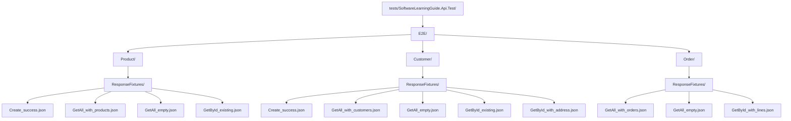

# Response Fixture


**Response Fixture** son archivos JSON que contienen respuestas esperadas de la API, utilizados en tests E2E para verificar que el endpoint devuelve exactamente el contrato acordado.

---

## ¿Qué es un Response Fixture?

> Un fixture de respuesta es un archivo JSON que representa la respuesta esperada de un endpoint. El test carga este archivo y compara la respuesta real contra él, asegurando que el contrato de la API se mantiene.

---

## ¿Por qué Response Fixtures?

| Opción | Problema |
|--------|----------|
| Assert inline con literales | Código verboso, difícil de mantener, mezcla datos con lógica |
| Objetos anónimos | No reutilizables, fragmentados entre tests |
| Clases estáticas de constantes | Escalables pero rígidas, poco flexibles |
| **Response Fixture** | **Archivos externos, legibles, versionables, reutilizables** |

---

## Uso en el proyecto

### Fixture JSON

```json
// E2E/Product/ResponseFixtures/Create_success.json
{
  "id": "a1b2c3d4-e5f6-7890-abcd-ef1234567890",
  "name": "Laptop Gamer",
  "description": "Laptop con RTX 4070",
  "price": 1299.99,
  "currency": "USD",
  "stockQuantity": 10,
  "createdAt": "2026-01-15T10:30:00Z"
}
```

### Carga del fixture en el test

```csharp
// En E2ETestBase.cs
protected async Task<JsonNode> LoadFixture(string relativePath)
{
    var baseDir = Path.GetDirectoryName(Assembly.GetExecutingAssembly().Location)!;
    var fixturePath = Path.Combine(baseDir, relativePath);
    var json = await File.ReadAllTextAsync(fixturePath);
    return JsonNode.Parse(json)
        ?? throw new InvalidOperationException($"Empty fixture file: {fixturePath}");
}
```

### Uso en un test E2E

```csharp
[Test]
public async Task CreateProduct_WithValidData_ShouldReturnExpectedResponse()
{
    // Arrange
    var request = new { name = "Laptop Gamer", description = "Laptop con RTX 4070",
                        price = 1299.99, currency = "USD", stock = 10 };

    // Act
    var response = await Client.PostAsJsonAsync("/api/v2.0/product", request);

    // Assert
    var actual = await GetResponseJson(response);
    var expected = await LoadFixture("E2E/Product/ResponseFixtures/Create_success.json");

    Assert.That(JsonNode.DeepEquals(actual, expected), Is.True);
}
```

---

## Estructura de Fixtures



---

## Buenas prácticas

| Práctica | Descripción |
|----------|-------------|
| **Un fixture por escenario** | `GetAll_empty.json`, `GetAll_with_orders.json` |
| **Nombres descriptivos** | `GetById_existing.json`, `Create_success.json` |
| **Sin datos dinámicos** | Usar GUIDs fijos, fechas estáticas, valores predecibles |
| **Versionados en Git** | Los fixtures reflejan el contrato de la API en cada commit |
| **Copiados al output** | Configurar el `.csproj` para copiar los JSON a `bin/Debug` |

---

### Configuración del .csproj

```xml
<ItemGroup>
  <Content Include="E2E/**/ResponseFixtures/*.json">
    <CopyToOutputDirectory>PreserveNewest</CopyToOutputDirectory>
  </Content>
</ItemGroup>
```

---

## Beneficios clave

- **Contrato vivo** — el fixture documenta la estructura exacta de la respuesta
- **Detección temprana** — cambios no intencionales en la respuesta rompen el test
- **Colaboración** — frontend puede conocer la respuesta esperada sin ejecutar la API
- **Mantenible** — cambiar un campo en un fixture es más seguro que cambiar 10 asserts inline

---

## Referencias

- [JSON Fixtures — xUnit Patterns](https://xunitpatterns.com/Shared%20Fixture.html)
- [System.Text.Json — JsonNode.DeepEquals](https://learn.microsoft.com/en-us/dotnet/api/system.text.json.nodes.jsonnode.deepequals)

**Ver también:**
- [`README.Respawn.md`](README.Respawn.md) — Respawn para limpiar datos entre tests
- [`README.TestContainer.md`](README.TestContainer.md) — TestContainers para entornos de integración
- [`README.TDD.md`](README.TDD.md) — Ciclo TDD y buenas prácticas de testing
