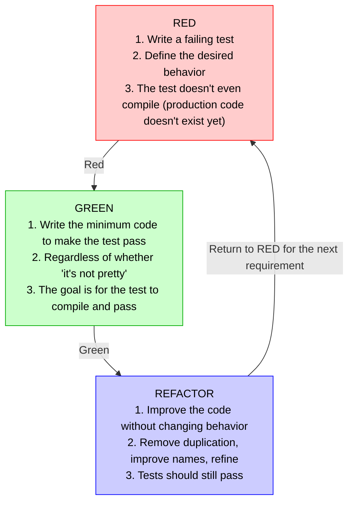

# TDD (Test-Driven Development)


**Test-Driven Development** is a development methodology where tests are written **before** production code, guiding design through a three-phase cycle: Red, Green, Refactor.

---

## What is TDD?

> TDD is a programming discipline that inverts the traditional order: first you write a failing test (Red), then you write the minimum code to make it pass (Green), and finally you refactor the code improving its design (Refactor).

It's not a testing strategy — it's a **design technique** that produces cleaner, more testable code with high coverage.

---

## Red-Green-Refactor Cycle



---

## Example in the project

### RED Phase — Write the test first

```csharp
[Test]
public async Task AddProduct_WithNegativePrice_ShouldReturnError()
{
    var result = Product.Create(
        ProductId.Create(),
        "Test",
        "Desc",
        Money.Create(-10m, "USD").Value!, // Negative price
        5
    );

    Assert.That(result.IsFailure, Is.True);
    Assert.That(result.Error.Code, Is.EqualTo("Product.InvalidPrice"));
}
```

**Note:** `Product.Create` doesn't even exist yet.

### GREEN Phase — Minimal implementation

```csharp
public static Result<Product> Create(ProductId id, string name,
    string description, Money price, int stockQuantity)
{
    // Only what's needed for the test to pass
    if (price.Amount <= 0)
        return Result<Product>.Failure(Errors.Product.InvalidPrice);

    return Result<Product>.Success(new Product(id, name, description, price, stockQuantity));
}
```

### REFACTOR Phase — Improve the design

```csharp
public static Result<Product> Create(ProductId id, string name,
    string description, Money price, int stockQuantity)
{
    var errors = new List<Error>();

    if (string.IsNullOrWhiteSpace(name))
        errors.Add(Errors.Product.InvalidName);
    if (price.Amount <= 0)
        errors.Add(Errors.Product.InvalidPrice);
    if (stockQuantity < 0)
        errors.Add(Errors.Product.InvalidStock);

    return errors.Count > 0
        ? Result<Product>.Failure(errors.ToArray())
        : Result<Product>.Success(new Product(id, name, description, price, stockQuantity));
}
```

---

## Test types in the project

| Type | Project | Framework | Purpose |
|------|----------|-----------|-----------|
| **Unit** | `Core.Business.Test` | NUnit | Value Objects, Entities, Aggregates |
| **Unit** | `Application.Command.Test` | NUnit | Command Handlers (with mocks) |
| **Unit** | `Application.Query.Test` | NUnit | Query Handlers (with Dapper) |
| **Integration** | `Infraestructure.Test` | NUnit | Repositories, DbContext, transactions |
| **E2E / API** | `Api.Test` | NUnit | Real HTTP requests against the API |

---

## Applied TDD best practices

| Practice | How It's Applied |
|----------|----------------|
| **Descriptive names** | `AddProduct_WithNegativePrice_ShouldReturnError` |
| **Arrange-Act-Assert** | Clear structure in each test (Given-When-Then) |
| **One concept per test** | Each test verifies a single scenario |
| **Independent tests** | Respawn + TestContainers isolate state |
| **Shared fixtures** | Response JSON for predictable asserts |
| **Builders for data** | `OrderBuilder`, `ProductBuilder` reduce boilerplate |
| **Minimum code in Green** | Only what's needed for the test to pass |

---

## TDD vs Writing tests after

| Aspect | TDD (Test First) | Tests After |
|---------|------------------|---------------|
| **Design** | Guided by tests, emerges naturally | Can produce non-testable code |
| **Coverage** | High by construction | Depends on discipline |
| **Confidence** | Immediate (test before = clear requirement) | Test only validates what's already written |
| **Initial speed** | Slower at first | Faster at first |
| **Technical debt** | Lower (continuous refactoring) | Higher (refactoring postponed) |
| **Documentation** | Tests document behavior | Tests document existing code |

---

## References

- [Test-Driven Development by Example — Kent Beck](https://www.pearson.com/en-us/subject-catalog/p/test-driven-development-by-example/P200000009465)
- [Martin Fowler — TDD](https://martinfowler.com/bliki/TestDrivenDevelopment.html)
- [The Three Laws of TDD (Uncle Bob)](https://www.oreilly.com/library/view/clean-code-a/9780136083238/)

**See also:**
- [`README.Respawn.md`](README.Respawn.md) — Respawn for cleaning data between tests
- [`README.TestContainer.md`](README.TestContainer.md) — TestContainers for integration environments
- [`README.ResponseFixture.md`](README.ResponseFixture.md) — JSON fixtures for test asserts
