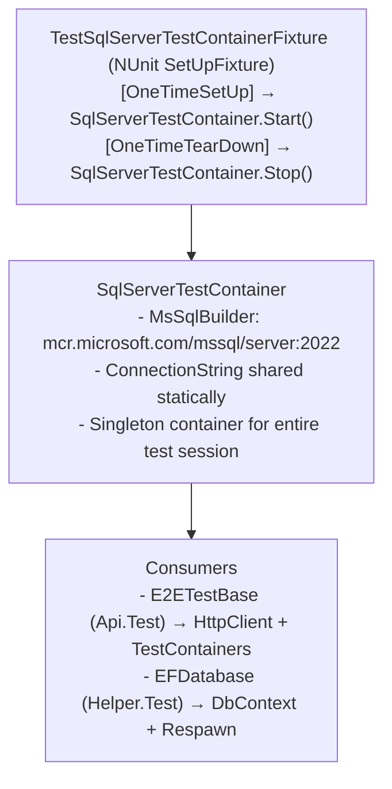

# TestContainers


**TestContainers** is a library that allows spinning up disposable Docker containers for integration tests, providing real environments without permanent infrastructure.

---

## What is TestContainers?

> "TestContainers for .NET is a library for creating and managing Docker containers from tests. It provides clean and disposable instances of databases, message brokers, etc."

In the project, it's used to spin up a **SQL Server 2022** in a Docker container shared across all tests.

---

## Why TestContainers?

| Option | Problem |
|--------|----------|
| Shared database | Residual data between tests, conflicts |
| SQL Server LocalDB | Not available in CI/CD, differences from production |
| Real database | Expensive, requires network connection, shared state |
| **TestContainers** | **Isolated, portable, identical to production, ephemeral** |

---

## Usage in the project

### Global lifecycle fixture

```csharp
// SoftwareLearningGuide.Helper.Test/Fixtures/SqlServerTestContainer.cs
public class SqlServerTestContainer
{
    private static MsSqlContainer? _container;

    public static string ConnectionString => _container?.GetConnectionString() ?? string.Empty;

    public static async Task StartContainer()
    {
        _container = new MsSqlBuilder()
            .WithImage("mcr.microsoft.com/mssql/server:2022-latest")
            .WithReuse(false)
            .Build();
        await _container.StartAsync();
    }

    public static async Task StopContainer()
    {
        if (_container != null)
        {
            await _container.DisposeAsync();
            _container = null;
        }
    }
}
```

### NUnit fixture that orchestrates it

```csharp
// SoftwareLearningGuide.Helper.Test/Fixtures/TestSqlServerTestContainerFixture.cs
[SetUpFixture]
public class TestSqlServerTestContainerFixture
{
    [OneTimeSetUp]
    public async Task OneTimeSetUp() => await SqlServerTestContainer.StartContainer();

    [OneTimeTearDown]
    public async Task OneTimeTearDown() => await SqlServerTestContainer.StopContainer();
}
```

### Usage from tests

```csharp
public abstract class E2ETestBase
{
    protected E2ETestBase()
    {
        ConnectionString = SqlServerTestContainer.ConnectionString;
        // Uses the container connection for WebApplicationFactory
    }
}
```

---

## Anatomy



---

## CI/CD Benefits

| Aspect | Benefit |
|---------|-----------|
| **No SQL Server installation required** | Only Docker needed |
| **Same version as production** | `mcr.microsoft.com/mssql/server:2022-latest` |
| **Complete isolation** | Each test run starts its own container |
| **No shared state** | Fresh container in each session |
| **Ephemeral** | Destroyed when done, no manual cleanup |

---

## Available configuration

```csharp
new MsSqlBuilder()
    .WithImage("mcr.microsoft.com/mssql/server:2022-latest")
    .WithPassword("Custom_Passw0rd!")     // SA password
    .WithEnvironment("ACCEPT_EULA", "Y")  // Accept license
    .WithPortBinding(1433, true)          // Fixed vs random port
    .WithReuse(true)                      // Reuse container between runs
    .Build();
```

---

## References

- [TestContainers for .NET](https://dotnet.testcontainers.org/)
- [GitHub: TestContainers](https://github.com/testcontainers/testcontainers-dotnet)

**See also:**
- [`README.Respawn.md`](README.Respawn.md) — Respawn for cleaning data between tests
- [`README.TDD.md`](README.TDD.md) — TDD cycle and testing best practices
- [`README.ResponseFixture.md`](README.ResponseFixture.md) — JSON fixtures for test asserts
